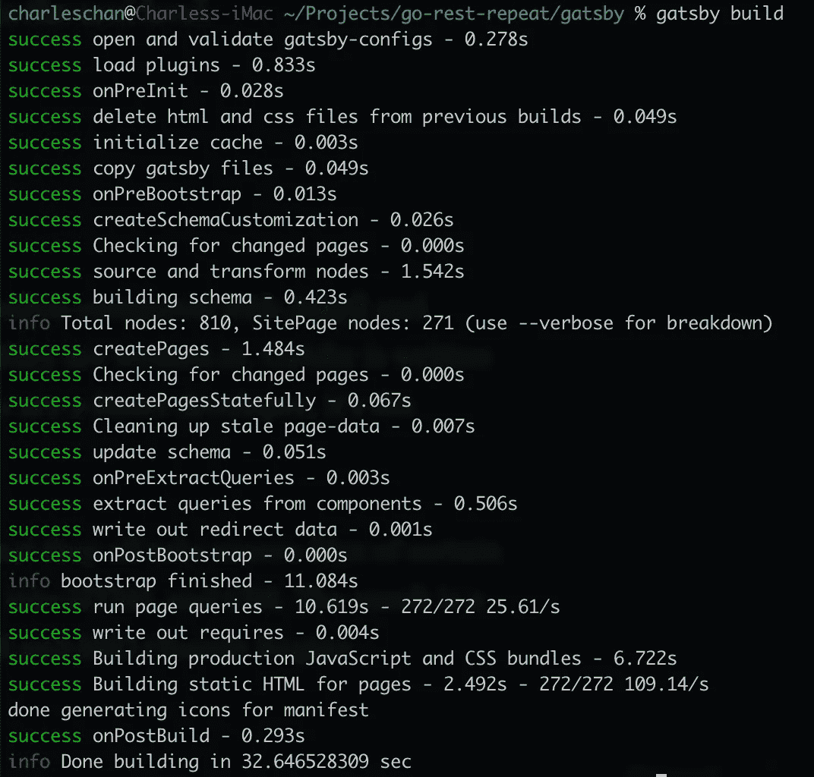
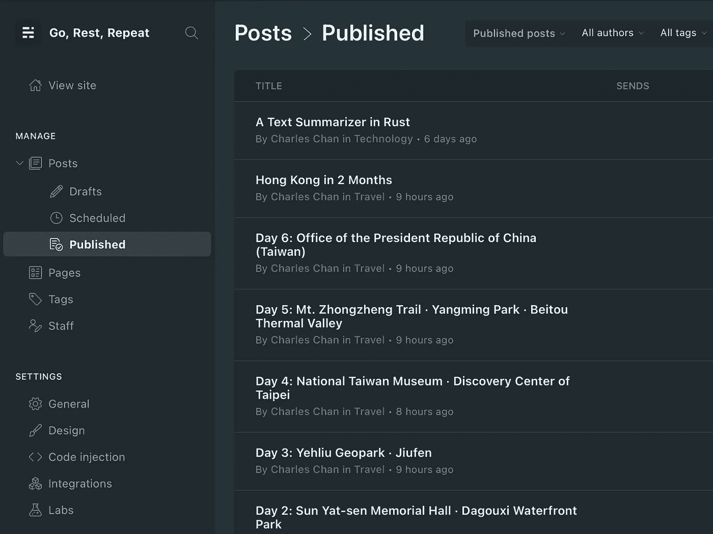
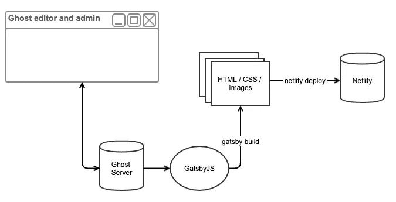
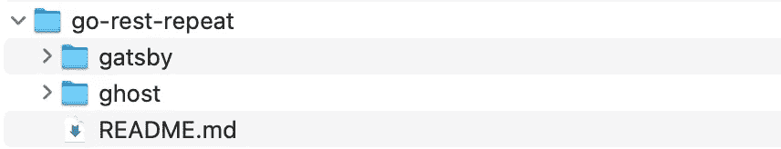
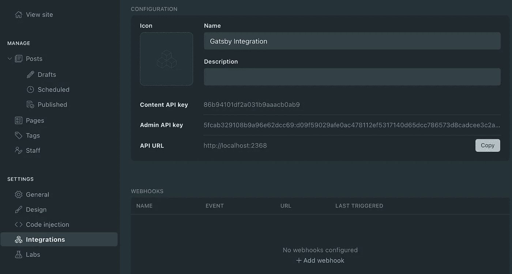

# 用 Ghost 和 Gatsby 让自己成为一个完美的博客平台

> 原文：<https://medium.com/codex/gatsby-ghost-d7ba70dd4664?source=collection_archive---------0----------------------->

## [法典](http://medium.com/codex)


安内特·lūsiņa 在 [Unsplash](https://unsplash.com?utm_source=medium&utm_medium=referral) 上拍摄的照片

你想拥有一个既美观又易于管理的博客平台吗？在过去，你受限于笨拙的 Wordpress 或者简洁但不那么用户友好的静态站点生成器。然而，最近，盖茨比和幽灵的结合终于带来了一场革命，我们需要将个人博客提升到一个新的水平。

# 盖茨比（姓）



Gatsby 的命令行界面生成静态 HTMLs(图片由作者提供)

[Gatsby](https://www.gatsbyjs.com/) 基本上是一个静态站点生成器。经常被拿来和[杰基尔](https://jekyllrb.com/)和[雨果](https://gohugo.io/)比较。主要的区别是他们被写的语言。Gatsby 是使用 React 库用 JavaScript 编写的。所以，如果你是 React 开发者，这是最容易上手的。

这些站点生成的共同点是它们都采用某种格式的源文件(例如 Markdown)并将它们预渲染成 HTML 和 CSS。结果是一个高度优化的网站，是为速度和搜索引擎优化(搜索引擎优化)而建。

有什么大不了的？你可能会问。编写 HTML 非常简单。然而，考虑一下这个，如果你的网站提供任何图片的话。您会希望优化您的图像，使它们在任何大小的设备上都看起来最好。现在，你正在进入[响应图像](https://developer.mozilla.org/en-US/docs/Learn/HTML/Multimedia_and_embedding/Responsive_images)的领域，这不是为心脏虚弱的人准备的。盖茨比为你做了一切！🎉

我使用盖茨比已经两年多了，我对它又爱又恨。一方面，它非常方便，并创造了良好的效果。另一方面，它在管理能力方面欠缺很多。你基本上是在处理 Markdown 文件和 JavaScript 文件。也没有一篇文章的生命周期的概念(即草稿对预定的对已发表的)。

# 《人鬼情未了》



Ghost 的帖子管理屏幕(图片由作者提供)

Ghost 是一个提供托管服务的现代出版平台。把它想成个人[媒介](/)。要使用他们的托管解决方案，你必须付费。然而，慷慨的 Ghost 社区免费提供源代码，最近，他们发布了一个改变游戏规则的新功能，重塑了个人博客。这个 [Ghost 前端](https://ghost.org/docs/concepts/front-end/)可以让你在保留自己喜欢的前端(即静态站点生成器)的同时，将 Ghost 作为一个无头 CMS 来使用。

在本文的剩余部分，我将讨论这种集成。

# 整合盖茨比和幽灵



盖茨比与幽灵的融合(作者图片)

在这个图表中，你可以看到不同系统之间的关系。每个组件都提供了重要的功能。我的设置如下所示，其中`go-rest-repeat`是我的存储库的根。



盖茨比和幽灵整合文件夹结构(图片由作者提供)

# 《人鬼情未了》

要在本地安装 Ghost 服务器，请使用以下命令:

```
$ npm install ghost-cli@latest -g
```

然后在一个空文件夹中(在我的例子中是`ghost`)，输入:

```
$ ghost install local
```

这将在文件夹下安装当前版本的 Ghost。转到 URL:[http://localhost:2368/ghost](http://localhost:2368/ghost)继续您的设置。我建议现在进行最小的设置，因为我们还在构建系统。

当您在那里时，请确保您还创建了一个定制的集成点，以便您获得内容 API 密钥和管理 API 密钥。



Ghost 的自定义集成点。使用它来生成内容 API 密钥和管理 API 密钥(图片由作者提供)

我们现在可以进入盖茨比场景了。

# 盖茨比（姓）

由于我们使用 Ghost 服务器作为一个无头 CMS，我们的预渲染网站的外观和感觉实际上与 Ghost 本身是分离的。为了尽可能多地保留卡斯珀的主题，我选择了《T2》作为开胃菜。在我的回购协议的*根*处，我输入:

```
$ git clone https://github.com/styxlab/gatsby-starter-try-ghost.git gatsby
```

## API 键

starter 设置为使用一些 GraphQL 从 Ghost 检索内容。要设置 Ghost 服务器的位置，请修改`.ghost.json`文件以包含您刚刚生成的 API 密钥:

```
{
   "development": {
     "apiUrl": "http://localhost:2368",
     "contentApiKey": "86b94101df2a031b9aaacb0ab9"
   },
   "production": {
     "apiUrl": "http://localhost:2368",
     "contentApiKey": "86b94101df2a031b9aaacb0ab9"
   }
}
```

## 成员插件

由于我们不是在 Ghost 基础架构上运行，所以我们没有成员功能。因此，我们需要删除成员插件:

```
$ npm uninstall gatsby-theme-ghost-members
```

在`gatsby-config.js`文件中注释掉相同的插件。

## 图像插件

要保存你自己的图片，你需要使用`gatsby-rehype-inline-images`插件。使用以下命令安装它:

```
$ npm install gatsby-rehype-inline-images
```

然后，将插件添加到您的`gatsby-config.js`文件中:

```
plugins: [
    {
        resolve: `gatsby-transformer-rehype`,
        options: {
            filter: node => (
                node.internal.type === `GhostPost` ||
                node.internal.type === `GhostPage`
            ),
            plugins: [
                {
                    resolve: `gatsby-rehype-ghost-links`,
                },
                {
                    resolve: `gatsby-rehype-prismjs`,
                },
                {
                    resolve: `gatsby-rehype-inline-images`,
                },
            ],
        },
    },    
]
```

这就是你所需要的关于盖茨比的一切。当您下次运行`gatsby build`或`gatsby develop`时，它将查询 Ghost 服务器，检索所有帖子，下载图像，并将静态 HTMLs 预渲染到`/public`文件夹中。

# 网络生活

最后但同样重要的是，我们将把我们闪亮的网站部署到 CDN 上。我们很感激 Netlify 免费托管我们的内容。首先，让我们安装 Netlify 命令行界面:

```
$ npm -g install netlify-cli
```

当您在项目文件夹中时，使用以下信息登录 Netlify:

```
$ netlify login
```

最后，部署到 Netlify ( `-p`意为生产):

```
$ netlify deploy -p
```

Netlify 会问你几个问题。一旦您回答完毕，您的网站将被上传并可在互联网上访问。

# 技巧

## 移除未使用的图像

Ghost 会累积上传的图像，即使它们没有被使用。因此，在我备份之前，我运行`ghost-purge-images`命令来删除未使用的映像。您可以使用以下方式安装此工具:

```
$ npm install -g ghost-purge-images
```

使用以下命令清除这些未使用的图像:

```
$ ghost-purge-images purge --content-key=<content API Key> --admin-key=<Admin API Key>
```

## 备份您的工作

万一你的公司出了问题，你不想失去你的努力。确保`ghost/content`文件夹下的所有内容都包含在您的备份解决方案中。我只是确保它包含在我的存储库中。

# 结论

盖茨比、幽灵和 Netlify 的结合提供了一个免费的个人博客平台。易用性超过了少量的前期设置时间。对于想要完全控制的博客作者来说，他们害怕锁定幽灵数据库。然而，对于我们其他人来说，这可能是一个完美的设置。

ps。要查看这个设置的样本，请访问我的个人网页:[https://www.gorestrepeat.com](https://www.gorestrepeat.com)