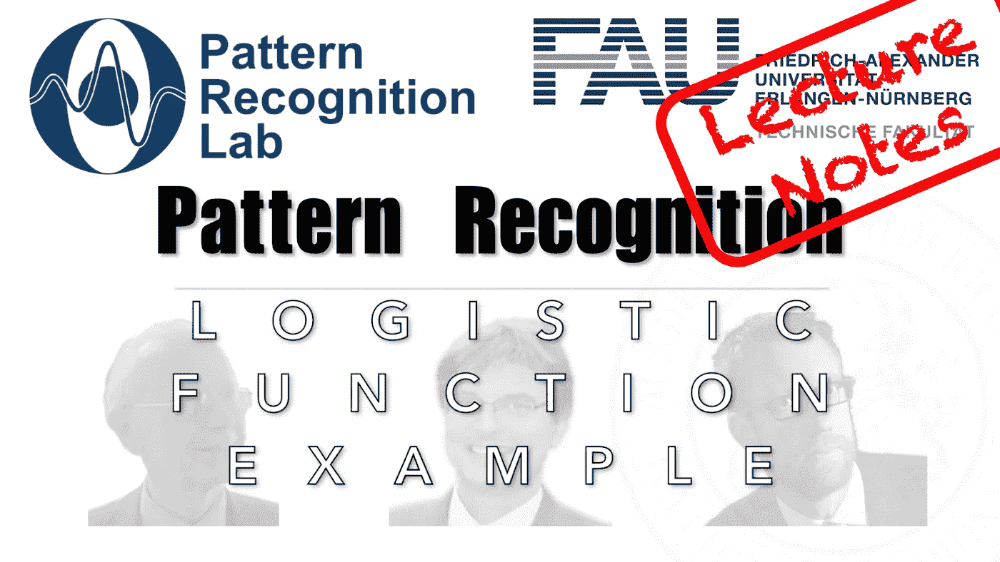

# 高斯人，他们的交叉点和物流功能

> 原文：<https://medium.com/codex/gaussians-their-intersections-the-logistic-function-9cd75492b1a0?source=collection_archive---------5----------------------->

## 模式识别中的 FAU 讲义

## 如何从概率密度函数的交集计算决策边界的示例

来自[模式识别讲座](https://www.youtube.com/playlist?list=PLpOGQvPCDQzsWvT_bqmexrJ359RTQQuMO)的 [CC BY 4.0](https://creativecommons.org/licenses/by/4.0/) 下的图片

**这些是 FAU 的 YouTube 讲座“** [**模式识别**](https://www.youtube.com/playlist?list=PLpOGQvPCDQzsWvT_bqmexrJ359RTQQuMO) **”的讲义。这是**的完整文字记录…