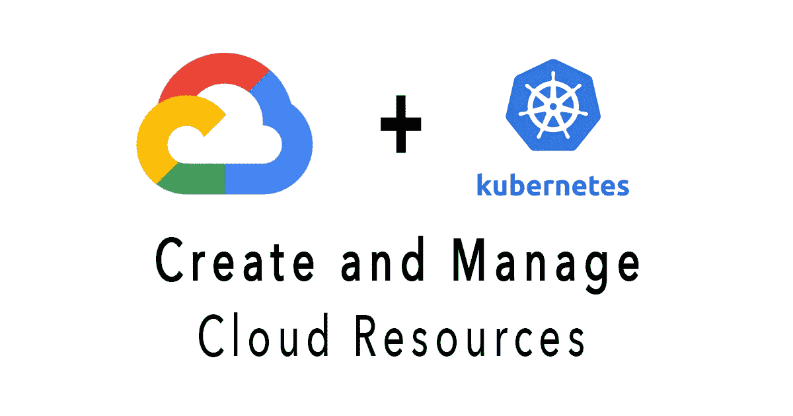

# GCP Kubernetes 负载平衡器教程

> 原文：<https://medium.com/codex/gcp-kubernetes-load-balancers-tutorial-14146f4b0dc5?source=collection_archive---------0----------------------->

## [法典](http://medium.com/codex)

本文帮助你学习 GCP 概念，使用 *gcloud* 命令和云 Shell。在计算引擎中创建和部署虚拟机，在 Google Kubernetes 引擎上运行容器化的应用程序，并配置网络和 HTTP 负载平衡器。

# 第 1 部分—虚拟机

## 1.1 创建虚拟机