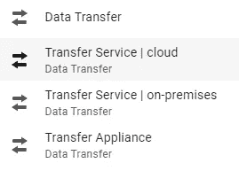
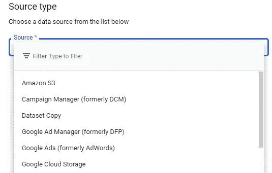

# GCP 数据传输选项

> 原文：<https://medium.com/codex/gcp-transfer-options-11ea963dfb79?source=collection_archive---------1----------------------->

本文讨论了 Google Cloud 提供的各种传输选项，Google Cloud 提供了各种选项来有效地传输数据。数据传输可以从本地数据到云，也可以在云到云之间进行，即从 GCP 到 GCP，或者从任何其他云到 GCP。

以下是可用于数据传输的选项:

GCP 的数据传输选项

**传输服务(云)**:这支持混合或多云策略的数据传输，它可以从私有数据中心、AWS、Azure 或 GCP 本身移动数据。它可以通过在线网络向其他云传输数十亿字节的数据——数十亿个文件和数十个 Gbps。它可以优化您的网络带宽，并通过横向扩展性能加快传输速度。

根据需要执行传输以启用多云策略，或者作为数据处理管道或分析工作流的一部分定期移动数据(按计划)。

**传输服务(On-Prem)** :它可以通过在线网络将数 Pb 的数据从内部资源传输到[云存储](https://cloud.google.com/storage)。凭借内置的简单性和安全性，该服务可扩展到可用带宽，并可在几分钟内实现无缝传输。根据需要执行一次性传输，或者以预定的方式为分析、备份或归档目的设置重复传输。

传输服务允许以非常高效的方式监控和记录传输作业的进度，存储传输服务可以配置为在传输完成时发送发布/订阅通知。它维护数据完整性，确保在传输过程中不会丢失数据。它遵循非常强大的安全和加密机制来安全地传输数据。您可以根据需要安排一次性转移操作或重复转移操作。它支持增量传输，以最大限度地减少需要发送的数据量，有效地利用带宽，并确保传输快速运行。

BigQuery 数据传输

**BigQuery 数据传输** —可以使用 BigQuery 数据传输服务将数据直接传输到 BigQuery。该服务在预定的托管基础上自动将数据移入 BigQuery。配置数据传输后，BigQuery 数据传输服务会定期自动将数据加载到 BigQuery 中。BigQuery 数据传输服务支持从各种数据源加载数据，如云存储、Google Ads、Campaign Manager、Youtube 频道报告等等。此外，它还可以用于在同一区域或不同区域的两个 BigQuery 数据集之间传输数据。这是在我们的项目中实现的一个用例，它将数据从美国地区移动到欧盟地区，以便在欧盟地区建立数据管道。

您可以安排传输，也可以在失败时收到电子邮件通知。

**gsutil**—`gsutil cp`命令允许您在本地文件系统或本地文件系统和云之间、云中以及云存储提供商之间复制数据。例如，将本地目录中的所有文本文件上传到一个桶中。它使用多线程选项或并行复合上传，将对象分成块，然后上传到 GCS，将其组装回原始文件。可以使用 cron 选项卡或任何可用的调度程序来调度 gsutil。

**传输设备** —这基本上是离线单向传输，比如从数据中心到 GCP。由于这涉及大量成本，因此可以使用 gsutil 对大量数据(超过 10TB)进行一次性数据传输，然后可以使用 gsutil 传输持续数据。该服务仅用于 GCP 的内部部署，不适用于 AWS 或 Azure。

这使用了一个高容量的存储设备，使您能够将您的数据传输并安全地运送到谷歌上传设备，然后上传到云存储。

希望这有所帮助！