# 从声音特征检测一个人的性别。

> 原文：<https://medium.com/codex/gender-from-voice-b12c04a1a836?source=collection_archive---------8----------------------->


照片由 [Unsplash](https://unsplash.com?utm_source=medium&utm_medium=referral) 上的 [Dainis Graveris](https://unsplash.com/@dainisgraveris?utm_source=medium&utm_medium=referral) 拍摄

使用 Kaggle 的[声音性别识别](https://www.kaggle.com/primaryobjects/voicegender)数据集，通过数据分析和可视化构建故事的新教程。

到现在为止，你已经知道我喜欢在执行分析时提出问题来绘制故事，我发现这是一件非常有趣的事情，不喜欢与数据打交道的人可以这样做，这也让我对数据有了更多的了解，对特征工程有了更好的想法。

这是我在 SureStart 培训中的一项任务，我非常喜欢，所以我尽可能多地尝试 EDA。在这篇文章中，我将带你浏览一些我做过的事情，更多的内容你可以随时查看原始的笔记本。

像往常一样，我们将导入重要的库

```
import numpy as np 
import pandas as pd 
import matplotlib.pyplot as plt
import seaborn as sns
import warnings
from sklearn.linear_model import LogisticRegression
from sklearn.svm import LinearSVC
from sklearn.svm import SVC
from sklearn.neighbors import KNeighborsClassifier
from sklearn.ensemble import RandomForestClassifier
from sklearn.tree import DecisionTreeClassifier
from sklearn.ensemble import GradientBoostingClassifier
from sklearn.naive_bayes import GaussianNB
*#model selection*
from sklearn.model_selection import train_test_split
from sklearn.metrics import  accuracy_score,precision_score,recall_score,confusion_matrix,roc_curve,roc_auc_score
from sklearn.model_selection import GridSearchCV
*#preprocess.*
from sklearn.preprocessing import MinMaxScaler,StandardScaler,LabelEncoder,OneHotEncoder
from sklearn.impute import SimpleImputer
warnings.filterwarnings('ignore')
```

将数据集读入熊猫数据框并显示形状

```
df_train= pd.read_csv('/kaggle/input/voicegender/voice.csv')
df_train.shape
```

# 电子设计自动化(Electronic Design Automation)

我们的数据集包含 21 列和 3168 个实例或行，让我们检查列名

```
df_train.columns
```

这是一个包含 21 个列名的列表，['meanfreq '，' sd '，' median '，' Q25 '，' Q75 '，' IQR '，' skew '，' kurt '，' sp.ent '，' sfm '，' mode '，' centroid '，' meanfun '，' minfun '，' maxfun '，
，' meandom '，' mindom '，' maxdom '，' dfrange '，' modindx '，' label']

从[描述](https://www.kaggle.com/primaryobjects/voicegender)页面，我们知道每一列对应什么。

然后我检查了空值，没有发现任何空值。

我创建了两个函数来简化我的工作，这样我就不会重复代码，第一个函数是检查列中的异常值(异常值是指由于太大或太小而不适合分布的值，会产生噪声)。我使用了 1.5 IQR 规则，您可以查看这篇文章以获得更好的演示

[](https://towardsdatascience.com/why-1-5-in-iqr-method-of-outlier-detection-5d07fdc82097) [## 为什么 IQR 异常值检测法中的“1.5”？

### 如果你不能向一个六岁的孩子解释，你自己也不会理解。

towardsdatascience.com](https://towardsdatascience.com/why-1-5-in-iqr-method-of-outlier-detection-5d07fdc82097) 

```
def check_outliers(col):
    q1,q3=df[col].quantile([0.25,0.75])
    iqr=q3-q1
    rang=1.5*iqr
    return(q1-rang,q3+rang)
```

另一个功能是为给定的列创建盒图和分布图。

```
def plot(col):
    fig,axes=plt.subplots(1,2)
    sns.boxplot(data=df,x=col,ax=axes[0])
    sns.distplot(a=df[col],ax=axes[1],color='#ff4125')
    fig.set_size_inches(15,5)
    lower,upper = check_outliers(col)
    l=[df[col] for i **in** df[col] if i>lower **and** i<upper] 
    print("Number of data points remaining if outliers removed : ",len(l))
```

**单变量分析**

在这里，我分析各个列，我选择了一个方框图和一个距离图，因为所有的功能都是数字。

```
plot('meanfreq')
#Number of data points remaining if outliers removed :  3104
```

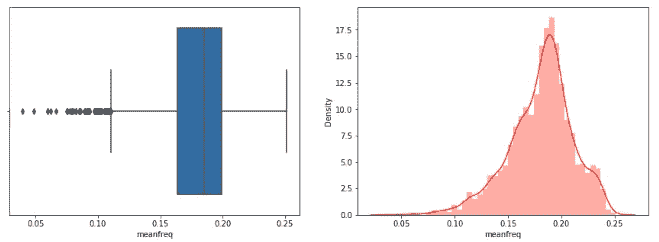

1.  从箱线图中，我们可以看到一些异常值小于大约 0.11 的平均频率，而且大多数异常值位于分布的左侧。
2.  从分布图中，我们知道这是一个正态分布，有一点-ve 偏斜，我们可以稍后归一化。

然后我会画其他有趣的列

```
plot('sd')
#Number of data points remaining if outliers removed :
```

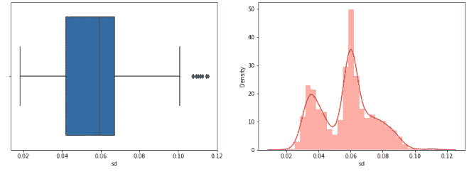

```
plot('median')
#Number of data points remaining if outliers removed :  3059
```

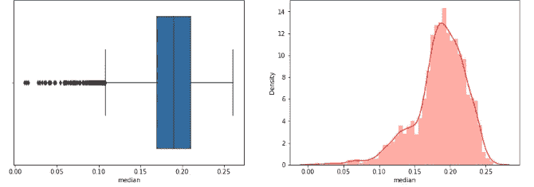

```
plot('Q25')
```

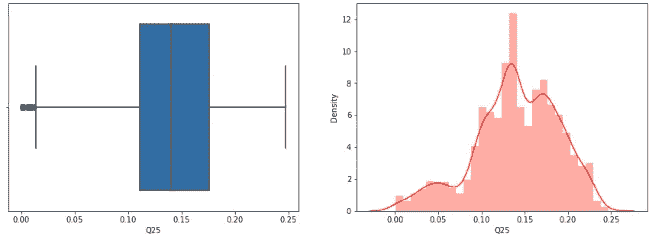

对于更多的图，您可以查看我将与您分享的原始笔记本，但主要是大多数列不是完美的正态分布，这是很容易预测的，有些列有异常值，这也是非常正常的，因为所有实例都不可能符合钟形曲线，特别是在现实世界的数据中。

此外，需要注意的一点是，我们的数据是平衡的，这意味着两个类包含的实例数量相等或半相等，而现实世界的数据集通常不是这样。

```
sns.countplot(data=df,x='label');
```

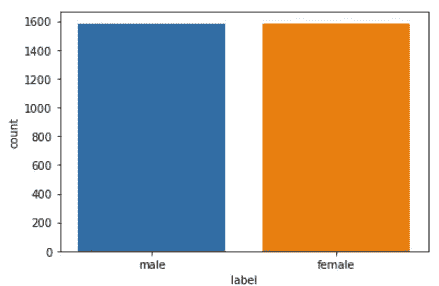

**双变量分析**

这里我们比较两列，首先为了更容易预测，后来我对标签进行了编码。

```
df['label']=df['label'].replace({'male':1,'female':0})
```

我首先创建了一个热图来显示每个属性和其他属性之间的相关性。

```
*# correlation heatmap* 
cor_mat= df[:].corr()
mask = np.array(cor_mat)
mask[np.tril_indices_from(mask)] = False
fig=plt.gcf()
fig.set_size_inches(30,12)
sns.heatmap(data=cor_mat,mask=mask,square=True,annot=True,cbar=True)
```

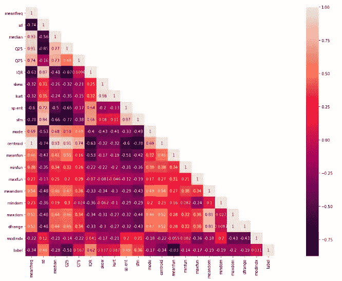

1.  IQR 是与目标标签最相关的特征。
2.  中值和质心，平均频率和质心>>删除质心，因为高度相关的特征通常被认为是多余的
3.  其他的观察，有弱相关的，也有高相关的，我会在特征工程里删掉一些栏目。

为了根据目标绘制一些列，我创建了一个新函数

```
def plot_against_target(feature):
    sns.factorplot(data=df,y=feature,x='label',kind='box')
    fig=plt.gcf()
    fig.set_size_inches(7,7)plot_against_target('meanfreq')
```

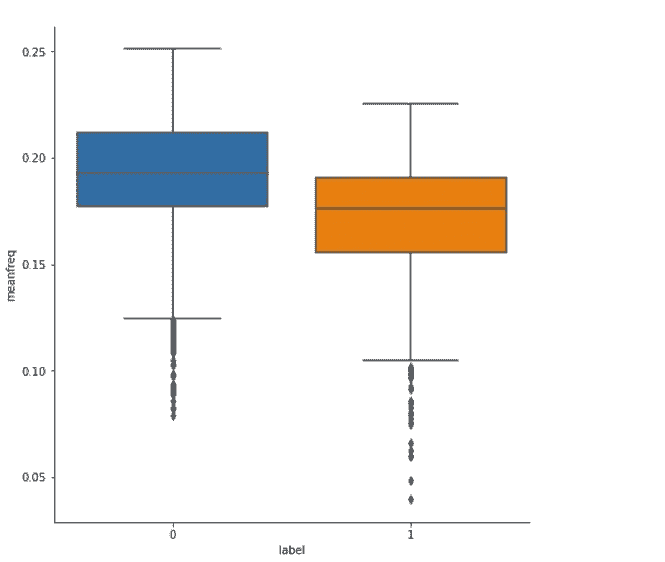

我们可以得出结论，女性比男性有更高的声音频率，这是**众所周知的**事实！

我创建了其他类似的图来比较这两个类的值，它们在几乎所有的属性上都非常不同。我在这里制作的最后一个图是另一个相关性图，这是一些列相互之间的散点图，我将在后面使用。

```
g=sns.PairGrid(df[['meanfreq','sd','median','Q25','IQR','sp.ent','sfm','meanfun','label']], hue = "label")
g = g.map(plt.scatter).add_legend()
```

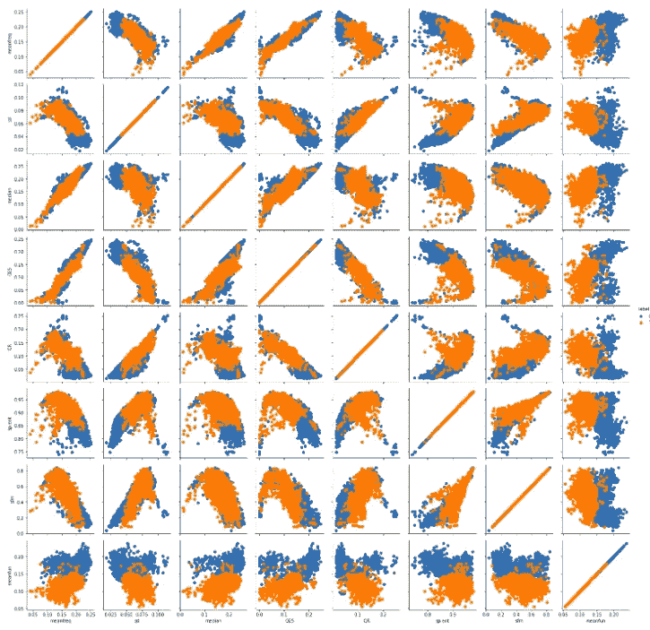

**特色工程**

1-移除异常值^^

```
for col **in** df.columns:
    l,u=check_outliers(col)
    df=df[(df[col]>l)&(df[col]<u)]
```

在移除异常值后，我们丢失了将近 50%的数据集，所以我将这部分反转并留下。

2-根据图，我们将删除一些列“skew，Kurt，mindom，maxdom，centroid ”,因为它们与其他列高度相关。

```
temp_df=df.copy()
temp_df.drop(['skew','kurt','mindom','maxdom','centroid'],axis=1,inplace=True)
```

3-创建新特征

将已经存在的功能组合成一个更强大的功能是 FE 中的常见做法。我创建了一个名为 pear_skew 的新特性，如下所示

```
temp_df['pear_skew']=temp_df['meanfreq']-temp_df['mode']
temp_df['pear_skew']=temp_df['pear_skew']/temp_df['sd']
```

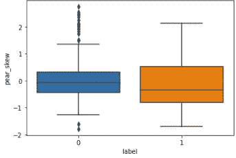

然后我把中值列改成 1/3(2 *均值+众数)也就是**经验关系**。

```
temp_df['meanfreq']=temp_df['meanfreq'].apply(lambda x:x*2)
temp_df['median']=temp_df['meanfreq']+temp_df['mode']
temp_df['median']=temp_df['median'].apply(lambda x:x/3)
```

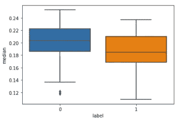

4-缩放

我用 Sklearn 的 StandardScaler 来归一化数据，它的工作原理是减去均值，除以标准差。

```
scaler=StandardScaler()
scaled_df=scaler.fit_transform(temp_df.drop('label',axis=1))
```

**ML 建模**

最后简单的部分！创建 ML 模型时，我使用了模型的默认参数。

1-从特征中分离目标，并创建训练/测试分离

```
X=scaled_df
Y=df['label'].values
x_train,x_test,y_train,y_test=train_test_split(X,Y,test_size=0.20,random_state=42)
```

2-我创建了 8 个不同的模型来比较结果

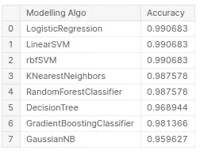

总之，这项工作更多的是关于分析而不是 ML 建模，你可以在这里查看原始笔记本。