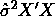

# R 中的广义矩量法(GMM )(第 1 部分，共 3 部分)

> 原文：<https://medium.com/codex/generalized-method-of-moments-gmm-in-r-part-1-of-3-c65f41b6199?source=collection_archive---------0----------------------->


来源:[https://i.ytimg.com/vi/bNWhsHug1rc/maxresdefault.jpg](https://i.ytimg.com/vi/bNWhsHug1rc/maxresdefault.jpg)和[https://youtu.be/bNWhsHug1rc](https://youtu.be/bNWhsHug1rc)

本文介绍了广义矩量法(GMM)的基本概念，并讨论了它在 R 中的应用。感兴趣的观众还可以参考 [Morten Nyboe Tabor](http://scholar.google.dk/citations?user=BFWWSE8AAAAJ&hl=en) 上传的[视频](https://youtu.be/bNWhsHug1rc)。嗯，首先要澄清的是， **GMM** 这里是计量经济学中**广义矩方法**的缩写，而不是机器学习中**高斯混合建模**。即使机器学习以及深度学习也是经济和商学院的热门话题，传统的理论驱动的经验主义思想仍然是课程的核心部分。在我大学的教学之旅中，澄清因果推理和预测之间的区别总是第一个话题。一般来说，即使训练有素的机器学习模型也无法直接说出因果推断。如今， [SHAP](https://github.com/slundberg/shap) 的非凡工具可以尝试将个体观测的预测值分解为每个特征值的贡献。然而，在大多数情况下，只能解释相关性或关联性。关于这个问题的详细讨论可以在由[斯科特·伦德伯格](https://scottlundberg.com/) (2021)撰写的[解释预测模型时要小心](https://towardsdatascience.com/be-careful-when-interpreting-predictive-models-in-search-of-causal-insights-e68626e664b6)中找到，他也是关于 [SHAP](https://github.com/slundberg/shap) 的文献的主要作者([斯科特·伦德伯格](https://scottlundberg.com/)，2017)。然而，在实践中，政府的经济决策者或公司的管理者总是考虑政策干预。因此，在反事实分析中，评估某项政策的改变对特定目标的影响通常是文章、报告和学术论文的首选。然而，如果不检查背景和理论，关于训练机器学习模型的 SHAP 值的结果可能会被误解为因果推断，并产生误导性的政策建议。仅以 [Scott Lundberg](https://scottlundberg.com/) 发布的[中所示的案例为例，训练好的模型只是表明了**报告的 bug 数量与个人更新产品的意图**之间的正相关关系。你认为现在的建议是要求技术人员在将来引入更多的 bug 来促进销售吗？因此，一系列关于因果推论、经济学或商业理论以及经验策略的概念总是在计量经济学课上讨论。为了便于在反事实分析中评估政策，我们认真讨论了生成参数方程的理论。从数据样本中，实施适当的估计方法来估计意义的固定但未知的参数。统计推断因此被讨论关于因果推断。这是经济学和商业研究中关于实证研究的通常路径。](https://towardsdatascience.com/be-careful-when-interpreting-predictive-models-in-search-of-causal-insights-e68626e664b6)

**广义矩量法(GMM)** 是对指定模型内未知参数的一种估计方法。有趣的是，GMM 通常不被讨论，尤其是在计量经济学的第一堂课中，可能是因为时间的限制，大多数不追求学术生涯或博士学位的学生通常只愿意选修一门(或更好的零)计量经济学课程。这是大多数商学院学生对 GMM 感到陌生的基本原因。然而，他们都只是在他们的项目或报告中应用 GMM，因为**普通最小二乘法(OLS)** 和**最大似然估计(MLE)** 可以看作是 GMM。GMM 实际上很有吸引力，不仅因为它在概念上将其他极值估计量(如 OLS 和最大似然估计)纳入综合系统，还因为它在模型构建方面的灵活性。在这第 1 部分(共 3 部分)中，我主要关注 GMM 的基本思想，以及 GMM 如何以简单线性回归(OLS)为例，更稳健地进行统计推断。在第 2 部分(共 3 部分)中，**讨论了最大似然估计与 GMM 之间的关系。在第 3 部分中，结构模型引入了 GMM，因此讨论了**两阶段最小二乘(2SLS)回归**与 GMM 的比较。请查看[https://github . com/AlfredSAM/medium _ blogs/blob/main/GMM _ in _ R/GMM _ in _ R . ipynb](https://github.com/AlfredSAM/medium_blogs/blob/main/GMM_in_R/GMM_in_R.ipynb)了解这些帖子中使用的代码和示例。**

# **有哪些瞬间？**

**就以这个简单的例子开始来说明什么是**(人口)** **时刻**。其实在概率论与统计中，**(总体)** **矩**指的是**总体均值或期望**，通常是感兴趣的关键总体参数。比如假设 x 是正态分布的随机变量，那么它的均值就是 E(x)=μ。*另一方面，理论上* ***总体均值或期望*** *可以在随机变量*的任意函数上实现。例如，通过简单的转换，我们也可以得到σ =E[(x-μ) ]。到目前为止，我们已经得到了两个方程，或者说，两个参数σ和μ的矩条件。通过简单的计算，我们可以得到它们的解:μ=E(x)和σ =E[(x-E(x)) ]。这种简单的计算似乎无助于获得μ和σ的值，因为我们不知道 x 的分布，因此无法计算相应的**总体均值或期望值**。**

**然而，概率论和统计学提供了从**随机样本**中推断人口的想法或思路。为简单起见，对于这种正态分布的 x，采集 T **(独立同分布)iid** 个随机样本。问题是，我们如何利用这些样本来获得μ和σ的合理估计值？这里我们有强大的基本原理:**大数定律(LLN)** : *样本均值收敛于总体均值*。诚然，一些技术问题在教科书中被充分讨论，因此我们至少有几个版本的 LLN。在这里，我们只是试图让我们的生活更容易获得 LLN 的本质意义。因此，我们可以用样本均值(矩)代替上述简单解决方案中的总体均值(矩):**

********

**现在，我们只得到基于两个矩条件和随机样本的μ和σ的估计量。通常我们称这样的估计量为**矩量法(MM)估计量**。我只记得在我大学的第一堂统计学课上，老师只是说 MM 比 MLE 简单得多，因为在获得估计量时忽略了成束的概率密度函数。关于 MM(还有 GMM)的直接推论是**只假设了矩条件**，但是**不需要分布假设**。这种性质决定了 MM(还有 GMM)对于数据生成过程中关于分布的不正确假设是相对稳健的。在大多数以因果推论为中心目标的实证研究中，**稳健性检查**总是需要展示的。**

# **GMM 目标函数背后的思想是什么**

**在本节中，引入了 GMM 以表明它比 MM 更一般化*。简单回顾一下上面的 MM 估计量的例子。一开始我们只是有**两个**未知参数要估计，然后尝试寻找**两个**时刻的条件。在文献中，这种情况被称为**刚识别的**，这意味着我们有足够的信息(两个矩条件)来求解两个估计量。另一方面，如果只给一个力矩条件呢？这种情况称为**未识别**，表示无法获得唯一解的估计量。最有趣的情况是**过识别**，其中矩条件的个数**大于待估计未知参数的个数**。按照上面的例子，实际上还可以给出一个力矩条件***

******

***第三行是关于正态随机变量的三阶矩。一般来说，有更多的信息来获得未知参数的估计量应该是有利的。然而，在实践中，用样本矩条件代替总体矩条件会产生可能无解的方程组，这仅仅是因为三个方程只给出了两个未知数。下图直观地说明了这一困难:一般来说，我们无法在 x 轴上找到完全相同的一点来使两条线同时等于零。那么，我们该怎么办呢？***

******

***如果总体矩条件有效，那么**基于总体矩条件的明智估计器应该使所有相应的样本矩条件尽可能接近零**。因此，我们可以将方程组的求解问题转化为优化问题，目标函数为***

******

***在哪里***

******

***是这三个样本矩的向量函数。也就是说，未知量的估计量应该是所有样本矩条件的加权平均值的最小值，这种估计量称为**广义矩方法(GMM)** 估计量。需要注意的一点是， **MM 估计量只是 GMM 估计量**的特例。在刚刚确定的的**情况下，上述目标函数应该具有最小值零，使得最优值是 MM 估计量，以使采样时刻条件下的方程组等于零。这也是有助于检查最小化过程是否对刚刚确定的**情况产生误差的特征。***

# ***高效 GMM***

***本节讨论最佳权重的选择。从目标函数中，人们可以容易地发现，最优值实际上取决于样本时刻条件和每一时刻权重的选择。问题是，应该选择什么样的权重？为了回答这个问题，我们需要有评价选择的目标或标准，而**效率**就是考虑的总点。一般来说，点估计是不够的，在验证性分析方面通常需要后续的统计推断(例如假设检验和置信区间)。由此可见，通常会考虑估计量的采样分布**。粗略地说，估计量的方差越小越精确。只需跳过繁琐的矩阵微积分推导，当矩条件协方差矩阵的逆作为权值**时，就可以得到**高效 GMM 估计器**。(马萨诸塞州维尔比克，2004 年)也就是说，***

******

***基本原理也很简单。仅以上面的例子为例，可以想象增加越来越多的矩条件是可能的，例如四阶矩、五阶矩等。xᵢ.的然而，你认为它们同等重要吗？从理论上讲，如果某个力矩条件具有很大的方差，那么将其视为不稳定或不可靠是明智的。也就是说，人们应该对这种力矩条件给予较小的重视。实际上，在较大方差的意义上，高阶矩更不稳定，因此应该对它们赋予较小的权重以保持估计量的稳定性(尽可能小的方差)。***

***就可操作性而言，我们需要对这种权重矩阵进行可行的估计，因为它取决于未知数。因此，估计策略是两步走的。在第一步中，我们仅仅使用相等的权重(单位矩阵)来获得所有未知数的估计。利用这样的估计，其仍然是未知量的**一致**估计，我们可以得到权重矩阵的以下一致估计:***

******

***当然，**这个结果也取决于样本之间没有自相关的假设，但是允许样本之间有不同的方差**。因此，我们有了关于**有效 GMM** 的采样分布的完整表达式:***

******************

***其中 D 是导数矩阵，用于测量矩条件对未知量变化的敏感性，在实践中，使用样本矩代替总体矩进行一致估计。幸运的是，在 R 中，我们有包`gmm`来处理上述优化过程和统计推断的标准误差的计算(Chaussé，p . 2021)。***

```
*# Simulate One column data# Reproducible
set.seed(123)
# Generate the data from normal distribution
n <- 200
x <- rnorm(n, mean = 4, sd = 2)# set up the moment conditions for comparison# MM (just identified)
g0 <- function(tet, x) {
  m1 <- (tet[1] - x)
  m2 <- (tet[2]^2 - (x - tet[1])^2)
  f <- cbind(m1, m2)
  return(f)
}# GMM (over identified)
g1 <- function(tet, x) {
  m1 <- (tet[1] - x)
  m2 <- (tet[2]^2 - (x - tet[1])^2)
  m3 <- x^3 - tet[1] * (tet[1]^2 + 3 * tet[2]^2)
  f <- cbind(m1, m2, m3)
  return(f)
}print(res0 <- gmm(g0, x, c(mu = 0, sig = 0)))print(res1 <- gmm(g1, x, c(mu = 0, sig = 0)))*
```

***人们可以检查详细的结果***

```
*summary(res0)*
```

***结果是***

```
*Call:
gmm(g = g0, x = x, t0 = c(mu = 0, sig = 0))

Method:  twoStep 

Kernel:  Quadratic Spectral

Coefficients:
     Estimate     Std. Error   t value      Pr(>|t|)   
mu    3.9812e+00   1.2373e-01   3.2177e+01  3.7093e-227
sig   1.8814e+00   9.9904e-02   1.8832e+01   4.1605e-79

J-Test: degrees of freedom is 0 
                J-test                P-value             
Test E(g)=0:    0.000702626643691055  *******             

#############
Information related to the numerical optimization
Convergence code =  0 
Function eval. =  67 
Gradian eval. =  NA*
```

***和***

```
*summary(res1)*
```

***结果是***

```
*Call:
gmm(g = g1, x = x, t0 = c(mu = 0, sig = 0))

Method:  twoStep 

Kernel:  Quadratic Spectral(with bw =  0.71322 )

Coefficients:
     Estimate     Std. Error   t value      Pr(>|t|)   
mu    3.8939e+00   1.2032e-01   3.2364e+01  8.9213e-230
sig   1.7867e+00   8.3472e-02   2.1405e+01  1.1937e-101

J-Test: degrees of freedom is 1 
                J-test   P-value
Test E(g)=0:    2.61527  0.10584

Initial values of the coefficients
      mu      sig 
4.022499 1.881766 

#############
Information related to the numerical optimization
Convergence code =  0 
Function eval. =  63 
Gradian eval. =  NA*
```

***这个简单的例子说明了如何使用`gmm`包进行 GMM。重点是设置关于时刻条件的功能，如`g0`和`g1`。自变量是参数`tet`和数据`x`，输出是 T × q 矩阵，其中 q 是矩条件的数量。实际上，这个函数需要导出每个样本(行)的 q 矩条件的结果。将这个函数放入`gmm`中，包将完成剩下的工作来获得估计值和标准误差。下面关于回归的例子可以说明更多的细节。***

# ***OLS 扮演 GMM***

***这一部分通过一个更现实的例子来说明 OLS 和 GMM 的关系。简短的回答是，OLS 估计量实际上是 GMM 估计量。为了解释这个问题，说明启发 OLS 的**线性投影模型**中嵌入的人口矩条件是有益的。***

***假设𝑦的线性预测值是𝒙′𝜷形式的函数。我们怎样才能让这样的**线性预测器**明智地成为**最佳**？实际上我们可以有合理的目标函数，称为**均方预测误差(MSE)**:𝑆(𝜷)=𝔼[(𝑦−𝒙′𝜷】。给定𝒙，𝑦的**最佳线性预测器**是𝒫[𝑦∣𝒙]=𝒙′𝜷，其中𝜷最小化均方预测误差𝑆(𝜷)=𝔼[(𝑦−𝒙′𝜷】。请注意，最小化𝜷=argmin𝑆(𝒃)被称为**线性投影系数**。人们可以很容易地证明，极小𝜷只是使𝔼[𝒙𝑒]=𝔼[𝒙(𝑦−𝒙′𝜷)]=𝔼[𝒙𝑦]−𝔼[𝒙𝒙′](𝔼[𝒙𝒙′])^(-1)𝔼[𝒙𝑦]=0 从这样的优化问题的一阶条件。看，我们刚刚导出了关于人口矩条件的向量函数:***

******

***其中**投影误差**通过构造定义为𝑦和𝒫[𝑦∣𝒙]: 𝑒=𝑦−𝒙′𝜷.之间的差异只要遵循 GMM 的逻辑，就可以得到相应的样本矩条件。还有一点需要注意，这是 MM 的情况，因为矩条件的数量与未知数的数量相同:***

******

***另一方面，上面的**线性投影模型**只是授权 OLS 给出样本。另一方面，OLS 估计量的含义也指向与上述完全相同的方程组:***

******

***因此，OLS 估计量就是 GMM 估计量，在给定同一组样本的情况下，它们应该给出完全相同的估计。然而，一个棘手的问题是，在没有特殊设置的情况下，它们具有不同的协方差。基本原因是来自线性回归情况下有效 GMM 的抽样分布:***

******

***这是在线性回归情况下有效 GMM 估计量的协方差矩阵的结果。默认情况下，有效的 GMM 估计器只考虑样本间的**异方差**。也就是中间部分是***

******

***实际上我们也有***

******

***和***

******

***实际上，这个协方差矩阵就是 OLS 估计量的**怀特(1980)异方差稳健协方差**。但是，包中的默认 OLS 协方差通常采用以下形式***

******

***因此，**在线性回归中，即使是 OLS 估计量也只是 GMM 估计量，但 GMM 的软件包通常会生成比 OLS** 更稳健的协方差矩阵。在 jupyter 笔记本中，关于 R & D 支出和专利的数据被用来说明这一点。关于数据的细节，也请查看[现代计量经济学指南(第二版)](https://thenigerianprofessionalaccountant.files.wordpress.com/2013/04/modern-econometrics.pdf)第 **7.3.2** 节。***

```
*# Simple regression can be implemented
lm_res <- patents_df %>%
  lm(p91 ~ lr91 + aerosp + chemist + computer + machines +
    vehicles + japan + us, data = .)summary(lm_res)*
```

***结果是***

```
*Call:
lm(formula = p91 ~ lr91 + aerosp + chemist + computer + machines + 
    vehicles + japan + us, data = .)

Residuals:
    Min      1Q  Median      3Q     Max 
-355.26  -54.78   -1.84   34.98  624.22 

Coefficients:
            Estimate Std. Error t value Pr(>|t|)    
(Intercept) -234.631     55.543  -4.224 3.88e-05 ***
lr91          65.639      7.907   8.302 2.91e-14 ***
aerosp       -40.771     35.700  -1.142   0.2550    
chemist       22.915     26.640   0.860   0.3909    
computer      47.370     27.834   1.702   0.0906 .  
machines      32.089     27.941   1.148   0.2524    
vehicles    -179.949     36.731  -4.899 2.21e-06 ***
japan         80.883     41.060   1.970   0.0505 .  
us           -56.964     28.794  -1.978   0.0495 *  
---
Signif. codes:  0 ‘***’ 0.001 ‘**’ 0.01 ‘*’ 0.05 ‘.’ 0.1 ‘ ’ 1

Residual standard error: 114.8 on 172 degrees of freedom
Multiple R-squared:  0.4471,	Adjusted R-squared:  0.4213 
F-statistic: 17.38 on 8 and 172 DF,  p-value: < 2.2e-16*
```

***另一方面，GMM 的估计类似于上一部分中的例子:***

```
*# Generate the data with all needed variables only
df_n <- patents_df %>%
  select(
    p91, lr91, aerosp, chemist, computer, machines,
    vehicles, japan, us
  ) %>%
  mutate(const = 1) %>%
  # Please hold the order as previous glm() to facilitate comparison
  select(
    p91, const, lr91, aerosp, chemist, computer, machines,
    vehicles, japan, us
  )## Need to converse the tibble class to dataframe
df_n <- as.data.frame(df_n)mom_lm <- function(beta, df) {
  # df is the data frame with first column as dv
  # This function returns n * q matrix
  # Each column is one moment condition before taking sample average
  # There are totally q moment conditionsy <- as.numeric(df[, 1])
  x <- data.matrix(df[, 2:ncol(df)])# Refer to moment conditions of QMLE
  m <- x * as.vector(y - x %*% beta)return(cbind(m))
}set.seed(1024)
gmm_lm_mds <- gmm(mom_lm, df_n, rnorm(length(coef(lm_res))),
  wmatrix = "optimal",
  vcov = "MDS",
  optfct = "nlminb",
  control = list(eval.max = 10000)
)
summary(gmm_lm_mds)*
```

***结果是***

```
*Call:
gmm(g = mom_lm, x = df_n, t0 = rnorm(length(coef(lm_res))), wmatrix = "optimal", 
    vcov = "MDS", optfct = "nlminb", control = list(eval.max = 10000))

Method:  twoStep 

Kernel:  Quadratic Spectral

Coefficients:
          Estimate     Std. Error   t value      Pr(>|t|)   
Theta[1]  -2.3463e+02   7.3190e+01  -3.2058e+00   1.3468e-03
Theta[2]   6.5639e+01   1.2913e+01   5.0833e+00   3.7097e-07
Theta[3]  -4.0771e+01   1.9869e+01  -2.0521e+00   4.0164e-02
Theta[4]   2.2915e+01   2.4433e+01   9.3787e-01   3.4831e-01
Theta[5]   4.7370e+01   4.0565e+01   1.1678e+00   2.4291e-01
Theta[6]   3.2089e+01   2.4385e+01   1.3159e+00   1.8820e-01
Theta[7]  -1.7995e+02   4.3154e+01  -4.1699e+00   3.0474e-05
Theta[8]   8.0883e+01   7.5709e+01   1.0683e+00   2.8537e-01
Theta[9]  -5.6964e+01   3.6552e+01  -1.5585e+00   1.1913e-01

J-Test: degrees of freedom is 0 
                J-test                P-value             
Test E(g)=0:    4.08752755490864e-14  *******             

#############
Information related to the numerical optimization
Convergence code =  0 
Function eval. =  66 
Gradian eval. =  590 
Message:  X-convergence (3)*
```

***人们可以发现，OLS 和 GMM 都能给出与我们的讨论相一致的相同的点估计。另一方面，它们的标准误差不同。实际上，我们可以通过下式获得白色鲁棒标准误差***

```
*# The estimates of the above GMM are the same as those in lm
# The sd of the above GMM are the white heterosketicity robust cov for linear regression
diag(vcovHC(lm_res, type = "HC0"))^0.5*
```

***结果是***

```
*(Intercept)73.1895474823068
lr91 12.9127608451989
aerosp 19.8685659210385
chemist 24.4331404653491
computer 40.5652626257489
machines 24.3850596348934
vehicles 43.1544093699569
japan 75.7092057725459
us 36.5516092451842*
```

***也就是说，白色的协方差与 GMM 的相同，再次与我们的讨论相一致。***

# ***摘要***

***这篇文章或一系列文章的主要目的是用最少的数学知识和最多的概念来介绍 GMM。总的来说，回顾这一系列关于 GMM 的文章可能有助于建立计量经济学中未知参数极值估计的统一体系。特别是从讨论中，人们可以得到以不同方式理解问题的提示。例如，观众可能记得 OLS 估计量在没有投影误差正态假设的情况下仍然是渐近正态的，一种解释是 GMM 估计量只有在矩条件有效时才是渐近正态的。另一方面，人们也可以设想 R 中的`gmm`包是强大的，可以用最少的编码工作来执行 GMM 过程。这里还可以提出关于`gmm`应用的几点:***

*   ***应尽可能设置`wmatrix``"optimal"`(默认)，以便使用最佳权重提高效率。同时，将相应地应用两步估计，以采用一致的权重估计。***
*   ***`vcov`的设置很棘手。在[现代计量经济学指南](https://thenigerianprofessionalaccountant.files.wordpress.com/2013/04/modern-econometrics.pdf)第 151 页中，人们可以很容易地检查到**效率 GMM** 估计量的协方差的表达式。棘手之处在于 Wᵒᵖᵗ.的假设请查阅[广义矩量法的第 1.1 节，可以找到可能的选项。一般来说，对于允许*异方差*的*鞅差序列*，至少应该使用`"MDS"`。就线性回归的情况而言，来自 GMM 的这种协方差矩阵应该与异方差一致性协方差矩阵(HCCM)估计器的怀特`HC0`版本相同。此外，在马尔诺·维尔比克的书](https://cran.r-project.org/web/packages/momentfit/vignettes/gmmS4.pdf)[现代计量经济学指南](https://thenigerianprofessionalaccountant.files.wordpress.com/2013/04/modern-econometrics.pdf)中，他也建议至少将这样的假设应用于稳健的标准误差。为了复制马诺·维尔比克的书[现代计量经济学指南](https://thenigerianprofessionalaccountant.files.wordpress.com/2013/04/modern-econometrics.pdf)中的结果，将使用这个选项。然而，`gmm()`函数**默认情况下**使用`"HAC"`，它假设弱依赖进程。实际上，这应该比`"MDS"`更稳定，因为`"HAC"`对于异方差和自相关都是鲁棒的。***
*   ***在 https://github . com/Alfred Sam/medium _ blogs/blob/main/GMM _ in _ R/GMM _ in _ R . ipynb 中，详细讨论了在 GMM 设置下复制 OLS 估计量的协方差，但在实践中几乎没有用处。***
*   ***请确保`optfct`应该设置为`"nlminb"`而不是默认的`"optim"`，这样会产生**不正确的结果**。在后面的帖子里，这一点会被高度讨论。***

# ***参考***

*   ***Chaussé，P. (2021 年)。[用 R](https://cran.r-project.org/web/packages/gmm/vignettes/gmm_with_R.pdf) 计算广义矩方法和广义经验似然。*统计软件杂志*， *34* (11)，1–35。***
*   ***肖斯议员和肖斯议员(2021 年)。[包‘GMM’](https://cran.r-project.org/web/packages/gmm/gmm.pdf)。***
*   ***米·维尔比克(2004 年)。[现代计量经济学指南(第二版)](https://thenigerianprofessionalaccountant.files.wordpress.com/2013/04/modern-econometrics.pdf)。ERIM(电子)书籍和章节。约翰·威利的儿子们，奇切斯特。***
*   ***布鲁斯·汉森(2021)。[计量经济学](https://www.ssc.wisc.edu/~bhansen/econometrics/Econometrics.pdf)。威斯康星大学打字稿。普林斯顿大学出版社，即将出版。***
*   ***布鲁斯·汉森(2021)。[经济学家概率统计](https://www.ssc.wisc.edu/~bhansen/probability/Probability.pdf)。威斯康星大学打字稿。普林斯顿大学出版社，即将出版。***
*   ***Lundberg，s .，，Lee，S. I. (2017)。解释模型预测的统一方法。 *arXiv 预印本 arXiv:1705.07874* 。***
*   ***Lundberg，s .，，Lee，S. I. (2021)。[在解释预测模型以寻找因果洞察力时要小心](https://towardsdatascience.com/be-careful-when-interpreting-predictive-models-in-search-of-causal-insights-e68626e664b6)。[走向数据科学](https://towardsdatascience.com/)。***
*   ***怀特·哈尔伯特(1980)。“异方差一致的协方差矩阵估计量和异方差的直接检验”。 [*计量经济学*](https://en.wikipedia.org/wiki/Econometrica) 。**48**(4):817–838。[CiteSeerX](https://en.wikipedia.org/wiki/CiteSeerX_(identifier))[10 . 1 . 1 . 11 . 7646](https://citeseerx.ist.psu.edu/viewdoc/summary?doi=10.1.1.11.7646)。[doi](https://en.wikipedia.org/wiki/Doi_(identifier)):[10.2307/1912 934](https://doi.org/10.2307%2F1912934)。 [JSTOR](https://en.wikipedia.org/wiki/JSTOR_(identifier)) [1912934](https://www.jstor.org/stable/1912934) 。[先生](https://en.wikipedia.org/wiki/MR_(identifier))0575027。***