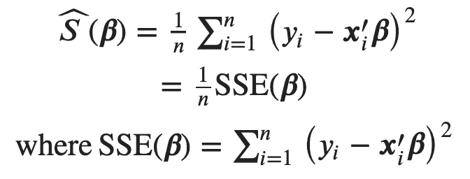

# R 中的广义矩量法(GMM )(第 2 部分，共 3 部分)

> 原文：<https://medium.com/codex/generalized-method-of-moments-gmm-in-r-part-2-of-3-5d03f4097044?source=collection_archive---------6----------------------->

这是 GMM 系列文章的第二篇，是计量经济学和统计学中广义矩量法的简称。欢迎有兴趣的观众来回顾我在 R(第 2 部分，共 3 部分)中的上一篇帖子[广义矩量法(GMM)对于 GMM 的基本思想和使用 R 包的应用`gmm`。在最后一篇文章中，说明了 OLS 估计量就是 GMM 估计量，因此在线性回归的情况下，对于同一组数据**，可以观察到 OLS 的点估计与 GMM 的点估计完全相同。然而，为 OLS 计算的标准误差通常不同于由`gmm`软件包返回的标准误差，因为默认情况下`gmm`至少允许样本间的异方差，但通常 OLS 函数的标准误差通常取决于同方差。也就是说，`gmm`只是提供了与 OLS 相同的点估计，但比 OLS 更稳健的标准误差。诚然，在计量经济学的第一堂课中，对 OLS 的讨论不需要明确触及 GMM。甚至对于应用来说，直接证明 OLS 估计量的稳健的标准误差也是好的，而不用麻烦 GMM。然而，正如我之前所说，GMM 只是提供了另一种观点来构建极值估计的综合体系，并从另一个角度来看待我们对 OLS 和极大似然估计的了解。在结构模型的应用方面，GMM 是一种自然的估计方法，它只需要矩条件的有效性。一般来说，这样的时刻条件可以通过领域知识的相关理论(例如，经济学、市场营销等)推导出来。)在下一篇文章中，我将尝试用 GMM 来解释结构模型的内生性问题。然而，在这篇文章中，我仍然希望从我们熟悉的东西开始理解 GMM。**](https://alfredfaisam.medium.com/generalized-method-of-moments-gmm-in-r-part-1-of-3-c65f41b6199)

本文讨论了为什么极大似然估计也是 GMM 估计。另一方面，也进行了几个实验来说明 R 中 `**optim()**` **的怪异行为，然后强烈建议**避免使用它**。**

# GMM 的 MLE

只要模仿上一篇文章中关于 OLS 是 GMM 的讨论中的观点，这里就说明了为什么 MLE 估计量只是 GMM 估计量。这一陈述的中心点是关于 MLE 一般应用的矩条件的构造。

人们可能记得，在关于 OLS 扮演 GMM 的讨论中，我只是去了启发 OLS 的**线性投影模型**，而不是直接去了 OLS。实际上这是汉森的教科书([计量经济学](https://www.ssc.wisc.edu/~bhansen/econometrics/Econometrics.pdf)和[经济学家概率统计](https://www.ssc.wisc.edu/~bhansen/probability/Probability.pdf))中关于极值估计量的一种图解风格。也就是说，我们可以建立**一种通用的方法来构造估计量作为总体参数**的样本类似物。因此，对于敏感的**线性投影系数** 𝜷，说明**线性投影模型**，以最小化**均方预测误差**:𝑆(𝜷)=𝔼[(𝑦−𝒙′𝜷】。基于这样的概念总体模型，**的样本模拟**的 **MSE** 就是**的平方和误差:**



因此，OLS 估计器只是**线性投影系数** 𝜷的样本模拟，因为**线性投影系数** 𝜷最小化**均方预测误差**:𝑆(𝜷)=𝔼[(𝑦−𝒙′𝜷】并且 OLS 估计器最小化**均方误差**。这样做的好处之一是便于构造 GMM 的总体矩条件，然后指出 OLS 估计量和 GMM 估计量之间的关系。基本原因是它们都可以追溯到**共同的人口时刻条件**:


根据总体模型的对数似然函数，显示 **MLE 是真实参数**的样本模拟也是有用的。从联合可能性开始是有用的:


一般来说，进行常规假设，使得条件似然是唯一的焦点，并且定义**期望对数密度函数**也是有用的:


去除 y 和𝒙的随机性，使其成为参数𝜽.的函数**一个重要的定理是，当模型被正确指定时，真实参数𝜽₀使期望对数密度𝑙(𝜽最大化。人们可以在[的《经济学家的概率与统计》](https://www.ssc.wisc.edu/~bhansen/probability/Probability.pdf) (Hansen，Bruce E .，2021)的第 10.20 节中查看关于该定理的技术问题。基本想法很简单。如果关于数据生成过程和分布的假设是可靠的，那么真实参数应该与这些假设一致，以最大化**【𝑙(𝜽】**。这个想法启发了 MLE，就像**线性投影模型**启发了 OLS 一样。也就是说，MLE 估计器模拟 **𝜽₀** ，因为 MLE 估计器最大化了 **𝑙(𝜽):** 的样本模拟**


对于**期望对数密度函数**的优化问题，一阶条件为


这就是 GMM 的人口状况。同样，相应的样本矩条件也是样本对数似然最大化的一阶条件的直接结果


因此，MLE 估计量就是 GMM 估计量，实际上它是 MM 估计量**,因为矩条件的数量与未知数的数量相同。**

下一个问题是 MLE 估计量的协方差是否与 GMM 估计量的协方差相同。简短的回答是，不。基本原因是，在最大似然估计下，分布假设是为数据生成过程作出的，但 GMM 只需要矩条件。因此，GMM 协方差再次**更稳健** MLE 协方差。这里是一些数学的插图。根据上一篇文章中关于 GMM 的一般性讨论，GMM 估计量具有以下抽样分布:


正如上一篇文章中所讨论的，J(θ)实际上是**最优权重矩阵**，它是力矩条件的协方差:


从教科书上关于 MLE 的讨论，我们知道 I(θ)称为**信息矩阵**，是对数似然的海森。此外，如果分布假设有效，那么我们有**信息等式** : I(θ) = J(θ)。也就是说，MLE 估计量只是明确地依赖于分布假设，所以协方差是 I⁻。因此，GMM 协方差通常比 MLE 协方差更稳健，因为它不期望**信息等式**依赖于分布假设的有效性。

# R&D 数据的案例研究

只要回到[现代计量经济学指南(第二版)](https://thenigerianprofessionalaccountant.files.wordpress.com/2013/04/modern-econometrics.pdf)第 **7.3.2** 节关于 R&D 的数据，并尝试对其进行 MLE 和 GMM。一般来说，人们很容易想到，专利的数量是离散的，只有非负的，所以可以作出具体的分布，如泊松。实际上，泊松模型只是将专利数量的条件分布描述为


在哪里


也是这种泊松分布的条件均值。由于它不再是简单的线性模型，而且作了特定的分布假设，极大似然估计成为估计参数的自然选择。在 R 中很容易得到结果:

```
poisson_res <- patents_df %>%
  glm(p91 ~ lr91 + aerosp + chemist + computer + machines +
    vehicles + japan + us, family = poisson(), data = .)summary(poisson_res)
```

结果是

```
Call:
glm(formula = p91 ~ lr91 + aerosp + chemist + computer + machines + 
    vehicles + japan + us, family = poisson(), data = .)

Deviance Residuals: 
    Min       1Q   Median       3Q      Max  
-27.979   -5.246   -1.572    2.352   29.246  

Coefficients:
             Estimate Std. Error z value Pr(>|z|)    
(Intercept) -0.873731   0.065868  -13.27  < 2e-16 ***
lr91         0.854525   0.008387  101.89  < 2e-16 ***
aerosp      -1.421850   0.095640  -14.87  < 2e-16 ***
chemist      0.636267   0.025527   24.93  < 2e-16 ***
computer     0.595343   0.023338   25.51  < 2e-16 ***
machines     0.688953   0.038346   17.97  < 2e-16 ***
vehicles    -1.529653   0.041864  -36.54  < 2e-16 ***
japan        0.222222   0.027502    8.08 6.46e-16 ***
us          -0.299507   0.025300  -11.84  < 2e-16 ***
---
Signif. codes:  0 ‘***’ 0.001 ‘**’ 0.01 ‘*’ 0.05 ‘.’ 0.1 ‘ ’ 1

(Dispersion parameter for poisson family taken to be 1)

    Null deviance: 29669.4  on 180  degrees of freedom
Residual deviance:  9081.9  on 172  degrees of freedom
AIC: 9919.6

Number of Fisher Scoring iterations: 5
```

然而，泊松分布往往过于强大，其直接属性是**等离差**，它描述了每个样本的均值和方差相等。如果是这样，第一个问题就是 MLE 估计量是否仍然可靠，或者说，[](https://en.wikipedia.org/wiki/Consistent_estimator)**？由以上讨论可知，极大似然估计量就是 GMM 估计量，而 GMM 估计量的一致性只取决于矩条件的有效性。那么，让我们检查相应的力矩条件。就这种情况而言，我们可以认为条件期望被假定为具有 exp()形式:**

****

**因此，我们可以有以下构造的错误**

****

**令人满意的**

****

**因此，**

****

**因此，样本力矩条件为**

****

**这也是**假设泊松分布的对数似然最大化的一阶条件**。也就是说，它也是这种泊松 MLE 模型的**对应 GMM 估计器的样本矩条件。因此，如果我们可以信任条件期望的特定函数形式，那么 GMM 估计的相合性是可靠的，因此极大似然估计的相合性也是可靠的。这就是结论的神奇之处:即使 y 的条件分布不遵循泊松分布，泊松 MLE 估计量基于条件**假设条件期望具有 exp()形式**仍然是一致的:****

****

**在文献中，我们将估计量称为**一个准最大似然估计量(QMLE)** 。准通常意味着不真实。表面上这种估计量是从泊松分布导出的，但实际上它也可以由依赖于条件期望的矩条件导出。**

**根据协方差矩阵的估计，可以看出 MLE 过程只返回 I⁻，而 GMM 过程应该返回**

****

**哪个更健壮。利用`gmm`，人们可以很容易地构建力矩条件:**

```
# GMM estimator as Quasi- (Psudo-) MLE
# Define moment conditions matrix for QMLE (gmm)mom <- function(beta, df) {
  # df is the data frame with first column as dv
  # This function returns n * q matrix
  # Each column is one moment condition before taking sample average
  # There are totally q moment conditionsy <- as.numeric(df[, 1])
  x <- data.matrix(df[, 2:ncol(df)])# Refer to moment conditions of QMLE
  m <- x * as.vector(y - exp(x %*% beta))return(cbind(m))
}# Generate regression coef as the initial values for QMLE (gmm)
init_values <- patents_df %>%
  select(
    p91, lr91, aerosp, chemist, computer, machines,
    vehicles, japan, us
  ) %>%
  mutate(const = 1) %>%
  # Please hold the order as previous glm() to facilitate comparison
  select(
    p91, const, lr91, aerosp, chemist, computer, machines,
    vehicles, japan, us
  ) %>%
  lm(p91 ~ lr91 + aerosp + chemist + computer + machines +
    vehicles + japan + us, data = .) |>
  {\(x) coef(x)*0.01}()# Be careful that we need to use "nlminb" INSTEAD OF "optim", which is
# bloody awful.
# Refer to [https://cran.r-project.org/web/packages/gmm/vignettes/gmm_with_R.pdf](https://cran.r-project.org/web/packages/gmm/vignettes/gmm_with_R.pdf)# Just use random initial values
set.seed(1024)
qmle_res_1 <- gmm(mom, df_n, rnorm(length(init_values)),
  wmatrix = "optimal",
  vcov = "MDS",
  optfct = "nlminb",
  control = list(eval.max = 10000)
)summary(qmle_res_1)
```

**结果是**

```
Call:
gmm(g = mom, x = df_n, t0 = rnorm(length(init_values)), wmatrix = "optimal", 
    vcov = "MDS", optfct = "nlminb", control = list(eval.max = 10000))

Method:  twoStep 

Kernel:  Quadratic Spectral

Coefficients:
          Estimate     Std. Error   t value      Pr(>|t|)   
Theta[1]  -8.7373e-01   7.4295e-01  -1.1760e+00   2.3958e-01
Theta[2]   8.5453e-01   9.3694e-02   9.1204e+00   7.4878e-20
Theta[3]  -1.4219e+00   3.8016e-01  -3.7401e+00   1.8395e-04
Theta[4]   6.3627e-01   2.2536e-01   2.8234e+00   4.7520e-03
Theta[5]   5.9534e-01   3.0080e-01   1.9792e+00   4.7795e-02
Theta[6]   6.8895e-01   4.1468e-01   1.6614e+00   9.6628e-02
Theta[7]  -1.5297e+00   2.8069e-01  -5.4496e+00   5.0489e-08
Theta[8]   2.2222e-01   3.5284e-01   6.2981e-01   5.2882e-01
Theta[9]  -2.9951e-01   2.7362e-01  -1.0946e+00   2.7368e-01

J-Test: degrees of freedom is 0 
                J-test                P-value             
Test E(g)=0:    4.82602870693394e-15  *******             

#############
Information related to the numerical optimization
Convergence code =  0 
Function eval. =  83 
Gradian eval. =  515 
Message:  X-convergence (3)
```

**人们可以发现点估计与最大似然估计相同，但协方差不同。你可以检查一下，我们只是复制了[现代计量经济学指南](https://thenigerianprofessionalaccountant.files.wordpress.com/2013/04/modern-econometrics.pdf)第 216 页表格中的结果:**

****

# **R 中`optim()`的不稳定性**

**直到现在，一直强调`optfnc`选择`"nlminb"`，而不是默认的`optim`。当使用`optim`解决问题时，可以检查实验，发现不正确的结果:**

```
# Just use random initial values
set.seed(1024)
qmle_res_3 <- gmm(mom, df_n, rnorm(length(init_values)),
  wmatrix = "optimal",
  vcov = "MDS",
  optfct = "optim",
  control = list(maxit = 10000)
)summary(qmle_res_3)
```

**结果是**

```
Call:
gmm(g = mom, x = df_n, t0 = rnorm(length(init_values)), wmatrix = "optimal", 
    vcov = "MDS", optfct = "optim", control = list(maxit = 10000))

Method:  twoStep 

Kernel:  Quadratic Spectral

Coefficients:
          Estimate     Std. Error   t value      Pr(>|t|)   
Theta[1]   4.68677922   1.27672054   3.67095152   0.00024165
Theta[2]   0.11570739   0.19122828   0.60507468   0.54512938
Theta[3]  -3.27941695   2.04110024  -1.60669079   0.10812222
Theta[4]  -0.22722767   0.33122546  -0.68602113   0.49269979
Theta[5]   0.34977317   0.32271631   1.08384100   0.27843530
Theta[6]  -1.29893740   1.31655110  -0.98662133   0.32382831
Theta[7]  -4.52432887   4.93624197  -0.91655330   0.35937677
Theta[8]   0.66823830   0.42017527   1.59037989   0.11174920
Theta[9]  -1.19538287   0.43457120  -2.75071811   0.00594648

J-Test: degrees of freedom is 0 
                J-test            P-value         
Test E(g)=0:    24521.7280884245  *******         

#############
Information related to the numerical optimization
Convergence code =  0 
Function eval. =  1558 
Gradian eval. =  NA
```

**和**

```
# What about anoter set of random initial values
set.seed(4201)
qmle_res_4 <- gmm(mom, df_n, rnorm(length(init_values)),
  wmatrix = "optimal",
  vcov = "MDS",
  optfct = "optim",
  control = list(maxit = 10000)
)
summary(qmle_res_4)
```

**结果是**

```
Call:
gmm(g = mom, x = df_n, t0 = rnorm(length(init_values)), wmatrix = "optimal", 
    vcov = "MDS", optfct = "optim", control = list(maxit = 10000))

Method:  twoStep 

Kernel:  Quadratic Spectral

Coefficients:
          Estimate     Std. Error   t value      Pr(>|t|)   
Theta[1]  -2.2705e+00   8.8977e-01  -2.5518e+00   1.0717e-02
Theta[2]   1.0505e+00   1.0605e-01   9.9060e+00   3.9217e-23
Theta[3]   1.2665e+00   4.5386e-01   2.7904e+00   5.2639e-03
Theta[4]   8.2098e-01   2.7199e-01   3.0184e+00   2.5414e-03
Theta[5]   1.0493e+00   3.2657e-01   3.2130e+00   1.3134e-03
Theta[6]   1.0738e+00   5.0875e-01   2.1106e+00   3.4806e-02
Theta[7]  -1.7693e+00   3.8303e-01  -4.6194e+00   3.8490e-06
Theta[8]  -1.1773e-01   3.7078e-01  -3.1752e-01   7.5085e-01
Theta[9]  -6.2103e-01   3.0085e-01  -2.0643e+00   3.8991e-02

J-Test: degrees of freedom is 0 
                J-test            P-value         
Test E(g)=0:    7532.64472252297  *******         

#############
Information related to the numerical optimization
Convergence code =  0 
Function eval. =  846 
Gradian eval. =  NA
```

**可以发现优化结果只是表示成功收敛，结果却**不正确**！这只是 MM 估计量，所以值应该是 0！老实说，当我准备讲稿时，这些发现让我大吃一惊。据我所知，很多 R 包仍然使用`optim()`进行数值优化，但从这些经验来看，建议要小心，尽可能不要使用**。****

# ****摘要****

****本文讨论了最大似然估计与 GMM 的关系。实际上极大似然估计也是 GMM 估计，如果 GMM 估计的相合性成立，那么极大似然估计的相合性仍然成立。在 R&D 的例子中，如果条件期望的 exp()规格是可接受的，那么当泊松分布受到挑战时，人们仍然可以争论一致性。另一方面，当数据生成过程不服从泊松分布时，GMM 过程可以提供更稳健的协方差。****

****另一方面，从实验中我也发现了数值优化常用的 R 函数`optim()`的不稳定性。糟糕的是，据我所知，许多计量经济学或统计学的软件包通常使用`optim()`，所以人们应该小心这些软件包的未来用途。幸运的是，目前我们有其他选择。在`gmm`的岗位上，我只是切换到`nlminb`。我相信其他 R 包应该有类似的优化方法选项。对于那些想进行计算课题研究的人来说，[茱莉亚](https://julialang.org/)被推荐试用。嗯，几年前我曾为两种语言的问题困扰过 Rcpp。Julia 被期望处理这样的问题来平衡简单编码和快速。****

# ****参考****

*   ****Chaussé，P. (2021 年)。[用 R 计算广义矩方法和广义经验似然](https://cran.r-project.org/web/packages/gmm/vignettes/gmm_with_R.pdf)。*统计软件杂志*， *34* (11)，1–35。****
*   ****肖斯议员和肖斯议员(2021 年)。[包装‘GMM’](https://cran.r-project.org/web/packages/gmm/gmm.pdf)。****
*   ****米·维尔比克(2004 年)。[现代计量经济学指南(第二版)](https://thenigerianprofessionalaccountant.files.wordpress.com/2013/04/modern-econometrics.pdf)。ERIM(电子)书籍和章节。约翰·威利的儿子们，奇切斯特。****
*   ****布鲁斯·汉森(2021)。[计量经济学](https://www.ssc.wisc.edu/~bhansen/econometrics/Econometrics.pdf)。威斯康星大学打字稿。普林斯顿大学出版社，即将出版。****
*   ****布鲁斯·汉森(2021)。[经济学家概率统计](https://www.ssc.wisc.edu/~bhansen/probability/Probability.pdf)。威斯康星大学打字稿。普林斯顿大学出版社，即将出版。****
*   ****怀特·哈尔伯特(1980)。“异方差一致的协方差矩阵估计量和异方差的直接检验”。 [*计量经济学*](https://en.wikipedia.org/wiki/Econometrica) 。**48**(4):817–838。[CiteSeerX](https://en.wikipedia.org/wiki/CiteSeerX_(identifier))[10 . 1 . 1 . 11 . 7646](https://citeseerx.ist.psu.edu/viewdoc/summary?doi=10.1.1.11.7646)。[doi](https://en.wikipedia.org/wiki/Doi_(identifier)):[10.2307/1912 934](https://doi.org/10.2307%2F1912934)。 [JSTOR](https://en.wikipedia.org/wiki/JSTOR_(identifier)) [1912934](https://www.jstor.org/stable/1912934) 。[先生](https://en.wikipedia.org/wiki/MR_(identifier))0575027。****