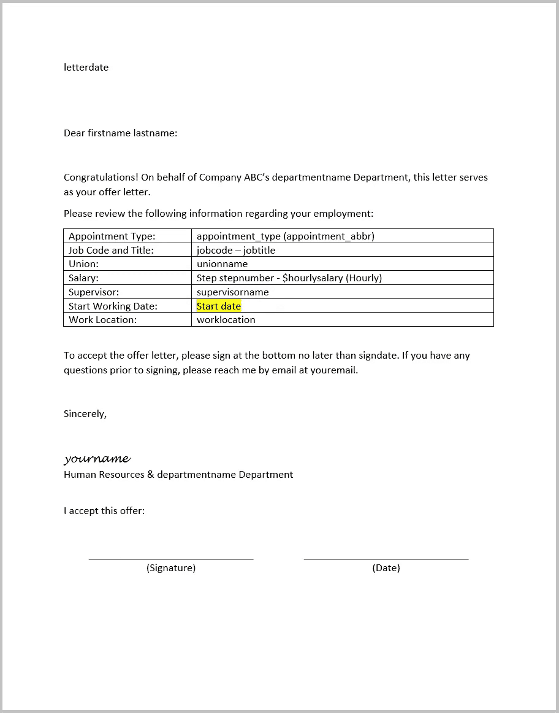

# 用 R 和 Microsoft Word 生成动态套用信函

> 原文：<https://medium.com/codex/generate-dynamic-form-letters-with-r-and-microsoft-word-9923fc5fa9df?source=collection_archive---------9----------------------->

r 和 Microsoft Word 徽标(作者插图)

如果你曾经被要求在 Microsoft Word 中完成一封套用信函，你可能知道它有多乏味。有时，可以使用软件和工具生成信件和文档，例如 Microsoft Word 中的邮件合并功能，但其他时候，具有多个细微差别字段的文档通常只是在需要时才完成。

使用大卫·戈赫尔 的 [**officer 软件包，可以在 R 中找到一个解决复杂格式信函的方法。这个简短的教程创建了一个模板工作聘书，并使用 R 来完成其占位符字段。如果你有兴趣复制这些例子，你可以在这里**](https://davidgohel.github.io/officer/) 找到教程代码和文件 [**。首先，我们从创建模板文档开始。**](https://github.com/matthanc/dynamicword)

# 第一步:准备 Word 文档

用于更改占位符文本的方法本质上是一个“查找和替换”功能。因此，使用唯一的占位符并且不在文档的其他地方部分(或全部)使用是很重要的。例如，使用 *"appointment_type"* 和*" appointment _ type _ abbr "*作为占位符将不起作用，因为该函数会错误地将第一个合并字段匹配到第二个。为此，我们使用*“约会类型”*和*“约会缩写”*来避免无意的混淆。

对于本教程，下面的聘书模板将被用作一个例子。

带有占位符的 Word 模板文档

# 第二步:编写 R 脚本

步骤 1:加载 R 包。

我们将通过加载上述四个库来启动脚本。但是，在加载软件包之前，您需要使用*“install . packages”*函数安装每个软件包。更多关于如何安装包的信息可以在 [**这里**](https://www.r-bloggers.com/2010/11/installing-r-packages/) 找到。

步骤 2:加载相关数据

接下来，我们加载相关的数据表。在上面的代码中，表格是从外部 Excel 文件中加载的。在本例中，我们将使用四个表中的虚拟数据— *、【position_data】、*、*、【union_data】、*、*、【appointment_data】、*、*、【department _ data】*。

步骤 3:为输入和查找编写一个函数

加载数据表后，我们将为用户输入编写一个函数。在上面的示例中，10 个输入用于返回一个单行表。然后，使用职务代码和部门 ID 输入从以前使用各种连接和变异函数加载的表中查找信息。结果是一个有 21 个输入/变量的单行表格——其中许多将在以后输入到我们的套用信函中。

步骤 4:编写一个查找和替换函数

一旦我们编写了输入函数，接下来我们将编写“查找和替换”函数。在上面的例子中，读取 Word 文档，并为我们信函中的每个占位符编写一个 *"body_replace_all_text"* 函数(来自 officer 包)。

步骤 5:输入输入内容。

在上面的 R 代码中，我们调用前面创建的*“offer letter _ inputs”*函数，并提供必要的输入。这有效地创建了前面提到的 21 个变量的表。

步骤 6:生成并保存。Docx 文档

在我们的最后一步，我们运行“查找和替换”功能，并保存录用通知书。上面的代码使用了*"*[***glue***](https://www.rdocumentation.org/packages/glue/versions/1.4.2/topics/glue)*"*函数将输入表中的字段连接到文档的文件名中。结果是用我们选择的命名约定动态填充和保存的套用信函。

# 超越剧本

编写生成动态套用信函的 R 脚本的一个限制是，运行该脚本需要一些 R 的工作知识。向非 R 用户提供该脚本需要添加关于如何安装 R、软件包和运行代码的详细说明。然而，我们可以避免这种情况，通过将上面的代码工作到一个 [**闪亮的应用程序**](https://shiny.rstudio.com/) 中来包含非 R 用户。

Shiny 是一个 R 包，它使得快速创建 web 应用程序成为可能。例如，使用 Shiny，我们可以创建一个 web 应用程序，利用我们的脚本允许用户直接从他们的 web 浏览器生成动态套用信函。

# 闪亮的包裹

这个闪亮的应用程序将利用我们已经编写的大部分 R 代码。特别是，我们将加载相同的包、数据和函数，尽管我们需要在这个过程中对代码进行一些修改。

加载 R 包——这一次，闪亮的包包括在内

我们将首先加载包，这一次也包括如上所示的闪亮的包。

加载相关数据

为输入和查找编写一个函数

在我们的包被加载之后，我们加载相关的数据并复制到我们的查找函数中。上面几行代码与我们之前编写的数据加载和查找功能相同。

我们剩下的代码需要和这个闪亮的应用程序一起重写——尽管大部分代码和之前写的相似。闪亮的应用程序代码通常分为两个独立的部分——UI(用户界面)部分和服务器部分。UI 将作为应用程序的前端，最终用户可以在这里看到和/或输入信息。服务器端部分将处理所有后端计算。在主要的 Shiny 网站上有更多的互动指南和教程，分享如上。我们将从用户界面开始。

闪亮的应用程序 UI 代码

上面的 UI 代码包含 10 个输入，与我们的 inputs 函数所需的输入相同。使用界面输入的一个好处是我们可以指定如何输入信息。例如，在上面的代码中，我们允许用户自由地输入大部分文本，但只允许下拉选择其他内容(部门、职务代码、薪级和任命类型)。

闪亮的应用服务器端代码

上面的服务器代码做了一些事情。代码被包装在*“Download handler”*函数中，当我们的最终用户单击“Download Offer Letter”按钮时执行。它首先调用并运行我们的 inputs 函数，然后将用户的输入输入到一个现已解构的 find-and-replace 函数中。最后，它“打印”文件——有效地用先前选择的相同命名约定保存它

函数运行闪亮的应用程序。

最后，启动闪亮的应用程序(如上面的代码所示)。您可以通过以下链接找到该应用程序的工作版本，如果您想查看的话:【https://matthanc.shinyapps.io/dynamicworddemo/】**。**

# **结束语**

**就所使用的包的功能而言，本教程中使用的示例有一定的局限性。例如，officer 包包括创建 Word(.docx)和 Powerpoint(。pptx)文档，而不需要带有占位符的外部文档。同样，我们可以用 Shiny 做更多的事情来改进和风格化应用程序的界面。**

**如果你对这些脚本感兴趣，你可以在 Github 上找到代码:[**https://github.com/matthanc/dynamicword/**](https://github.com/matthanc/dynamicword/)**

## **额外资源**

*   ***R:*[*https://www.r-project.org/*](https://www.r-project.org/)**
*   ***r studio:*[*https://www.rstudio.com/*](https://www.rstudio.com/)**
*   ***潮汐:*[https://www.tidyverse.org/](https://www.tidyverse.org/)**
*   ***闪亮:*[*https://shiny.rstudio.com/*](https://shiny.rstudio.com/)**
*   ***官 R 包:*[*https://davidgohel.github.io/officer/*](https://davidgohel.github.io/officer/)**
*   ***教程文件:*[【https://github.com/matthanc/dynamicword/】T21](https://github.com/matthanc/dynamicword/)**
*   ***原帖:*[*https://matthanc . ghost . io/how-to-generate-dynamic-word-documents-with-r/*](https://matthanc.ghost.io/how-to-generate-dynamic-word-documents-with-r/)**