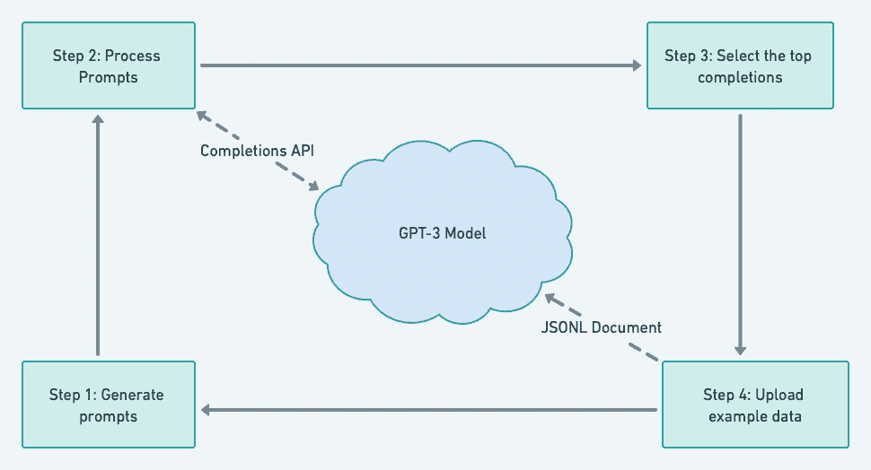

# 使用 GPT 协议 3 生成产品描述

> 原文：<https://medium.com/codex/generate-product-descriptions-with-gpt-3-2e4c45edaed9?source=collection_archive---------0----------------------->

## 使用 OpenAI Python 库为您的网站生成产品描述的简单指南。


DALL E 2 生成的图像

上个月，一个朋友问我是否可以帮助使用人工智能来为他们在网上商店出售的数千种产品生成产品描述。**在本文中，我将描述我使用 OpenAI 开发的大型语言模型(LLM)GPT-3 生成这些描述的步骤。**

今天，LLM 经常出现在新闻中；一些文章声称，这些模型在处理自然语言时具有人类水平的性能。当我得到关于为网站生成产品描述的问题时，我认为这是我自己尝试一下并看看 LLM 是否真的如此强大的理想时刻。

各种各样的公司都在建造 LLM，但是目前，最著名的两个模型是 GPT-3 和谷歌 LaMBDA。由于谷歌尚未向公众开放其模型，我决定尝试 GPT-3。

OpenAI 创建了一个 REST API 来访问 GPT-3 模型。对于这个用例，我们需要利用完成端点，这允许我们问 GPT-3 一个问题(提示)并得到一个响应(完成)作为回报。

# 配置 OpenAI Python 包

我们需要安装 openai 和 transformers 包来实现这个功能。[open ai Python 库](https://github.com/openai/openai-python)提供了对我们将用来与 GPT-3 通信的 API 的简单访问。我们可以使用[transformers 包](https://pypi.org/project/transformers/)来标记我们的输入提示，并计算我们使用的标记数量。我们可以使用 pip 简单地安装这些包:

```
!pip install openai
!pip install transformers
```

安装完这些包后，记得传递您的 API 秘密进行认证。

**谈谈代币及其定价**

OpenAI APIs 的使用不是免费的；他们的定价模型是基于代币的使用。一个标记最好被描述为文本中的一个字符序列。例如，单词“飞机”由 8 个字符和两个记号(空气和飞机)组成。使用[这个在线工具，](https://beta.openai.com/tokenizer)你可以计算出一段特定文本的标记数。或者，也可以使用 transformers 包并传递一个字符串来计算令牌:

```
from transformers import GPT2Tokenizer
tokenizer = GPT2Tokenizer.from_pretrained(“gpt2”)
len(tokenizer(“Your input string”)[‘input_ids’])
```

在撰写本文时，在最贵的型号(davinci)上处理 1K 令牌的价格是 0.02 美元。像阿达，居里这种便宜的型号，价格要便宜十几倍。请记住，收取的代币金额是基于提示+响应，而不仅仅是响应。

*一旦安装并配置了所需的包。我将生成这些产品描述的整个过程分为三个主要步骤:*

# 1.数据清理

在本例中，我们正在处理一家纺织公司提供的库存数据集，其中包含他们销售的面料及其相关属性:

为了成功完成以下步骤，我们需要对该数据集执行一些数据清理:

*   估算缺失值。
*   添加一个计算列以指示特定面料是否厚重(weight_category)。
*   将*用法*列中的所有单词转换为复数；为此，我使用了一个名为[的包。](https://pypi.org/project/inflect/)
*   在*组合*和*用法*列中的字符串值列表之间添加逗号和“*和*连接词。

# 2.生成提示

在数据清理步骤之后，我们可以根据每个产品记录的可用属性生成提示。

务必记住，我们必须用自然语言创建提示。由于模型是基于书面文本而不是数据集进行训练的，我们通过像问人类一样提问来获得最佳结果。

在我们的示例中，我使用以下属性来生成一个问题:

*   建筑
*   颜色
*   处理
*   成分
*   使用
*   重量类别

通过在我的库存数据集上运行这个简单的脚本，我能够生成一些提示:

```
"Write a short marketing description about: A knitted fabric, that is piece dyed and made of 80% Modacrylic and 20% Polyester. It's a heavy fabric that can be used for accessories, animal cushions, carnavals, decorations, home decoes, pillows, and traditional costumes""Write a short marketing description about: A knitted fabric, that is piece dyed and made of 95% Viscose, 5% Spandex. It's a fabric that can be used for blouses, dresses, evening fashions, skirts, t-shirts, and linings."
```

# 3.调用模型

一旦我们有了问题，我们可以调用完成端点来与 GPT-3 交互以获得我们的答案(完成)。

要设置的一些重要参数:

*   **引擎** : OpenAI 有不同的引擎，各有优缺点。查看[open ai 文档](https://beta.openai.com/docs/models/gpt-3)获取更多信息。我发现 curie 引擎对于生成产品描述来说是一个非常好的性价比。
*   **提示**:这是我们上一步刚刚生成的问题。
*   **温度**:我把它设置为 0.5，以便在完成时有一些变化。将此项设置为 0 将导致模型对每个相同的问题给出相同的答案。
*   **max_tokens** :提示和完成一起可以包含的最大令牌数。
*   频率惩罚:通过设置更高的频率，你可以减少同一个单词在文本中被频繁使用的机会。
*   **presence_penalty** :把这个设置的高一点会迫使模型避免重复相同的主题或者单词，迫使谈论新的话题和主题的可能性。

然后我们循环所有的问题，并将答案附加到我们的产品数据框中。

运行该脚本后，我们得到如下产品描述:

> 这款黑色针织面料是你衣橱里的百搭时尚单品。它由 80%的丙烯酸和 20%的聚酯制成，可用于配饰、动物靠垫、狂欢节、枕头和传统服装。

# 关于结果的最终想法

运行脚本后，我注意到一些描述包含错误或差错。我将简要地回顾一下它们，并提供一些如何避免或最小化它们的技巧。

## **语法错误**

我们注意到输出中有大量的语法错误。经过一些测试，似乎这主要是由于输入提示。如果提示中的某些单词拼写或变化不正确，这可能会增加完成时出错的几率。所以建议确保输入是正确的；你可以使用像[语言工具 python](https://pypi.org/project/language-tool-python/) 这样的包来帮助你。

## 错误的信息

在某些情况下，模型会在描述中提供不正确的信息。例如，它会说某个特定的面料是在美国制造的，但在我们的输入提示中从来没有提到过。这是一个严重的问题，因为我们可能会在不知不觉中误导客户。

**解决这个问题的最好方法是对模型进行微调；这是通过将最佳提示和完成反馈到模型中来实现的。**在数百个示例之后，模型将学习预期的完成类型，从而返回更高质量的结果。



微调模型是一个迭代过程。

示例提示，必须将完成内容作为. JSONL 文档上传。

```
{“prompt”: “<prompt text>”, “completion”: “<ideal generated text>”}
{“prompt”: “<prompt text>”, “completion”: “<ideal generated text>”}
{“prompt”: “<prompt text>”, “completion”: “<ideal generated text>”}
…
```

在这个文件被上传和处理之后，OpenAI 将返回一个 *fine_tuned_model* 参数，该参数可以在将来调用完成端点时使用。例如:

```
import openai
openai.Completion.create(
 model=FINE_TUNED_MODEL_NAME,
 prompt=YOUR_PROMPT)
```

关于微调模型的更多细节，可以在官方文档中找到所有相关步骤的完整描述[。](https://beta.openai.com/docs/guides/fine-tuning)

# 结论

大型语言模型(LLM)越来越受欢迎，甚至非机器学习专家也更容易使用。GPT 3 号只是其中的一个例子；谷歌推出了 LaMBDA 型号，该型号性能更高，将在未来几个月发布公测版。

本文只是一个简单的例子，展示了如何用最少的代码使用 LLM，并利用它的多功能性来完成几项任务。

如图所示，该模型并不完美，需要一些额外的步骤来确保输出符合预期。这仅仅是开始，在接下来的几年里，我们将会看到更多性能和精度更好的 LLM。目前，这是为常规开发人员提供工具来自动化重复任务的第一步，而不需要强大的人工智能或机器学习技能。

我很想知道是否还有其他人将 LLM 用于其他用例！