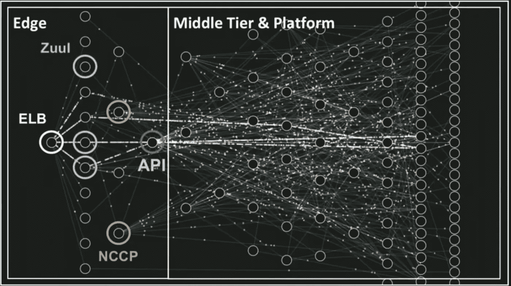
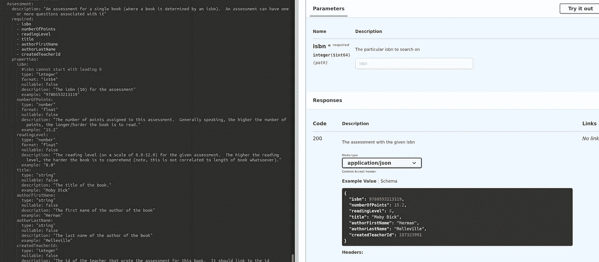
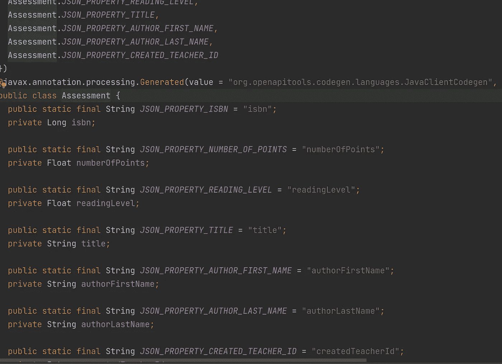
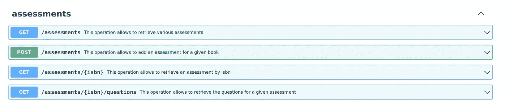
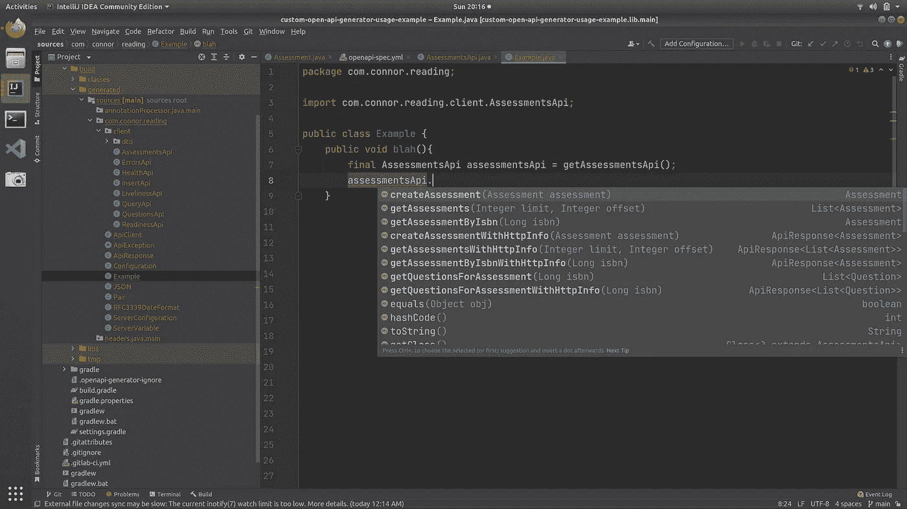
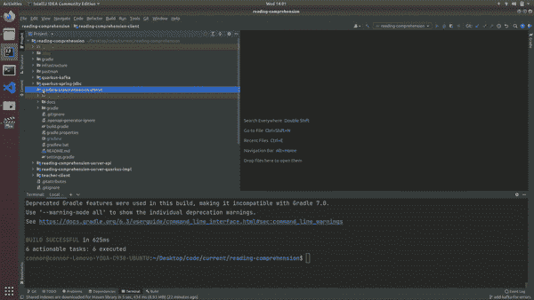
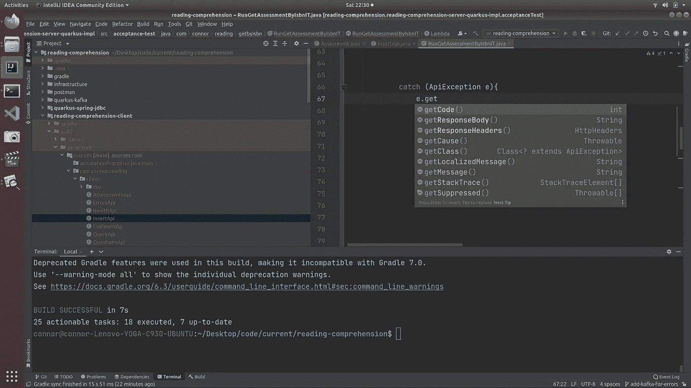

# 根据 OpenAPI 规范为 RESTful 服务生成客户端/模型

> 原文：<https://medium.com/codex/generating-clients-models-for-restful-services-from-openapi-specification-edf211e5d761?source=collection_archive---------0----------------------->

在几秒钟内生成随时可用的客户端和模型



网飞的服务图——注意有多少连接！( [src](https://www.youtube.com/watch?v=CZ3wIuvmHeM) )

# 沟通是不可或缺的！

随着[微服务](https://microservices.io/)越来越受欢迎，服务间的沟通成为一个组织架构的重要组成部分。企业的技术堆栈不再由三个很少通信的单一应用程序组成，而是由数百个频繁交互的微小组件组成。这些服务最常见的通信方式是与 [REST](https://www.redhat.com/en/topics/api/what-is-a-rest-api) 进行通信。

> B *在我们继续讨论之前，我必须指出的是* [*我尽可能避免进行同步调用*](https://aws.plainenglish.io/stop-making-synchronous-calls-f101af15cd46)*(REST 是同步调用的一种形式)，但是如果您必须进行同步调用，那么您应该* [*遵循这些提示*](/codex/successful-microservice-architecture-eda2adee67f8) *来使您的服务更有弹性*

# 当前(有缺陷的)流程

尽管它很重要，但我看到许多组织进行进程间调用的方式还有很多不足之处。事情往往是这样的:

*   服务器端团队手工输入模型(假设他们使用 java)
*   服务器端团队试图以反映上一步中创建的手写模型的方式编写开放 api 规范
*   服务器端团队创建他们自己的客户端进行测试
*   消费团队手工输入模型
*   消费团队创建他们自己的客户来消费服务

# 有待改进的领域

这一过程在许多方面存在缺陷；下面是一些主要的例子

*   容易出错— **不能保证契约是正确的**(考虑模型有 transactionId，契约有 transactionID)
*   低效——服务器端团队已经定义了合同，为什么他们还需要编写模型呢？**浪费开发者时间**
*   低效——服务器端团队编写测试客户端，然后消费者各自编写自己的客户端；再次，**又一次浪费开发者的时间**
*   低效——消耗团队必须花时间为他们编写的客户编写单元测试
*   额外的开销——因为每个消费团队都编写自己的客户端，
*   缺乏标准化——无法保证最佳实践在团队中得到遵循
*   缺乏可扩展性——添加新功能需要修改由不同团队维护的大量代码

# 如何改进:代码生成

有一种方法可以改善上面列出的许多缺点:**通过从规范**中生成代码(包括客户端和服务器端)。因为这篇文章是关于 REST 的，我们将使用[开放 api 规范](https://swagger.io/specification/)，但是你也可以用其他格式做类似的事情(比如用 protobuffers 的 [GRPC，或者用 WSDL](https://developers.google.com/protocol-buffers/docs/proto3) 文件的 [SOAP)。我们的流程概述如下:](https://www.soapui.org/docs/soap-and-wsdl/working-with-wsdls/)

*   为我们的服务写合同
*   在它自己的 sdk/jar 中生成客户端(在这种情况下，我们将使用一个 [gradle 插件](https://openapi-generator.tech/docs/plugins/)，**，这样我们就可以在我们的测试中使用它，消费者也可以将它包含在他们的项目中**
*   生成服务器端模型和接口(同样，使用相同的 [gradle 插件](https://openapi-generator.tech/docs/plugins/)，只是不同的[配置](https://subscription.packtpub.com/book/application_development/9781784392789/1/ch01lvl1sec08/declaring-dependency-configurations) ) —可以与上述步骤并行完成
*   为我们的功能编写[黄瓜测试](https://cucumber.io/)(使用我们生成的客户端)

*注意这是如何改进上述解决方案的缺点的:*

*   保证正确性——因为模型是从开放 api 规范中生成的；他们将会是 100%正确的
*   更高效——服务器端团队不再需要写模型；哪个**节省了几个小时的时间**
*   更高效——消费者使用与服务器端团队在功能测试中使用的相同的客户端(而不是编写他们自己的客户端),这**为每个消费者节省了数小时的时间**
*   更高效——消费者不再需要为客户编写单元测试，**为每个消费者节省了几个小时的时间**
*   标准化——每个客户端都将遵循相似的结构，这使得调试和使用更加容易，**节省了数小时的时间**
*   更容易扩展——团队可以传递拦截器来修改请求和响应；或者他们可以定制小胡子模板来修改生成的代码，**，这对所有团队都有好处**

*注:这个过程类似于* [*google 多年来用 grpc*](https://www.programmableweb.com/news/how-to-auto-generate-grpc-code-using-protoc/how-to/2020/10/14) *所拥抱的，对于* [*SOAP webservices(用 WSDL)*](https://www.baeldung.com/java-soap-web-service) *它是存在的(至少代码生成)，还有如果你看* [*aws 的客户端 SDK*](https://docs.aws.amazon.com/AWSJavaSDK/latest/javadoc/com/amazonaws/services/sqs/AmazonSQSClient.html)*，它们都是生成的。最后，许多其他成功的技术公司，如*[*sales force*](https://www.salesforce.com)*和*[*paypal*](https://www.paypal.com)*都长期使用客户端生成流程。故事的寓意；这是经过实践检验的真理，如果你不使用它，你的公司就会被甩在后面。*

# 最后结果

在本文结束时，您将已经建立了一个自动生成 java 模型对象的过程，这些对象表示 open api 规范中声明的任何模型(用于请求/响应主体)以及功能完整的 java 客户机，这些客户机为规范中声明的每个操作提供了一个方法。它在你的 build.gradle 中包含 10 行代码(**你不用写一行 java 代码**——它都是自动生成的),你可以用它来调用你的服务。

*   开放 api 规范中指定的任何模型都有一个为其创建的 Java POJO 用相同的名称构造并适当嵌套



开放 api 文档中评估对象的规范(通过 [swagger 编辑器](https://editor.swagger.io/)可视化)



生成的代表评估的 java 类

*   任何操作(url 和方法的组合)都有一个生成了方法的客户端。这个方法是调用 api 的全功能方法，使用生成的请求和响应模型。如果您愿意，您可以使用标签来生成不同的 APIs 如果您用不同的标签标记相同的操作，您可以在不同的类中公开相同的功能。



这些是开放 api 规范中规定的操作(通过 [swagger 编辑器](https://editor.swagger.io/)可视化)



您还可以获得一个为生成的 java 客户端，其中包含规范中声明的每个操作的方法

# 实施细节

我们现在将看到如何用 Java 为客户端库实现上述过程(*注意，对于其他语言*，可以遵循非常相似的过程)。这个过程与服务器端存根类似，只是它们为您提供了一个接口来实现使用您的业务逻辑，而不是一个全功能的客户端:

*   应用开放 api 生成器插件

```
plugins {
    id "java-library"
 **id "org.openapi.generator" version "4.3.1"** 
}
```

*   添加配置块—唯一必需的重要字段是 inputSpec、generatorName 和 library

```
openApiGenerate {
 **generatorName = "java"**
 **inputSpec = "$rootDir/infrastructure/openapi-spec.yml"**
    outputDir = "$projectDir"
    apiPackage = "com.connor.reading.client"
    modelPackage = "com.connor.reading.client.dto"
    configOptions = [
            dateLibrary: "java8",
            generateBuilders: "true",
 **library: "native",**
            useRuntimeException: "true",
            generatePom: "false",
            sourceFolder: "build/generated/sources/" 
    ]
}
```

*   添加生成的*代码中使用的依赖项

```
dependencies {
    implementation "com.fasterxml.jackson.core:jackson-core:$jacksonVersion"
    implementation "com.fasterxml.jackson.core:jackson-annotations:$jacksonVersion"
    implementation "com.fasterxml.jackson.core:jackson-databind:$jacksonVersion"
    implementation "com.fasterxml.jackson.datatype:jackson-datatype-jsr310:$jacksonVersion"
    implementation "org.openapitools:jackson-databind-nullable:$jacksonDatabindVersion"
    implementation "com.google.code.findbugs:jsr305:$findBugsVersion"
    implementation "io.swagger:swagger-annotations:$swaggerAnnotationsVersion"
}
```

*   将生成的代码添加到类路径中—检查编译并允许使用它

```
sourceSets.main.java.srcDirs += "$outputDir"
```

*   使生成在代码编译之前运行，这样如果生成的代码中有任何错误，项目将不会编译

```
tasks.compileJava.dependsOn tasks.openApiGenerate
```

*   (可选)更新[。openapi-generator-ignore](https://gitlab.com/connorbutch/reading-comprehension/-/blob/master/reading-comprehension-client/.openapi-generator-ignore) 防止生成额外的文件

# 最后结果

完整的 build.gradle 如下所示(在 gitlab [这里](https://gitlab.com/connorbutch/reading-comprehension/-/blob/master/reading-comprehension-client/build.gradle))至此，您已经完成了设置代码生成所需的所有工作(下一节将展示如何运行它)

```
plugins {
    id "java-library"
    id "org.openapi.generator" version "4.3.1"
}

ext{
    findBugsVersion = "3.0.2"
    jacksonDatabindVersion = "0.2.1"
    jacksonVersion = "2.9.9"
    openApiGeneratorVersion = "4.3.1"
    swaggerAnnotationsVersion = "1.5.22"

    outputDir = "build/generated/sources/"
}

sourceCompatibility = 11
targetCompatibility = 11

sourceSets.main.java.srcDirs += "$outputDir"

repositories {
    mavenCentral()
}

dependencies {
    implementation "com.fasterxml.jackson.core:jackson-core:$jacksonVersion"
    implementation "com.fasterxml.jackson.core:jackson-annotations:$jacksonVersion"
    implementation "com.fasterxml.jackson.core:jackson-databind:$jacksonVersion"
    implementation "com.fasterxml.jackson.datatype:jackson-datatype-jsr310:$jacksonVersion"
    implementation "org.openapitools:jackson-databind-nullable:$jacksonDatabindVersion"
    implementation "com.google.code.findbugs:jsr305:$findBugsVersion"
    implementation "io.swagger:swagger-annotations:$swaggerAnnotationsVersion"
}

task deleteExtraGeneratedDirectories(type: Delete) {
    delete ".openapi-generator"
    delete "api"
    delete "src"
}

tasks.deleteExtraGeneratedDirectories.dependsOn tasks.openApiGenerate
compileJava.dependsOn tasks.deleteExtraGeneratedDirectories

openApiGenerate {
    generatorName = "java"
    inputSpec = "$rootDir/infrastructure/openapi-spec.yml"
    outputDir = "$projectDir"
    apiPackage = "com.connor.reading.client"
    modelPackage = "com.connor.reading.client.dto"
    configOptions = [
            dateLibrary: "java8",
            generateBuilders: "true",
            library: "native",
            useRuntimeException: "true",
            generatePom: "false",
            sourceFolder: "build/generated/sources/" 
    ]
}
```

## 其他强调点

在生成代码时，我有一些建议，如下所示:

*   生成客户端，因为它是**自己的 jar —** 这允许消费者轻松地将客户端包含在他们的项目中
*   **生成到构建目录**，它通过。[git ignore](https://git-scm.com/docs/gitignore)——这将避免它被登记到 git 中(并且不会出现在 pull 请求中)，并且它可以从静态代码分析和单元测试覆盖中排除
*   **在您的功能测试中使用生成的客户端**——这确保了您提供给客户端的 sdk 是有效的(并且您必须测试您部署的服务)
*   **发布 jar**——然后让你的客户使用它(就像 aws、salesforce、okta 和其他行业领导者一样)
*   **修改生成的(java)代码没有任何作用**——它将被构建过程重写。如果您想对此进行修改，请修改小胡子模板(参见本系列的下一篇文章)

## 让我们看看它的实际效果吧！

当您运行 gradle build 时，将为 open api 规范中描述的端点生成模型和客户端的 java 文件(通过插件中的 *openApiGenerate* 任务)。这显示在下面的视频。请注意，构建目录并不存在，在我运行构建之后，目录存在了，它包含模型(对于成功和错误响应)以及我们可以用来调用端点的客户端。



此视频显示了代码生成过程(第一个文件是生成的成功响应，第二个是生成的错误响应，第三个是生成的客户端)

## 使用

现在我们已经有了生成的客户端和模型，剩下唯一要做的事情就是使用它:

*   [通过指定主机(和其他可选字段)获得生成的客户端](https://gitlab.com/connorbutch/reading-comprehension/-/blob/master/reading-comprehension-server-quarkus-impl/src/acceptance-test/java/com/connor/reading/util/ClientBuilder.java#L34)的实例

```
**String host = getHost(); //get the host from service discovery**
ApiClient apiClient = new ApiClient()
        .setScheme(*SCHEME*) //http or https
        .setHost(host) //i.e. dev.mycompany.com
        .setPort(*PORT*); //http or https port (8080 or 443) 
return new AssessmentsApi(apiClient);
```

*   [在客户端调用适当的方法并使用响应](https://gitlab.com/connorbutch/reading-comprehension/-/blob/master/reading-comprehension-server-quarkus-impl/src/acceptance-test/java/com/connor/reading/add/RunAddAssessmentIT.java#L117)(包含响应体、响应头等)

```
responseBody = assessmentsApi.getAssessmentByIsbn(isbnUsedInRequest);
```

*   [捕捉 ApiException](https://gitlab.com/connorbutch/reading-comprehension/-/blob/master/reading-comprehension-server-quarkus-impl/src/acceptance-test/java/com/connor/reading/add/RunAddAssessmentIT.java#L120) 并使用它来检查状态代码、响应正文、失败时的标题

```
try{
    responseBody = assessmentsApi.getAssessmentByIsbn(isbnUsedInRequest);
    scenario.log("Successfully made request (and got response with 2xx status code)");
}catch (ApiException e){
    exceptionThrownOnNonSuccess = e;
    scenario.log("Exception thrown when making request (NOTE: doesn't mean bad, if running negative tests this is actually expected behavior).  The response body was " + **e.getResponseBody()**);
}
```



您可以从抛出的 api 异常中获得 http 状态代码、响应正文和响应头

# 结论

我们已经认识到，不根据规范生成代码的过程是低效的、不准确的，并且难以扩展。我们已经改进了这些缺点，使我们的服务 100%符合我们的合同，节省了大量时间，并允许我们通过为通过 OpenAPI 规范定义的 RESTful 服务生成全功能客户端(和模型),轻松扩展现有功能并在团队间共享最佳实践。这在我们的 build.gradle 中只需要 10-20 行代码，生成模型和客户端只需要几秒钟。

然后，我们在功能测试中使用这个客户端库，然后将它分发给任意数量的消费者使用。这减轻了压力，并允许工程师专注于编写业务逻辑。

请继续关注[系列的下一部分](/@connorbutch/enhancing-openapi-code-generation-with-custom-features-58d38e38222)，在那里我将向您展示*如何修改代码生成模板(存储在 mustache 文件中)来定制生成的代码，以自动重试失败的呼叫(4xx 响应除外)*。

# 相关链接

[https://medium . com/@ Connor butch/enhancing-open API-code-generation-with-custom-features-58d 38 e 38222](/@connorbutch/enhancing-openapi-code-generation-with-custom-features-58d38e38222)

[](https://gitlab.com/connorbutch/reading-comprehension/-/tree/master) [## 档案大师康纳·布奇/阅读理解

### GitLab.com

gitlab.com](https://gitlab.com/connorbutch/reading-comprehension/-/tree/master)  [## OpenAPI 生成器从 OpenAPI 2.0/3.x 文档生成客户端、服务器和文档

### 将一个支持 OpenAPI 生成器项目的 Maven 插件添加到您的 build->plugins 部分(默认阶段是…

openapi-generator.tech](https://openapi-generator.tech/docs/plugins/) [](/codex/successful-microservice-architecture-eda2adee67f8) [## 成功的微服务架构

### 如何在设计涉及同步调用的实时系统时取得成功？

medium.com](/codex/successful-microservice-architecture-eda2adee67f8) [](https://aws.plainenglish.io/stop-making-synchronous-calls-f101af15cd46) [## 停止同步呼叫！

### 为什么同步调用会破坏你的架构

aws .平原英语. io](https://aws.plainenglish.io/stop-making-synchronous-calls-f101af15cd46) 

*如果您想知道要包含哪些版本，请暂时从 open api generator ignore 文件中删除 pom.xml，运行一个构建，从那里复制依赖项，然后删除 pom 文件