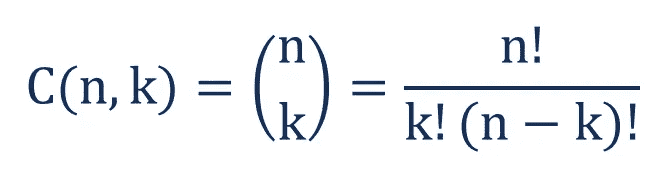

# 用 Asif 算法高效地生成组合

> 原文：<https://medium.com/codex/generating-combinations-efficiently-with-asifs-algorithm-d453e803893?source=collection_archive---------3----------------------->



好吧，密码在哪里？

你好。我是赛义夫·侯赛因。如果您正在阅读这篇文章，那说明您想学习如何以编程的方式高效地生成给定数组的 *r* 元素的组合。也许你已经做了一些关于如何从数组中生成组合的研究，并且被大量的算法淹没了，同时它们比看起来更难并且效率不高。今天我要向大家介绍一种新的组合生成算法，它既优雅又高效。

# 为什么是这篇文章？

在过去的几天里，我一直在研究如何编写一个高效优雅的代码来生成组合。弹出的第一个问题，“为什么？”。故事从一个月前开始，当时我正在解决谷歌的 FooBar 挑战，这是谷歌的一个秘密招聘挑战。我不擅长算法，当然也不知道如何生成组合。但我想出了一个名为“幸运三人组”的挑战，我必须生成组合。我遇到的第一个问题是，在发表这篇文章的时候，很难在互联网上了解组合。因为在大多数算法中，你必须使用树形数据结构来生成组合，并使用相同的方法来解决问题。所以我不得不做一些关于树数据结构的研究。我遇到第二个问题是这个方法有两个解决方案。简单的和高效的，难的。我不需要完整的组合生成器功能，因为我只需要处理 3 个元素。所以我选择了简单的方法。事情是这样的，简单的那个根本没有优化。我不得不使用 Java 而不是 Python 来避免超时错误。完成挑战后，我做了一些困难的研究。我不得不深入学习一下递归。但是那一次我发现这些算法不只是一团糟，而且也没有看起来那么有效。实现这些算法需要时间，并且可以在性能方面进行更多的优化。再说一遍，有很多算法可供你检验，我不想说得太具体。所以，我决定为什么我不做一个研究，并试图找出最优雅和最有效的一个！我就是这样开始的。

# 先决条件

任何编程语言的基础知识都是期望的。与其他组合算法不同，Asif 的算法不需要你深入了解递归。但是关于递归的最少知识是被期望的。

本页可能会对你的递归有所帮助:[https://www . tutorialspoint . com/data _ structures _ algorithms/recursion _ basics . htm](https://www.tutorialspoint.com/data_structures_algorithms/recursion_basics.htm)

# 阿西夫算法

好了，我们到了主赛事现场！Asif 的算法。

## 主要依据

1.  首先弹出数组的第一个元素，并将其存储在任何变量中。
2.  递归地找出数组其余部分的组合两次(第一次是 r - 1 的组合，第二次是 r 的组合)并存储它。我们为什么要生成两次组合将在后面解释。
3.  然后将我们弹出的第一个元素放在我们使用 r - 1 生成的所有组合的前面。
4.  你完了！但是不要忘记实现基本标准来打破递归。

就这么简单。还在迷茫？放心吧！让我们深入了解一下。

假设我们有一个数组[ 1，2，3，4 ]。从该数组中，我们必须生成 3 个元素的组合(r = 3)。我们把我们的组合函数叫做“*组合*”。根据算法，您弹出数组的第一个元素，并将其存储在一个变量中。做我们所拥有的，

```
head = 1, array = [ 2, 3, 4 ]
```

然后我们用 r - 1 递归调用我们的组合函数。在我们的例子中，r 是 3，所以是 2。

```
result = combination(array, 2)
```

结果应该是，

```
result = [ [ 2, 3 ], [ 2, 4 ], [ 3, 4 ] ]
```

太好了！现在我们的下一步是推动第一个元素。我们将弹出的第一个元素存储在 head 变量中。我们把它加在我们生成的组合前面。添加后的结果将是，

```
result = [ [ 1, 2, 3 ], [ 1, 2, 4 ], [ 1, 3, 4 ] ]
```

现在，这应该产生所有的组合。好的，坚持住！我们的数组长度是 4，r 是 3。那么，4C3 就是 4 对吗？那么我们应该有 4 个元素而不是 3 个元素。另一个在哪里？这就是第二代组合出现的原因。如果我们在 r = 3 的情况下再次递归调用组合函数，就可以找到丢失的元素。

```
results_again = combination(arr, 3)
```

这应该会导致，

```
results_again = [ [ 2, 3, 4 ] ]
```

显然，如果数组长度等于 r，那么将返回相同的数组作为结果。但是如果我们合计结果，我们得到，

```
final_result = result + result_again
```

结果是，

```
final_result = [ [ 1, 2, 3 ], [ 1, 2, 4 ], [ 1, 3, 4 ], [ 2, 3, 4 ] ]
```

万岁！我们得到了所有可能的组合。如果你到这里还不明白，试着再读一遍内容，最重要的是记住这是一种递归方法，它有一个基本的标准或递归终止点。

# 履行

这里，我打算用 JavaScript 实现组合函数。你可以尝试在其他编程语言上实现它，比如 C++、Java 或 Python。

```
**function** Combinations( arr, r ) {
    // To avoid object referencing, cloning the array.
    arr = arr && arr.slice() || []; **var** len = arr.length; **if**( !len || r > len || !r )     // Base criteria 1.
        **return** [ [] ];
    **else if**( r === len )            // Base criteria 2\. 
        **return** [ arr ]; // Base criteria 3\. If r === 1, return individual elements.
    **if**( r === 1 ) **return** arr.reduce( ( x, v ) => {
        x.push( [ v ] ); **return** x;
    }, [] ); **var** head = arr.shift();         // Popping the first element. **return** Combinations( arr, r - 1 ).map( x => {
        // Pushing the first popped element at the front of all the generated combinations.
        x.unshift( head ); **return** x;
    } ).concat( Combinations( arr, r ) ); // The missing combinations.
}// Now do your stuff.console.log( Combinations( [ 1, 2, 3, 4, 5 ], 3 ) );
```

# 结论

这就结束了我关于以优雅而有效的方式生成组合的文章。希望对你有所帮助。是 SD·阿西夫·侯赛因。注销。