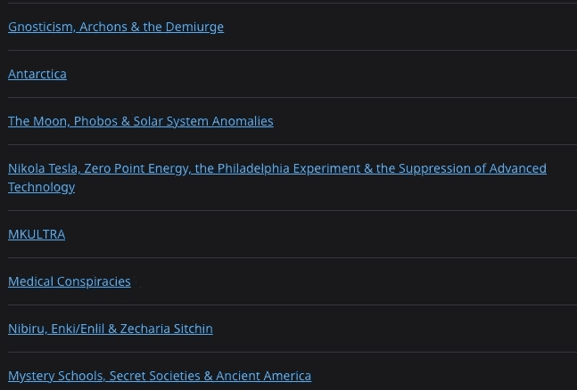
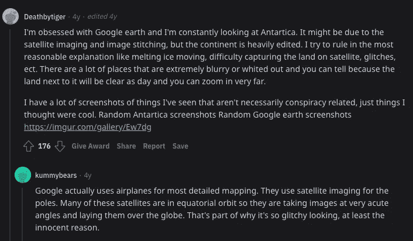
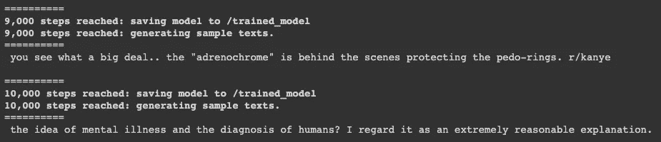
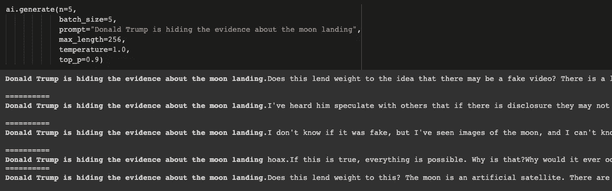
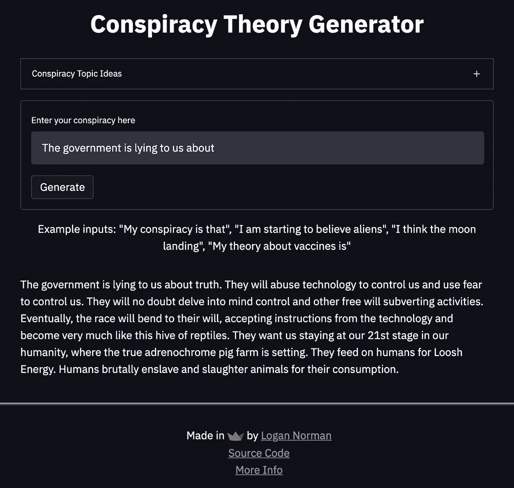

# 用机器学习生成阴谋论(GPT-2)

> 原文：<https://medium.com/codex/generating-conspiracy-theories-with-machine-learning-gpt-2-28e9c416b367?source=collection_archive---------13----------------------->


图片来源:[https://www . verywell mind . com/why-people-believe-in-阴谋论-4690335](https://www.verywellmind.com/why-people-believe-in-conspiracy-theories-4690335)

***免责声明*** *:本项目仅为娱乐目的，并非恶意使用。我不支持使用此应用程序来传播伪科学、虚假信息或其他违反公共健康或安全的内容。我不容忍使用此应用程序煽动或导致骚扰、身体伤害或名誉伤害。此外，我不赞成使用这个应用程序来推进关于历史事件和事实的错误主张。由此应用程序生成的任何文本都可能不准确或不恰当。请谨慎使用此应用程序，并自担风险。*

在本文中，我将带您了解我如何构建一个生成阴谋论的 web 应用程序。**为了给这个项目一个快速的总结，我…**

1.  通过使用 API 从公共论坛帖子中收集超过 10，000 条评论，构建了一个数据集
2.  微调数据集上的 GPT-2，以获得小于 0.1 的损失
3.  优化模型参数以生成更像人类的理论
4.  为模型构建了一个 Streamlit 应用程序
5.  在 Google App Engine 和 Google Kubernetes 上部署包含模型的 Streamlit web 应用程序

**想试一试还是玩代码？查看这些链接:**

网络应用:[https://share.streamlit.io/lognorman20/con_gen/main/app.py](https://share.streamlit.io/lognorman20/con_gen/main/app.py)

源代码:[https://github.com/lognorman20/con_gen](https://github.com/lognorman20/con_gen)

# 目录

## 1 [简介](#fe86)
2 [数据采集&预处理](#7c4a)
3 [型号选择&开发](#f0af)
4 [型号部署](#7b31)
5 [结论](#080f)

# 介绍

最近一直在看阴谋论，从地球是平的到鸟不存在等各种话题。我读到的一个理论是地球是空心的，外星人住在里面。在这一点上，我觉得任何事情都可能是阴谋论，甚至是“我”正在写这篇文章的想法。

阴谋论的一个关键方面是，理论背后的理由甚至不需要对理论建立牵引力有意义。这让我试图使用机器学习来生成阴谋论背后的推理。

从质疑工业革命期间的快速技术发展到新冠肺炎疫苗的声誉，阴谋论一直存在。他们以不同的方式对社会产生了影响，但在历史上没有任何一个时期，人类能够像今天这样快速有效地相互交流。随着 Twitter、Youtube、Instagram、Reddit 和其他社交媒体应用的兴起，**分享想法变得前所未有的简单，几乎没有反响**。此外，这些应用程序允许用户匿名评论，从而增加了另一层自由。

虽然这种自由会带来一些后果，但它也给了那些没有发言权的人一个为自己的信仰大声疾呼的机会。Reddit 等流行的公共论坛网站允许用户匿名发布他们的观点，并与其他用户讨论时事。**社交媒体是新思想的温床**，在这些媒体上讨论阴谋论只是时间问题。

我产生阴谋论的方法利用了社交媒体平台 Reddit 和公共论坛。我使用 Reddit 创建了一个数据集，然后在数据集上训练了机器学习模型 GPT-2。最后，我在 Google 云平台上使用 Streamlit 部署了该模型。

# 数据收集和预处理


照片由[克里斯·利维拉尼](https://unsplash.com/@chrisliverani?utm_source=medium&utm_medium=referral)在 [Unsplash](https://unsplash.com?utm_source=medium&utm_medium=referral) 上拍摄

在我生成任何东西之前，我需要一个数据集。我选择使用社交媒体平台 Reddit 来制作这个数据集有几个原因:

1.  Reddit 上有一个强大的阴谋论者社区
2.  Reddit 已经有了一个可以用来轻松创建数据集的 API
3.  Reddit 是匿名的，未经过滤，有多年的想法等待收集

如果你愿意，可以查看 subred dit[r/阴谋](https://www.reddit.com/r/conspiracy/)来了解更多关于这个社区的信息。另外，**如果你想跟随代码，你可以在这个项目的**[**Github repo**](https://github.com/lognorman20/con_gen)**上这么做。**

r/阴谋论社区已经将不同阴谋论的讨论分成了所谓的“圆桌会议”。在这些圆桌会议中，用户表达他们的想法，分享信息，并就手头的主题进行辩论。



r/阴谋主题示例

这些圆桌会议都是公共论坛，任何人都可以阅读、分享或评论他们的想法。这些圆桌会议上的评论长度各不相同，从一小段文字到一篇附有引文的研究论文。也就是说，从构建数据集是完美的。



r/共谋评论示例

我使用 Python Reddit API 包装器从这些圆桌会议中获取所有的评论来制作我的数据集。结果是一个简短的 Python 脚本。运行这个脚本后，我从 r/阴谋论圆桌会议的用户评论中收集了超过 10，000 条评论。

虽然我有一个数据集，但并不是所有的数据都可以用来训练模型。有些评论可能只有几个词，或者包含超链接/特殊字符。所以，我也写了一个脚本来清理这个数据集。

清理这个数据集时，我遇到的最大问题是**决定一个有意义的评论应该有多长**。有些评论可能不到十个字，但能提出好的观点。也就是说，我最终决定放弃任何少于 170 个字符的评论，因为我发现这是评论增加对话价值的最小长度。这也会防止模型产生空头阴谋论。运行这个脚本后，数据集中有大约 6000 条评论。

最初，我害怕这个数据集太小；然而，我觉得这将足以实现这个项目的目的。

创建数据集后，我就可以构建模型了。

# 型号选择和开发

首先，我需要了解自然语言生成实际上是如何发生的。为此，我观看了一些 Youtube 视频，阅读了一些文章/论文，并探索了各种机器学习模型的文档。

有多种不同的方法，但最让我感兴趣的是使用 GPT-2。**由于该模型对传统深度学习方法的改进，它已经引起了自然语言处理界的广泛关注。**正如 HuggingFace 在本[笔记本中指出的，GPT-2 拥有“改进的变压器架构和大量无监督的训练数据”，参数超过 3 亿，表明该模型用大量高质量数据进行了大量训练。](https://colab.research.google.com/github/huggingface/blog/blob/master/notebooks/02_how_to_generate.ipynb)

也有很多 GPT-2 的实现，包括生成新闻故事、回答问题等等。最重要的是，GPT-2 在数百万个网页上进行了训练，因此变得非常智能。考虑到这一点，我决定用 GPT-2 来产生阴谋论。

为了开始，我使用了工具 [aitextgen](https://github.com/minimaxir/aitextgen) 。它允许我在谷歌实验室笔记本上用几行代码对数据集上的 GPT-2 进行**微调:**

```
from aitextgen import aitextgen# defining the model 
ai = aitextgen(tf_gpt2="124M", to_gpu=True)file_name = "../data/processed/corpus.txt"# training model
ai.train(file_name,
         line_by_line=False,
         from_cache=False,
         num_steps=6000,
         generate_every=1000,
         save_every=1000,
         save_gdrive=False,
         learning_rate=1e-3,
         fp16=False,
         batch_size=1, 
         )ai.save()
```



Google Colab 笔记本上模型训练输出的图像

训练完模型，收到的损失不到 0.1。对于一个小数据集来说还不算太差。



Google Colab 笔记本中生成的文本示例

生成的文本并不总是最好的——它通常偏离输入主题或输出无意义的内容。这可能是因为数据集太小，无法进行训练，或者模型可以进一步优化。同样值得注意的是，自然语言生成(NLG)仍然是机器学习领域中一个不断发展的研究领域。

# 模型部署

在训练了模型并成功生成文本之后，我继续进行这个项目最大的挑战:模型部署过程。我想快速推出一个 web 应用程序，所以**我决定使用 Streamlit，因为它易于使用，而且能够快速扩展。**

我使用 Streamlit 的文档和公共论坛线程构建了一个基本的 web 应用程序，并在我的本地机器上进行了测试。



Web 应用程序

这个 web 应用程序花了一些时间来构建，因为我遇到了几个问题:

1.  requirements.txt 文件没有在 Streamlit 上运行所需的版本/包
2.  这个模型太大了，无法存储在常规的 Github repo 上，所以我需要学习使用 GitLFS
3.  网站很慢，因为我没有缓存模型和其他大型元素

在获得 web 应用程序的工作版本后，我决定将它部署在谷歌云平台(GCP)上。我以前从未用过 GCP。对我来说，最困难的部分是设置 Docker 并确保我的应用程序被适当地容器化。

我在 Google Kubernetes 和 Google App Engine 上部署了这个 web 应用程序，看看我更喜欢哪一个。我选择了后者，因为与 Kubernetes 相比，只需要几个步骤。我为我的应用程序获得了一个自定义域，并且能够成功地路由它。

**现在，您可以找到部署在:**的应用程序

[https://share.streamlit.io/lognorman20/con_gen/main/app.py](https://share.streamlit.io/lognorman20/con_gen/main/app.py)

看看吧！

# 结论

总的来说，我喜欢这个项目。我能够探索阴谋论的创造性，并把它教给电脑。阴谋论将永远存在，尤其是在社交媒体的现状下。谁知道， ***也许地球真的是平的*** 。

你对这个项目有什么想法？请在评论中告诉我。

你可以随时联系 [LinkedIn](https://www.linkedin.com/in/logannorman/) 并在 [GitHub](https://github.com/lognorman20) 上关注我的工作。

有兴趣和我一起工作吗？在 LinkedIn 或[**up work**](https://www.upwork.com/o/profiles/users/~018e1b3bfbe0db3d04/)**上给我发消息。**

如果你喜欢阅读这个项目，我鼓励你[在 Medium](https://lognorman.medium.com/) 上跟随我，我写了我在编码世界的经历。当你在做的时候，看看我的其他项目[预测运动鞋价格](/swlh/predicting-stockx-sneaker-prices-with-machine-learning-ec9cb625bec0)或者建立一个 [Spotify 歌曲推荐系统](/geekculture/how-to-find-new-songs-on-spotify-using-machine-learning-d99bd8855a18)！