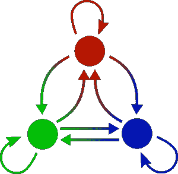

# 用数学产生随机的名字？

> 原文：<https://medium.com/codex/generating-random-names-using-maths-8872a8f3b981?source=collection_archive---------20----------------------->

## 想学习如何使用概率和随机性来程序化地生成好听的名字吗？:)

在最近的[系列](/c-sharp-progarmming/make-a-basic-fsm-in-unity-c-f7d9db965134) [帖子](/geekculture/make-a-hierarchical-fsm-in-unity-c-6809d49f8955)中，我谈到了**有限状态机**(FSM)以及它们如何模拟实体行为。但是状态机也可以用来**产生数据**。

