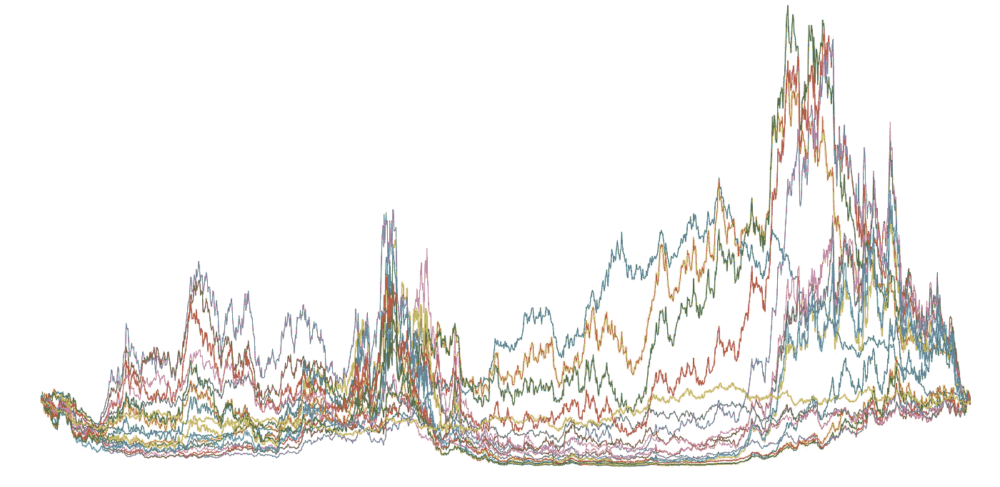
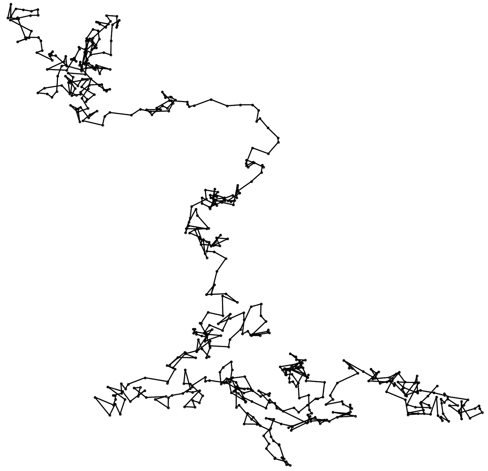
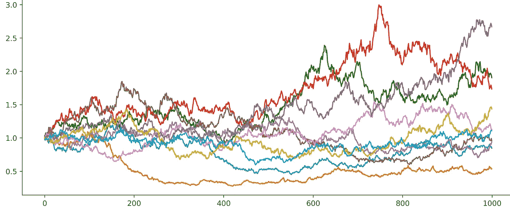
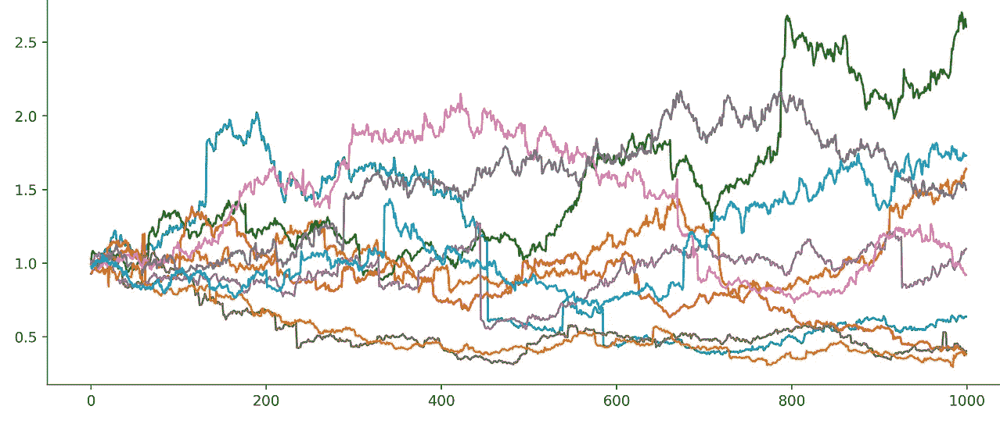
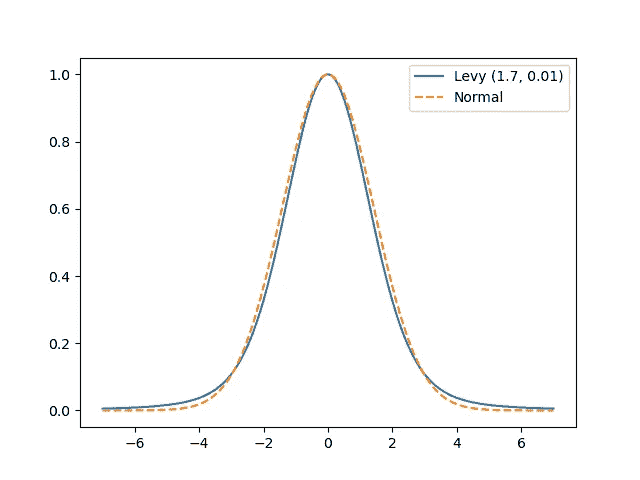
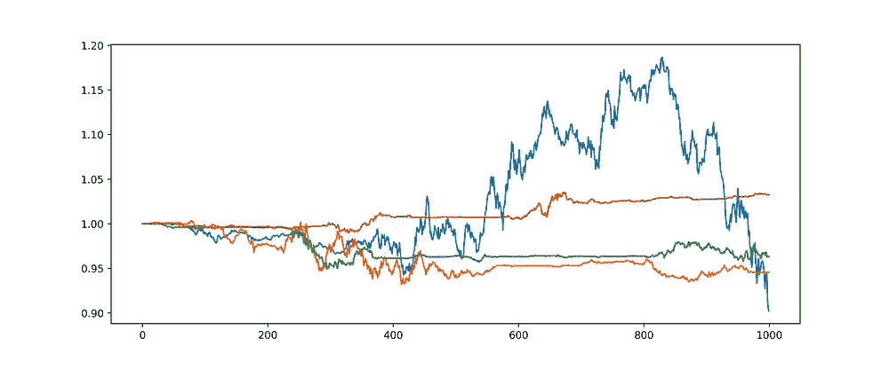
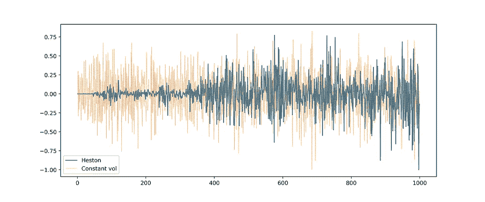

# 资产价格模拟

> 原文：<https://medium.com/codex/generating-synthetic-price-data-2dd1e82fe5cf?source=collection_archive---------11----------------------->

## 综合价格数据生成概述

作者图片

一个快速的谷歌/medium 搜索会显示出对金融数据分析方面的巨大兴趣。主流的前沿似乎仍然是*用机器学习来击败市场回报。*尝试按照这些思路编写项目代码有两个好处:

1.  如果你尝试做得正确，这在教育学上是非常宝贵的——金融回归中的标记、验证和架构选择比其他领域中的回归更微妙。
2.  它*可以*成为具有领域专业知识的经验丰富的从业者 [alpha](https://www.investopedia.com/terms/a/alpha.asp) 的来源(历史上一直如此),但是，众所周知，如果这个策略只对任何人有效，它将不再对所有人有效。

远不如用人工智能交易信号发生器快速致富更有吸引力的是理论模型，我们试图通过这些模型来理解金融市场的本质。一个人不可能通过理解如何根据市场动态的随机模型(至少是直接的)生成合成价格而致富！但是，我认为能够模拟经验价格过程有两个好处:

1.  在构建金融 ML 模型时，拥有一个免费且无限制的数据源(你不会用它来快速致富)，这在教育学上是非常宝贵的。
2.  如果价格生成器足够复杂和具体，它*可以*有助于生产级模型开发和回溯测试。例如，人们可以综合模拟泡沫动力学(这并不容易)，用于预测一个行业存在泡沫的可能性。

除了金融之外，合成数据对机器学习的某些领域至关重要，并在训练和测试 ML 模型的数据中获得越来越多的市场份额[【1】](https://research.aimultiple.com/synthetic-data/)。

## 模拟随机价格动态

T 这篇文章的目的不是介绍数学金融或随机微分方程。在直觉层面，所需要的只是对 [*随机游走*](https://en.wikipedia.org/wiki/Brownian_motion) *的概念性把握。希望你阅读了足够多的维基百科文章，让我们进入一些代码。*

虽然这个想法很简单，但描述布朗运动的算法方面可能有点不透明。我们想描述的是

这里，ηᵢ是一个同分布且独立分布的标准正态变量序列。

这个表达式告诉我们的是，我们必须计算高斯随机变量的归一化累积和来构造(连续时间)布朗过程。我们可以简单地通过一个期望的标准偏差来调整这个过程的波动性。

任意维度的简单矢量化实现如下

方差为 0.1 的二维布朗运动

由于正态分布在 0 附近是对称的，这个过程没有负的问题——如果我们对价格建模感兴趣，这是一个不希望的特征(同样，很明显，价格过程是一维的)。

有人可能会猜测，将布朗过程指数化(以得到*几何*博恩尼过程)加上一些波动性和方向性的可调参数可能是合成价格的一个很好的候选。这种猜测当然是正确的，并且更好地受到随机微分方程的激励:

μ标度项编码价格的确定性变化(漂移)，而σ标度项编码布朗过程产生的随机性。在许多方面，这一模型与我们对市场的基本直觉是一致的:在给定时间，市场及其环境的真实情况决定了确定性趋势，除此之外，复杂的人为因素带来了一定程度的噪音。

如果我们认为这个模型是令人满意的，我们可以继续下去，生成数据集

μ=0.01，σ=0.02 的正常价格过程的 10 个样本

在几行代码中，我们创建了一种生成大规模合成数据集的方法。

由于模型本身存在一些重要的缺陷。我们将花些时间来解决第二个问题。

> 实际资产价格会对新信息做出剧烈波动。上述价格模型的连续性意味着，如果存在错误定价，它在时间上必须完全是局部的(因此它是即时固定的)。这在道德上等同于断言每个市场参与者都是全知的，只受因果关系的约束。

事实证明，解决第一个问题相当简单。为了简单起见，我不想放弃价格过程的连续性，考虑更合适的跳跃过程。目前，我希望能够对某些时间非局部记忆效应进行编码，以促进序列中突然的巨大变化。

然后，我将追求的概括是将正态分布扩展到一个可以控制尾部权重和偏斜度的分布。这种分布族就是所谓的 Levy 稳定分布。由于`scipy.stats`有一个`levy-stable`类，我们可以很容易地扩展我们刚刚定义的函数。对于这个可能不熟悉的发行版的解释，请参考[科学文档](https://docs.scipy.org/doc/scipy/reference/generated/scipy.stats.levy_stable.html)。

10 个几何 Levy 稳定过程样本，α=1.68，β=0.01

请注意，Levy 稳定分布看起来几乎与标准正态分布相同。然而，这种细微的差异(围绕尾部)足以引起价格的突然剧烈变化，这在高斯模型中是不存在的(或者说，太罕见了)。Levy-stable 过程无法作为一个定量精确的模型，这是有一定的经验和技术原因的(比如我们的综合分布不存在二阶矩，而股票收益似乎呈现有限的矩),但很难说这些原因是否足以排除我们的模型。

如果我们坚持使用比稳定分布更好的分布，同时仍然保持一些尾部权重和偏斜度的参数化，我们必须有所创新。一个想法是使用所谓的方差伽马过程[【2】](https://engineering.nyu.edu/sites/default/files/2018-09/CarrEuropeanFinReview1998.pdf)

这被解读为对数价格过程是由通常的标准布朗运动在由[γ过程](https://en.wikipedia.org/wiki/Gamma_process)给出的时间上的重新采样给出的。我就不细说这种型号相对于以前型号的技术优势了。人们可以把它当作另一个数据源来欣赏。我将在这里作弊，并向读者推荐我的[笔记本](https://datalore.jetbrains.com/view/notebook/7ePCXEffpdZr2dA5ySdwr1)，因为有太多的移动部分需要在几行中捕捉。

> 波动性不是价格动态的常数。

这实际上是真实(或现实)价格过程的确凿证据之一，可能与人类交易者的特质有关。

作为一个例子，人们不需要看得比 [CBOE 波动指数](https://finance.yahoo.com/chart/%5EVIX#eyJpbnRlcnZhbCI6ImRheSIsInBlcmlvZGljaXR5IjoxLCJ0aW1lVW5pdCI6bnVsbCwiY2FuZGxlV2lkdGgiOjgsImZsaXBwZWQiOmZhbHNlLCJ2b2x1bWVVbmRlcmxheSI6dHJ1ZSwiYWRqIjp0cnVlLCJjcm9zc2hhaXIiOnRydWUsImNoYXJ0VHlwZSI6ImxpbmUiLCJleHRlbmRlZCI6ZmFsc2UsIm1hcmtldFNlc3Npb25zIjp7fSwiYWdncmVnYXRpb25UeXBlIjoib2hsYyIsImNoYXJ0U2NhbGUiOiJsaW5lYXIiLCJwYW5lbHMiOnsiY2hhcnQiOnsicGVyY2VudCI6MSwiZGlzcGxheSI6Il5WSVgiLCJjaGFydE5hbWUiOiJjaGFydCIsImluZGV4IjowLCJ5QXhpcyI6eyJuYW1lIjoiY2hhcnQiLCJwb3NpdGlvbiI6bnVsbH0sInlheGlzTEhTIjpbXSwieWF4aXNSSFMiOlsiY2hhcnQiLCLigIx2b2wgdW5kcuKAjCJdfX0sInNldFNwYW4iOnt9LCJsaW5lV2lkdGgiOjIsInN0cmlwZWRCYWNrZ3JvdW5kIjp0cnVlLCJldmVudHMiOnRydWUsImNvbG9yIjoiIzAwODFmMiIsInN0cmlwZWRCYWNrZ3JvdWQiOnRydWUsImV2ZW50TWFwIjp7ImNvcnBvcmF0ZSI6eyJkaXZzIjp0cnVlLCJzcGxpdHMiOnRydWV9LCJzaWdEZXYiOnt9fSwic3ltYm9scyI6W3sic3ltYm9sIjoiXlZJWCIsInN5bWJvbE9iamVjdCI6eyJzeW1ib2wiOiJeVklYIiwicXVvdGVUeXBlIjoiSU5ERVgiLCJleGNoYW5nZVRpbWVab25lIjoiQW1lcmljYS9OZXdfWW9yayJ9LCJwZXJpb2RpY2l0eSI6MSwiaW50ZXJ2YWwiOiJkYXkiLCJ0aW1lVW5pdCI6bnVsbCwic2V0U3BhbiI6e319XSwic3R1ZGllcyI6eyLigIx2b2wgdW5kcuKAjCI6eyJ0eXBlIjoidm9sIHVuZHIiLCJpbnB1dHMiOnsiaWQiOiLigIx2b2wgdW5kcuKAjCIsImRpc3BsYXkiOiLigIx2b2wgdW5kcuKAjCJ9LCJvdXRwdXRzIjp7IlVwIFZvbHVtZSI6IiMwMGIwNjEiLCJEb3duIFZvbHVtZSI6IiNmZjMzM2EifSwicGFuZWwiOiJjaGFydCIsInBhcmFtZXRlcnMiOnsid2lkdGhGYWN0b3IiOjAuNDUsImNoYXJ0TmFtZSI6ImNoYXJ0IiwicGFuZWxOYW1lIjoiY2hhcnQifX19fQ--)的趋势更远。一方面，很明显均值回归在多个时间尺度上发生(随机),另一方面，在一些更快的时间尺度上，大的变化似乎会导致更大的变化(这被称为波动聚类)。似乎我们可以简单地将波动率σ建模为原始价格随机微分方程中的均值回复随机过程——这正是[赫斯顿模型](https://en.wikipedia.org/wiki/Heston_model)的内容。

赫斯顿模型的方差过程就是 [CIR 过程](https://en.wikipedia.org/wiki/Cox%E2%80%93Ingersoll%E2%80%93Ross_model)。我将选择使用平方[奥恩斯坦-乌伦贝克过程](https://en.wikipedia.org/wiki/Ornstein%E2%80%93Uhlenbeck_process)(CIR 略有不同):

该微分方程的数值解可用于

此外，请记住，潜在的布朗过程可以(实际上是)相关的。为了简单起见，让我们将它们视为不相关的，并迭代求解该 sde(见 [torchsde](https://github.com/google-research/torchsde) 中的复杂 SDE 求解器)。

赫斯顿价格过程和回报比较

任何关注股价回报的人都可以看出，深蓝色的回报更接近真实回报。特别是，我们看到了强烈的波动性聚集，正如我们开始捕捉的那样。

## 结束语

让我第一个说，这里绝对没有什么新东西。在计算金融中，合成数据有许多广阔的应用领域。我简单地展示了各种价格动态模型的实现，着眼于它们在测试甚至训练金融 ML 模型中的使用。这里开发的代码的一个公认的更自然但不太引人注目的用途是在诸如蒙特卡罗衍生品定价和策略回溯测试中。

> 这里实现的模型可以从 price_process 包中调用，其源代码链接如下

 [## GitHub - borab96/price_process:用于生成各种随机价格序列的库

### 这个库提供了各种随机过程的矢量化生成器，模拟价格…

github.com](https://github.com/borab96/price_process.git)