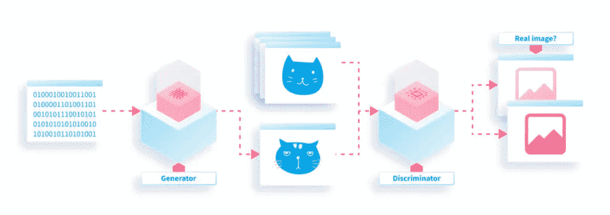
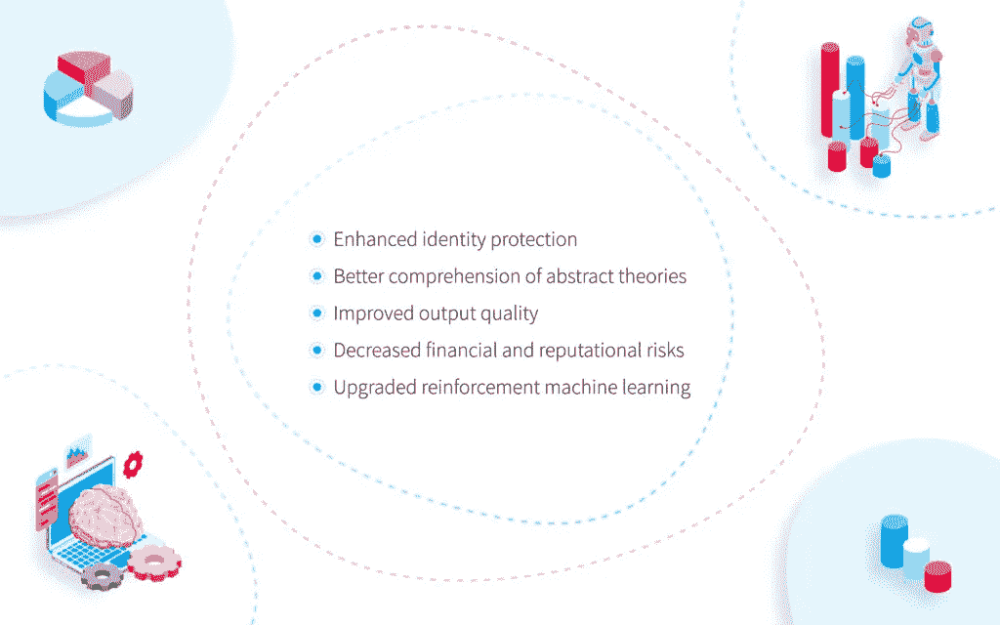
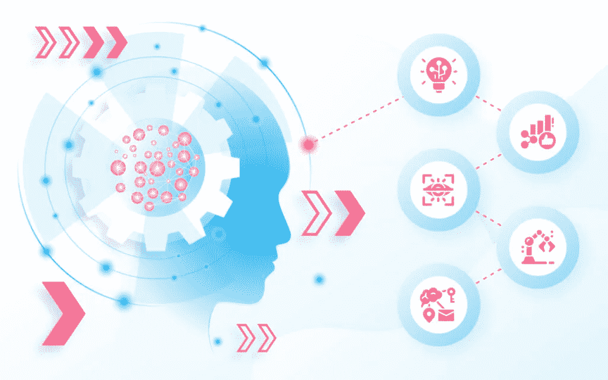

# 生成式人工智能——通过应用和用例解决问题——NIX United

> 原文：<https://medium.com/codex/generative-ai-figuring-it-out-through-applications-use-cases-nix-united-9a547d0d19be?source=collection_archive---------24----------------------->

文明的进步可以归结为几千年来人们越来越精通技术。在 21 世纪初，科学家和工程师们确保他们开发的机器也是智能的，从而引入了人工智能的概念。不久前，由人工智能驱动的机器人和机器渗透到各个领域，包括[商业](https://nix-united.com/blog/ai-in-business-think-big-and-scale-with-intention/)，教育，[医疗](https://nix-united.com/blog/telehealth-vs-telemedicine-remote-healthcare-solutions/)，娱乐等。

今天，人工智能技术已经发展成为几项相关技术(如区块链、机器学习、自然语言处理、物联网)，在许多数字领域得到广泛应用。随着新的高科技创新不断涌现，这个名单越来越长。生殖人工智能是科技行业中越来越受欢迎的现象之一。

# 生成人工智能被仔细研究

什么是生成式 AI？它是一款颠覆性软件，可以通过分析大量现有数据(无论是文本、音频文件、视频剪辑还是图像)来创建新的内容。它是怎么做到的？生成式人工智能工具会检查大量输入信息，识别它所基于的模式，并生成包含类似内容的输出(因此得名)。

一种更复杂的生成式人工智能不仅仅是监控现实生活中的环境来产生内容。它还可以利用数学仿真，处理通过它揭示的未知模式。传统上，这种机制依赖于压力测试和敏感性分析的应用。

无论我们谈论的是哪种类型的生成式人工智能，它都采用三种操作技术来完成工作。

# 生成对抗网络

为什么是复数？因为有两个神经网络参与内容生成。生成器神经网络的任务是创建与输入数据相似的新内容。鉴别器神经网络用于区分源和生成的内容，以确定哪一个更接近原始内容。

在生成周期中，这两者交替运行。生成器试图产生越来越多的真实数据，鉴别器学会越来越好地辨别真假数据。

# 变形金刚(电影名)

他们的职责是理解输入(通常是文本或图像)，根据预先设定的标准对其进行分类，并依靠庞大的数据库生成类似的输入。LaMDA，GPT-3，Wu-Dao 和其他此类工具能够测量输入片段的相关性和重要性，从而模仿人类的认知注意特征。

# 可变自动编码器

虽然这两种解决方案被称为编码器，但实际上只有一种能够自动将输入数据转换为压缩代码。第二个充当解码器，将信息再次转换成可消化的格式。这种两步数据处理有助于节省存储设备，因为缩减的数据占用更少的存储空间。

既然你已经理解了生成性人工智能的含义，让我们看看生成性人工智能用例可以给企业、私人和非商业组织带来什么好处。

# 放大生成人工智能的资产

生成式人工智能应用有几个优点。

# 增强的身份保护

生成性 AI 可以创建头像，从而隐藏那些在接受采访或在线工作时出于任何原因不想公开身份的人的真实外貌。

# 更好地理解抽象理论

机器还不够机敏，无法理解它们在现实或模拟世界中可能遇到的一些抽象概念，而生成式人工智能有助于应对这一挑战。

# 提高产出质量

在自学 GANs 中使用的穿梭操作模式有助于获得高质量的图像、视频或音频，即使输入内容远非完美。

# 降低财务和声誉风险

生成式人工智能工具可以立即检测恶意或至少可疑的活动，并防止对企业或个人的各种损害。

# 升级的强化机器学习

[强化 ML](https://www.techtarget.com/searchenterpriseai/definition/reinforcement-learning) 是基于奖励想要的行为，惩罚不想要的行为。然而，检测某个步骤属于哪里常常是有偏差的。生殖人工智能技术可以消除或至少大大减少这种偏见。

尽管好处显而易见，但生成性人工智能应用程序可能会隐藏一些恼人的陷阱。

# 要注意的人工智能风险

在实现生成式人工智能的最佳实践时，确保你意识到可能的瓶颈和与之相关的误解。

# 需要庞大的数据集

你不能指望生成式人工智能算法正常工作，除非它们依赖于大量的输入内容。

# 不切实际的期望

这个软件可以创造奇迹，但只能在训练数据所限定的范围内。它不能凭空创造任何新的文本或图像。

# 未预见的结果

GAN 的机制仍然不稳定且难以控制，容易产生完全出乎意料的结果。

# 数据隐私问题

医疗保健和金融领域的生殖人工智能用例应受到密切监控，以防止个人和企业的任何金钱相关或敏感数据泄露。

# 恶意应用

没有最先进的技术让作恶者无法为非作歹，而生殖人工智能也不例外，其中可能涉及各种欺诈性骗局。

一旦你学会应对这些挑战，你就可以享受这项技术的应用所预示的光明前景。

# 生成性人工智能用例

正如 Gartner 的专家估计的那样，到 2025 年，由生成式人工智能产生的数字数据的比例将[增长 10 倍，与今天的 1%相比，这是一个惊人的峰值。这项技术的应用将在哪些领域占据主导地位？](https://quidgest.com/en/blog-en/generative-ai/)

# 1.卫生保健

在这个领域，生成式人工智能发挥着双重功能。首先，它可以升级患者治疗。第二，可以加强患者的数据隐私。当生成虚假的、代表性不足的数据来训练和开发模型时，前者的生成性人工智能用例更频繁。例如，GANs 可以提供不同角度的 X 射线图像，以可视化可能的肿瘤生长结果。或者，它可以通过比较数据库中健康器官的图像与受影响器官的图像来检测恶性发展。使用该技术的第二种方式侧重于数据去识别，有助于保护逆转过程，这远远不是完全防渗透的。

一个相关的领域是药理学，其中生殖人工智能可以在药物发现中发挥作用。该技术能够创造用于治疗某些疾病的药物的分子结构。当该技术对用于此目的的化合物进行快速数据库搜索时，也可以显著促进新疾病的治疗。这个自动化的过程比手工操作要快得多。一般来说，到 2025 年，Gartner 预计[一半的药物开发计划](https://quidgest.com/en/blog-en/generative-ai/)将依赖于生殖人工智能。

# 2.电影复原

许多老电影和经典的迪斯尼卡通片属于全球文化的宝库，但它们的质量往往达不到我们时代的要求。生殖人工智能可以将它们升级到 4k 甚至更高，每秒生成 60 帧而不是传统的 23 帧，消除噪声，并将黑白转换为彩色。

# 3.动画模型生成

与电影院一样，视频游戏行业是另一个依赖于运动图像的娱乐领域，生成式人工智能也可以伸出援手。当人工智能算法生成计算机游戏中使用的 3D 模型时，软件开发人员的工作可以减轻，开发时间可以大大缩短。这种模型可以是全新的，也可以源自之前输入其中的 2D 图像。该技术还可以生成 2D 图片，进一步用于特定的游戏和卡通类型，例如动画。

# 4.照片编辑

对动态图像所做的可以更有效地应用到静态图像。

*   图像到图像转换。你可以提高低质量图片的分辨率，彩色黑白图像，将白天的照片变成夜晚的照片，将其中任何一张照片转换成艺术画，或将卫星照片转换成谷歌地图图像。
*   文本到图像的翻译。您可以输入描述一些简单事物(如花或动物)的文本，并获得一组符合描述的图像。随着技术变得更加复杂，更复杂的项目将被添加到生成的选项列表中。
*   草图到图像的翻译。有了铅笔画的草图(称为语义图像)作为输入，您将能够接收到它的真实照片图像。这个用例应用于时尚(服装和配饰的草图)、建筑和设计(房屋和公寓的内部和外部)、娱乐业(舞台布景)和汽车业(新型车辆和拖车)等领域。
*   处理人脸图像。在这里，生成式人工智能有着巨大的应用领域。有了它，你可以创建不存在的人的照片(或物体和场景，就此而言)，从某个角度拍摄人脸的照片制作正面照片，生成同一个人在老年时的照片，甚至将实拍照片转换为表情符号。

一个更严重的用例与失踪或被通缉的人的身份识别有关，这些人的外貌可能发生了一些变化。在这种情况下，蓄胡须、染发或摄像头捕捉到的其他面部表情将不会成为生成式人工智能识别机制的障碍。

# 5.NFT 创作

不可替代的代币在当今数字驱动的世界中风靡一时，去年其销售额超过了 250 亿美元。NFT 艺术在利基市场占据了突出的位置，卡通、迷因和绘画占据了主导地位。生成性人工智能工具是生产这种艺术作品的首屈一指的手段，可以为创作者带来源源不断的现金。

# 6.音频合成

生成式 AI 不仅仅是图片。声音领域也可以从它的应用中受益。在电影摄影和视频游戏中，这种技术可以用来制作福利元素、环境声音、画外音和其他音频效果，这些构成了观众非常喜欢的电影或视频游戏的重要部分。

另一个音频用例与计算机生成的音乐有关。生成型人工智能所依赖的神经网络可以模仿人类大脑的工作方式，制作音乐作品。2016 年，谷歌的 Magenta 发布了第一首由 AI 创作的歌曲，我们很可能会看到更多由机器人创作的音乐作品(甚至可能是交响乐和歌剧)。

# 7.情感分析

零售和商业领域也可以发现生殖人工智能的使用非常有利。在与商品互动时，人们会流露情感，并对他们购买的产品和销售机构提供的服务做出评价。人工智能算法可以被训练来分析消费者生成的文本、语音样本和面部表情，从而为理解客户对问题商品的态度提供线索。

其他类型的生成性人工智能机制可以监控在线客户的网络活动，并分析用户数据，以衡量 UX 的满意度，或者广告或整个营销策略的成功程度。此类数据可进一步用于客户细分，以识别各种客户群并制定有针对性的促销活动，从而增加追加销售和交叉销售机会。

# 8.软件开发

如果工业 4.0 带来的尖端技术不能被高科技领域的专业人士使用，那才是真正奇怪的。生成式人工智能也是如此，软件开发人员将其应用于自动化手动编码。人类向一个特定的解决方案“解释”他们想要得到什么，然后机器就按需要的数量生产出所需的程序。

另一种类型的生成式人工智能迎合了公民开发人员和外行人的需求，他们没有足够的编码专业知识来构建应用程序或各种解决方案，甚至不知道编程语言。据 Gartner 称，在两年内，此类解决方案有望成为 50%开发平台套件的一部分。

在这两种情况下，新软件产品的开发速度大大提高，这在当今快速发展的商业世界中可能是一个游戏规则的改变者。

# 总结一下

生成式人工智能是一项创新技术，它使智能机器能够在处理输入的文本、音频和视觉数据后产生全新的内容。利用三种专业技术，这种技术为各个领域的[颠覆性未来趋势](https://nix-united.com/blog/future-tech-trends-why-business-implements-innovations/)铺平了道路。尼克斯联合[可以帮助](https://nix-united.com/contact-us/)你开发一个高端的生成式人工智能解决方案，以提高你的业务效率和增加收入。

*原载于 2022 年 6 月 29 日 https://nix-united.com***。**