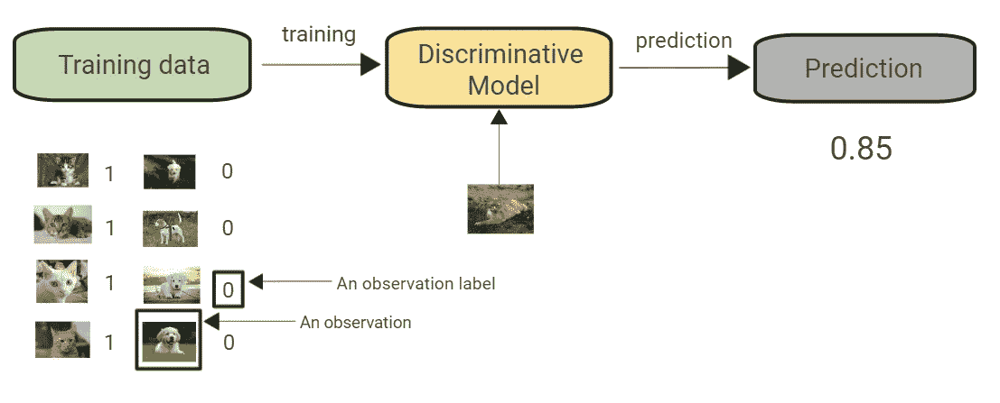
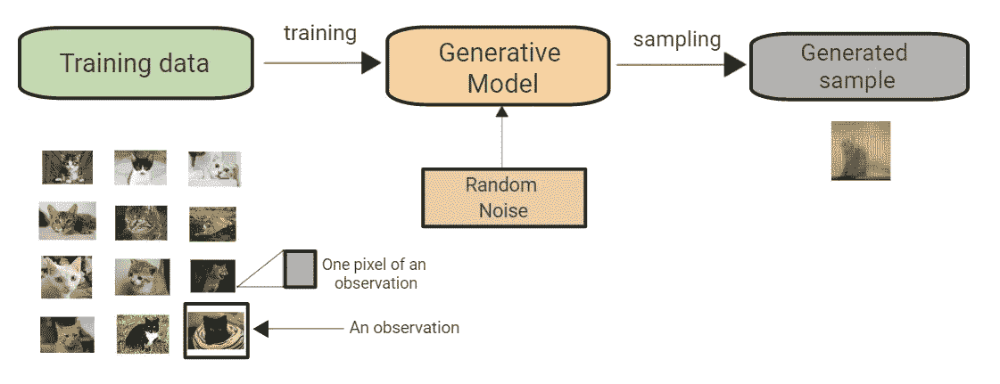
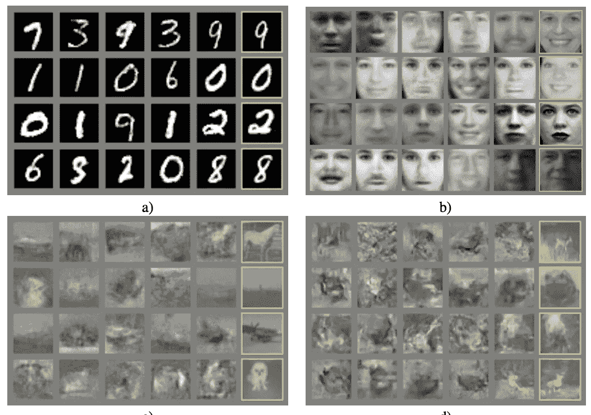
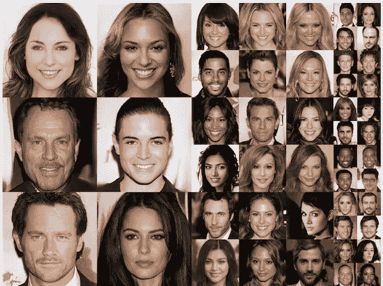
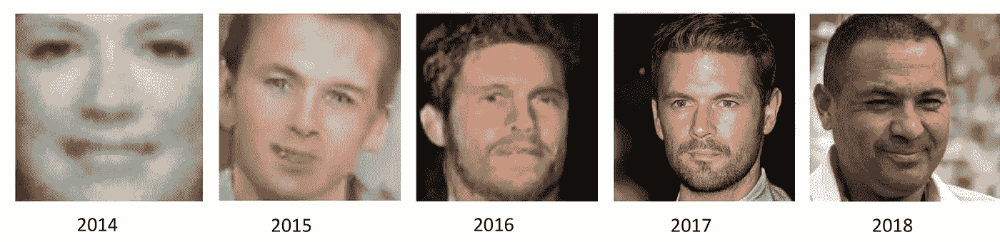

# 生成模型:下一个机器学习热潮？

> 原文：<https://medium.com/codex/generative-models-the-next-machine-learning-boom-865b80c54fb1?source=collection_archive---------16----------------------->

最近的人工智能进展比“人工智能产业”要大得多这些创新将彻底改变地球。从谷歌大脑可以找到小猫视频的日子，到可以以 95%的准确率识别人脸的 FaceNet 的发布，到可以自我设计神经网络的 AutoML 等工具，以及在旧金山街道上行驶的 Waymo 自动驾驶汽车，我们已经走过了漫长的道路。

对我们大多数人来说，人工智能一直是关于理解世界的。深度学习和卷积神经网络正允许计算机以与人类相同的方式查看视频中的图像和帧。

然而，这只是工作的一半。

> **人类不仅了解世界；他们成功了。**人类创造了对话、语言、艺术、音乐、事物、宗教和代码等等。**要让计算机真正成为人工智能，它们不仅要理解，还要创造。**

这些世代问题的解决方案是**生成模型**，这是一个巨大的突破。

## 本博客的范围

这个博客将全面概述生成模型领域。我们将看看什么叫模型生成，以及它如何不同于更普遍研究的判别建模。我们还将着眼于生成模型随时间的演变，以及它们如何工作的细节。接下来，我们将定义和介绍多种形式的生成模型。

机器学习模型可以根据它们的工作方式分为两种类型:生成模型和判别模型。简而言之，判别模型使用条件概率来生成对未知数据的预测，并可用于解决分类或回归问题。另一方面，生成模型专注于数据集的分布，以便返回给定事件的概率。

我知道所有这些技术术语乍一看很难理解，但是不要担心，下一节将会把一切都讲清楚，你会完全理解一切。

先说有辨识度的车型！

## 什么是判别建模？

如果你研究过机器学习，你会知道你遇到的大多数挑战在本质上都是歧视性的(*能够准确地识别或区分*)。让我们看一个例子来更好地掌握判别模型。

首先，我们需要一个数据集，其中包含大量我们要创建的东西的样本。这被称为训练数据，每个数据点被称为观察值。每个观察值由许多特征组成，在图像产生问题的情况下，这些特征通常是单个像素值。假设我们有一个猫和狗的数据集。我们可以训练一个判别模型来预测给定的图像是猫还是狗。我们的模型会了解到特定的颜色、形状和纹理更有可能揭示哪个动物是法师，并且它会预测具有这些特征的图像。注意*图 1–1 中描述了区别建模方法。* —注意它与*图 1–2*中所示的创成式建模过程有何不同。

*图 1–1。判别建模过程*

当执行判别建模时，训练数据中的每个观察值都有一个标签，这是一个显著的差异。在像我们的动物分类这样的二元分类问题中，猫的图像将被标记为 1，而非猫的图像，如狗的图像，将被标记为 0。然后，我们的模型输出一个新观察结果具有标签 1(即，它是一只猫的图像)的可能性，该模型已经学会区分这两组。

**辨别模型的一些例子**

*   ‌Logistic 回归。
*   标量向量机
*   ‌Traditional 神经网络。
*   ‌Nearest 邻居。
*   条件随机场
*   决策树和随机森林。

## 什么是生成建模？

术语“生成”指的是一种不同于判别模型的统计模型。

**以下是生成模型的广义定义:**

> 就概率模型而言，生成模型规定了数据集是如何形成的。我们可以通过从这个模型中取样来产生新的数据。

假设我们有一个包含猫图像的数据集。我们可能希望创建一个模型，它可以创建一个从未存在过但看起来仍然真实的猫的新图像，因为该模型已经学习了控制猫的外观的一般规则。这是生成模型可以解决的问题类型。figure 1–2 描述了一种典型的创成式建模方法。

*图 1–2。创成式建模过程*

我们的目标是设计一个能够生成新的特征集(图片像素)的模型，这些特征集看起来是根据与原始数据相同的原理生成的。考虑到可以分配单个像素值的方式多种多样，而构成我们试图模拟的项目图像的这种排列相对较少，这对于图像制作来说是一个概念上具有挑战性的问题。

此外，生成模型必须是概率性的，而不是确定性的。如果只是简单的固定计算，比如取数据集中每个像素的平均值，那么我们的模型就不是可生成的。该模型每次都给出相同的输出。模型中必须包含随机元素，以改变模型生成的单个样本。

换句话说，我们可以认为存在一些未知的概率分布，解释了为什么一些图像可能在训练数据集中找到，而其他图像则没有。我们的职责是创建一个尽可能类似这种分布的模型，然后从中进行采样，以生成新的、不同的观察结果，这些观察结果似乎来自原始的训练集。

## 生成性与鉴别性建模

为了上述工作的目的，判别建模与监督学习是同义的，或者学习使用标记数据集将输入转化为输出的函数。生成模型最常见的应用是无标签数据集(即无监督学习)，但它也可以用于有标签的数据集，以学习如何从每个单独的类中产生观察值。

非正式地:

*   **生成型**模型能够生成新的数据实例。
*   具有**辨别能力的模型**能够区分不同类型的数据实例。

一个辨别模型可以识别一只狗和一只猫，而一个生成模型可以生成看起来像真实动物的新鲜动物图像。生成模型，如 GANs，就是生成模型的例子。

给定一组数据实例 X 和一组标签 Y，用更正式的术语来说:

*   **生成型**模型捕获 p(X，Y)联合概率，或者如果没有标签，则只捕获 p(X)。
*   条件概率 p(Y | X)由**判别**模型捕获。

生成模型考虑了数据的分布，并告知您给定事件发生的可能性。因为它们可以为一系列单词分配概率，所以预测序列中下一个单词的模型通常是生成模型(比 GANs 简单得多)。

判别模型避免了一个给定事件是否可能的问题，而是专注于一个标签应用于它的可能性。

## 生成模型的兴起

让我们来看看生成模型的兴起以及这些年来它们是如何发展的。

## 2014

*使用 GANs 为 MNIST 手写数字数据集、CIFAR-10 小对象照片数据集和多伦多人脸数据库生成新的似是而非的示例是 Ian Goodfellow 等人在 2014 年的论文“Generative Adversarial Networks”中的原始论文中描述的应用，其中 GANs 用于为 MNIST 手写数字数据集、CIFAR-10 小对象照片数据集和多伦多人脸数据库生成新的似是而非的示例。*

图 1–3。用于为图像数据集生成新的合理示例的 gan 示例。摘自《生成性对抗网络》，2014 年。

## 2017

Tero Karras 等人在他们 2017 年的出版物“GANs 的渐进增长以提高质量、稳定性和变化性”中展示了人脸的可信现实图像的发展。事实上，它们是如此的栩栩如生，以至于最终的产品令人震惊。结果，这些发现引起了媒体的广泛关注。

图 1–4。照片般逼真的 GAN 生成的脸的例子。摘自 2017 年《提高质量、稳定性和多样性的渐进增长甘》。

## 2018

*这篇论文中的例子被用于 2018 年的一份题为“* [*【人工智能的恶意使用:预测、预防和缓解*](https://arxiv.org/abs/1802.07228) *”的报告中，以展示 GANs 从 2014 年到 2017 年的快速进展(通过 Ian Goodfellow* *的这篇推文找到)。*

*图 1–5。在过去的四年里，使用生成模型的人脸生成技术有了显著的改进*

## 展望未来

在接下来的几年里，将会有数百个领域的生殖技术丰富我们的生活。与当前许多专注于增强现有工作流的人工智能应用相比，生成技术将创建全新的工作流，其中许多工作流目前是不可想象的。

新的工作类别将由基于生成过程的想法产生，就像汽车和互联网的出现催生了全新的工作类别一样。想象一下，如果没有接受过这方面的正规教育，你也能成为一名“数字作曲家”或“时尚产品设计师”，但仍然能够使用生成技术生成成功的作品！

感谢你花时间阅读这篇博客。
敬请关注我即将推出的有趣博客！