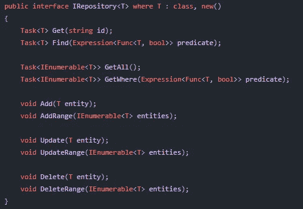
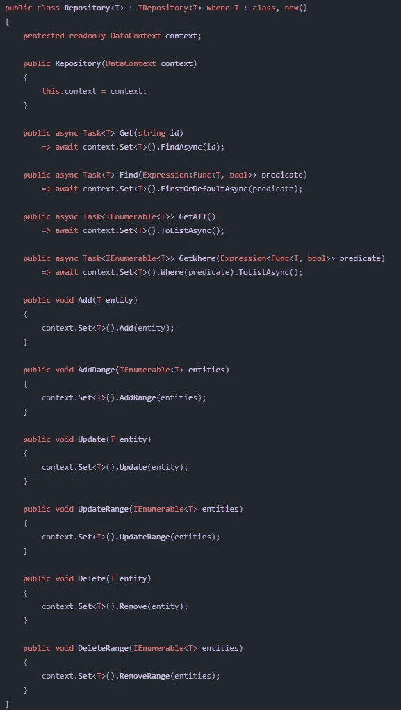
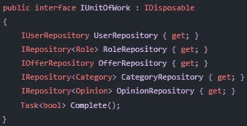
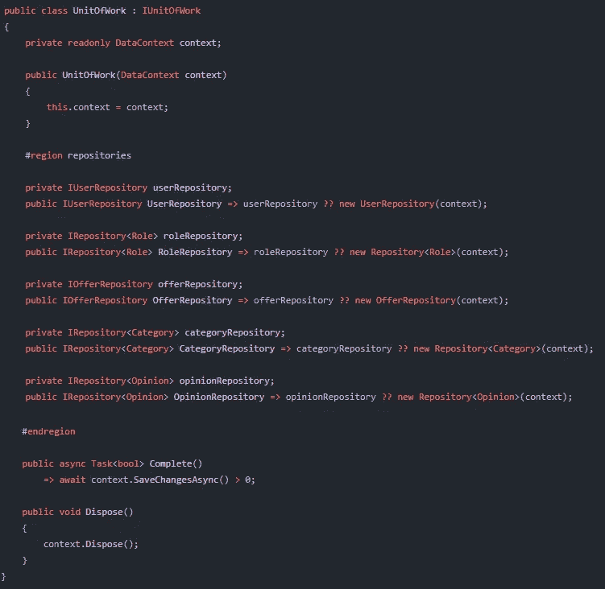
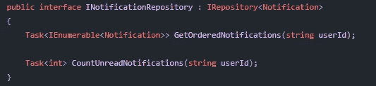
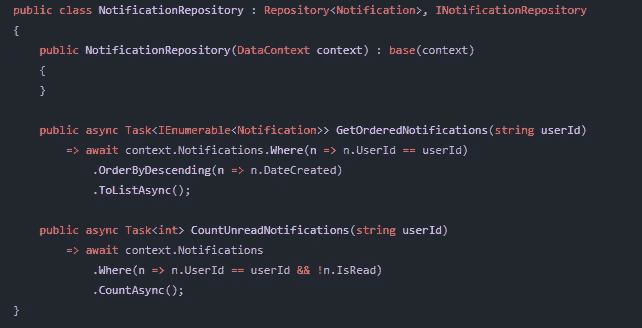
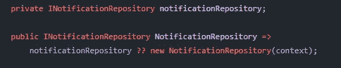
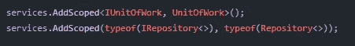
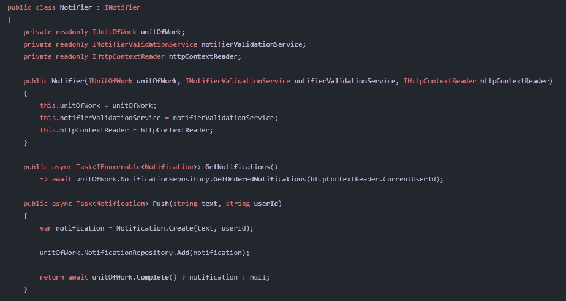

# 通用存储库和工作单元模式。网

> 原文：<https://medium.com/codex/generic-repository-unit-of-work-patterns-in-net-b830b7fb5668?source=collection_archive---------0----------------------->

## 实现通用知识库和工作单元模式的实用指南。NET Core C#应用程序

## 关于存储库和工作单元模式

正如我所猜想的，几乎每个现代数据库应用程序都在实现存储库模式——尤其是在许多 web API 在线课程中。这种方法的目的是抽象持久性(在我们的例子中是 EF 核心)层，并使用这些实现来查询数据库。我们正在讨论的另一种模式是工作单元，它为我们的存储库执行“包装”功能，并向数据库提交更改。在本文中，我想一起实现这两种模式。

## 先决条件

*   已创建。NET C#项目在你最喜欢的 IDEs，VS 代码，Rider 等)中。)
*   关于实体框架 ORM 的一点知识(将来要使用的 DataContext 类是 EF DbContext 的临时实现，包含所有的数据库集和实体配置)

## 让我们以一种通用的方式实现存储库模式

Repository 是一个为指定的实体对象(表)执行数据库操作的类。它们中的大多数都足够简单，可以通用地实现，并且引用 DRY 原则(不要重复自己)对于编写多次通过主键查找实体的方法来说是多余的。

为了简化这一点，我们将以一种通用的方式对我们的存储库进行编码，并具有扩展它的能力！

现在，首先我们将在 C#项目中创建两个文件:

*   IRepository < T > —我们存储库的通用接口。正如我们所看到的，当前的抽象是异步实现的，因为我们希望我们的数据库查询以这种方式工作。这样的操作会阻塞一些线程，我们不喜欢这样。

通用存储库接口

*   **储存库<T>—这里我们创建一个实现我们接口的类。现在，我们需要比前一个文件中更多的代码。长话短说，这个类的构造函数注入了 DataContext 对象，我们在所有方法中使用它来执行 CRUD 数据库操作。
    法境。Set < T >()通过泛型 T 类型在 DataContext 类中查找对应的 DbSet(table)——这意味着如果 repository 是通知实体的类型，那么将在我们的数据库中查询通知表。**

通用存储库类

现在我描述我们知识库中的每一个方法:

*   **Get(字符串 id) —** 通过主键查找实体
*   **Find(Expression<Func<T，bool>谓词)—** 使用谓词查找实体。这个方法的声明可能很复杂，但是用法非常简单——我们使用它的方式和 FirstOrDefault LINQ 方法完全一样
*   **GetAll() —** 从指定的表中获取所有实体
*   **get Where(Expression<Func<T，bool>predicate)—**使用谓词从指定的表中获取实体(与 Where LINQ 方法完全相同)
*   所有剩余的方法从数据库中添加、更新或删除实体。他们还能够对一系列实体执行这些操作。
    **很重要的一点是，只有当我们的 UnitOfWork 类调用 Complete()方法时，操作才会提交给数据库！**

## 好吧，那么工作单元模式呢？

正如我上面所说的，这种模式是我们的存储库的一种包装器。我们的业务逻辑类将注入 IUnitOfWork，它提供对应用程序中所有已注册存储库的访问。对此的抽象非常简单:

工作单元接口

UnitOfWork 应该通过其构造函数注入 DataContext 对象，然后将该对象传递给在该类中注册的所有存储库。

所有的存储库都以相同的方式实现——私有字段和只读属性返回其合适的现有存储库，或者如果字段没有初始化(？？运算符)—实例化新的运算符。

在 repositories 区域下，我们可以看到 **Complete()** 方法实现— **它负责提交对数据库**的更改。如果进行了任何更改，它将返回 true。

要编写的最后一个方法是 Dispose()，它简单地处理我们的上下文字段。

工作类单位

## 如果我需要比通用存储库类中实现的更复杂的查询怎么办？

答案很明显——我们必须提供一个定制的存储库类。我想展示一下这个类是如何实现的，以及它是一种多么灵活的方法。

我们要做的第一件事是创建新的自定义接口，该接口实现了我们的通用 IRepository 抽象，但我们只是使用指定的实体对象(在本例中是通知类)而不是 T 参数。

自定义 INotificationRepository 接口

NotificationRepository 类应该从泛型 Repository 类继承并实现其自定义接口。

自定义通知存储库类

现在，使用这个自定义存储库实现，您可以调用通知表的所有通用方法，以及另外两个指定的方法:GetOrderedNotifications 和 CountUnreadNotifications。

为了在我们的 UnitOfWork 类中注册这个存储库，我们不使用 IRepository <notification>和 Repository <notification>而是键入:INotificationRepository 和 NotificationRepository。</notification></notification>

## 在应用程序中注入函数

首先，我们需要将 IUnitOfWork 和 IRepository <t>注册到我们的依赖注入容器——我为 ASP NET 核心应用程序使用默认的 DI Microsoft 容器。</t>

在 Startup.cs 类中:

现在，我们可以在任何我们想去的地方注射 IUnitOfWork。😎

**向服务注入 IUnitOfWork 并查询数据库的示例:**

使用 IUnitOfWork 的通知程序类的示例

第一个通知方法是 GetNotifications()，它对我们在 NotificationRepository 类中实现的数据库执行查询。

另一个是 Push()方法，它创建通知实体实例，将其本地添加到通知表，然后提交到数据库。
如果 Complete()成功—新通知将保存在我们的数据库中。

# 完成！

好了，我们完成了我们的工作！我认为这种方法非常灵活可靠。如果需要，我们能够扩展我们的通用存储库，但是如果它提供的功能对我们来说足够了，我们也可以使用基本存储库。😀

此外，我们不需要注入我们在业务逻辑服务中使用的所有存储库，因为 IUnitOfWork 让我们可以访问所有存储库！不方便吗？😎

感谢您的阅读，祝您愉快，让代码与您同在！💻 ⌨️ 🖥