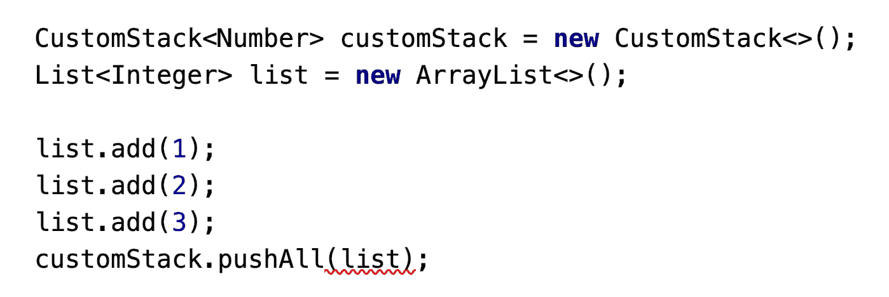

# Java 中的泛型(第 1 部分)

> 原文：<https://medium.com/codex/generics-in-java-part-1-e6a2d74745cd?source=collection_archive---------4----------------------->

本系列第 2 部分:[https://medium . com/codex/generics-in-kotlin-part-2-6 e 87 f 9 b 2 E8 AC](/codex/generics-in-kotlin-part-2-6e87f9b2e8ac)

本系列第三部分:[https://medium . com/codex/generics-in-kotlin-part-3-1 efde 0 BF 0167](/codex/generics-in-kotlin-part-3-1efde0bf0167)

泛型在 Java 和 Kotlin 中都是一个强大的特性，可以帮助您编写类型安全的可伸缩代码。然而，我发现了多个概念，如界限、通配符、递归界限等。非常令人困惑，现在是 Kotlin 中泛型的区别。这篇文章试图揭开泛型各种基本概念的神秘面纱。

注意:这是一篇长文，会有更多更新。请继续关注并通过在您的 IDE 中尝试代码示例来理解这些概念:)

让我们从最基本的开始。

# 为什么是仿制药？

我相信大多数人已经看到了列表中的例子，并且阅读了像编译时类型检查和代码重用这样的术语，它们是使用泛型的最大好处。让我们来看一个泛型能让我们做什么的例子。

## 参数化的类/接口/方法/变量

让我们按照预期从列表示例开始。如果没有泛型，我们将编写如下代码:

```
List ints = Arrays.*asList*(1, 2, 3, **"hello"**);
**int** s = 0;
**for** (Iterator it = ints.iterator(); it.hasNext(); ) {
    **int** n = (**int**) it.next();
    s += n; }
**assert** s == 6;
```

如您所见，编码器必须记住添加的值的类型，并引入手动转换(第 4 行)。**我们无法在声明期间指定类型。**另外，如果你注意到了，我狡猾地添加了一个字符串，因为为什么不？！这个程序在编译时不显示任何错误，只在运行时(即我们执行代码时)失败。您应该已经猜到了失败的原因:编译器无法将字符串转换为 int 类型。

一些超级聪明的人意识到了这种混乱，并添加了一种方法，让你很早就定义什么样的元素是预期的，并让编译器很早就向你显示错误(当编译器只是编译代码，而不是等待你运行代码)。

一旦使用泛型编写代码，您会立即在 IDE 中看到错误，并且代码不再编译。


如您所见，没有泛型，就没有办法指定我们打算在列表中存储什么样的条目，这需要更多的手动检查。它引入了冗长和运行时故障，而不是编译时故障。请不要建议我们应该为所有不同的类型创建单独的列表类，然后永远不必处理上面提到的问题，甚至重载构造函数！

顾名思义，泛型通过在尖括号<>中指定类型，让我们将泛型结构用作具有类型安全和更强编译时检查的列表

# 数组与列表

Java 中数组和列表的定义方式与经常出现的多个关键字/概念(如协方差、不变性、具体化和擦除)之间存在显著差异。让我们通过这些，了解这些看起来很吓人的文字背后的细节。

> Effective Java 在首选列表胜于数组的主题下很好地涵盖了这些内容

## 数组是协变的，列表是不变的

这种令人困惑的说法只是解释了列表是使用泛型定义的，而数组不是。这进一步证实了列表<type1>既不是父类型也不是列表<type2>的子类型，其中类型 1 和类型 2 可以具有子类型或父类型关系。对于数组来说，情况并非如此。如果 Type1 是 Type2 的子类型，Type1[]也是 Type2[]的子类型，反之亦然。让我们通过一个简单的例子来阐明:</type2></type1>


请注意，在上面的例子中，如果我试图将一个列表<double>赋给一个列表<number>，在编译时会失败。然而，我可以将一个 Double 类型的数组赋给一个 Number 类型的数组，因为 Double **扩展了** Number。这就是为什么数组是协变的，列表是不变的。</number></double>

## **具体化&擦除**

数组是具体化的&泛型是通过擦除实现的。正如我们已经看到的，如果使用数组，失败只会在运行时发生，而使用泛型 List，可以在编译时捕获错误。

```
Arrays = Store all type information and verify at RuntimeList = Ensure all type checks at Compile time & delete all type information at Runtime
```

现在，因为在泛型的情况下，检查已经在编译时完成了，所以它们也不需要在运行时携带类型描述。

因此，**当我们使用泛型时，类型描述在编译时存在，但是*在运行时被删除*** *。*这样做是为了提高效率，因为不再需要这些细节了&也保持了与 5 之前没有泛型的 Java 版本的向后兼容性。你可以看到为什么数组不是这种情况，即使在实际运行时，我们也一直带着类型描述。当我们在 Kotlin 中讨论泛型时，我们将在后面的博客中更详细地讨论内联函数和具体化的概念。

# 扩展和超级

我相信任何一个 Java 程序员都见过这些术语，并且困惑过一段时间。让我试着澄清一下每一个问题，以及为什么首先引入它们。

我们已经看到参数化类型是不变的，这意味着我们不能仅仅因为 Integer 扩展了 Number 就用 List <integer>代替 List <number>。</number></integer>

让我们举一个简单的例子来理解为什么我们需要更多的灵活性。

```
**public class** CustomStack<E> {

    Stack<E> **stack** = **new** Stack<>();

    **void** pushAll(Iterable<E> source){
        **while** (source.iterator().hasNext()){
            **stack**.push(source.iterator().next());
        }
    }

    **void** pop(Collection<E> destination){
        destination.add(**stack**.pop());
    }
}
```

在上面的代码中，我们创建了一个用类型参数化的自定义类。这一点很重要，因为我们看到了为什么要使用泛型。如果我们没有将它声明为 CustomStack <e>，我们就不能指定一个类型，然后你基本上可以将任何类型放入这个堆栈，它只会在运行时出现问题时失败。我可以在自定义堆栈中放置随机类型，比如字符串和整数，但是当我们声明它为自定义堆栈时就不行了</e>

让我们尝试使用这个自定义堆栈。



如您所见，我将其声明为 CustomStack <number>，这意味着根据泛型原则，除了 Number 之外，不允许其他类型。那么，我如何更灵活地创建自定义堆栈呢？我想做以下事情，一旦你经历了这些事情，这些事情听起来会很有效:</number>

1.  我有一堆自定义的数字。我现在想把整数或其他子类型也放到这个堆栈中。请注意，我们正在从源可迭代获取值，并将它们存储到堆栈中(push all(Iterable<E>source))。
2.  现在，假设我们有一堆在声明中定义的数字。我现在想创建一个**对象的集合(例如 List < Objects >)并将其传递给 pop 方法来存储/放置弹出的值。**由于对象类型是先前存储的值(Number)的超类型，我们应该被允许在其中存储数字。

在 CustomStack <e>和方法只接受 E 类型的情况下，上述选项不可用。让我们修改我们的自定义堆栈并引入**扩展&超级**。</e>

```
**public class** CustomStack<E> {

    Stack<E> **stack** = **new** Stack<>();

    **void** pushAll(Iterable<? **extends** E> source){
        **while** (source.iterator().hasNext()){
            **stack**.push(source.iterator().next());
        }
    }

    **void** pop(Collection<? **super** E> destination){
        destination.add(**stack**.pop());
    }
}
```

请务必记住，对于要传递给方法的变量(源和目标)，应该考虑 get 和 put 的以下细节。理解所解释的获取和放置逻辑很重要。

为了支持灵活性 1，我们希望允许更多的子类型存储在 CustomStack <number>中。我们需要确保我们**从 pushAll 方法中定义的结构中获得的值**要么是**数字，要么是数字的子类型**。我们用“扩展”来做这件事，现在如果你把它作为一个整体来读，以数字为例，这很简单。扩展号码。唯一能证实这一点的类型是数字的子类型，如整数、双精度等...</number>

需要清楚理解的一个细节是，使用“extends ”,我们只能从结构中获取元素，而不能将元素放入结构中。这是已经实施的，您可以通过尝试在 pushAll 方法中声明的**源**变量中存储任何值来轻松地进行试验。编译器不会允许你。

为了支持灵活性 2，我们希望定义一个超类型的集合来存储堆栈中的值。为此，我们需要确保用于存储堆栈中值的集合类型( **destination** 变量)应该是我们可以从堆栈中获得的值的超类型，或者(E 的超类型)。这是使用。超级 e。

与 extends 相反，当你只有**把**值放入结构时，使用“super”。在这里，我们**将值放入目标变量**。希望我们修改后的类的用法能够澄清这些细节:

```
CustomStack<Number> customStack = **new** CustomStack<>();
List<Integer> list = **new** ArrayList<>();
List<Object> listOfObject = **new** ArrayList<>();

list.add(1);
list.add(2);
list.add(3);
customStack.pushAll(list);
customStack.pop(listOfObject);
```

我们已经创建了一个自定义的数字堆栈，但是现在也从**源**变量中获取整数。我们还可以传入一个集合< Object >来存储堆栈中的值，在这种情况下，这些值可以是整数或数字，Object 可以存储它们。

# 通配符

让我们更详细地讨论一下**。**仿制药中常见的是什么？

简单来说就是“？”代表某种类型。让我们快速回顾一下我们在上面看到的扩展和超级示例:

```
? extends E = Any Type that is a subtype of E
? super E = Any type that is a super type of E
? = ? extends Object
```

我想快速地谈论一下通配符捕获以及通配符和类型参数方面的不同选项。

## 更短/更简洁代码的通配符

这些方法声明是等效的，这里的通配符提供了一种更简洁的方式来编写代码:

```
public static void reverse(**List<?>** list);public static void **<T>** reverse(**List<T>** list);
```

**通配符捕获**

让我们试着理解上面提到的两个选项之间的区别:

如果我们使用使用类型参数的选项 2，下面的代码可以工作:

```
public static **<T>** voidreverseWithT(**List<T>** list) {
    List<T> tmp = **new** ArrayList<T>(list);

    for (int i = 0; i < list.size(); i++) {
        list.set(i, tmp.get(list.size() - i - 1));
    }
}
```

对于选项 1，上述代码可以写成如下形式:

```
public static void reverse(**List<?>** list) { List<Object>tmp = new ArrayList<Object>(list); for (int i = 0; i < list.size(); i++) {
  list.set(i, tmp.get(list.size()-i-1)); **// compile-time error** }}
```

然而，这是非法的，因为我们现在正试图将一个对象列表写入一个未知类型的列表。解决这个问题的一个方法是声明一个后续的私有方法来捕获被传递的类型:

```
public static void reverse(**List<?>** list) { rev(list); } private static **<T>** void rev(**List<T>** list) {List<T> tmp = new ArrayList<T>(list); 
for (int i = 0; i < list.size(); i++) {list.set(i, tmp.get(list.size()-i-1)); 
 }
}
```

这里我们说**类型变量 T 已经捕获了通配符**。

我希望这篇文章澄清了很多关于 Java 中泛型基础的问题。在下一篇文章中，我将涉及更多的主题，比如 Kotlin 中的泛型和递归界限，以使文章更加清晰。