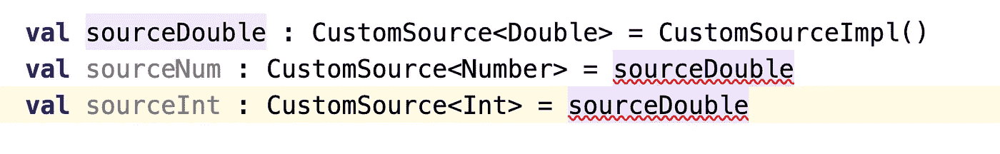
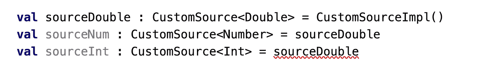

# Kotlin 中的泛型(第 2 部分)

> 原文：<https://medium.com/codex/generics-in-kotlin-part-2-6e87f9b2e8ac?source=collection_archive---------9----------------------->


欢迎阅读泛型系列的第 2 部分。

如果您是第一次学习泛型，这里是本系列的第 1 部分，包含 Java 示例:

[https://medium . com/@ nehalCodes/generics-in-Java-part-1-e6a2d 74745 CD](/@nehalCodes/generics-in-java-part-1-e6a2d74745cd)

在这篇文章中，我想回顾一下 Kotlin 中的泛型，并强调一下它与 Java 的区别。如前所述，学习这些的最好方法是在您的首选 IDE 中尝试这些示例:)

Kotlin 有多个像 in-out 这样的关键字&像*use-site-variance&declaration-site-variance*这样的概念。通过这些详细的分步主题，我想确保我们绝对清楚地理解了这两个主要概念。我个人认为，一旦你完全理解了 Java 中的泛型，在 Kotlin 中映射一切就容易多了。

# 进出

我知道这是一个奇怪的标题，大多数帖子更喜欢像*声明-网站-差异等*这样的标题。然而，我更喜欢以非常简单的方式解释这些概念，我们可以将这些概念映射到标准术语中！

## 与 Java 的相似之处

我们已经看到了 Extends & Super 如何与通配符一起使用来增加 API 的灵活性。如果您不熟悉，请查看本系列的第 1 部分。

Kotlin 简化了这个签名，并引入了一些强大的选项来使它不那么冗长。

让我们用一个类似的例子来尝试一下:

```
**class** CustomStackK<E> {

    **var stack** = Stack<E>()

    **fun** pushAll(source: MutableList<**out** E>) {
        **while** (source.iterator().hasNext()) {
            **stack**.push(source.iterator().next())
        }
    }

    **fun** pop(destination: MutableCollection<**in** E>) {
        destination.add(**stack**.pop())
    }
}
```

如你所见，用非常简单的术语来说，in & out 对应于 Java 中的 super & extends。所以你可以写 List < **out** E >而不是写 List **extends** E >。正如你可以清楚地看到它更容易记住了:)

Producer-extends Consumer-Super 可以很容易地用相关的词**Out(Producer)&In(Consumer)**映射。

让我快速指出一些你可以从 Kotlin 免费得到的东西。我鼓励您打出这个示例代码，然后将 pushAll 函数改为使用列表而不是可变列表。因为 List 在 Kotlin 中是不可变的类型，所以也不需要指定 out 关键字！

**编译器知道你只能从这个集合中提取项目:)**

用 Kotlin 的术语来说，这个代码类型指的是***use-site variance***，这仅仅意味着当我们声明 CustomStackK < E >时，这些注释(in & out)不被使用，只有当这个类型实际上与一些逻辑一起使用时才被使用。

Kotlin 的官方博客也这样写道:

**这是我们对*使用地点差异*的处理方式，它对应于 Java 的** `**Array<? extends Object>**` **，只是稍微简单一些。**

注意:如果你从一个 Java 类中调用 pushAll，你可以为 source/destination 传递空值，因为这是允许的。在 Kotlin 中，这是不允许的，除非你把它指定为一个可空的参数。

## Kotlin 增加了支持(声明-站点差异)

让我们来看另一个样例代码，来回顾一下 Kotlin 中新引入的概念。Java 没有这样的支持，而且非常方便！

看看这个界面及其用法:

```
**interface** CustomSource<E> {

   **fun** nextT(): E

}
```

用法:



基于泛型是如何工作的，我们不能真的将一个定制源<double>或定制源<int>分配给定制源<number>，即使它是绝对安全的。第三行在所有情况下都无效，只是为了额外理解而添加的。</number></int></double>

在这种情况下，由于这个接口只有生产者方法，我们实际上可以从这个接口使用的任何方法都只能充当生产者(理解这一点非常重要)。

让我们看看如何支持 Kotlin:

```
**interface** CustomSource<**out** E> {

   **fun** nextE(): E

}
```

用法:



第二行现在有效。让我们了解如何:

out 关键字现在已经用在了我们声明接口/类的地方**。这就是 ***申报-现场差异*** 的意思。我们被允许这样做(在声明中添加)，因为**我们在这个接口**中只有生产者方法。如果您尝试这段代码并添加其他将类型 E 作为消费者的方法，编译器会立即阻止您。对于只有消费者方法的类/接口，**中的**也有类似的选项。**

此选项在 Java 中不可用。坦率地说，它非常方便。在 Java 中，我们唯一的选择是在一个方法中再次将类型声明为 CustomSource extends E>接受这些类型来表示生产者/消费者，正如 Java 博客中所解释的那样，这很冗长，需要您创建额外的方法来处理这些检查。

在下一篇文章中，我们将详细讨论星体投射，以及更多的概念和例子。

希望这些帖子能够澄清 Java & Kotlin 中关于泛型的大部分概念。敬请期待！

本系列第 1 部分:[https://medium . com/codex/generics-in-Java-part-1-e6a2d 74745 CD](/codex/generics-in-java-part-1-e6a2d74745cd)

本系列第 3 部分:[https://medium . com/codex/generics-in-kotlin-part-3-1 efde 0 BF 0167](/codex/generics-in-kotlin-part-3-1efde0bf0167)