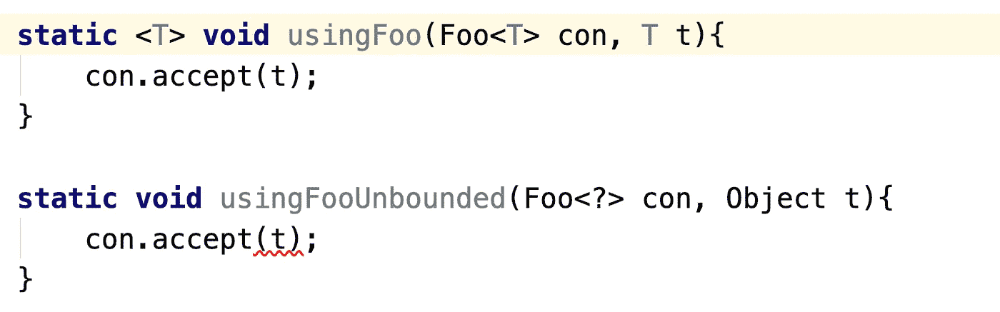

# Kotlin 中的泛型(第 3 部分)

> 原文：<https://medium.com/codex/generics-in-kotlin-part-3-1efde0bf0167?source=collection_archive---------5----------------------->


欢迎阅读泛型系列的第 3 部分。

如果你是第一次学习泛型，请检查

包含 Java 示例的第 1 部分:

[](/@nehalCodes/generics-in-java-part-1-e6a2d74745cd) [## Java 中的泛型(第 1 部分)

### 泛型在 Java 和 Kotlin 中都是一个强大的特性，可以帮助您编写类型安全的可伸缩代码。然而，我发现…

medium.com](/@nehalCodes/generics-in-java-part-1-e6a2d74745cd) 

Kotlin 基础知识第 2 部分:

[](/@nehalCodes/generics-in-kotlin-part-2-6e87f9b2e8ac) [## Kotlin 中的泛型(第 2 部分)

### 欢迎阅读泛型系列的第 2 部分。

medium.com](/@nehalCodes/generics-in-kotlin-part-2-6e87f9b2e8ac) 

在这篇文章中，我想在 Kotlin 中复习更多关于泛型的概念，同时根据需要与 Java 进行比较。如前所述，学习这些的最好方法是在您的首选 IDE 中尝试这些示例:)

# 星形投影

有一个单独的 bog 帖子专门用于恒星投影可能会感觉怪怪的，但让我们确保理解它背后的所有概念。

Kotlin 的星形投影类似于 Java 中的无界通配符，当我们对类型一无所知，但仍然希望以安全的方式使用时，我们会使用它。

虽然这是一个简单的定义，但让我们来理解为什么会有星图投影，以及我们如何利用这个概念。使用星形投影有多种原因/场景:

1.  我们不知道要指定的类型(这很简单！)
2.  对于用参数 T 声明的泛型类，我们对使用签名中有 T 的函数不感兴趣
3.  我们不想意外地使用特定的函数！

我们通过一些代码示例来了解一下。我鼓励在您的 IDE 中尝试这个示例代码，并立即看到不同之处:

```
**class** Foo<**in** T> {

    **fun** accept(value: T){
        *println*(value)
    }
}**fun** <T> usingFoo(con: Foo<T>, t: T){
    con.accept(t) //Allowed
}**fun** usingFooStar(con: **Foo<*>**, t: Any){
    **con.accept(t)   // Not Allowed**
}
```

正如您在上面的示例代码中所看到的，**我们只能在拥有特定类型**时使用签名中带有 T 的方法。我们先来理解一下这为什么有意义。

当我们使用星形投影时，编译器不知道它的类型。因此，任何依赖于验证类型的东西都不再安全。如果某些东西在编译时工作，而在运行时失败，这又是一个麻烦。

让我们来看看当你使用这些方法时，什么是特定类型和星形投影所允许的，并阐明为什么某些事情是不允许的。

用类型声明了 Foo，并使用 Foo 方法使用了**:**

```
//Case 1(Valid): Foo is declared with Number type & 7 is Int which is Subtype of Number.**val** fooNum : Foo<Number> = Foo()
usingFoo(fooNum, 7) //Case 2(Invalid & Compile time failure): Foo is declared with type Int and we are trying to store a Double which is NOT Subtype of Int**val** fooNum : Foo<Int> = Foo()
usingFoo**(fooNum, 7.0)**
```

现在让我们使用 FooStar 方法来使用

```
//Case 3(No compile time failure here but you are **not allowed to use accept method from Foo class as mentioned above**!)**val** fooString : Foo<String> = Foo()
usingFooStar(fooString, 7)//Case 4(No compile time failure here but you are **not allowed to use accept method from Foo class as mentioned above**!)**val** fooAny : Foo<*> = Foo<Any>()
usingFooStar(fooAny, 7)
```

**我现在让你明白为什么编译器阻止你使用签名中有 T 的方法！如果我们允许调用类型相关的方法，那么它们将在运行时失败，因为我们无法验证类型。**

## **与通配符的比较**

**Kotlin 博客没有 Java 参考是不完整的，你看:)**

**科特林的星形投影类似于我们以类似方式使用的无界通配符:**

****

**可能需要注意的一点是，在 Java 代码中，我们允许为 Foo <t>或 Foo >传递 null，但在 Kotlin 中不允许，除非我们显式地将它们标记为可选的。我想这也是 Kotlin 官方博客用这句话传达的意思:</t>**

****星形投影非常像 Java 的原始类型，但是很安全。****

**希望这篇短文能澄清恒星投影的细节。添加一些有用的资源，帮助我更好地理解这些主题。**

## **资源**

**[](https://stackoverflow.com/questions/48172314/kotlin-star-projection-on-contravariant-types) [## 逆变型柯特林星投影

### 让我们来理解一下为什么逆变消费的星空投影等同于。但在那之前，我们…

stackoverflow.com](https://stackoverflow.com/questions/48172314/kotlin-star-projection-on-contravariant-types) [](https://kotlinlang.org/docs/generics.html#star-projections) [## 泛型:in，out，where | Kotlin

### Kotlin 中的类可以有类型参数，就像 Java 中一样:class Box (t: T) { var value = t }创建一个实例…

kotlinlang.org](https://kotlinlang.org/docs/generics.html#star-projections) 

本系列的第 1 和第 2 部分:

[](/codex/generics-in-java-part-1-e6a2d74745cd) [## Java 中的泛型(第 1 部分)

### 泛型在 Java 和 Kotlin 中都是一个强大的特性，可以帮助您编写类型安全的可伸缩代码。然而，我发现…

medium.com](/codex/generics-in-java-part-1-e6a2d74745cd) [](/codex/generics-in-kotlin-part-2-6e87f9b2e8ac) [## Kotlin 中的泛型(第 2 部分)

### 欢迎阅读泛型系列的第 2 部分。

medium.com](/codex/generics-in-kotlin-part-2-6e87f9b2e8ac)**