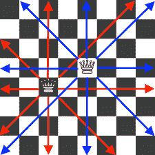
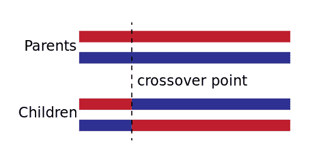
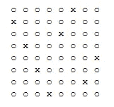
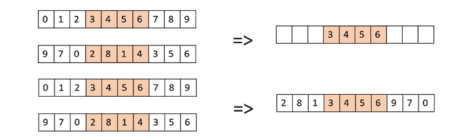
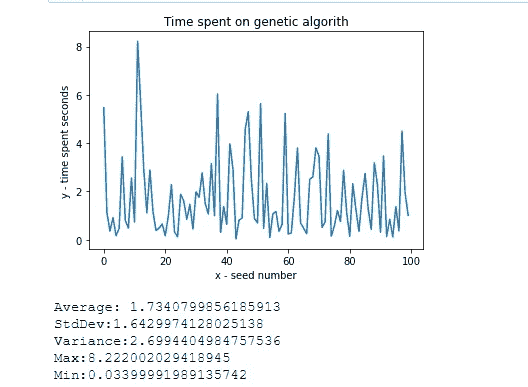
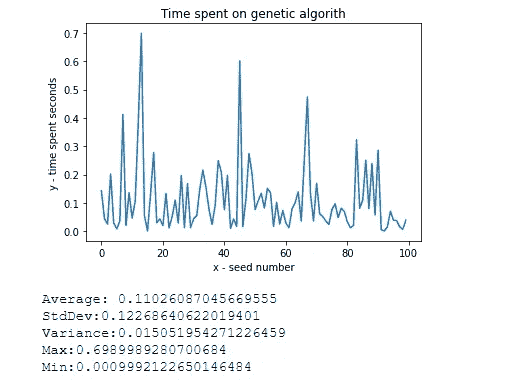

# 遗传算法——解决 8 皇后难题

> 原文：<https://medium.com/codex/genetic-algorithm-solving-an-8-queens-puzzle-d951c9baa2cf?source=collection_archive---------10----------------------->

遗传算法试图用自然和进化的方式来解决问题。选择最适合的个体进行繁殖，以产生下一代的后代。在本文中，我们将尝试使用一个用于教育目的的 8 皇后谜题。一个 8 皇后是一个经典的难题，将八个国际象棋皇后放在一个 8×8 的棋盘上，这样没有两个皇后互相威胁。因此，没有两个皇后应该共享相同的行、列或对角线。

我们在处理 8 皇后问题时将使用的方法首先，我们将寻找一个在成本函数上给出零成本的列表组合，这意味着没有皇后攻击另一个皇后。

我们假设每一个女王都属于单独的一排，否则他们早就互相攻击了。例如，右边的棋盘将被解码为[3，1，6，2，5，7，4，0]。我们的目标是找到一个这样的排列。

从分析角度来看，该过程需要以下步骤:

*   **初始化**:创建适当长度的适当大小的种群。种群规模不应该保持很大，因为这会导致遗传算法变慢，而较小的种群可能不足以形成良好的交配池。因此，最佳群体规模需要通过反复试验来决定。

*   **选择**:它涉及从当前群体中选择最佳结果的子集，即具有最小成本函数的 8 皇后结果。在我们的案例中，我们将保留 20%的人口。

*   **交叉**:挑选这个子集，我们每次随机挑选其中的两个单词，然后交叉。从 0，8 中随机选取一个长度，这是皇后状态的长度，我们将取第一个字的第一位，并将其与第二位的第二个字连接起来

下图显示了发生的情况:

*   突变:突变表现为个体组合的微小随机变化。这种突变发生一次的概率很小。在我们的例子中是 30%的时间。

下面的只是在一个例程中描述的上述内容:

最后，所有工作都需要一个八皇后状态的类表示:

如下图所示，每个国际象棋位置的双 for 循环将使我们的解决方案可视化:

解决方案的可视化

所以现在我们的算法起作用了。但是，让我们更进一步，采取一些额外的步骤来扩展我们的应用:

*   首先让我们让皇后接受任意数量的皇后。

*   因为我们有一个排列，所以利用它而不是把它当作一个整数表示是有意义的。换成一个排列而不是一个整数会更快得到更好的结果。

*   最后实现戴维斯的顺序交叉和变异功能。

我们试图使用 OX1 来获得更快的结果。我们在新的交叉函数中所做的包括以下步骤。

1.  在第一个父对象中创建两个随机交叉点，将它们之间的线段从第一个父对象复制到后代。
2.  从第二个父项中的第二个交叉点开始，将第二个父项中剩余的未使用数字复制到第一个子项中，环绕列表。
3.  对第二个孩子做同样的事情，现在第一个父母是第二个，反之亦然。
4.  因为保持它们相同的变异函数或删除它要么破坏应用程序，因为我们会有相同的数字不止一次出现，这将破坏 OX1 的实现，要么收敛得非常快，试图找到一个不存在的组合。我们实现了一个变异函数，每 30%的时间只输入一个新个体的随机排列。

大卫交叉的例子[2]

现在，让我们用一种一致的方式来判断我们的改进是否确实提高了算法的时间效率。因此，我们为前 100 个种子创建一个循环，并计算算法找到最优解所需的时间。

添加均值、平均值、方差、最大值、最小值的图表和统计数据将让我们感受到我们做得有多好。

这张图显示了我们最初的时间:

增强版本清楚地显示了算法效率的显著提高。

完整的项目在 GitHub[https://github.com/nikkaramessinis/Genetic-Algorithm](https://github.com/nikkaramessinis/Genetic-Algorithm)上

如果你喜欢这些内容，请考虑关注尼克·卡拉梅西尼斯或 https://www.buymeacoffee.com/nikaramesinis 的[或](https://medium.com/u/e69257c626b4?source=post_page-----d951c9baa2cf--------------------------------)[。对于任何更正或补充，我们都非常欢迎您发表评论进行更多讨论。](https://www.buymeacoffee.com/nikaramesinis)

参考

*[1]人工智能现代方法第三版*。(未注明)。

[2] *遗传算法:8 皇后问题|由程邹|讷为理工|媒*。(未注明)。检索于 2022 年 1 月 18 日，来自

[https://medium . com/nerd-for-tech/genetic-algorithm-8-queens-problem-b 01730 e 673 FD](/nerd-for-tech/genetic-algorithm-8-queens-problem-b01730e673fd)

*【3】遗传算法—快速指南*。(未注明)。检索于 2022 年 1 月 18 日，来自[https://www . tutorialspoint . com/genetic _ algorithms/genetic _ algorithms _ quick _ guide . htm](https://www.tutorialspoint.com/genetic_algorithms/genetic_algorithms_quick_guide.htm)