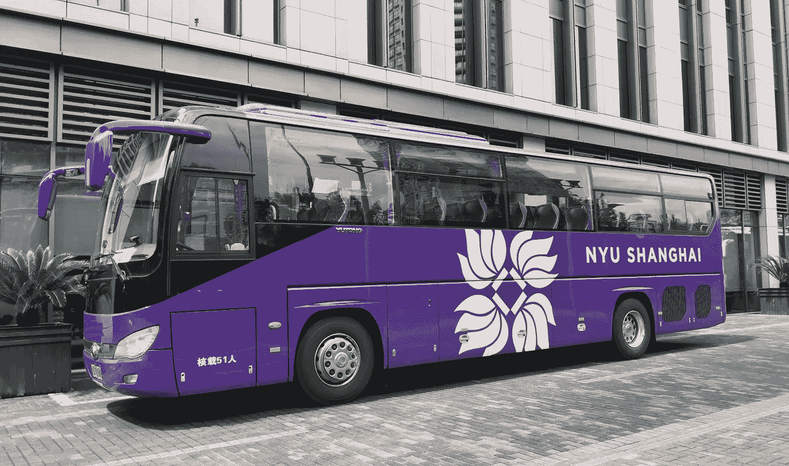
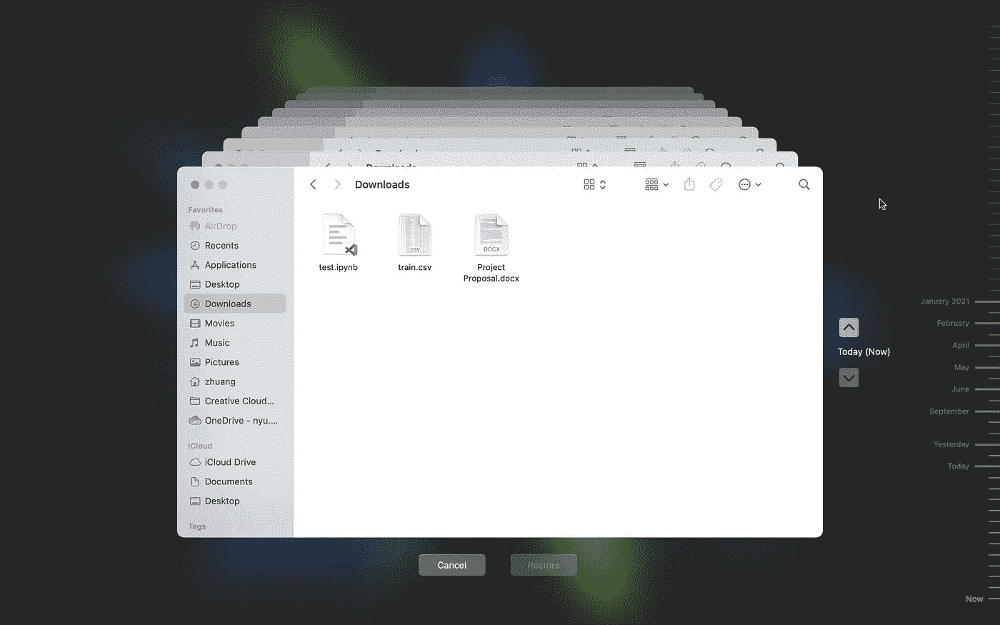
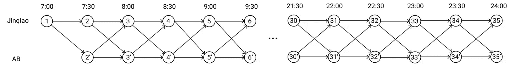
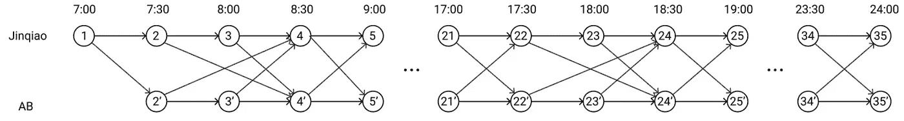
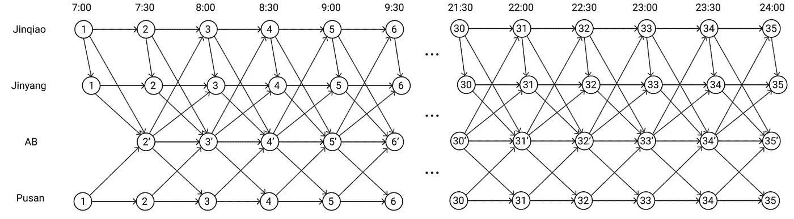
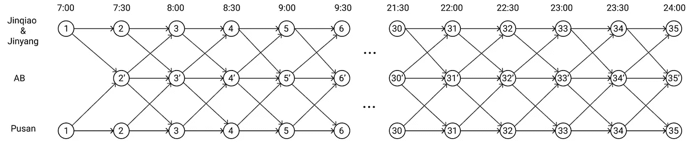
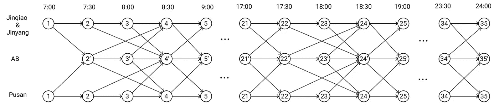

# 遗传算法与时空网络:校园班车时刻表优化(一)

> 原文：<https://medium.com/codex/genetic-algorithm-spatio-temporal-networks-optimization-of-campus-shuttle-bus-schedule-part-1-e0dc3bcdb30c?source=collection_archive---------12----------------------->

## 第 1 部分:问题表述的时空网络

作者图片

# 问题介绍

我们大学的教学楼和宿舍是分开的(相距数英里)。大多数学生利用指定的学校班车往返于教学楼和宿舍之间。我们有三个宿舍，两个相距只有一个街区，第三个相距很远。班车往返于教学楼和不同宿舍之间。我在宿舍住了三年，像大多数学生一样，我对我们的公交时刻表不满意。我可能醒得很早，但最终却没有赶上公共汽车，错过了我的课；因为害怕错过公交车，我浪费了很多时间去停车场。为什么我每次上车，巴士就不能开往我的目的地呢？

> 是时候把这个问题掌握在我自己手中，用我在课堂上学到的知识为我们的学生社区做些有用的事情了。听起来很棒，对吧？

所以我就这么做了。我将这个车辆调度问题公式化为 4 种时空网络，并用 Python 实现了遗传算法，以在确保满足学生需求的同时，为学校降低高达 20%的成本。

让我在这一系列的博客中告诉你是如何做到的。如果你想看演示或者看代码，请直接去我的[项目 GitHub](https://github.com/AlisonYao/DURF-Bus-Schedule-Optimization) 。

# 问题描述

通常，现实生活中的问题不适合任何模型。我们需要通过做出假设并将其分解成更小的部分来简化问题。在我们的例子中，虽然有三个宿舍，但我首先只从一个开始，这个宿舍有最多的学生，也是我住了 2 年的宿舍。也就是说，我的模型只涉及两个位置，学术大楼(AB)和金桥宿舍(JQ)，现在忽略另外两个宿舍。我把这个版本称为“基线问题”。我做了如下假设:

1.  所有班车只往返于 JQ 和 AB 之间，不往返于其他宿舍。
2.  所有班车从 JQ 出发或在 JQ 等待第一班车，这意味着在早上第一班车期间没有班车从 AB 出发。它与真实世界的操作是一致的。
3.  班车服务在工作日从早上 7:00 开始，到晚上 24:00 结束(每天 17 个小时)，特殊情况下没有时间变化。
4.  所有班车只能从 AB 开往 JQ 或从 JQ 开往 AB，间隔时间为 30 分钟(30 分钟通常保证及时到达)。上述假设的唯一例外是，在高峰时间，所有班车需要 2 个间隔(1 小时)才能到达目的地。
5.  每辆班车都有一名司机操作。他或她不能连续工作超过 4 小时的最长工作时间。

在定义了“基线问题”之后，我继续阐述更复杂的“扩展问题”，其中考虑了所有三个宿舍(金桥-JQ、金阳-JY 和釜山-PS)。请注意，JQ 和 JY 只有一个街区的距离，所以他们基本上可以被视为同一个地方。同样，我们做了一些假设，但这里我只列出与上面不同的假设:

1.  如果学生需要，所有班车可以在任何一天往返于 JQ/JY 和 AB 或 PS 和 AB 之间。
2.  所有班车从 JQ 或 PS 出发，或者在 JQ 或 PS 等待第一次调度，这意味着在早上第一次调度期间没有班车从 AB 出发。
3.  所有班车只能从 AB 开往 JQ/JY 或 PS，或从 JQ/JY 或 PS 开往 AB，间隔 T 为 30 分钟(同样，30 分钟通常保证及时到达)。上述假设的唯一例外是，在高峰时间，所有班车需要 2 个间隔(1 小时)才能到达目的地。

好了，我已经用文字描述了这个问题，但是我们仍然需要一个数学表达式。这就是时空网络的用武之地。

# 什么是时空网络？

时空网络模型是一种捕捉时间和空间变化的图形模型。在我们的车辆调度问题中，时间更重要，所以一个**时间扩展图**就是我们要找的。

把一个**时间扩展图**想象成一台 Mac 时间机器。随着时间的推移，您会看到同一目录的不同版本。

作者图片

因此，时间消耗图具有代表整个时间内相同位置的多个节点。例如，所有节点 1 代表同一个节点，但它在不同的时间与节点 2 和节点 3 交互。

作者图片

在我们问题的上下文中，所有节点 1 可以表示 JQ，所有节点 2 可以表示 AB。从 1 指向 1 的箭头表示班车在某一时段停在 JQ；从 1 指向 2 的箭头表示班车在某一时段从 JQ 开往 AB。

# 如何将我们的问题公式化为一个时空网络？

## 3.1 基线问题

让我们首先考虑最简单的场景。除了第一次调度，时空网络是同一网络结构的重复。每辆班车可以在一个间隔 T = 30 分钟内从节点 n 行驶到节点 n+1 或节点(n+1)’。我们称之为 1.0 版本。

作者图片

实际上，高峰时间会延迟到达时间，所以我们给公交车 2 个间隔(1 小时)来通勤。2.0 版本增加了高峰时间限制，并将网络结构从 7:30 改为 8:30，从 17:30 改为 18:30。其中一个变化的例子是不再有从节点 2 指向节点 3’的箭头。相反，节点 2 指向节点 4’，因为在高峰时间从 JQ 到 AB 需要 30 多分钟。其他地方与 1.0 版保持一致。

作者图片

## 3.2 扩展问题

在扩展问题中，我们将在基线问题模型公式中添加 JY 和 PS 节点。JY 节点都略微向右移动，因为从 JQ 到 JY 需要 3 到 5 分钟，但 JQ-JY-AB 通勤仍在 30 分钟的间隔 T 内。PS 节点与 JQ 非常相似，只是 PS 远离 JQ 和 JY，因此 PS 被视为独立的节点。

作者图片

事实上，从班车时刻表来看，不去 JY 并没有什么不同。最先到达 JY 的巴士司机会通知其他司机他们是否需要开车去 JY 接更多的学生。由于 JY 对公共汽车时刻表没有影响，我们可以合并 JQ 节点和 JY 节点，以更简单的方式表述问题。1.0 版本没有高峰时间的限制。

作者图片

同样，2.0 版本增加了高峰时间限制，并将网络结构从 7:30 更改为 8:30，从 17:30 更改为 18:30。

作者图片

好了，我们已经把问题公式化了。在下一篇博客中，我将解释为什么以及如何使用遗传算法解决这个问题。

谢谢你阅读我的博客！希望对你有帮助。

我的 Github:[https://github.com/AlisonYao](https://github.com/AlisonYao)

我的卡格尔:【https://www.kaggle.com/alisonyao】T2