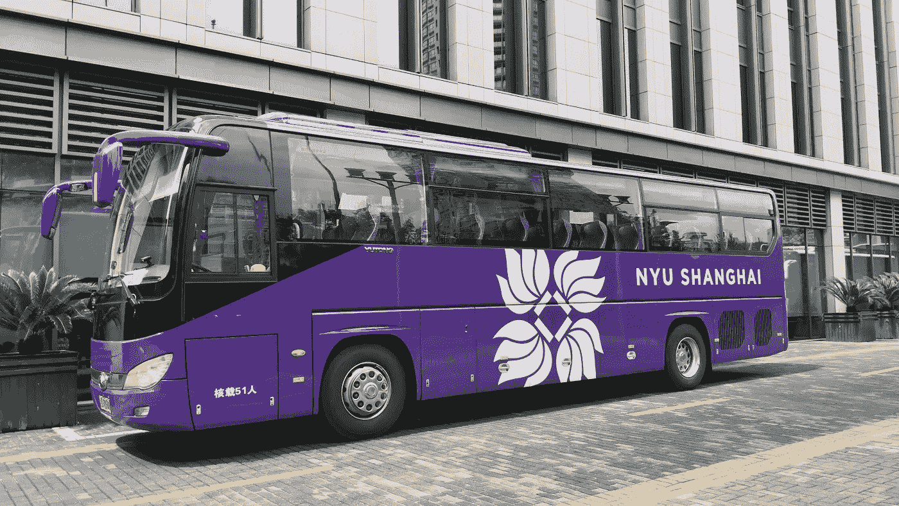
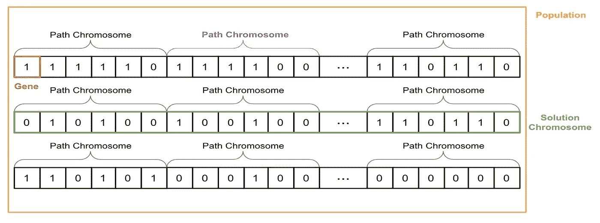
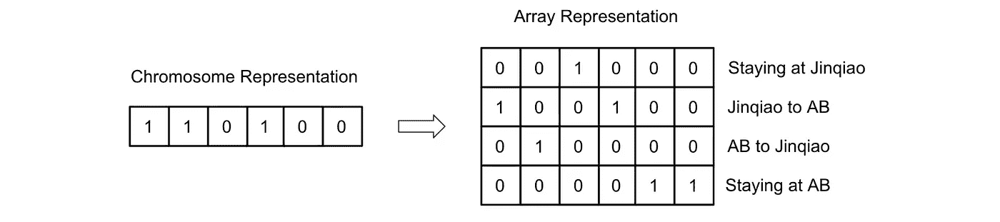
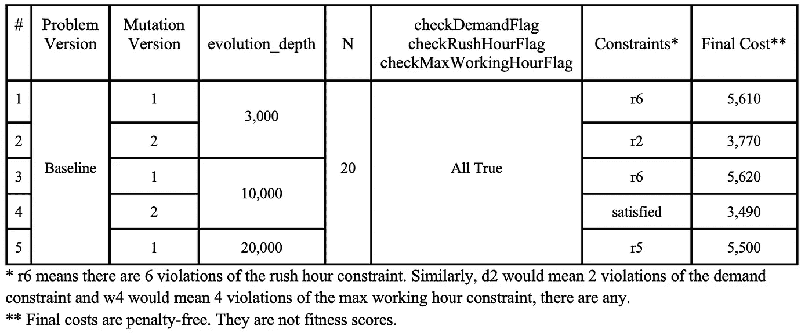
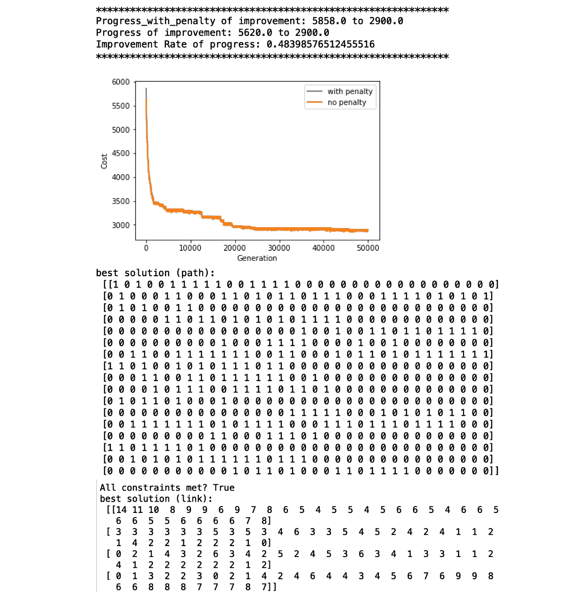
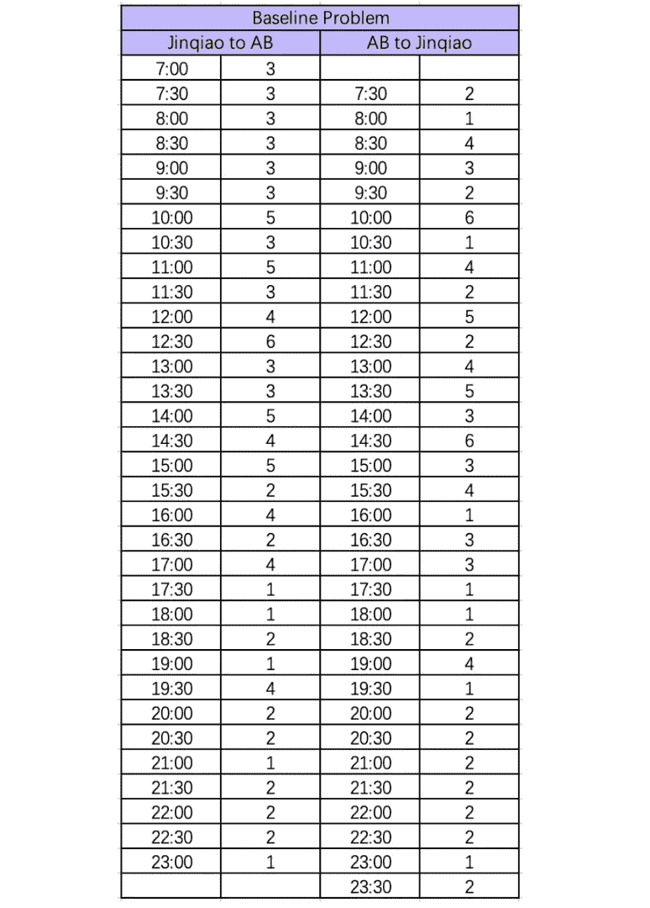

# 遗传算法与时空网络:校园班车时刻表优化(二)

> 原文：<https://medium.com/codex/genetic-algorithm-spatio-temporal-networks-optimization-of-campus-shuttle-bus-schedule-part-2-255a25daf53e?source=collection_archive---------3----------------------->

## 第 2 部分:基线问题的遗传算法(带 Python 代码)

作者图片

> 代码可以在这个 [GitHub Repo](https://github.com/AlisonYao/DURF-Bus-Schedule-Optimization) 中找到。

在[的上一篇博客](/codex/genetic-algorithm-spatio-temporal-networks-optimization-of-campus-shuttle-bus-schedule-part-1-e0dc3bcdb30c)中，我介绍了用于问题公式化的**时空网络**，它几乎涵盖了这个项目的所有理论部分。这里，我们将继续讨论最后一点理论，然后是实现。更具体地说，这篇文章将向您展示如何使用 Python 编写基线问题的遗传算法解决方案(要查看什么是基线问题，请查看此处的)。

# 为什么是遗传算法？

我选择了[遗传算法](https://towardsdatascience.com/introduction-to-genetic-algorithms-including-example-code-e396e98d8bf3)来解决这个优化问题，因为它有独特的优势:

## **1。遗传算法需要较少的计算能力**

由于只有枚举了总线的路径才能确定总线的开销，因此我们首先尝试了列生成的方法。列生成枚举解集中所有可能的路径，并使用强力搜索来寻找最优解。逐一检查干草，直到我们找到针，这就像大海捞针一样。但是，仅基准案例就已经总共有 2 ** 34 = 17，179，869，184 条路径，而我的计算机没有存储所有这些信息的硬件容量。我们只能看到干草堆中随机的一部分，不知道针是否真的在这一部分，所以列生成在计算上变得不可行。因此，我求助于遗传算法，一种启发式算法。它从一个随机的次优解开始，然后随着时间的推移进化到更接近最优解的更好的解。

## **2。遗传算法不受黑盒公式的影响**

在理想情况下，优化问题有一个明确的目标函数，我可以用𝑓(𝑥).的形式来表达然而，在我们的例子中，用一种显式的形式来表述问题是非常复杂的，而且有些不必要。主要原因是没有封闭形式的函数规定了营业时间和价格之间的关系。因此，我将目标表述为一个黑盒，这意味着我不试图编写一个明确的目标函数。同样，也不需要明确表达我们的约束。因此，我们的问题表述如下。

我们的**目标**是将 NYU 至上海班车车队的总成本降至最低。根据不同版本的网络结构，约束条件很容易发生变化。所有**约束**的并集包括:

1.  **需求约束**:班车车队需要尽可能满足学生的需求，并留有少量余量。一个例子是，每辆公交车容纳 50 名学生，容差为 3。即使 3 个学生在等着出行，公交车也不会开。容忍度取决于学校对学生要求的重视程度。
2.  **高峰时段约束**:在早上和下午的高峰时段，任何一辆公交车都不能在 30 分钟的间隔内行驶。
3.  **最大工作时间限制**:每辆公交车只能由一名公交车司机驾驶，且不能连续工作超过 4 小时。

尽管有优势，我确实需要指出*遗传算法并不能保证最优*。遗传算法可能会陷入次优解。尽管如此，如果基线问题的计算要求已经很高，而扩展问题只会变得更糟，那么相比之下，GA 是我们的最佳策略。

# 基线问题的 Python 实现

在我们深入 Python 代码之前，我们需要理解 GA 的每一步是如何适应基线问题的。我强烈建议你在前进之前学习 GA 的[基础知识。](https://towardsdatascience.com/introduction-to-genetic-algorithms-including-example-code-e396e98d8bf3)

对于基线问题，解决方案中的一个路径看起来像 011001010001011111000010111110001011。它有 34 个 0 或 1 的基因，因为总共有 34 个区间。0 表示在间隔期间公共汽车仍在等待，并且不运载任何学生；1 代表一辆从 JQ 到 AB 或者从 AB 到 JQ 的公共汽车。请注意，基因为 1 不一定代表公交车载有学生。为了满足下一个时段开始时的巨大需求，公共汽车可能会空载前往 JQ。一个解决方案有几条总线，所以一个解决方案将几个路径染色体连接在一起。

作者图片

在产生解染色体之后，可以根据适应度函数计算适应度分数。适应度函数有两个组成部分，总成本和惩罚成本。对于第一个组成部分，虽然每辆公交车的价格需要与班车公司协商，但价格一般取决于从公交车运营开始到结束的持续时间。**请注意，只要司机开始一天的工作并且没有打卡下班，所有标有 0 的间隔仍然要付费，即使公交车停在一个地方。**因此，我使用了下面的数学公式:

作者图片

其中 x 为公交车的运行时长(单位:小时)。这个公式在很多方面是违反直觉的，但我们只是把它作为一个案例。比如路径染色体 01100101000101111100001011110001011 运营 33 个区间，也就是 16.5 个小时，那么这趟公交的成本就是 20 * 16.5 = 330 元。那么，总成本就是每辆公交车的成本之和。适应性分数的第二个组成部分是违反约束的惩罚。根据您所考虑的基本函数的版本，您可能会有一个仅强制需求约束的惩罚，或两个约束，或需求约束、高峰时间约束和最大工作时间约束的所有三个惩罚。每次学生没有上车，或司机在高峰时间的一个间隔内完成一次旅行，或司机连续工作超过 4 小时，都会在健康得分上增加不同金额的小额罚款。

具体来说，下面是如何检测违反约束的情况。首先，对于需求约束，染色体路径需要被编码成大小为 4 * 34 的数组，该数组指定每个 0 和 1 的含义。

作者图片

在这个例子中，左边的第一个 1 对应于右边的第一列，其中唯一的 1 表示公共汽车从 JQ 开往 AB。同理，其余意思相同。帮助我们计算总线总容量的是数组的第二行和第三行。然后，我们可以将所有 JQ 到 AB 的公共汽车和 AB 到 JQ 的公共汽车加起来，然后乘以公共汽车的载客量，与需求进行比较。第二，对于高峰时间的限制，我们需要从 7:30 到 8:30 和从 17:30 到 18:30 检查每个染色体的连续 1。10、01 和 00 在高峰时间有效，但 11 点无效。第三，对于最大工作时间约束，我们需要跟踪一行中 1 的数量。在高峰时间的情况下，高峰时间的 0 也可能意味着公共汽车正在运行，所以我们也需要考虑这种特殊情况。如果工作持续时间超过 4 小时，则会导致惩罚。

## Python 代码

现在我们终于可以得到 Python 代码了。

我偏离典型 GA 实现的一个地方是`mutation`函数。我测试了遗传算法中变异步骤的两个实现。第一种是传统的实现方式，其中给定一个概率 mutation_prob，每个基因都可能发生突变。不能保证一条染色体是否会发生突变，也不能保证一条染色体会在多少个地方发生突变。第二个是从一个解染色体中随机挑选一个基因来静音。突变是确定的，而且只能有一个突变。我尝试了第二个实现，试图更快地收敛算法。测试结果表明，第二种方法在许多方面确实优于传统方法。此外，第二种实现更快，因为它不需要遍历每个基因并确定它是否会发生突变。

作者图片

比较测试 1&2 和 3&4，给定固定的 evoluation _ depth，变异版本 2 具有更少的约束违反和更低的最终成本。比较测试 1 和 3 和 5，变异版本 1 似乎即使在产生 20，000 代之后也没有很好地收敛。它的性能在早期达到稳定，与测试 4 相比远不令人满意。因此，自行设计的变异函数实现比常规方法执行得更好。无论如何调整参数 mutation_prob，这种优势都会持续存在。

> 因此，我建议将 mutationType 设置为‘New’，并将 mutation_num 保持为 1。

Python 代码的结果应该如下所示:

作者图片

在我的测试中，最好的结果给了我一个新的优化时间表来解决基线问题:

作者图片

谢谢你阅读我的博客！希望对你有帮助。

我的 Github:[https://github.com/AlisonYao](https://github.com/AlisonYao)

我的卡格尔:[https://www.kaggle.com/alisonyao](https://www.kaggle.com/alisonyao)