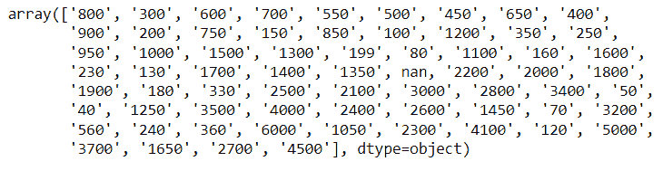

# 地理空间分析项目(佐马托案例研究)

> 原文：<https://medium.com/codex/geospatial-analysis-project-zomato-case-study-f5026cebdfdd?source=collection_archive---------6----------------------->


图片鸣谢-[https://www.financialexpress.com](https://www.financialexpress.com/brandwagon/experts-divided-on-why-zomato-is-seeking-to-become-eternal/2645435/)

# 介绍

今天我们将分析 Zomato 的数据。让我们知道它是什么。对于那些不知道的人，你们大多数人已经在使用 Zomato 应用程序了。Zomato 是一家印度餐厅聚合商和在线食品配送公司，在 24 个不同的国家都有业务。

根据一些机构的调查。因此，据估计，Zomato 每秒大约会收到 8 个订单。因此，试着想象一下客户产生了多少大量的数据。

我们要对这些数据进行分析，从这些数据中找到一些真知灼见。

现在你可能会遇到一个问题，我可以对这些数据进行什么类型的分析？

假设你要完成一个地理分析。你所在城市的商店。

同样，某一家餐馆最有名的菜是什么？对于这一点，我们可以做一个**字云**，可视化之后就可以下结论了。你的鸡肉沙拉，汉堡，比萨饼，等等。这些是我在某家餐厅的拿手好菜。

假设你要分析我在孟买最受欢迎的美食有哪些。所以你将在孟买探索北印度最受欢迎的美食。

同样，您可以分析接受在线订单的餐厅和不接受在线订单的餐厅的评分与价格之间的关系。

因此，让我们继续尝试从这些数据中获得一些见解。

**你可以从 Kaggle** — [下载数据集点击这里](https://www.kaggle.com/datasets/shrutimehta/zomato-restaurants-data)

# 1.用于分析的数据预处理

我们正在读取数据并导入所有库。

```
# importing libraries
import pandas as pd
import numpy as np
import matplotlib.pyplot as plt
import seaborn as sns
```

我们将数据存储在 PDF 变量中，并导入 CSV 文件。

```
df=pd.read_csv('F:/Dataset/3-Zomato Data Analysis-20220908T112931Z-001/3-Zomato Data Analysis/zomato.csv')
```

**使用 df.head()检查数据**

```
df.head()
```


检查我们数据的形状

```
df.shape
```

如下所示，我们的数据集有 51717 条记录和 17 个要素。

检查我的列名

```
df.columnsdf.info()
```


# 数据清理

*   找出数据中缺失值的百分比
*   处理缺失值

让我们找出数据集中空值的百分比；为此，我们将使用 isnull 函数。

如上所述，我们的数据集中有许多空值。让我们分别处理它们。

# 获取缺失值的百分比

我将具有空值的列存储在单独的列中。

```
features_na = [features for features in df.columns if df[features].isnull().sum()>0]
print(features_na)for features in features_na:
    print('{} has {} missing values '.format(features,round(df[features].isnull().sum()/ len(df)*100,4)))
```


正如我们在上面看到的，关于每一列的空值的总百分比，我们现在将分别处理每一列并彻底清理数据。

**处理费率特性**

```
#dealing with rate feature
df['rate'].unique()
```


正如我们在上面看到的，我们有 nan 值和一些字符串值，并且在我们独特的特性中有'/5 '。我们分开处理，去掉。

首先，我们将处理里面的空值并删除它们。

```
df.dropna(axis='index',subset=['rate'],inplace = True)df.shape
```

因此，在删除空值之后，我们的数据集剩下 43942 行。

现在让我们把“/5”从列中去掉。我们知道，评级将总是在 5 分之外，如果我们不从队列中删除“5”，它将不会给我们预期的结果或抛出一个错误。

```
def split(x):
   return x.replace('/5',"")df['rate']= df['rate'].apply(split)
```

我们将函数定义为 split，其中每个瞬时值，例如，我们有 4.2/5；split 函数将用一个空字符串替换“5 ”,只给出 4，2。

```
df.head(2)
```


正如我们在数据集中看到的，“5”已被删除。现在我们需要删除列中的字符串，让我们看看它们是哪一个。

```
df.rate.unique()
```


正如您在上面看到的，数据集中有“新”和“当前”。我们将把 new 重命名为 0，并将—重命名为 0。

```
df.replace('NEW',0,inplace=True)
df.replace('-',0,inplace=True)df.rate.unique()
```


现在我们可以看到我们的数据集仍然是一个**对象**类型，所以我们将把它改为浮点**类型**

```
df['rate']=df['rate'].astype(float)
```

让我们检查一下我们的数据集中是否有空值

```
df.isnull().sum()
```


因此，我们的 rate 列现在已被清除。让我们来看另一个故事。

**洗碗 _ 喜欢的功能。**

正如我们看到的，dish _ liked 列有超过 50 %的空值，所以我们要删除它，因为它没有用。

```
df.drop(columns='dish_liked',inplace = True)
```

**大约费用(两个人)**

我们要看的下一个特性是 approx_cost(两个人)。让我们检查一下其中的唯一值。

```
df['approx_cost(for two people)'].unique()
```


检查数据类型

```
df['approx_cost(for two people)'].dtype
```

**dtype('O')**

它的 d 类型是一个对象。首先，我们将删除特征中存在的(，)彗差，然后将其转换为浮点数据类型。

```
df['approx_cost(for two people)'] = df['approx_cost(for two people)'].str.replace(',','')df['approx_cost(for two people)'].unique()
```



我们可以看到昏迷消失了，现在我们可以将数据类型转换为 float。

```
df['approx_cost(for two people)'] = df['approx_cost(for two people)'].astype(float)
```

我们的数据集中有一些空值，总数是 252。我们将使用特征的平均值并替换值。

```
mean_value = df['approx_cost(for two people)'].mean()
print(mean_value)
```

**28661 . 868686868667**

```
df['approx_cost(for two people)'].fillna(mean_value,inplace=True)
df['approx_cost(for two people)'].unique()
```


**处理电话号码**

我们不会使用电话号码功能，因此最好将其删除。

```
df.drop(columns='phone',inplace=True)
```

**处理 rest_type 特征**

我们在 rest_type 特性中只有 151 个空值，所以我们将用 mode 替换它。

```
res_mode=df['rest_type'].mode()res_mode
```


我们现在将把 nan 值替换为 mode。

```
df['rest_type'].fillna(res_mode[0],inplace=True)
```

让我们检查一下是否已经清除了所有的空值。

```
df.isnull().sum()
```


所以我们还剩下一个特性。让我们也来处理它。

处理美食特色

```
df.dropna(axis=0,subset=['cuisines'],inplace=True)
```

它们只有 11 个值，所以我们现在要删除它们。

```
df.isnull().sum()
```


最后，我们完成了数据清理，现在可以进行分析了。

```
df.shape
```


# 对餐厅的深入分析

1.  计算每个餐厅的平均评分。
2.  获取 Rating 列的分布，并尝试找出这些特性支持什么分布。
3.  班加罗尔顶级连锁餐厅。
4.  有多少餐厅不接受网上点餐？

现在，我们将研究上述问题陈述。

让我们先检查一下我们的数据

```
df.head()
```


**1。计算每个餐厅的平均评分。**

```
df_rate=df.groupby(by='name',axis = 0,)['rate'].mean().to_frame().reset_index()
df_rate.columns=['resturant','avg_rating']
df_rate.head()
```


为了找到平均评分，我们首先要按名称类别分组，使用 rate 列，并对其应用平均函数。然后，我们将其转换为数据帧并重置索引。所以现在我们可以直接用它来做进一步的分析。这样，我们就可以得到每家餐厅的平均评分。

**2。获取评级栏的分布，并尝试找出这些特性支持什么分布？**

```
sns.distplot(df_rate['avg_rating']);
```


从图表中，我们可以得出结论，大多数餐厅的平均评分在 3-4 之间。你可以看到国税局显示高零。这只是因为我们在执行数据清理时将新的餐厅评级更改为 0。

**3。班加罗尔的顶级连锁餐厅**

```
chains = df['name'].value_counts()[0:10]
sns.barplot(x=chains,y=chains.index)
plt.title('Most famous resturant chains in Bangalore')
plt.xlabel('Numer of outlets')
```


为了获得最高数量的链，我们使用条形图来绘制它。

**4。有多少餐厅不接受网上订单**

```
x=df['online_order'].value_counts()
print(x)
```


为了可视化这个类别，我们使用了一个饼图；使用任何其他图表都没有意义。

# 分析最著名的餐馆

1.  提供餐桌和不提供餐桌的餐厅之间的比率
2.  深入分析我们拥有的餐厅类型
3.  最高投票餐厅
4.  班加罗尔不同地点的餐厅总数

## **1。提供餐桌和不提供餐桌的餐厅比例**

我们需要找出哪些餐厅提供餐桌设施，哪些不提供。

先来看看我们的数据。

所以如果你看上面的数据，我们有一个特性名 book_table。我们可以用它来做分析。

让我们首先使用 Plotly 库绘制数据。

我们可以看出，14.6%的餐馆有订餐设施，85.4%的餐馆没有。

## 2.深入分析我们餐厅的类型。

现在，我们将分析我们拥有的所有类型的餐厅，并对它们进行处理。来查找哪些餐馆比较多。

导入 Plotly 以获得更好的可视化效果。您也可以使用 Matplotlib 或 Seaborn。

让我们来理解上面的代码。

在第一行`go.Bar(x=df['rest_type'].value_counts().nlargest(20).index,`中，我们使用“go”来调用“plotly.graph_obj”，在 x 变量中，我们存储了特征“rest_type ”,将值 count 应用于此将显示我们的输出如下。


当我们将 nlargest(20)应用于上面的输出时，我们将得到前 20 个 rest_type。我们使用 index 来获取 rest_type 的所有名称，如果你看到下图，你会明白餐馆的名称是我们的索引，值计数是我们的列值。


现在让我们绘制条形图。

因此，从这里，你可以说这是我最喜欢的 20 家餐馆，如果我将鼠标悬停在这里快速品尝的话。你可以看到快餐大约有 15000 份。我的休闲餐饮有 9000 左右，咖啡厅 3500 左右。所以我的三家餐厅将会统治孟加拉鲁鲁所有不同类型的餐厅。你可以看到它的交互性和易用性。我们将在 seaborn 上使用 Plotly 和所有不同的可视化库。

如果您必须在产品级别上使用可视化工具，那么在这种情况下，您可以选择 Plotly，而不是所有不同的可视化库。

就这些了。本加卢鲁被称为印度的科技之都。过着忙碌现代生活的人们会更喜欢快餐，所以我们可以观察到快餐餐馆在所有餐馆中占主导地位。

所以这是你可以从这个图表中得出的结论。

## **3。投票最高的餐厅**

为了找到投票最高的餐馆，我们需要得到每个餐馆的投票总数。我们已经有了特色**票**餐厅。现在，我们将对每家餐厅进行分组，并对投票进行汇总。我们会得到最高票数的餐馆的名字。所以让我们继续吧。

使用上面的代码，我们可以找出最高的 20 家餐馆并绘制它们。

让我们试着用 Plotly 来绘制它们。

这里我们使用相同的代码。我们只是分别定义 X 和 Y。

使用 **go 时的小提示。Bar，**别忘了大写 **B** ar 的第一个字母。

## 4.班加罗尔不同地点的餐厅总数

接下来，我们需要找出班加罗尔不同地点的餐馆数量。

先来看看我们的数据。

正如我们在上面看到的，我们有一个位置列，其中有每个餐馆的位置。在这种情况下，使用 group by 会比较好。

让我一步一步地解释这里发生了什么。如果你有信心，可以跳过下面的。解释。

**代码的解释。**

1.  在第一行和第二行中，我们创建了一个空列表来存储我们的餐馆名称及其位置。
2.  下一行 ***为 key，location _ df in df . group by(' location '):***我们正在使用一个循环，在这个循环中，我们将把键和位置存储在一个单独的变量中。如果你想看看它会是什么样子，请检查下面。

对于作为我们的键的每个位置，我们将在其中存储所有与之相关的餐馆数据。

如果您只是在它的前面加上***print(location[' name '])***，它会给出与该位置相关的所有餐馆名称。检查以下示例

我们实际上需要关于那个地方的餐馆的计数，所以我们使用 len 函数，并且重复的名字有可能重复两次。为此，我们使用 unique 来给出唯一的名称。

这就是它的样子。现在让我们回到下一个代码。

**解释结束**

因此，在将它的列表存储在两个不同的变量中之后，我们将使用下面的代码使它们成为数据帧。

接下来，我们将 location 列转换为一个索引来绘制条形图。

接下来，我们绘制图表。这里我们将对值进行排序，并使用 tail 函数来获得前 10 个位置。因为我们是升序排序，最高值会在底部。

如果你想让它更有趣和更有帮助，你也可以尝试用 Plotly 来绘制它。

# 餐馆价格分析

*   班加罗尔各种餐馆的总数
*   分析 2 人功能的大约成本
*   分析两个人的大约成本与评级。找出一些关系
*   餐馆接受和不接受网上订单的投票有什么不同吗？
*   接受和不接受网上订单的餐厅价格有区别吗？

# 1.孟加拉国各种餐馆的总数

我们先查一下数据库。

我们有一种烹饪风格或方法，特别是作为一个特定国家、地区或机构的特征。

正如你从上面的输出中看到的，北方的印度菜系更多。在班加罗尔，这是真的，它遵循更多的北印度菜。

让我们用 Plotly 绘制图表

# 2.分析两个人的大约成本

我们已经有了一个名为`'approx_cost(for two people)'`的列，我们将对其进行分析。

从上面的情节中，我们可以得出结论，大约 50 %的餐厅是负担得起的，这是在 1000 卢比以下。

## 3.分析 2 人的大约成本与评级。找出一些关系

我们在 x 轴上使用了散点图。我们有一个等级，y 轴是两个人的花费。我们使用色调作为在线订单。由此，我们可以得出结论，接受在线订单的餐厅平均评级为 4-5 星。

## 4.餐馆接受和不接受网上订单的投票有什么不同吗？

如果您将鼠标悬停在它上面，您将获得更多的图表细节，通过这些细节，您可以了解两种介质的方框图。如果您检查接受在线订单的餐厅的介质比不接受在线订单的餐厅的介质具有更高的票数。

## 5.接受和不接受网上订单的餐厅价格有区别吗？

通过这一点，我们可以看出接受网上点餐的餐馆比不接受网上点餐的餐馆花费更少，也更实惠。

# 从餐馆模式分析洞察力

1.  找出班加罗尔最豪华的餐厅。
2.  10 大最贵的餐厅，大约两个人的费用。
3.  十大最便宜的餐厅，大约两个人的费用。
4.  找到所有价格低于 500 英镑(经济型酒店)且价格合理的餐馆。

## 1.找出班加罗尔最豪华的餐厅。

这是最简单的部分，我们将使用 min 和 max 函数来查找餐馆数量最多的餐馆。

如上图所示，下面是最豪华的餐厅。

## 2.十大最贵的餐厅，两个人的费用差不多。

让我们复制数据库，以便创建一个我们可以直接操作的新数据库。

我们将把索引重置为餐馆的名称，因为如果我们绘制它，我们不需要在 x 轴上给出餐馆名称，它将直接考虑索引。

这是设置索引后的样子

我们绘制它是为了更好的可视化

## 3.十大最便宜的餐厅，大约两个人的费用。

我们将使用与上面相同的代码来绘制最便宜的餐馆。我们将使用 nsmallest，而不是 nlargest。

## 4.找到所有价格低于 500 英镑(经济型酒店)且价格合理的餐馆

以上是两人 500 卢比以下的所有酒店。

# 执行空间分析

*   评分> 4 且有预算的餐厅总数
*   班加罗尔所有地点的各种经济型酒店总计
*   在任何地方寻找最好的经济型餐厅
*   哪些是吃货的领域？

## 1.评分> 4 且有预算的餐厅总数

我们使用的是介于两种情况之间的 and，在这两种情况下，我们的评分大于 4，而大约费用(两个人)小于 500。这将给出预算内餐馆的总数。

## 2.班加罗尔所有地点的各种经济型酒店总计

为了找到便宜的酒店，我们看到评级在 4 以上，价格在 500 以下。

就像我在上面解释的函数组一样，我们在这里使用相同的函数。得到每个地方价格合理的餐馆的总数。

## 3.在任何地点寻找价格> 4 且 res_type 的最佳经济型餐厅

上面我们定义了这个函数，如果你提供了位置和 rest_type，你将得到这个位置最好的经济型餐馆。

正如你在上面看到的，我使用这个函数来获取地点“Banashankari”的餐馆名称，并输入“cafe”

## 4.哪些是吃货的领域？

下面是著名美食区的列表，那里有最多的餐馆。

让我们绘制柱状图。

# **地理空间分析**

1.  找出班加罗尔每个地点的纬度和经度。
2.  生成班加罗尔的底图。
3.  餐馆的热图。
4.  绘制北印度餐馆的热图。
5.  查找班加罗尔每个地点的纬度和经度。

## 1.查找班加罗尔每个位置的纬度和经度。

首先，我们在一列中获取一个位置，并将其存储在一个变量中。

我们需要安装一个新的地理图书馆

让我们从**geo py . geocoder**导入提名

我们在下面的函数中存储了纬度和经度的单独列表。

我们将在我们的位置数据库中添加一个新列，其中包含经度纬度。

现在，我们需要找出餐馆的位置及其在该特定位置的价值计数，并将其存储在一个单独的数据框中。

正如你在上面看到的，我们有位置和各自的餐厅计数。

让我们重命名该列

现在我们需要合并两个数据框并创建一个单独的数据框。

接下来，我们需要将经度纬度分成两个不同的列

压缩后，lat 将包含所有纬度值，lon 将包含所有经度值。现在我们需要将它们都添加到主数据框架中。

检查数据帧的头部

正如您在上面看到的，我们有 2 个包含 lon 和 lat 的单独列，现在我们需要删除 geo_loc 列。

现在下一步是安装叶库

让我们现在导入它

我们使用热图来展示某个特定地点的餐厅密度。

下面我们正在定义一个函数，它将生成一个底图，我们在其中定义了一些参数，如默认位置和缩放级别，这样我们在使用它时就不需要一次又一次地输入它们。

为简单起见，将我的函数称为基本地图

现在让我们绘制默认的孟加拉鲁鲁地图

## 3.班加罗尔一家餐厅的热图

下面我们根据位置绘制了餐厅数量的热图，因此餐厅数量越多，它将显示红色和深色。

# 4.供应北印度菜的餐馆

如果你看到下面的美食，我们有北印度菜，现在我们需要找到在哪个地区我们有更多的北印度餐馆

上面我们得到了有北印度菜的地方的名字。

将我们的北印度数据与 rest_location 数据合并，以获得该特定地点的经度纬度。

如果你想看看它会是什么样子，请查看下面。

总的来说，我们有 64 家餐厅供应北印度菜。

我们可以说“Koramangala”地区拥有最多的北印度餐馆。

这样，我们就完成了地理空间分析项目

# 结论

在这个项目中，我们分析了 Zomato 数据，这是一个流行的在线食品交付平台。我们研究了各种类型的问题陈述。我们首先对数据库进行了一些 EDA 和数据清理，为进一步分析做准备。

获得最高评级的餐厅，哪些餐厅是最便宜的负担得起的等。

我们还做了地理空间分析，这是我们博客的主题。

***谢谢***

请关注、分享和订阅电子邮件通知。

图片参考—[https://www . financialexpress . com/brand wagon/experts-divided-on-why-zomato-is-seeking-to-be-eternal/2645435/](https://www.financialexpress.com/brandwagon/experts-divided-on-why-zomato-is-seeking-to-become-eternal/2645435/)

所有的数据都是从我的木星档案中嵌入的