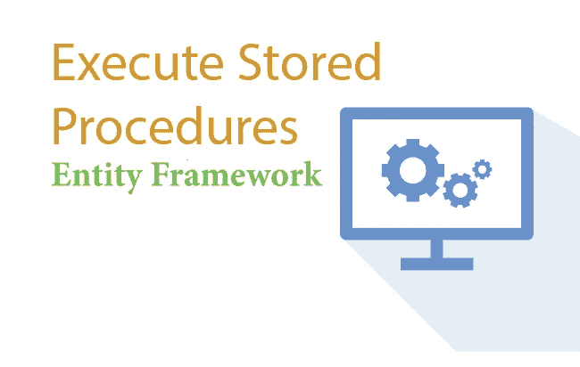
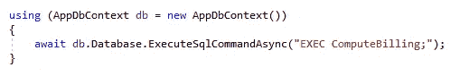
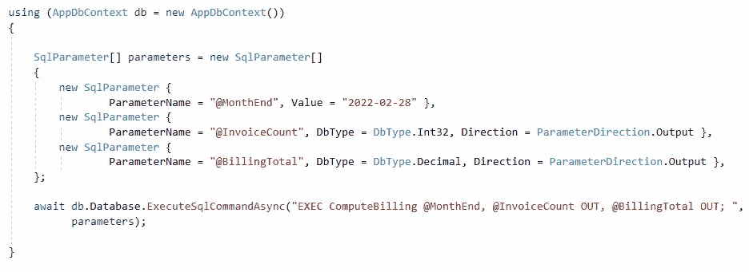
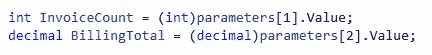

# 通过结合存储过程和实体框架获得 10 倍的性能

> 原文：<https://medium.com/codex/get-10x-performance-by-combining-stored-procedures-entity-framework-8a7af3678e26?source=collection_archive---------3----------------------->

使用实体框架执行存储过程

在实体框架中使用存储过程听起来可能与直觉相反，因为实体框架的全部目的是避免编写 SQL，而存储过程只是一堆 SQL 语句。

存储过程有自己的优势。有些任务只能通过存储过程来完成。

# 复杂和批量操作

让我们假设我们有一个 CRM 软件，允许客户管理销售线索、支持票证、发送电子邮件等。为了给我们的客户开账单，我们每个月都要进行大量的计算。这需要确定创建的销售线索数量、提出的支持请求数量、发送的电子邮件数量等。这必须为每个客户独立完成。显然，这需要对多个数据库表进行大量查询。

# 实体框架和批量操作

如果你试图做一个复杂的操作，就像上面所说的那样，由于显而易见的原因，它将花费大量的时间。由于实体框架代码在您的应用程序中运行，每个查询(读/写)都有网络 IO 开销。应用程序和 SQL server 之间的通信是通过 TCP/IP 协议进行的。一种解决方案是将您的操作分成更小的批次，每次几个客户，然后运行多个这样的批次。

但是，为了处理这种批量操作，建议创建一个存储过程，并将所有逻辑打包在一起。由于存储过程在数据库中运行，因此我们大大减少了网络 IO 开销，从而节省了大量资源。

# 两全其美

让我们继续上面的例子。假设我们的存储过程的名字是`**ComputeBilling**`

下面是使用实体框架执行存储过程的方法:

使用实体框架执行存储过程

现在，我们只是不想执行这个过程，但是在操作完成之后，我们也需要知道摘要。也许我们需要知道向多少客户开了账单，以及总账单金额是多少(所有客户的总和)。

# **SQL 参数**

当您需要向存储过程传递一个值时(例如，**月**，需要对其进行计费)，或者当您希望从存储过程获得一些输出时，您需要传递所谓的 SQL 参数。参数可以有两种类型-输入和输出。输入参数将值传递给存储过程，输出参数从存储过程返回值。继续我们的示例，我们需要传递一个输入参数来指示存储过程运行截止到 2022 年 2 月 28 日的月份的账单，并期望返回两个值——已开账单的客户数量(生成的发票)和总账单金额。下面是如何做到这一点:

执行带参数的存储过程

以下是执行完成后读取值的方法:

读取 SQL 参数值

这样，您就可以结合存储过程的能力来执行实体框架中的复杂任务。您还可以让存储过程像 select 查询一样返回表行，并在 EF 中使用它进行进一步的操作。这可能是另一篇文章的主题:)

你可能也喜欢阅读:
1。[实体框架的最佳实践](/codex/best-practices-with-entity-framework-567ac9d5493a)，以及
2。[快速&实体框架内存高效查询](/codex/fast-and-memory-efficient-querying-in-entity-framework-ebf906d9e6cb)

要阅读我所有的故事，以及媒体上成千上万的其他作家，考虑成为媒体成员[在这里](https://prashantio.medium.com/membership)。