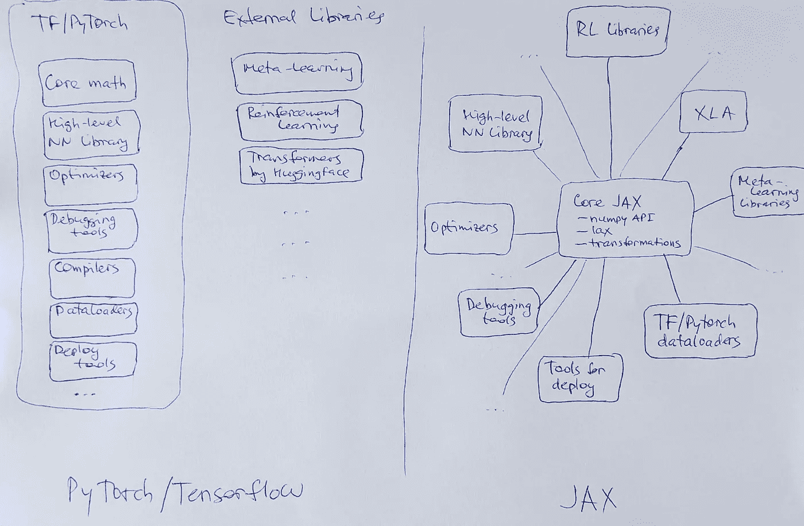

# 和 JAX 一起上船吧

> 原文：<https://medium.com/codex/get-on-board-with-jax-c55733439f99?source=collection_archive---------2----------------------->

## 新书

## *摘自格里戈里·萨普诺夫*的 [*JAX 在行动*](https://www.manning.com/books/jax-in-action?utm_source=medium&utm_medium=referral&utm_campaign=book_sapunov_jax_7_28_22)

**

*照片由 [charlesdeluvio](https://unsplash.com/@charlesdeluvio?utm_source=unsplash&utm_medium=referral&utm_content=creditCopyText) 在 [Unsplash](https://unsplash.com/s/photos/machine-learning?utm_source=unsplash&utm_medium=referral&utm_content=creditCopyText) 上拍摄*

**本节选涵盖:**

*   **什么是 JAX，它与 NumPy 相比如何**
*   **为什么使用 JAX？**
*   **比较 JAX 与 TensorFlow/PyTorch**

*如果您是对 JAX 及其功能感兴趣的 Python 开发人员或机器学习从业者，请阅读本书。*

*将 **fccsapunov** 输入[manning.com](https://www.manning.com/books/jax-in-action?utm_source=medium&utm_medium=referral&utm_campaign=book_sapunov_jax_7_28_22)收银台的折扣代码框，即可享受 [*JAX 活动*](https://www.manning.com/books/jax-in-action?utm_source=medium&utm_medium=referral&utm_campaign=book_sapunov_jax_7_28_22) 七五折优惠。*

*随着越来越多的研究人员将其用于研究，JAX 越来越受欢迎，DeepMind 等大公司也开始为其生态系统做出贡献。*

*在这一节选中，我们将介绍 JAX 及其强大的生态系统。我们将解释什么是 JAX，以及它与 NumPy、PyTorch 和 TensorFlow 的关系。我们将通过 JAX 的优势来了解它们如何协同工作，为您提供一个非常强大的深度学习研究和高性能计算工具。*

## *什么是 JAX？*

*JAX 是一个 Python 数学库，带有由 Google(确切地说是 Google Brain 团队)开发的 NumPy 接口。它大量用于机器学习研究，但不限于此——许多其他事情都可以用 JAX 解决。*

*JAX 的创作者将它描述为亲笔签名和 XLA。如果你不熟悉这些名字，不要害怕；这很正常，尤其是你刚入行的时候。*

*autograded([https://github.com/hips/autograd](https://github.com/hips/autograd))是一个高效计算 NumPy 代码导数的库；它是 JAX 的前身。《亲笔签名》的主要开发者现在正在开发 JAX。简而言之，Autograd 可以让你自动计算计算的梯度，这是深度学习和许多其他领域的本质，包括数值优化，物理模拟，以及更普遍的可微分编程。*

*XLA 是谷歌特定领域的线性代数编译器，称为加速线性代数。它通过线性代数运算将您的 Python 函数编译成高性能代码，以便在 GPU 或 TPU 上运行。*

*让我们从数字部分开始。*

## ***JAX 饰演 NumPy***

*NumPy 是 Python 数值计算的主力。它在工业和科学领域得到了广泛的应用，以至于 NumPy API 成为了在 Python 中使用多维数组的事实上的标准。JAX 提供了一个兼容 NumPy 的 API，但是提供了许多其他的 NumPy 所没有的特性，所以有些人把 JAX 称为“类固醇上的 NumPy”。*

*JAX 提供了一个名为`DeviceArray`的多维数组数据结构，它实现了`numpy.ndarray`的许多典型属性和方法。还有一个`jax.numpy`包，它实现了 NumPy API，具有许多众所周知的功能，如`abs()`、`conv()`、`exp()`等等。*

*JAX 试图尽可能紧密地遵循 NumPy API，在许多情况下，你可以从`numpy`切换到`jax.numpy`而不改变你的程序。*

*仍然有一些限制，并不是所有的 NumPy 代码都可以与 JAX 一起使用。JAX 提倡函数式编程范式，要求没有副作用的纯函数。因此，JAX 数组是不可变的，而 NumPy 程序经常使用就地更新，如`arr[i] += 10`。JAX 提供了一个替代的纯函数式 API，用纯索引更新函数代替就地更新，从而解决了这个问题。对于这种特殊情况，它将是`arr = arr.at[i].add(10)`。还有一些其他的区别，在书中有所阐述。*

*因此，您可以使用 NumPy 的几乎所有功能，并以您在使用 NumPy 时习惯的方式编写程序。但是，JAX 让你做得更多。*

## ***可组合转换***

*JAX 不仅仅是 NumPy。它为 Python+NumPy 代码提供了一组*可组合的函数转换*。在其核心，JAX 是一个可扩展的系统，通过四个主要的转换来转换数值函数(但这并不意味着没有更多的转换即将到来！):*

1.  ***获取代码的梯度**或对其进行微分。这是深度学习和许多其他领域的本质，包括数值优化，物理模拟，以及更普遍的可微分编程。JAX 使用一种叫做*自动微分*(或简称*自动微分*)的方法。自动微分有助于你专注于你的代码，而不是直接处理衍生品；框架会处理它。这通常由`grad()`函数来完成，但也存在其他高级选项。*
2.  ***用`jit()`编译**你的代码，或者即时编译。JIT 使用谷歌的 XLA 为 GPU(通常是通过 CUDA 的 NVIDIA，尽管 AMD ROCm 平台支持正在进行中)和 TPU(谷歌的张量处理单元)编译和生成高效的代码。XLA 是在各种设备上支持机器学习框架的后端，最初是 TensorFlow，包括 CPU、GPU 和 TPU。*
3.  ***用`vmap(),`自动矢量化**您的代码，这是矢量化地图。如果你熟悉函数式编程，你可能知道什么是映射。如果没有，不要担心；我们会在书中详细描述它的含义。`vmap()`处理数组的批量维度，可以轻松地将代码从处理单个数据项转换为一次处理多个数据项(称为批量)。你可以称之为自动批处理。通过这样做，您可以对计算进行矢量化，这通常会显著提升现代硬件的性能，从而有效地并行化矩阵计算。*
4.  ***并行化**您的代码在多个加速器上运行，比如 GPU 或 TPU。这是用`pmap()`完成的，它帮助编写单程序多数据(SPMD)程序。`pmap()`用 XLA 编译一个函数，然后复制它，并在其 XLA 设备上并行执行每个副本。*

## *为什么要用 JAX？*

*JAX 现在势头越来越大。众所周知的《2021 年人工智能状况报告》将 JAX 列为新框架的挑战者。*

*深度学习研究人员和实践者热爱 JAX。越来越多的新研究正在 JAX 身上进行。在最近的研究论文中，我可以提到谷歌的[视觉转换器(ViT)和 MLP 混合器](https://github.com/google-research/vision_transformer)。Deepmind [宣布](https://www.deepmind.com/blog/using-jax-to-accelerate-our-research)他们正在使用 JAX 加速他们的研究，JAX 很容易被采用，因为 Python 和 NumPy 都被广泛使用和熟悉。它的可组合功能转换有助于支持机器学习研究，JAX 已经实现了对新算法和架构的快速实验，现在它支撑着 DeepMind 的许多最新出版物。其中，我要强调一种自我监督学习的新方法，称为 [BYOL](https://www.deepmind.com/publications/bootstrap-your-own-latent-a-new-approach-to-self-supervised-learning) (“引导你自己的潜能”)，一种基于通用变压器的结构化输入和输出架构，称为[感知者 IO](https://www.deepmind.com/blog/building-architectures-that-can-handle-the-worlds-data) ，以及对具有 2800 亿参数[地鼠](https://www.deepmind.com/blog/language-modelling-at-scale-gopher-ethical-considerations-and-retrieval)和 700 亿参数[龙猫](https://www.deepmind.com/publications/an-empirical-analysis-of-compute-optimal-large-language-model-training)的大型语言模型的研究。*

*2021 年中期，Huggingface 使 JAX/亚麻成为他们著名的变形金刚库中第三个官方支持的框架。截至 2022 年 4 月，预训练模型的 Huggingface 集合的 JAX 模型(5530 个)已经是 TensorFlow 模型(2221 个)的两倍。PyTorch 仍然以 24467 个模型领先于这两者，并且将模型从 PyTorch 移植到 JAX/弗莱克斯是一项正在进行的工作。*

*其中一个开源的大型类似 GPT 的模型，由 EleutherAI 称为 GPT-J-6B，60 亿参数转换器语言模型，在谷歌云上与 JAX 一起训练。作者表示，这是快速开发大规模模型的正确工具。*

*JAX 现在可能不太适合生产部署，因为它主要专注于研究方面，但这正是 PyTorch 所走的路。研究和生产之间的差距很可能很快就会缩小。拥抱脸和 GPT-J-6B 的案例已经朝着正确的方向发展。鉴于谷歌的影响力和社区的快速扩张，我预计 JAX 会有一个光明的未来。*

*JAX 并不局限于深度学习。JAX 上有许多令人兴奋的应用程序和物理库，包括分子动力学、流体动力学、刚体模拟、量子计算、天体物理学、海洋建模等等。有用于分布式矩阵分解、流数据处理、蛋白质折叠和化学建模的库，其他新的应用程序也在不断出现。*

## *JAX 与 TensorFlow/PyTorch 有何不同？*

*我们已经讨论了 JAX 和 NumPy 的比较。让我们将 JAX 与另外两个领先的现代深度学习框架进行比较:PyTorch 和 TensorFlow。*

*我们提到，与 PyTorch 和 TensorFlow 常见的面向对象方法相比，JAX 提倡函数方法。当你开始用 JAX 编程时，这是你面临的第一件非常实际的事情。它改变了你构建代码的方式，并且需要改变一些习惯。同时，它给你强大的函数转换，迫使你写干净的代码，并带来丰富的可组合性。*

*你很快就会注意到的另一件切实的事情是，JAX 非常简约。它并没有实现所有的东西。TensorFlow 和 PyTorch 是两个最受欢迎和发展良好的深度学习框架，它们标配了所有的花哨功能。与他们相比，JAX 是一个非常简约的框架，以至于很难称之为框架。这更像是一个图书馆。*

*例如，JAX 没有提供任何数据加载器，因为其他库(例如 PyTorch 或 Tensorflow)做得很好。JAX 的作者不想重新实现一切；他们想专注于核心。这正是你可以并且应该混合 JAX 和其他深度学习框架的情况。从 PyTorch 获取数据加载材料并使用它是可以的。PyTorch 有优秀的数据加载器，所以让每个库发挥自己的优势。如果别人已经做了一个好轮子，就没有必要重新发明轮子。*

*另一个值得注意的事情是，JAX 原语非常低级，根据矩阵乘法编写大型神经网络可能非常耗时。因此，您需要一种更高级的语言来指定这样的模型。JAX 不提供这种现成的高级 API(类似于 TensorFlow 2 中添加高级 Keras API 之前的 TensorFlow 1)。没有包括这样的特性，但是这不是问题，因为 JAX 生态系统也有高级的库。*

*你不需要用类似 NumPy 的原语来编写你的神经网络。有优秀的神经网络库，如 Google 的 Flax 和 DeepMind 的 Haiku，还有 Optax 库，它收集了最先进的优化器。还有更多！*

*图 1 显示了 PyTorch/TensorFlow 和 JAX 之间的差异。*

**

*图一。JAX 与 PyTorch/TensorFlow 的比较*

*因为 JAX 是一个用于可组合函数转换的可扩展系统，所以很容易为所有东西构建单独的模块，并根据您的需要进行混合和匹配。*

## *你将从这本书中学到什么*

*简而言之，这本书将教你如何利用 JAX 进行机器和深度学习。您将了解如何使用 JAX 的高级库和模块生态系统，以及如何将 TensorFlow 和 PyTorch 与 JAX 结合起来进行数据加载和部署。*

## ***这本书是给谁的？***

*本书面向熟悉深度学习和/或机器学习的中级 Python 程序员。然而，任何对 JAX 感兴趣的人都会发现这本书引人入胜，内容丰富。*

*如果你想了解这本书的更多内容，请点击这里查看。*