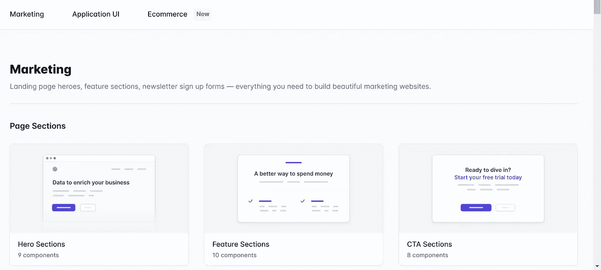
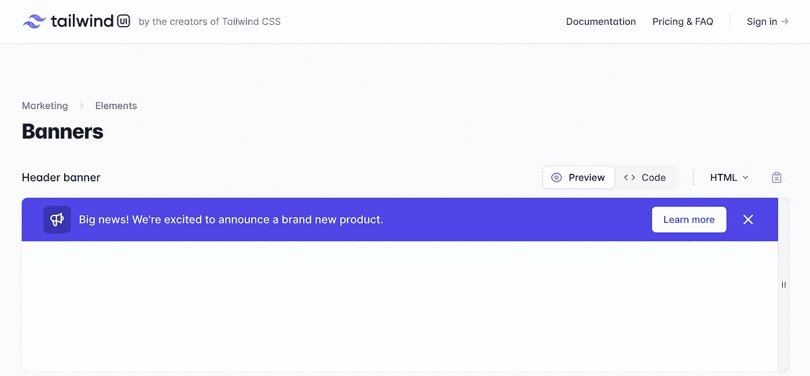
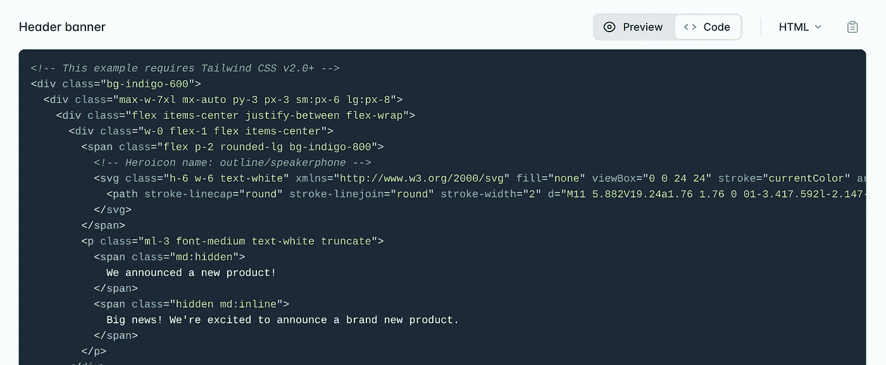

# 摆脱手动造型！使用顺风 CSS

> 原文：<https://medium.com/codex/get-rid-of-manual-styling-use-tailwind-css-c2326bf35570?source=collection_archive---------18----------------------->


照片由[布兰科·斯坦切维奇](https://unsplash.com/@landb?utm_source=medium&utm_medium=referral)在 [Unsplash](https://unsplash.com?utm_source=medium&utm_medium=referral) 拍摄

一个网站只是没有样式的纯文本。我们在设计网站时面临的所有障碍就是它的风格。CSS3 是最新的用于网页设计的层叠式样式表，但是今天我将与你分享一个菱形，它将处理你所有的设计任务。

**Tailwind CSS** 是一个实用至上的 CSS 框架，它包含了像`**flex**`、`**pt-4**`、`**text-center**`和`**rotate-90**`这样的类，可以直接在你的标记中构建任何设计。在本教程中，我将指导你如何使用这个工具，并节省你的宝贵时间。

首先通过 [**点击**](https://tailwindcss.com/) **进入顺风 CSS 网站。该网站提供了一个软件包，可以直接在你的系统中安装 Tailwind CSS，这样你就可以打开你的控制台并执行下面的命令**

```
npm install tailwindcss
```

如果您的系统上目前没有安装 NPM，请先安装它。有很多你可以自己发现的功能，但我只是在本教程中介绍了最重要的一个，即网页的组件。不同的组件组成一个网页，例如:

*   **导航条**
*   **表头**
*   **内容框**
*   **边框**
*   **按钮**
*   **滑块等**

现在让我们看看如何使用 **Tailwind CSS 来完成这一切。我们开始吧。**

点击 进入顺风界面 [**。将出现一个类似下图的页面。**](https://tailwindui.com/)


顺风 UI 截图

向下滚动，不同组件的部分将如下图所示。



顺风 UI 截图

选择您想要的组件，我将在本教程中选择**横幅**。



顺风 UI 截图

有 4 个不同的横幅可用，你可以选择其中任何一个。在横幅的右上方，有一个**预览**和**代码**的选项。预览当前已选中，您可以看到它正在显示您的横幅的预览，这是您的横幅的外观。预览选项旁边有一个代码选项。选择代码选项将显示用于构建该横幅的所有代码。更多细节请看下图。



顺风 UI 截图

您可以根据自己的需要定制此代码，然后只需通过单击右上角的记事本图标复制此代码，并将其粘贴到您的代码编辑器中，将会显示相同的定制输出。

**怎么样？？很容易吗？？**你只需对所有组件做同样的事情，你的网页就能在几分钟内完成。

现在让我们来谈谈这个工具的一些优点，因为它是你的网页设计伙伴。

# **优势-1**

第一个最大的好处就是节省你的宝贵时间。你不必键入所有的代码，只需复制并粘贴这些代码。

# 优势-2

复制和粘贴减少了出错的机会。虽然在 CSS 中，通过犯错误你可以学到新的东西。这也会给你的工作造成延误，尤其是当你为别人工作的时候。使用 Tailwind CSS，你得到错误输出的机会将会最小化。

# **优势-3**

Tailwind CSS 不仅为你提供 HTML 和 CSS 代码，还为你的 **React 应用**提供现成的代码。Tailwind CSS 提供了三种格式的代码，分别是 **HTML、React 和 Vue** 。所以，无论你是设计网站还是制作 React 应用，这个工具都会是你最好的伴侣。

# **优势-4**

Tailwind CSS 为你提供了同一个组件的不同风格。同一个组件至少有四到五种不同的样式。对于**头**，你会发现四到五种不同的头可以免费使用。此外，您可以使用这些预定义的样式创建自己的样式。

# **优势-5**

Tailwind CSS 提供了一个游戏场，让你可以玩不同风格的不同组件。这个游乐场是一个在线编辑器，你可以在这里创建自己的风格，就像你的代码编辑器一样，你可以在其中进行日常编码。 [**想用**顺风游乐场**就点这里**](https://play.tailwindcss.com/) 。

**在我看来，** Tailwind CSS 是**前端开发者**的瑰宝。这与 **bootstrap** 非常相似，但是它有更多的特性，并且比 bootstrap 容易得多。每个网页开发者和网页设计师都必须使用这个工具。虽然 Tailwind CSS 提供了一切，但这并不意味着一个人不应该自己编码。这个工具是开发者的助手，但不是网页设计的新手。在使用这个工具之前，他们应该先学习编码。

**顺风 CSS 真的省时吗？CSS 的未来会怎样？Bootstrap 比 Tailwind CSS 好吗？**

别忘了回答以上问题，并在下面的评论区给出你的个人观点。

点击此处 ，在 Twitter 上关注我

点击此处 ，在 Instagram 上关注我

请在 **Medium** 上跟随我并订阅 **CodeX** 以便我们每次发布新内容时您都能收到电子邮件通知。

保持快乐，保持安全。再见！