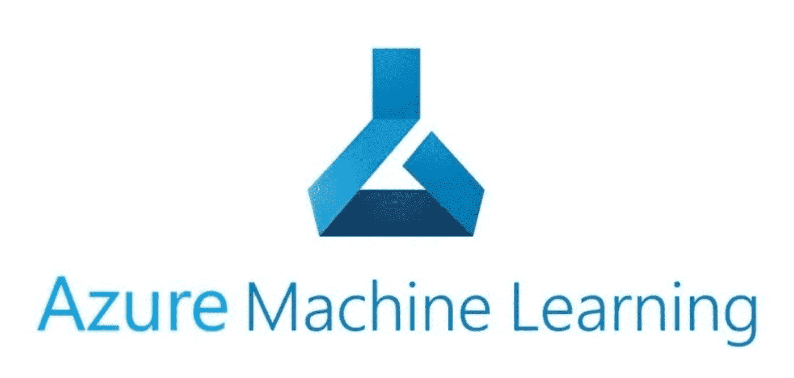

# Azure 机器学习入门

> 原文：<https://medium.com/codex/get-start-azure-machine-learning-e8235f8ed03e?source=collection_archive---------6----------------------->

## Python 包 Azure 机器学习的安装步骤

Azure 机器学习

[Azure 机器学习(AML)](https://azure.microsoft.com/en-us/services/machine-learning/) 提供了一种强大而便捷的方式来构建、部署和运行您的 ML 应用程序。AML 允许您在 Scikit-Learn、PyTorch 或任何其他 ML 框架的基础上构建代码。这很好。