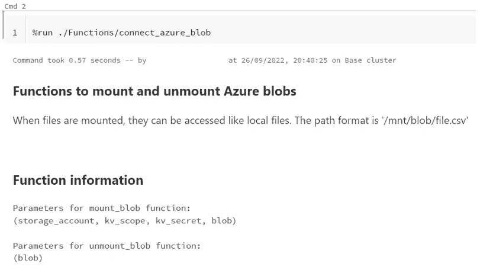

# 从 Databricks 中的 Azure Blobs 开始

> 原文：<https://medium.com/codex/get-started-with-azure-blobs-in-databricks-a6c965b7af4d?source=collection_archive---------9----------------------->

## 以天蓝色拱顶和火花熊猫为特色


数据块中的蓝色斑点

本教程将介绍如何在 Databricks 中使用 Spark Pandas 从 Azure blobs 中读取和写入数据。blob 连接是通过 Azure Key Vault 访问的。

这是关于数据块系列的第 3 部分:

1.  [从数据砖块中的熊猫开始](https://selectfrom.dev/get-started-with-pandas-in-databricks-70b184be0ad3)
2.  [开始使用 Databricks 中的 Azure SQL](/codex/get-started-with-azure-sql-in-databricks-9bfa8d590c64)
3.  从 Databricks 中的 Azure Blobs 开始

# 先决条件

1.  通过 [Azure](https://docs.microsoft.com/en-us/azure/databricks/scenarios/quickstart-create-databricks-workspace-portal?tabs=azure-portal) 的数据块实例
2.  一个 [Azure 存储帐户](https://learn.microsoft.com/en-us/azure/storage/common/storage-account-create?tabs=azure-portal)
3.  熟悉 Databrick 的基本功能
4.  对蟒蛇熊猫有些熟悉

# 我们的演示案例

作为示例数据，我们有一个保存课程评估的 CSV 文件。将这个文件上传到 Azure blob 后，我们用每个学生的平均评价来丰富数据，然后将结果写回另一个 Azure blob。你会在 Github 这里找到文件[(双击**另存为)**。](https://raw.githubusercontent.com/chpatola/databricks_tutorials/main/data/course_feedback.csv)

为了保护对 blob 的访问，我们将通过一个密钥库来访问它。我们还将遵循 [DRY 原则](https://deviq.com/principles/dont-repeat-yourself)，创建一个可重复使用的连接函数，供我们的 Databricks 笔记本使用。

# Blob 设置

我们为原始数据创建一个 blob，为转换后的输出数据创建一个 blob。然后，我们将 *course_feedback* CSV 文件(参见上面的演示案例)上传到原始数据 blob。


Blob 设置

# 密钥库设置

密钥库是一个“凭据存储库”，用户可以在其中安全地保存和访问凭据。我们应该始终避免在代码或相关文件中写出凭证，因为它们很容易从那里泄露或者意外地出现在版本控制系统中。

## 在 Azure 中创建密钥库

要在 Azure 中创建密钥库，请在门户顶部的资源搜索窗口中搜索“密钥库”。

创建密钥库(默认设置)后，转到左窗格中的**机密**。从那里，点击**生成/导入。**为字段**名称**和**秘密值设置一个值。**


创造一个秘密

*   **Name**—因为我们将存储帐户密钥作为我们的秘密值，所以我们相应地命名它
*   **秘密值—** 点击您的存储账户，进入**访问密钥**，您将找到存储账户访问密钥。您可以使用 key1 或 key2。点击**显示**查看密钥并复制。


存储帐户访问密钥

## 数据块中的秘密范围设置

建立密钥库之后，我们需要创建一个 Databricks secret 作用域。


设置数据块秘密范围

*   当您位于 Databricks 实例的起始页时，将 **secrets/createScope** 添加到 URL 的末尾
*   在该页面上，您被引导在**作用域名称**字段中给出您的 Azure 密钥库的名称
*   将**管理主体**下拉菜单设置为*所有用户。*这意味着所有的用户都被允许读写这个秘密范围。你可以在这里找到更多关于这些设置的信息
*   在 **DNS 字段**中，插入您在密钥库的**属性**下找到的库 URI


*   将**资源 ID** 设置为您在密钥库的**属性**下找到的资源 ID

密钥存储库设置现已完成，可以从数据块中访问存储帐户密钥。

# 从数据块访问存储帐户 Blobs

我们将通过使用 WASB 驱动程序将 blobs 挂载到一个文件夹结构来访问它们。这样，我们可以像访问本地文件一样访问 CSV 文件。

我们将创建可重用的安装和卸载函数，并将其保存在单独的 Databricks 笔记本中。我们的 Databricks 实例中的任何笔记本都可以调用这些函数。函数调用是通过从调用笔记本中运行函数笔记本来完成的。在此之后，来自另一个笔记本的所有数据(函数、变量、常数……)对于调用笔记本都是可用的。

你可以在下面的 GitHub([*connect _ azure _ blob*](https://github.com/chpatola/databricks_tutorials/blob/main/Notebooks/connect_azure_blob.html)&*course _ feedback _ blob*)上找到我们演示的全部代码。

## **安装斑点**

我们首先检查 blob 是否已经挂载。如果没有，我们继续连接属性，通过我们的密钥库中的秘密访问。如果安装不成功，我们会以一条错误消息结束。

```
def mount_blob(storage_account,kv_scope, kv_secret, blob):
    if not any(mount.mountPoint == '/mnt/'+blob+'/' 
               for mount in dbutils.fs.mounts()):
        try:
            dbutils.fs.mount(
                source = wasbs://'+blob+'@'+storage_account
                +'.blob.core.windows.net',
                mount_point = '/mnt/'+blob,
                extra_configs = {'fs.azure.account.key.'
                                 +storage_account+
                                 '.blob.core.windows.net':
                                 dbutils.secrets.get(scope=kv_scope,
                                                     key=kv_secret)
                                }
            )
        except Exception as e:
            print('Could not mount. Possible already mounted')
```

## 卸载 Blob

当我们完成并且不再需要 blob 连接时，卸载它被认为是一个好的做法。为了处理一种可能的情况，即 blob 已经被卸载，我们包含了一个检查。

```
def unmount_blob(blob):
    if any(mount.mountPoint == '/mnt/'+blob
           for mount in dbutils.fs.mounts()):
        dbutils.fs.unmount('/mnt/'+blob)
    else:
        print(blob + ' is already unmounted')
```

## 完成笔记本的安装

为了使安装笔记本的使用更简单，我们添加了一些关于它的功能的信息。静态信息可以写入降价(%md)单元格。当笔记本运行时，这些信息将被打印出来。当笔记本准备好时，我们在共享工作区下创建一个 *Functions* 文件夹，并保存在那里。我把笔记本命名为 *connect_azure_blob。*

```
import inspect #Needed to get a list of parameters for functionsprint("Parameters for mount_blob function:")
print(inspect.signature(mount_blob))print("\nParameters for unmount_blob function:")
print(inspect.signature(unmount_blob))
```

## 争吵笔记本

在创建了我们的新笔记本——我将其命名为*course _ feedback _ blob*——并将其保存在共享工作区中，与 *Functions* 文件夹在同一层，我们继续导入 Spark Pandas 并使用 **%run** 命令运行 *connect_azure_blob* 笔记本。

```
import pyspar.pandas as ps%run ./Functions/connect_azure_blob
```

笔记本运行时，会显示笔记本信息。



通话记录中显示的功能信息

**访问 Blob 数据**

现在，我们挂载了 *rawdata-courses* blob 和 t*transformed data-courses*blob。如果您经常从同一个存储帐户进行读取和写入，那么最好在函数定义中给出前三个参数的默认值。 **read_csv** 现在将读取 csv 文件并将其保存为 pandas 数据帧，就像它是一个本地文件一样。我们只需要记住路径必须以 */mnt/name_of_our_blob* 开头。

```
#Mount rawdata-courses blob
mount_blob(storage_account="chpatoladatabricks",
           kv_scope="chpatoladatabricks",
           kv_secret="chpatoladatabricks-storage-account-key",
           blob="rawdata-courses")#Mount transformeddata-courses blob
mount_blob(storage_account="chpatoladatabricks",
           kv_scope="chpatoladatabricks",
           kv_secret="chpatoladatabricks-storage-account-key",
           blob="transformeddata-courses") #Read in and inspect raw data from theblob
course_feedback = ps.read_csv(
    '/mnt/rawdata-courses/course_feedback.csv')
course_feedback.info()
```

**扯皮**

我们将做的唯一修改是计算每个课程反馈行的总分。

```
# Transform and inspect data
ps.set_option('compute.ops_on_diff_frames', True)³
course_feedback['Overall'] = course_feedback.iloc[:, 4:7].mean(axis=1).round(2)
course_feedback.head(5)
```

**将输出写入 Blob**

转换后的数据帧现在准备写入到*transformed data-courses*blob 中。为了确保它安全到达，我们可以读一遍并检查它。

```
#Save transformed data to blob
path = '/mnt/transformeddata-courses/course_feedback_overall.csv'
course_feedback.to_csv(path,index=False)
course_feedback_overall = ps.read_csv(path)
course_feedback_overall.head(5)
```

最后一步是卸载已使用的 blobs。

```
unmount_blob("rawdata-courses")
unmount_blob("transformeddata-courses")
```

# 状态

我们现在已经成功地建立了一个密钥库，将其连接到数据块，创建了一个具有装载和卸载 Azure blobs 功能的笔记本，并最终在笔记本中使用它们，我们从一个 blob 中读取数据，与 Spark Pandas 争论并将其写入另一个 blob。

[1]:众所周知的熊猫功能，但在 Spark 上——你可以在这里阅读更多信息[。](https://spark.apache.org/docs/latest/api/python/user_guide/pandas_on_spark/index.html)

[2]:还有其他方法连接到 Azure blob，例如，[这里的](https://learn.microsoft.com/en-us/azure/storage/blobs/data-lake-storage-abfs-driver)是关于 ABFS 驱动的信息。

[3]:为了能够在 spark python 数据帧中创建新列，需要此设置。您可以在本笔记本中找到更多信息和示例。