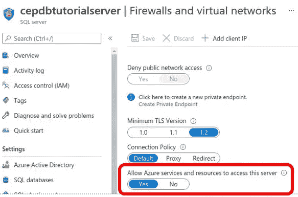
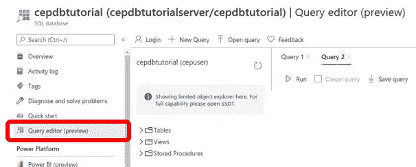
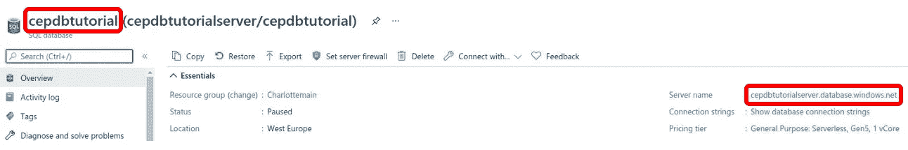
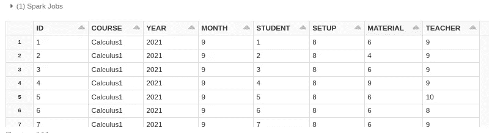
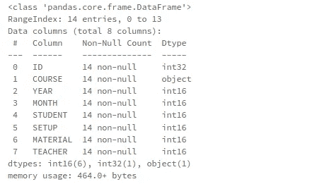
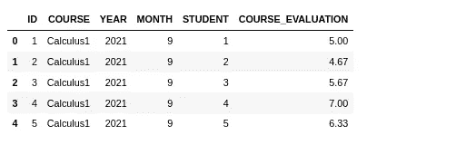
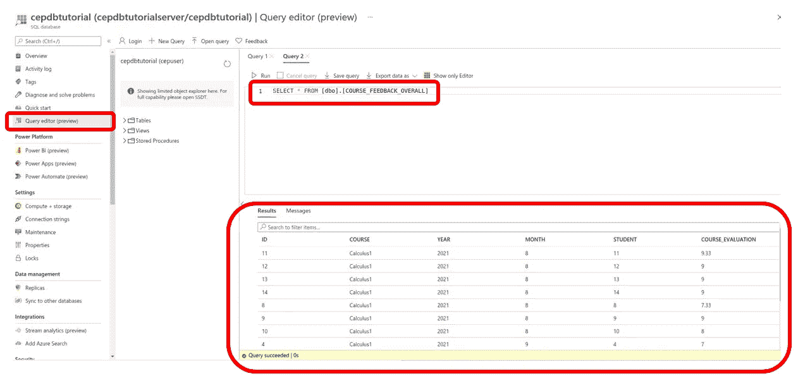
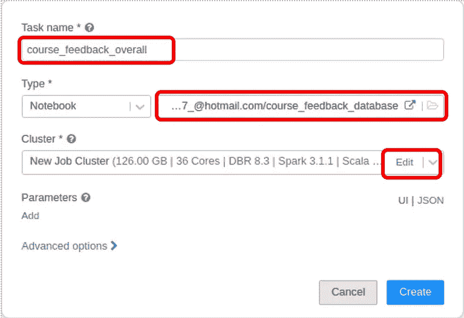
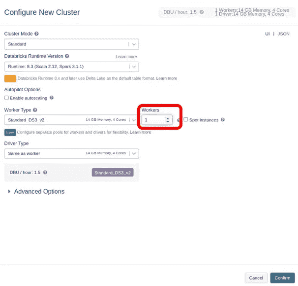
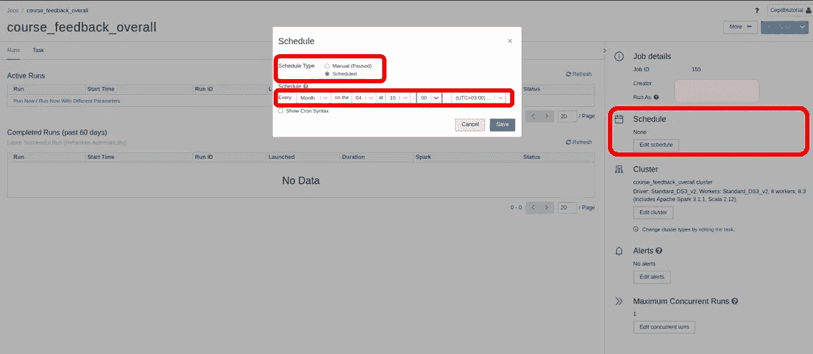

# Databricks 中的 Azure SQL 入门

> 原文：<https://medium.com/codex/get-started-with-azure-sql-in-databricks-9bfa8d590c64?source=collection_archive---------2----------------------->

## -以熊猫为特色

本教程将介绍如何在 Databricks 中使用 pandas 从 Azure SQL 数据库中读取和写入数据。如果你想学习数据砖块的基础知识，你可以看看[这篇文章](https://chpatola.medium.com/get-started-with-pandas-in-databricks-70b184be0ad3)。

**这是关于数据砖块系列的第 2 部分:**

1.  [从数据砖块中的熊猫开始](https://selectfrom.dev/get-started-with-pandas-in-databricks-70b184be0ad3)
2.  Databricks 中的 Azure SQL 入门
3.  [从数据块中的 Azure Blobs 开始](/codex/get-started-with-azure-blobs-in-databricks-a6c965b7af4d)

# 先决条件

1.  对蟒蛇熊猫有些熟悉
2.  Databricks 的一个实例——最好通过 [Azure](https://docs.microsoft.com/en-us/azure/databricks/scenarios/quickstart-create-databricks-workspace-portal?tabs=azure-portal)
3.  一个 [Azure SQL 数据库实例。](https://docs.microsoft.com/en-us/azure/azure-sql/database/single-database-create-quickstart?tabs=azure-portal)确保连接设置允许从数据块访问。如果你在 Azure 上有 Databricks 实例，你可以将“*允许 Azure 服务和资源访问此服务器*”(见下图)设置为 yes。确保使用强密码/访问方式，因为数据库现在对外界是可访问的。如果你想要更强的安全等级，你可以看一下[本指南](https://databricks.com/blog/2020/02/28/securely-accessing-azure-data-sources-from-azure-databricks.html)。



Azure SQL 访问设置

# 我们的演示案例

作为演示数据，我们有一个保存课程评估的 sql 文件。你可以在 Github 上找到文件[。我们将把这些数据插入我们的 Azure SQL 服务器，在 Databricks 中连接到它，用 pandas 转换它，并把它作为一个新表写回到 Azure SQL 中。该过程完成后，我们将安排它每月运行一次。](https://raw.githubusercontent.com/chpatola/databricks_tutorials/main/data/course_feedback_setup.sql)

# 设置和准备

为了进入正题，我们需要一个启动并运行的集群和一个空的 python 笔记本。如果你不知道如何设置，看看这篇文章中的[步骤 1 和步骤 3。](https://chpatola.medium.com/get-started-with-pandas-in-databricks-70b184be0ad3)

您还需要在 Azure SQL 中创建一个表，并用我们的示例数据填充它。通过(例如)进入 Azure 门户中的查询编辑器并在查询编辑器窗格中输入 [this query](https://raw.githubusercontent.com/chpatola/databricks_tutorials/main/data/course_feedback_setup.sql) 来实现这一点。



Azure SQL 中的查询编辑器

我们将使用 jdbc/PySpark 连接到数据库，然后将数据保存到 pandas dataframe 中。在这之后，我们对熊猫进行改造。这是可能的，因为我们目前正在处理一个小数据集。如果需要处理大数据，可以用 [PySpark](http://spark.apache.org/docs/latest/api/python/getting_started/quickstart.html) 或者 [PySpark 熊猫](https://databricks.com/blog/2021/10/04/pandas-api-on-upcoming-apache-spark-3-2.html)代替。

为了使连接工作，您需要数据库名称、服务器名称以及您的用户名和密码(在下面的代码中标记在<>符号内)。当您在 Azure 中访问数据库时，您会在概览页面上看到数据库名称和服务器名称。



Azure SQL 连接信息

不在笔记本上写用户名和密码是一个好习惯。在本教程中，我们破例这样做，但对于生产数据库，您应该使用一个密钥库或类似的。密钥库允许您为敏感信息提供别名，然后您可以在笔记本中引用该别名，例如:*dbutils . secrets . get(scope = " azurekeyvault _ secret _ scope "，key = "sqldbpwd ")。* [这里的](https://docs.microsoft.com/en-us/azure/key-vault/secrets/quick-create-portal)是关于如何在 Azure 上建立密钥库的信息，这里的[是关于如何将其连接到 Databricks 的信息。完成此操作后，您可以从笔记本中访问密钥库的秘密。](https://docs.microsoft.com/en-us/azure/databricks/security/secrets/secret-scopes)

你可以在下面的 GitHub(course _ feedback _ database)上找到我们演示的全部代码。

# 提取

我们从导入所需的库和创建 sparksession 开始。

```
import pandas as pd
from pyspark.sql import SparkSessionspark = SparkSession.builder.appName( "pandas to spark").getOrCreate()
```

然后，我们用数据库信息配置 jdbc 连接。输入变量用**粗体**标记。

```
jdbcHostname = "**<database_server_name>**.database.windows.net"jdbcDatabase = "**<database_name>**"jdbcPort = 1433jdbcUrl = "jdbc:sqlserver://{0}:{1};database={2}".format(jdbcHostname, jdbcPort, jdbcDatabase)connectionProperties = {"user" : "**<database_username_or_keyvault_alias>**","password" : "**<database_password_or_keyvault_alias>**","driver" : "com.microsoft.sqlserver.jdbc.SQLServerDriver"}
```

我们现在可以提取数据并检查它。注意，我们需要定义我们想要从中提取的表，这里是 *COURSE_FEEDBACK* 。

```
Spdf = spark.read.jdbc(url=jdbcUrl, table="COURSE_FEEDBACK", properties=connectionProperties)display(Spdf)
```



提取的火花数据帧

# 转换

为了在 pandas 中进行转换，我们需要将 Spark 数据帧转换成 pandas 数据帧。

```
course_feedback = Spdf.toPandas()
course_feedback.info()
```



提取的熊猫数据帧

我们通过添加具有反馈列*设置*、*材料*和*教师*的行方式平均值的新列来转换数据帧。这等于每个学生给这门课的总分数。

```
#Create Overall columncourse_feedback['COURSE_EVALUATION'] = course_feedback.iloc[:, 4:7].mean(axis=1).round(2)#Drop not needed columnscourse_feedback.drop(['SETUP','MATERIAL','TEACHER'], inplace= True, axis=1)#Inspectcourse_feedback.head(5)
```



转变的熊猫数据框架

# 负荷

为了将新的数据帧加载回 Azure SQL，我们需要再次将其转换为 Spark 数据帧。

```
Spdf_overall=spark.createDataFrame(course_feedback)
```

现在我们可以将它作为一个新表写入数据库。请注意，我们将模式定义为覆盖。这意味着每次代码运行时，表不会用新行更新，但整个表将被替换。你可以在这里找到更多模式选择。

```
Spdf_overall.write.jdbc(url=jdbcUrl, table="COURSE_FEEDBACK_OVERALL", mode = "overwrite",properties=connectionProperties)
```

# 确认

我们可以确认新表是由(例如)使用 Azure 门户中的查询编辑器创建的。



检查 Azure SQL 中的新表

# 日程安排

当我们确认代码如预期的那样工作时，就该安排它了。在我们的演示案例中，每个月都会有新的课程评估，每个月的评估在下个月的第一天结束。我们将安排代码在每个月的这几天之后运行。

在 Databricks 的左侧菜单中选择**作业**，然后选择**创建作业。**会弹出下面的窗口。填写**任务名称**，选择**笔记本**。我们将为计划运行使用一个新的作业集群，因此我们继续在**集群**/编辑下指定它。



计划作业，1

您可以按照自己的方式配置集群，但是对于这个小演示任务，我们只需要一个工作人员。



计划作业，2

设置好集群后，点击右边菜单中的**编辑时间表**，在弹出的窗口中填写首选时间表。如果您愿意，还可以在代码运行失败时创建电子邮件提醒。这是在右侧菜单中的**编辑警报**下完成的。



计划作业，3

# 状态

我们现在已经连接到一个 Azure SQL 数据库，用 PySpark 提取数据，用 pandas 转换数据，然后用 PySpark 加载回数据库。我们还计划每月调整一次代码。