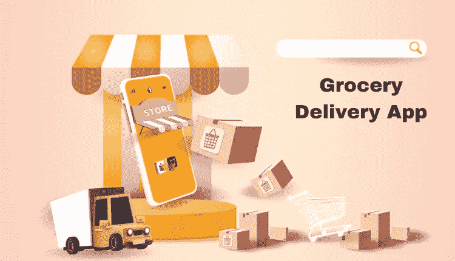
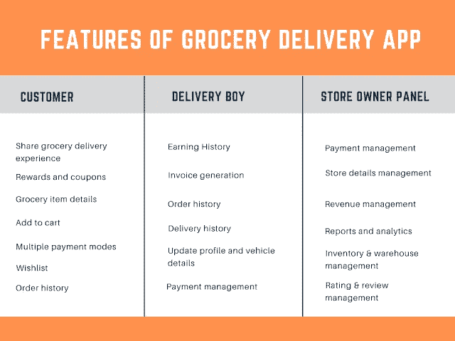

# 让杂货应用克隆应用优势成为你的超市优势

> 原文：<https://medium.com/codex/get-the-grocery-app-clone-app-edge-to-your-supermarket-advantage-624ee111d97e?source=collection_archive---------12----------------------->

在新冠肺炎疫情的黎明，如果有一个行业见证了其业务的戏剧性转变，这是食品杂货业，毫无疑问！随着疫情接近尾声，这种变化开始以更大的比例发生。此后就没有回头路了。

对我们正在谈论的东西感到困惑？不要！我们正在谈论杂货交付应用程序。这款应用让顾客递送家居用品变得异常简单。

通过极其简单的操作，该解决方案将客户与杂货店联系起来，因此他们可以订购商品，并在此后完成交付。它还极大地帮助了商店，让更多的用户了解他们，他们的产品，有吸引力的折扣等等，同时也自动化了他们的操作。

这随即推动了该解决方案的普及，尤其是在那些计划数字化其超市运营的企业中，从而导致他们集成现成的杂货交付应用程序。

## 关于现成的杂货交付应用程序

现成的杂货交付应用程序是一个现成的解决方案，它是为离线经营的杂货店创建的，以便他们可以快速获得业务可见性。由于其可修改的性质，杂货经营可以根据未来的业务和客户需求进行修改。

## 如何进行杂货配送 App 开发？

当你带着[现成的杂货应用克隆](https://www.groceryappclone.com/)开始杂货交付应用开发服务之旅时，请记住这些要点，以实现最大价值。

> ***第一步:研究——持之以恒***

进行研究。这样做的时候要始终如一。这意味着你需要了解你的竞争对手以及他们在做什么。接下来，尽可能仔细地研究客户需求。

这是一个好主意，你问自己这些问题，这样你就可以构思一个独特的应用程序设计。

*   我的竞争对手的 USP 是什么？
*   他们的做法有什么不同？
*   解决方案有什么不同吗，有什么遗漏吗？是/否
*   如果没有，实现对我有用吗？
*   集成会让客户受益吗？是/否
*   我的客户需要什么？这种集成对他们公平吗？

一旦你以简洁的方式回答了所有这些问题，你就可以构思一个应用程序设计策略了。

> ***第二步:选择合适的 App 设计***

接下来构思一个应用程序设计策略是个好主意。研究你的竞争对手，评估他们实施的设计策略。

检查其用户友好性。此后，尝试分析它与您开发的应用程序的相关性。这将有助于为你创造价值。这将促进用户参与，并确保更多的客户保留在解决方案中。

> ***第三步:保持关联***

选择允许杂货交付服务从应用程序无缝进行的功能。因此，分别在客户、杂货店和送货司机的应用程序中包含独特的成分。

> ***第四步:选择合适的业务&收入模式***

这与下一步用完美的业务和收入模式来增强自己的能力是相关的。让我们首先用商业模式来启发自己。

***商业模式**

*   库存模型，其中商店收集订单，然后通过内部或外部专业送货人员供应链完成送货
*   多供应商市场模式，客户通过应用程序下订单。此后，交货被处理和完成。

> ***第五步:购买现成杂货配送 App 克隆***

最后，这是一个好主意，你得到现成的杂货交付应用程序。换句话说，买一个现成的杂货店送货应用克隆。

要做到这一点，将服务外包给离岸的[杂货交付应用开发公司](https://www.groceryappclone.com/blog/know-reasons-to-connect-grocery-app-development-company/)，并评估他们开发的杂货交付应用源代码。

除了以下这些步骤:
·检查投资组合
·评估客户评论

一旦你在做了这两件事之后对组织有能力处理你的项目有了全面的了解，就和他们联系起来。分享你的应用理念和需求。检查他们对相同内容的理解。此后，开始您的应用程序开发之旅，并开始获得有竞争力的收入。

# 包扎

全球在线杂货市场规模目前为 3542.8 亿美元，预计 2030 年的收入约为 21585.3 亿美元。预计 2022 年至 2030 年间，CAGR 的增长率为 25.3%。因此，总的来说，这是一个有利可图和有利可图的提议，让您的传统杂货业务拥有一个可以控制成本的解决方案。换句话说，用现成的杂货应用程序克隆来增强自己的能力。与一家离岸杂货交付应用开发公司联系，以简化这一旅程并获得有利可图的回报。不言而喻，就目前而言，您的投资回报率将随着该解决方案的推出而大幅提升。那么，你还在等什么？让杂货应用程序成为你的优势，开始吸引更多的客户，并从一开始就获得更多的利润！