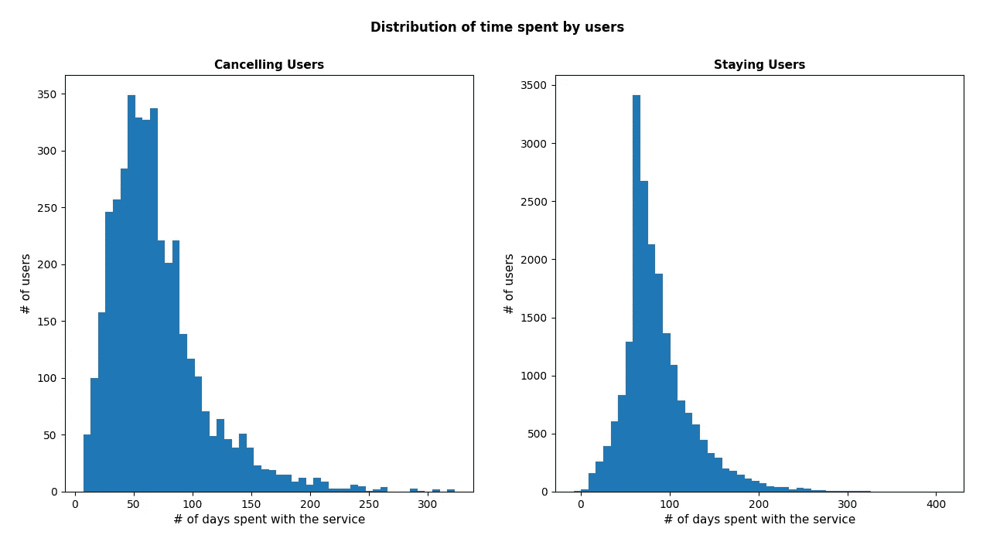
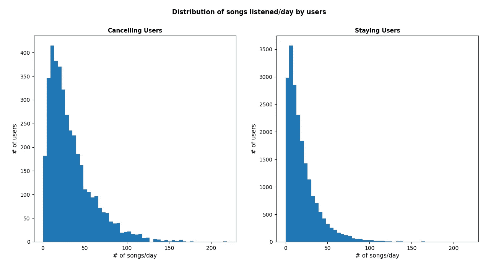
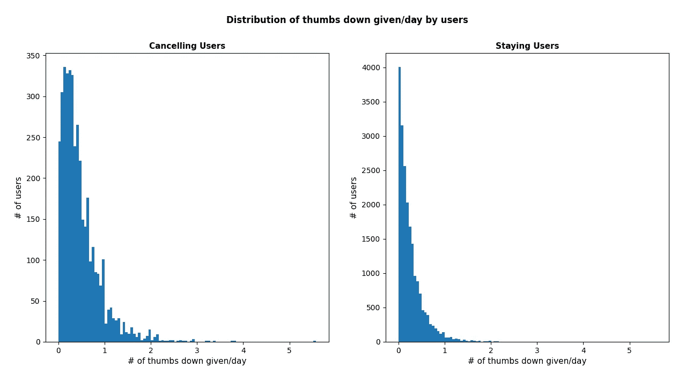
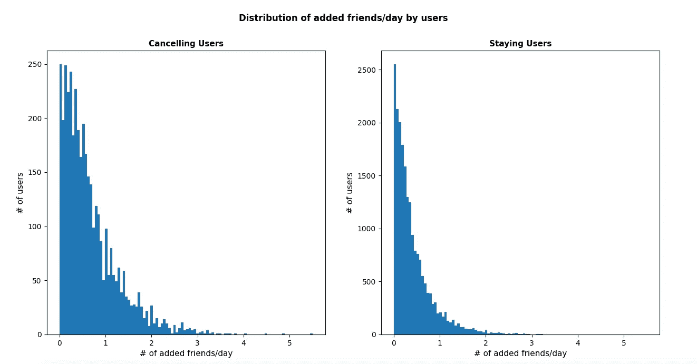

# 在他们流失之前抓住他们…

> 原文：<https://medium.com/codex/get-them-before-they-churn-561ec6e98307?source=collection_archive---------14----------------------->

## 在客户真正离开你之前，如何使用数据科学来了解他们将要做什么。


[Evergent](https://www.evergent.com/blog/5-strategies-to-reduce-churn-in-ott-services/) 的图像属性

在商业语境中,“客户流失”一词指的是某项服务的用户在使用一段时间后，出于这样或那样的原因，决定离开的行为。

这当然是该服务的*提供商*想要避免的事情，因此通常会投入相当大的努力来定义和实施策略，以在用户真正采取最后一步并离开之前检测出他们很可能会流失的用户。反过来，这可以成为专门营销或保留策略、特别优惠、推荐等的输入。

在下文中，我将记录这些步骤，并展示我正是为了这个目标进行的一项研究的结果，使用数据科学技术并利用 [Apache Spark](https://spark.apache.org/) 。这是我在从 [Udacity](https://www.udacity.com/) 攻读[数据科学](https://www.udacity.com/course/data-scientist-nanodegree--nd025)纳米学位过程中完成的最后(顶点)项目。完整代码可在 [Git repo 中获得。](https://github.com/russom/DSND-Capstone)

# 介绍“Sparkify”


rawpixel.com 创建的背景向量—[www.freepik.com](http://www.freepik.com)

分析的数据由 Udacity 直接提供，旨在代表在一个名为“Sparkify”的虚构音乐流媒体服务的运营过程中收集的日志。它实际上有两种不同的“大小”:一种是有限的数据集(大约 128 MB，超过 280000 行)，用于在本地机器上进行初步分析，另一种是完整的数据集(大约 12 GB，超过 2600 行)，用于在集群上运行 Spark 进行分析。

数据集的架构显示以下字段:

```
root
 |-- artist: string (nullable = true)
 |-- auth: string (nullable = true)
 |-- firstName: string (nullable = true)
 |-- gender: string (nullable = true)
 |-- itemInSession: long (nullable = true)
 |-- lastName: string (nullable = true)
 |-- length: double (nullable = true)
 |-- level: string (nullable = true)
 |-- location: string (nullable = true)
 |-- method: string (nullable = true)
 |-- page: string (nullable = true)
 |-- registration: long (nullable = true)
 |-- sessionId: long (nullable = true)
 |-- song: string (nullable = true)
 |-- status: long (nullable = true)
 |-- ts: long (nullable = true)
 |-- userAgent: string (nullable = true)
 |-- userId: string (nullable = true)
```

这是数据集的一行实际看起来的样子:

```
Row(artist='Popol Vuh', auth='Logged In', firstName='Shlok', gender='M', itemInSession=278, lastName='Johnson', length=524.32934, level='paid', location='Dallas-Fort Worth-Arlington, TX', method='PUT', page='NextSong', registration=1533734541000, sessionId=22683, song='Ich mache einen Spiegel - Dream Part 4', status=200, ts=1538352001000, userAgent='"Mozilla/5.0 (Windows NT 6.1; WOW64) AppleWebKit/537.36 (KHTML, like Gecko) Chrome/36.0.1985.143 Safari/537.36"', userId='1749042')
```

为了处理完整的数据集，我利用了 AWS [EMR](https://aws.amazon.com/emr/) 服务。这样，我就可以运行一个由 **4 个**节点(1 个主节点，3 个工作节点)组成的集群，由 [m5.xlarge](https://aws.amazon.com/blogs/aws/m5-the-next-generation-of-general-purpose-ec2-instances/) EC2 虚拟机组成，运行:

*   EMR 5.33
*   火花 2.4.7
*   李维 0.7.0
*   蜂巢 2.3.7
*   Jupyter 企业网关 2.1.0

# 战略和方法

我试图解决这个问题的方法是建立一个分类器，根据提供的数据预测用户是否会流失。我使用了 [Spark](https://spark.apache.org/docs/latest/ml-classification-regression.html) 提供的工具，在一部分数据上训练分类器，在剩余部分上测试。

在真正引入分类器之前，我经历了一个广泛的数据探索阶段，这使我能够识别出一个重要特征的子集，这些特征可以有效地识别出离开的用户。

在那之后，我可以真正进入建模阶段。我分两步走:

*   我最初训练并比较了 Spark 中可用的一些分类器的结果，使用了它们的默认参数，以便识别那些在分析数据集上具有更好行为的分类器；
*   之后，我继续进行优化阶段，在这个阶段，我可以为一些参数提供一个选项网格，并验证是否/如何改变它们可以产生更好的结果。

# 清理和探索

首先，我对数据进行了一些清理，删除了最终出现在`sessionId`、`userId`或`gender` / `location`等字段中的任何`NaN`行:这些可能是日志记录系统中的错误或缺陷造成的结果。之后，我还删除了任何剩余的空`userId`字段的行:这很可能与用户与系统的第一次交互有关。总的来说，这个过程将数据集中的行数减少了约 3%。

一旦清理了数据，我就可以分析用户查看`page`字段值的行为，这显示了他们访问的页面。例如，根据本专栏中可用的信息类型，我们可以识别实际的客户流失(查看用户何时访问`Cancellation Confirmation`页面)或服务的升级/降级(从免费到付费，反之亦然)，还可以识别用户竖起大拇指或添加好友，或看到滚动广告等事件。
我们还可以参考`registration`和`ts`列，重建用户使用系统的时间。

之后，我可以继续将留下的用户和离开的用户分开，并在一些特定特征上比较两组用户，例如他们在服务上花费的时间:



图 1 —用户在服务上花费的时间

```
------------------------------------------------
Time spent statistics for users that cancelled:
Mean =  69.69 ; Std. Dev. =  40.74
------------------------------------------------
Time spent statistics for users that stay:
Mean =  86.45 ; Std. Dev. =  39.59
------------------------------------------------
```

或者他们每天听的歌曲数量:



图 2-每天收听的歌曲

```
---------------------------------------------------
Songs per day statistics for users that cancelled:
Mean =  33.40 ; Std. Dev. =  26.71
---------------------------------------------------
Songs per day statistics for users that stay:
Mean =  20.21 ; Std. Dev. =  19.17
---------------------------------------------------
```

他们每天“拒绝”的次数:



图 3-每天给出的拇指向下

```
--------------------------------------------------------------
Thumbs down given per day statistics for users that cancelled:
Mean =  0.48 ; Std. Dev. =  0.43
--------------------------------------------------------------
Thumbs down per day statistics for users that stay:
Mean =  0.27 ; Std. Dev. =  0.29
--------------------------------------------------------------
```

或者他们每天添加的朋友数量:



图 4 —每天添加的朋友

```
---------------------------------------------------------
Added friend per day statistics for users that cancelled:
Mean =  0.68 ; Std. Dev. =  0.61
---------------------------------------------------------
Added friend per day statistics for users that stay:
Mean =  0.41 ; Std. Dev. =  0.44
---------------------------------------------------------
```

[回购](https://github.com/russom/DSND-Capstone)中的[笔记本](https://github.com/russom/DSND-Capstone/tree/main/notebooks)和特定[记录](https://github.com/russom/DSND-Capstone/blob/main/Capstone_writeup.md)最好详细记录所有这些。

我也试着从其他角度看数据:

*   我从离开/留下的用户数据集中提取了一个子集，包含每个用户最近一周的数据。这个想法是为了寻找用户在离开时的不同行为模式。然而，这并没有显示出用户在搅动前的最后一周的行为与之前的行为有任何显著差异，所以我决定考虑他们的全部历史。
*   我研究了非行为特征，比如用户的性别或位置。然而，这里也没有出现明显的模式:离开的人和留下的人在性别上一样平衡，在这两种情况下，代表性最强的州几乎相同。

# 定义正确的特征

在所有的清理和探索之后，我决定将建模阶段使用的训练特性考虑在内:

*   每天滚动广告的数量
*   添加的好友数量/天
*   每天被拒绝的次数
*   每天收听的歌曲数量
*   花费在服务上的时间

标签将是实际的搅动事件，特征将由`userId`分组。结果数据集格式的一个示例是:

```
Row(id='100010', rolledAdvDay=1.1818181818181819, addedFriendDay=0.09090909090909091, thumbsDwnDay=0.022727272727272728, songsDay=6.113636363636363, permanence=56.0, label=0)
```

# 适合模型

一旦准备好了特性，我就可以开始实际的建模了。我决定开始比较 [Spark](https://spark.apache.org/docs/latest/ml-classification-regression.html) 中可用的几个分类器，考虑所有这些分类器的参考参数(也就是说，我在这里没有运行任何网格优化)。我选择了:

*   一个[逻辑回归](https://spark.apache.org/docs/latest/ml-classification-regression.html#logistic-regression)分类器；
*   一个[梯度提升树](https://spark.apache.org/docs/latest/ml-classification-regression.html#gradient-boosted-tree-classifier)分类器；
*   一个[随机森林](https://spark.apache.org/docs/latest/ml-classification-regression.html#random-forest-classifier)分类器；
*   一个[线性支持向量](https://spark.apache.org/docs/latest/ml-classification-regression.html#linear-support-vector-machine)分类器。

就阶段而言:

*   第一件事是将数据集分成训练和测试部分(注意:在这里固定种子可以确保实验的可重复性):

```
# 80/20 % split
  train, test = df_user_logs_mod.randomSplit([0.8, 0.2], seed=42)
```

*   然后我定义了一个 [VectorAssembler](https://spark.apache.org/docs/latest/ml-features#vectorassembler) 来将所有感兴趣的特性组合到一个向量中:

```
# Define VectorAssembler
  assembler = VectorAssembler(inputCols=["rolledAdvDay",\
                                       "addedFriendDay",\
                                       "thumbsDwnDay",\
                                       "songsDay",\
                                       "permanence"], \
                            outputCol="inputFeatures")
```

*   然后我使用[最小-最大缩放器](https://spark.apache.org/docs/latest/ml-features#minmaxscaler)缩放数据。我选择这个是因为各种特性的分布(如数据探索部分所见)非常不均匀，远不像正态分布。

```
# Define Scaler
  scaler = MinMaxScaler(inputCol="inputFeatures", outputCol="features")
```

*   之后，我可以引入 4 个[管道](https://spark.apache.org/docs/latest/ml-pipeline.html)，每个分类器一个:

```
# Classifiers/Pipelines

  # Logistic Regression 
  lr = LogisticRegression()
  pipeline_lr = Pipeline(stages = [assembler, scaler, lr])

  # Gradient-Boosted Tree classifier
  gbt = GBTClassifier()
  pipeline_gbt = Pipeline(stages = [assembler, scaler, gbt])

  # Random Forest classifier
  # Note: setting the seed will ensure repeatability of the results
  rf = RandomForestClassifier(seed = 42)
  pipeline_rf = Pipeline(stages = [assembler, scaler, rf])

  # Linear Support Vector Machine classifier
  lsvc = LinearSVC()
  pipeline_svc = Pipeline(stages = [assembler, scaler, lsvc])
```

*   最后，我选择了一个使用 **f1-score** 指标的验证器，考虑到[数据的不平衡](https://stats.stackexchange.com/questions/210700/how-to-choose-between-roc-auc-and-f1-score)(留下的用户比离开的用户多得多):

```
# Evaluator - will be common for all the grids
  evaluator = MulticlassClassificationEvaluator(metricName="f1")
```

之后，我继续拟合和评估四个分类器。在所有情况下，我使用了一个[交叉验证器](https://spark.apache.org/docs/latest/api/python/reference/api/pyspark.ml.tuning.CrossValidator.html)，**用** `**k = 3**`折叠数据集，以验证训练分类器相对于训练数据的健壮性。例如，对于逻辑回归模型，我有:

```
# Empty parameter grid
paramgrid_lr = ParamGridBuilder()\
    .build()

# Crossvalidator 
crossval_lr = CrossValidator(estimator = pipeline_lr, \
                             estimatorParamMaps = paramgrid_lr, \
                             evaluator = evaluator, \
                             numFolds = 3, \
                             seed = 4242)
```

查看结果，我认为最有趣的事情之一是有限数据集和完整数据集之间的结果差异。

## ***有限数据集***

```
F1-score, Logistic Regression classifier:  0.8828F1-score, Gradient-Boosted Tree classifier:  0.8190F1-score, Random Forest classifier:  0.8095F1-score, Linear Support Vector Machine classifier:  0.8302
```

## ***完整数据集***

```
F1-score, Logistic Regression classifier:  0.8344F1-score, Gradient-Boosted Tree classifier:  0.8858F1-score, Random Forest classifier:  0.8798F1-score, Linear Support Vector Machine classifier:  0.8236
```

# 优化和验证

一旦给分类器配备了默认参数，我就开始对**梯度增强树**和**随机森林**的情况进行优化。为了在可能对改变有影响的参数和计算负载之间寻找折衷，我定义了以下网格(注意:每个参数的第一个值是默认值):

```
# Gradient Boosted Tree 
  # Parameter grid
  paramgrid_gbt_o = ParamGridBuilder()\
      .addGrid(gbt.stepSize, [0.1, 0.25, 0.5])\
     .addGrid(gbt.maxIter, [20, 40, 60])\
     .build()# Random Forest
  # Parameter grid
  paramgrid_rf_o = ParamGridBuilder()\
      .addGrid(rf.impurity, ['entropy', 'gini'])\
     .addGrid(rf.maxDepth, [5, 10])\
     .addGrid(rf.numTrees, [20, 40])\
     .build()
```

分数有所提高:

## *有限的数据集*

```
F1-score, Gradient-Boosted Tree classifier:  0.8401F1-score, Random Forest classifier:  0.8302
```

## *完整数据集*

```
F1-score, Gradient-Boosted Tree classifier:  0.8858F1-score, Random Forest classifier:  0.8850
```

评估参数相对于默认值改变了多少是很有趣的。
查看完整的数据集案例(即具有更好分数的案例)，可以验证梯度增强的树分类器，即使仍然是最好的一个，实际上仍然保留了默认参数(详情请参见 [repo](https://github.com/russom/DSND-Capstone) 中的[笔记本](https://github.com/russom/DSND-Capstone/blob/main/notebooks/Sparkify-project-EMR.ipynb)),而对于随机森林案例，我们有:

```
name='impurity', doc='Criterion used for information gain calculation (case-insensitive). Supported options: entropy, gini'): 'entropy'
name='maxDepth', doc='Maximum depth of the tree. (Nonnegative) E.g., depth 0 means 1 leaf node; depth 1 means 1 internal node + 2 leaf nodes.'): 10
name='numTrees', doc='Number of trees to train (at least 1)'): 40
```

因此，我们可以看到影响参数似乎是`maxDepth`和`numTrees`，它们移动到所提供的最大值。当然，这种评估总是一种权衡:进一步增加任何一项都可以提高分数，但肯定会增加计算量。

有了为最佳模型确定的最佳参数组合，我们还可以比较 f1 分数对于`CrossValidator`定义的每个折叠如何/是否变化。如前所述，度量的稳定性将是分类器相对于训练数据的鲁棒性的指示。

在这里，我们也可以看到数据集之间的差异:

## 有限数据集

```
Fold:  0 ; F1-score, Gradient-Boosted Tree classifier:  0.8613
Fold:  1 ; F1-score, Gradient-Boosted Tree classifier:  0.7891
Fold:  2 ; F1-score, Gradient-Boosted Tree classifier:  0.7523Fold:  0 ; F1-score, Random Forest classifier:  0.8571
Fold:  1 ; F1-score, Random Forest classifier:  0.7523
Fold:  2 ; F1-score, Random Forest classifier:  0.7944
```

## 完整数据集

```
Fold:  0 ; F1-score, Gradient-Boosted Tree classifier:  0.8854
Fold:  1 ; F1-score, Gradient-Boosted Tree classifier:  0.8847
Fold:  2 ; F1-score, Gradient-Boosted Tree classifier:  0.8834Fold:  0 ; F1-score, Random Forest classifier:  0.8771
Fold:  1 ; F1-score, Random Forest classifier:  0.8798
Fold:  2 ; F1-score, Random Forest classifier:  0.8823
```

显而易见，更丰富的数据集如何提供更好的训练，从而为两个分类器带来非常稳定的度量。

# 结果和结论

在这个项目中，我展示了训练一个分类器的可能性，该分类器基于可用的信息来预测“Sparkify”服务的用户是否会以由 **f1-score > 0.8** 测量的性能水平“搅动”。

具体来说，我可以比较和对比几个分类器，既可以针对有限的数据集(~128 MB，超过 280000 行)，也可以针对完整的数据集(~12 GB，超过 2600 万行)。
参考指标是 f1 得分，考虑到数据中的不平衡，有更多的用户留下来离开，最好的得分分类器是**梯度提升树**，它可以针对完整的数据集实现大约 0.886 的最终 **f1 得分**。
这种分类器不仅优于其他分类器(包括随机森林分类器，即使是轻微的)，而且还提供了稳健的结果，当用 k 倍交叉验证器评估时，其度量没有太大变化。
此外，我在分类器上运行了一个网格优化过程，没有对默认参数产生任何变化。然而，应该注意的是，网格被定义为探索空间的大小和计算负担之间的折衷，因此它并不打算是详尽的。

在体验过程中，我发现了一些特别有趣的事情:

*   首先，一般说数据科学的大部分时间都花在做数据探索和特性工程上是绝对正确的。我可以说，我在这个项目上至少花了 75%的时间在这两个阶段，可能还会更多。
*   实际的建模阶段强调了完整数据集与有限数据集之间的差异和附加值。事实上，虽然在对有限数据进行拟合时，一些分类器(逻辑回归和 SVC)比其他分类器得分更高，但当对完整数据集进行评估时，位置发生了变化。在这种情况下，像梯度增强树和随机森林这样的集成技术在相对和绝对意义上都取得了更好的成绩，正如人们可能已经预料到的那样。
*   通过网格优化阶段可以进一步改进结果，例如，改变随机森林分类器相对于完整数据集的结果，从 0.8798 的 f1 分数变为 0.8850 的分数。一般来说，探索分类器的参数空间以获得更好的分数肯定是进一步改进的可能选择。
*   当运行 k 倍交叉验证分析时，数据集之间的差异甚至起了更大的作用:在这种情况下，有限的数据集明显显示出不太稳定的度量，因此分类器对于数据不是特别稳健。