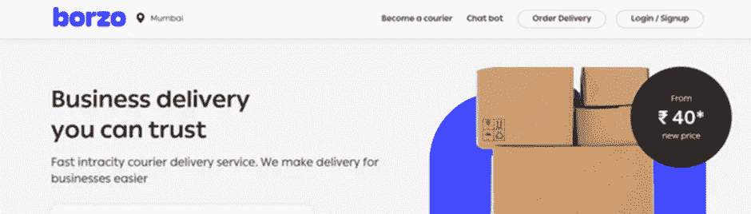
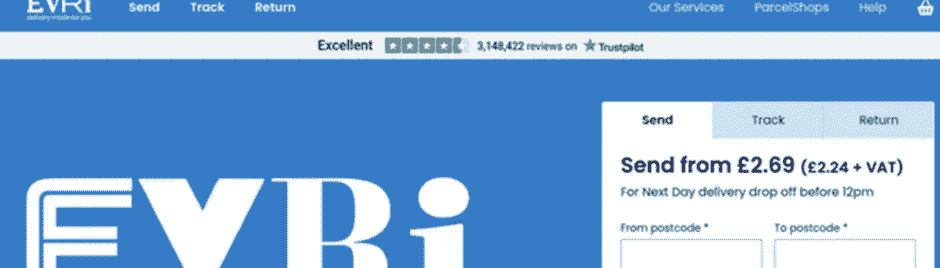
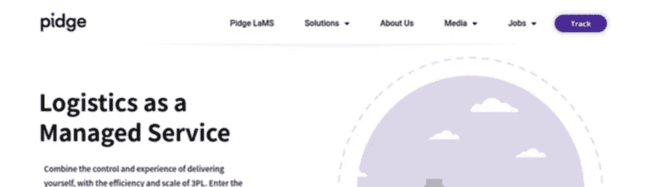
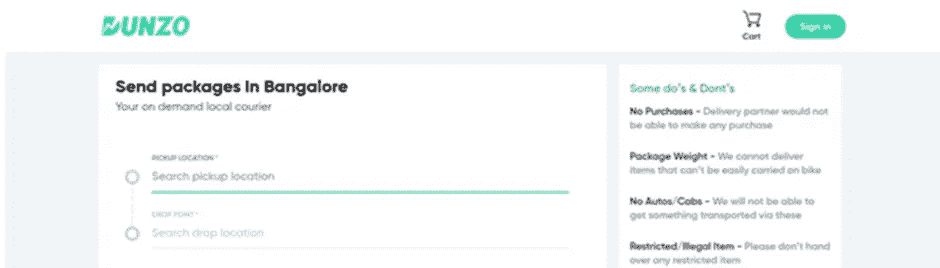
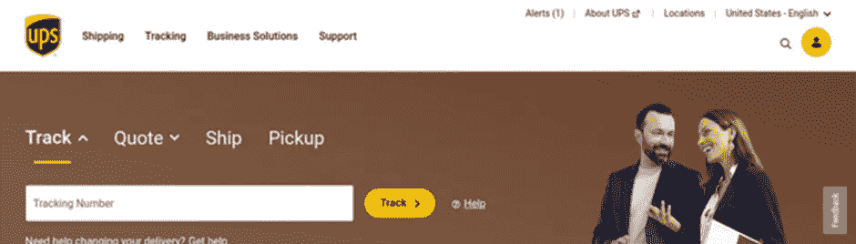
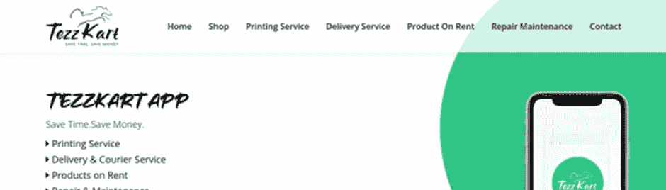
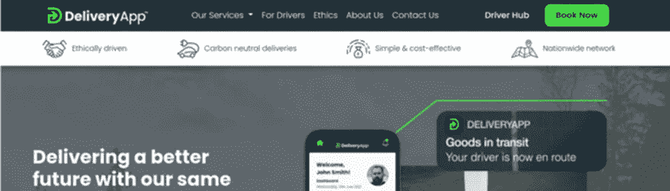

# 在 2022 年获得这些快递递送应用程序，以便及时递送包裹

> 原文：<https://medium.com/codex/get-these-courier-delivery-apps-this-2022-for-timely-parcel-delivery-b4071844d3ca?source=collection_archive---------15----------------------->

快递配送 App

按需定制的魔力已经影响到了每一个企业。如今，每个企业都有一个按需应用程序来提高其在线知名度，并帮助其努力获得较高比例的收入。即使是提供最后一英里配送的机构，现在也可以通过一个应用程序来轻松向最终客户提供这些服务。这就是市场盈利能力成倍增长的原因。得益于该解决方案，预计到 2023 年底，市场将增长约 4.9%。

所以，我相信你一定有这个问题- [快递应用](https://www.peppyocean.com/know-how-on-demand-courier-delivery-app-works-and-its-best-features/)越来越受欢迎的原因&是什么？

看完之后，你会先对这方面有一个全面的了解。**同时，您还将洞察:**

> 10 款广受欢迎的快递应用掀起了物流行业的一场革命
> 
> 这些应用为企业和客户带来的好处
> 
> 为什么构建和优化快递应用程序至关重要？

# 包裹递送应用受欢迎的因素

使客户能够预订包裹递送，并能够跟踪预期到达时间

自动化车队管理活动，并允许物流设置以最大的便利和舒适进行其不同的操作

由于与包裹相关的所有细节都存储在应用程序中，减少了快递设置对文书工作的依赖

这些原因是该应用程序受欢迎程度上升的唯一原因吗？答案是否定的。一些统计数据也给出了该解决方案对行业的总体利润价值的估计。

# 描述包裹递送应用盈利范围的统计数据

> 1.到 2024 年，按需快递市场的价值预计将达到 4000 亿美元
> 
> 2.该应用的出现将有助于快递和送货服务市场在 2023 年底前实现约 4.9%的增长

通过这些吸引人的数字，你可以估计出到底是什么让这款应用成为物流企业如此有利可图的解决方案。

如果你分别访问 Android 和 iOS 的应用程序市场、谷歌 Play 商店和苹果应用程序商店，你会发现许多应用程序特别负责让快递服务变得容易提供。然而，我列出了他们 2023 年的十个最佳产品，列出了他们的发布年份，他们的杰出品质等。，不一而足。

# 2023 年 10 款流行的按需快递应用

# 1.博尔佐

发布年份— 2016 年

交付区域—孟买、德里、本加卢鲁、海得拉巴、艾哈迈达巴德、钦奈、加尔各答和浦那

**特色**

1.轻松跟踪

2.当天交货

3.单次或多次交付

4.次序改变

5.应用内支持聊天

# 2.埃夫里

发布年份— 2009 年

服务区域——除海峡群岛、邮政信箱和英国军队邮局之外的整个英国

**特性**

1.实时包裹跟踪

2.在附近寻找包裹

3.包裹递送状态

4.共享交付以共享跟踪信息

5.我的地点为所有包裹递送设置首选项

# 3.皮奇

发布年份— 2019 年

服务区域—遍布 NCR 德里

**特色**

1.当天交货

2.批量订单的实时交付报告

3.实时跟踪订单

4.计划订单

5.反馈和评审

# 4.邓佐

发布年份— 2014 年

服务区域—班加罗尔、浦那、孟买等

**特色**

1.多次付款

2.评论和评级

3.折扣、奖励和优惠券

4.推送通知

5.社交媒体整合

# 5.deliver.ee

发布年份— 2013 年

服务区域—法国 60 多个城市和欧洲 300 多个城市

**特性**

1.地理定位交付跟踪

2.不到 2 小时内交货

3.实时数据可视化

4.成本控制

5.轻松交付管理

# 6.Onfleet

发布年份— 2015 年

服务领域—遍布美国

**特性**

1.路线优化

2.搜索和过滤

3.自动分配

4.应用内聊天

5.ETA 乐队

# 7.不间断电源

发布年份— 2017 年

服务领域—遍布美国

**特性**

1.追踪包裹

2.运输包装

3.管理送货上门

4.使用移动条形码功能在 UPS 商店进行现场标签打印

5.获取报价并创建发货

# 8.泰兹卡特

发射年份— 2020 年

服务区域—诺伊达、德里等

**功能**

1.数字印刷服务

2.价格计算器

3.选择产品类别

4.更改装货/交货地点

5.自动跟踪

# 9.智能路线

发布年份— 2017 年

服务区域—整个爱尔兰

**功能**

1.实时跟踪

2.驾驶员导航

3.实时更新路线

4.路线管理

5.客户映射

# 10.DeliveryApp

发布年份— 2019 年

服务领域—全英国

**特性**

1.当天快递

2.多点

3.计划交货

4.紧急快递

5.快速报价

有了这十个流行的按需快递应用程序的概念，你就可以明白为什么物流企业在收入和受欢迎程度上都经历了如此广泛的增长。

因此，如果您计划将您的物流设置数字化，这无疑是一个有利可图的提议。这将确保企业和客户获得如下优势。

# 包裹递送应用程序的优势

客户在获得他们预订的包裹递送费率方面获得了额外的透明度

物流业务获得支持，实现运营自动化，并执行不同的任务，如车队管理、仓库管理等，更加方便

由于该应用程序存储了与快递、其重量、交付日期等相关的所有详细信息，企业对文书工作的依赖性大大降低。

看看这些要点，以及流行的快递应用程序，你就能明白，为什么你应该用优步快递应用程序来优化你的企业。

# 开发包裹递送应用程序时需要记住的几点

对竞争对手进行彻底的调查，研究他们开发的解决方案。了解他们缺少的元素，检查客户对应用程序的满意度，并确定他们的加入是否会带来价值。

选择一种能帮助你赚取收入的商业模式。有不同的模式可供选择，即通过包裹和快递服务应用程序，通过跟踪聚合器，最后通过品牌应用程序。

确定包含哪些功能可以实现轻松的快递服务，并让您能够以最大的便利管理您的运营。

使用技术堆栈，使应用程序功能保持强大，并确保零应用程序崩溃事件发生。

联系一家离岸的[快递递送应用开发公司](https://www.peppyocean.com/courier-delivery-app-development/)，该公司拥有构建客户包裹递送应用的技能，因此您可以成功实现可扩展性和增长。此外，你可以在最短的时间内成功地为你的创业建立一个品牌。

最后，思考成本因素很重要。

# 开发包裹递送应用程序的成本

当你开始构建包裹递送应用程序的旅程时，大概的成本会在 15，000 美元到 20，000 美元之间。

但是，需要注意的是，成本会有所不同，并且可能会因某些因素而上涨。他们是-

您包括的功能的复杂性

您使用的技术堆栈

您获得发展服务的国家

您添加到应用中的功能

# 包扎

浏览一下十个流行的快递应用程序，你会发现这个行业确实有一个非常有利可图的范围。因此，投资一个包裹递送应用程序肯定是一个有利可图的提议。因此，如果你正着手建立优步快递应用程序，立即联系离岸快递应用程序开发公司。通过他们在建立这种定制解决方案方面的专业知识，他们将带你走上一条充满巨大利润和客户的道路。正如他们所说，任何时候都是正确的时间。因此，如果你在发展创业时，以正确的方式投入时间，你肯定会从第一天开始就获得大量的收入和回报。