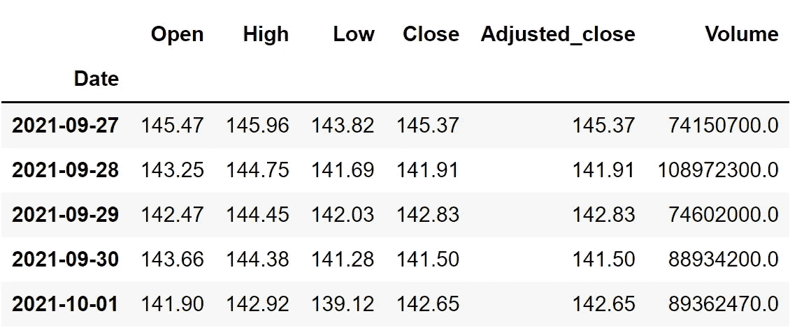
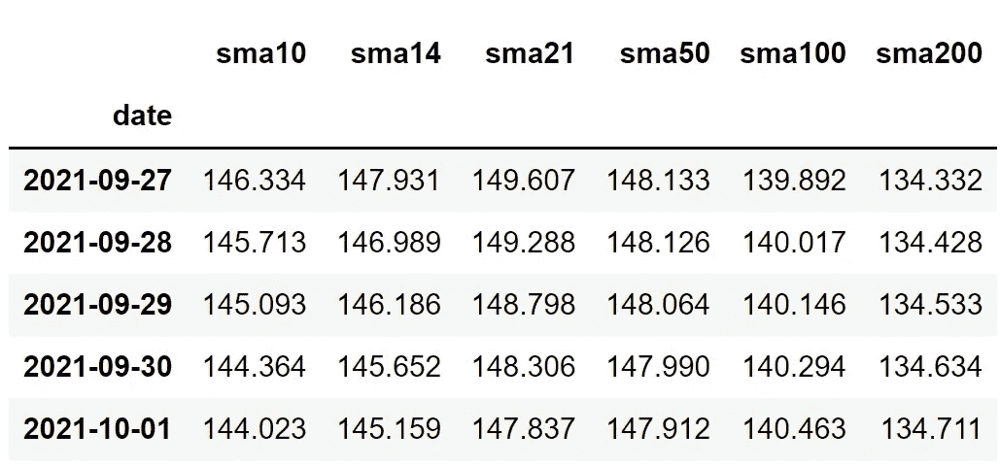
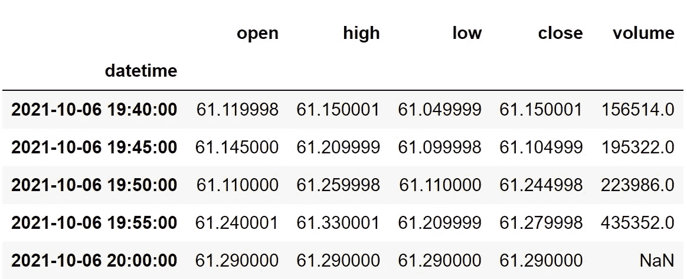

# 使用 Python 在几秒钟内获得准确的股票数据

> 原文：<https://medium.com/codex/getting-accurate-stock-data-with-python-in-seconds-1ad14410c8ee?source=collection_archive---------0----------------------->

## 用股票 API 提取不同类型市场数据的简单而有效的方法


克里斯·利维拉尼在 [Unsplash](https://unsplash.com?utm_source=medium&utm_medium=referral) 上的照片

让我们面对现实吧，以可承受的成本找到准确可靠的股票数据很难(几乎不可能)。获取这些数据的唯一途径是直接从交易所花大价钱购买。但最近，我发现了一个金融数据 API 提供商，它以很低的成本提供从历史数据到经济数据的各种市场信息。不是别人，正是 [**EOD 史料**](https://eodhistoricaldata.com/?ref=DHY3H8NT&utm_source=medium&utm_medium=post&utm_campaign=getting_accurate_stock_data_with_python_in_seconds) 。在本文中，我们将首先简要了解他们的真实身份，然后深入研究他们提供的 API，以便使用 Python 提取一些有用的信息。

> **注**:本文强烈基于 [EOD 史料](https://eodhistoricaldata.com/?ref=DHY3H8NT&utm_source=medium&utm_medium=post&utm_campaign=getting_accurate_stock_data_with_python_in_seconds)提供的 API。因此，为了顺利地跟进即将到来的内容，请确保您拥有自己的帐户，因为它使您能够访问您的私有 API 密钥(对于使用 API 提取数据是必不可少的)。您可以使用此处 的 [**链接创建账户。此外，并非本文中提到的所有 API 都是免费提供的，但需要订阅。点击**](https://eodhistoricaldata.com/register?ref=DHY3H8NT&utm_source=medium&utm_medium=post&utm_campaign=getting_accurate_stock_data_with_python_in_seconds) 查看所有套餐的价格，并选择最适合您的套餐。

# 一些历史和统计数据

EOD 历史数据公司是一家致力于提供各种精确的财务数据 API 的组织。对我个人来说，他们的数字相当可观，并说服我利用他们的服务。他们拥有 30 年的金融数据，总计超过 7.6 亿个数据点，包括全球 70 多个股票交易所、150000 多个报价机、20000 多个交易所交易基金、600 多个指数和 1100 多个外汇对。现在，让我们转到本文的技术部分，在这里，我们将使用 Python 使用一系列 API，并希望提取一些有趣的数据。

# 使用 Python 提取金融数据

正如我之前所说，EOD 历史数据为用户提供了大量的 API。因此，我们将把这个技术部分分成不同的类别，以确保没有遗漏任何内容。文章的这一部分分为以下几个主题:

```
**1\. Fundamental Information
2\. Historical Data
3\. Real-Time Market Data
4\. Technical Indicators
5\. Intraday Data**
```

每个类别都包含使用一组 API 提取相应数据的代码。在直接进行分类之前，我们应该首先将所有需要的包导入到 python 环境中。在本文中，涉及到三个重要的包，它们是用于处理数据的 Pandas、进行 API 调用的请求和用于日期操作的 Datetime。要导入这些包，请遵循以下代码:

```
import pandas as pd
import requests
from datetime import datetime
```

我们现在已经成功地将包导入到我们的环境中。此外，请确保在导入软件包之前已经安装了它们。不浪费任何时间，让我们进入第一类，将提取股票的基本面信息。

## 基本信息

与其他 API 相比，EOD 历史数据的基本面信息 API 提供了更全面的数据，从股票的一般细节到收益和财务报告。这对研究人员来说很容易，因为他们不必依赖各种 API 来获取不同类型的信息。现在，我们可以轻松地与 Python 中的基础信息 API 进行交互，并使用以下代码提取数据:

```
def extract_fundamentals(symbol):
    api_key = 'YOUR API KEY'
    url = f'https://eodhistoricaldata.com/api/fundamentals/{symbol}?api_token={api_key}' 
    data = requests.get(url).json()
    return data

tsla_fundamentals = extract_fundamentals('TSLA')
```

在上面的代码中，我们定义了一个名为`extract_fundamentals`的函数，它将股票的符号作为参数。在函数内部，我们首先将 API 键和 URL 存储在各自的变量中。然后，使用 Requests 包提供的`get`函数，我们调用 API 并存储数据。最后，我们将返回提取的数据，并调用创建的函数来访问 Tesla 的基本股票信息。考虑到其巨大的尺寸，输出没有被表示。我们已经成功完成了本部分的第一个类别。是时候进行下一个了！

## 史料

不同研究人员出于不同目的使用的最常见但有用的数据是日终数据或所谓的股票历史数据。EOD 历史数据提供的历史数据可以分为 CSV 格式和 JSON 格式两种。

**1。CSV 格式**

众所周知，我们从 API 得到的响应是 JSON 格式的。对于初学者来说，这可能有点困难，因为要处理提取的数据，必须经过数据预处理和操作步骤。但是有了选择不同响应格式的选项，即 CSV 格式，这个过程就大大简化了。下面是以 CSV 格式提取股票历史数据的 python 代码:

```
def extract_historical_csvdata(symbol, start_date, end_date):
    api_key = 'YOUR API KEY'
    url = f'https://eodhistoricaldata.com/api/eod/{symbol}?from={start_date}&to={end_date}&api_token={api_key}'
    df = pd.read_csv(url).set_index('Date')
    return df

aapl = extract_historical_csvdata('AAPL', '2021-01-01', '2021-10-01')[:-1]
aapl.tail()
```

该代码的结构与我们在上一类别中看到的代码非常相似，但是增加了一些额外的参数，并且 API URL 略有变化。上面代码的输出是一个 Pandas dataframe，其中包含了 Apple 从 2021 年初到同年 10 月 10 日的历史数据。数据帧将如下所示:



作者图片

**2。JSON 格式**

对于喜欢构建大型应用程序的人来说，JSON 形式的数据是必不可少的。尽管 EOD 历史数据公司的末日 API 的默认输出格式是 CSV，但是将它转换成 JSON 并不需要太多时间。我们所需要做的只是向查询中添加另一个特殊参数`fmt=json`,其他一切都将迎刃而解！最终的 Python 代码如下所示:

```
def extract_historical_jsondata(symbol, start_date, end_date):
    api_key = 'YOUR API KEY'
    url = f'https://eodhistoricaldata.com/api/eod/{symbol}?api_token={api_key}&from={start_date}&to={end_date}&fmt=json'
    raw_df = requests.get(url).json()
    df = pd.DataFrame(raw_df).set_index('date')
    return df

msft = extract_historical_jsondata('MSFT', '2021-01-01', '2021-10-01')
msft.tail()
```

上面的代码几乎与 CSV 格式的代码相似，但是在 API URL 的末尾有一个特殊的参数`fmt=json`。输出没有显示，因为它与前一个相同。对于所有即将出现的类别，CSV 和 JSON 格式都可用，但是在本文中，我们将只关注 JSON 格式。让我们现在跳到下一个类别！

## 实时市场数据

股票交易者在很大程度上依赖实时市场数据来进行他们的行动，无论是买入还是卖出。通过 EOD 历史数据的另一个高效的 API，访问如此重要的数据变得很容易。使用 Python 提取实时市场数据的代码如下所示:

```
def extract_realtime(symbol):
    api_key = 'YOUR API KEY'
    url = f'https://eodhistoricaldata.com/api/real-time/{symbol}?api_token={api_key}&fmt=json'
    data = requests.get(url).json()
    data['timestamp'] = datetime.fromtimestamp(data['timestamp'])
    del data['gmtoffset']
    return data

googl_realtime = extract_realtime('GOOGL')
for i in googl_realtime.keys():
    print(f'{i}: {googl_realtime[i]},')
```

同样，代码的结构和思想或多或少类似于我们在以前的类别中看到的代码，但是在 API URL 上有所变化。在提取数据的同时，我们还在函数内部进行一些数据操作，以确保最终结果足够清晰，任何人都能理解。上述代码的输出是一系列值，这些值是特定股票的实时信息，如下所示:

```
**code: GOOGL.US,
timestamp: 2021-10-05 01:30:00,
open: 2719.21,
high: 2719.21,
low: 2621.27,
close: 2673.1899,
volume: 2371139,
previousClose: 2730.8601,
change: -57.6702,
change_p: -2.1118**
```

需要注意的是，数据会比市场稍晚 15-20 分钟。这一类就这么多了。让我们继续本节的下一个类别，我们将提取任何给定股票的技术指标。

## 技术指标

鉴于技术指标的效率和易学性，它是市场研究领域的新趋势。就像我们在前面的主题中提取数据的可行性一样，提取技术指标也不例外。按照下面的代码使用 Python 提取任何给定股票的简单移动平均线(SMA ):

```
def extract_technical(symbol, function, period, start_date, end_date):
    api_key = 'YOUR API KEY'
    url = f'https://eodhistoricaldata.com/api/technical/{symbol}?api_token={api_key}&from={start_date}&to={end_date}&fmt=json&function={function}&period={period}'
    raw_df = requests.get(url).json()
    df = pd.DataFrame(raw_df)
    return df

aapl_sma10 = extract_technical('AAPL', 'sma', 10, '2020-01-01', '2021-10-01').set_index('date').rename(columns = {'sma':'sma10'})
aapl_sma14 = extract_technical('AAPL', 'sma', 14, '2020-01-01', '2021-10-01').set_index('date').rename(columns = {'sma':'sma14'})
aapl_sma21 = extract_technical('AAPL', 'sma', 21, '2020-01-01', '2021-10-01').set_index('date').rename(columns = {'sma':'sma21'})
aapl_sma50 = extract_technical('AAPL', 'sma', 50, '2020-01-01', '2021-10-01').set_index('date').rename(columns = {'sma':'sma50'})
aapl_sma100 = extract_technical('AAPL', 'sma', 100, '2020-01-01', '2021-10-01').set_index('date').rename(columns = {'sma':'sma100'})
aapl_sma200 = extract_technical('AAPL', 'sma', 200, '2020-01-01', '2021-10-01').set_index('date').rename(columns = {'sma':'sma200'})

aapl_sma = pd.concat([aapl_sma10, aapl_sma14, aapl_sma21, aapl_sma50, aapl_sma100, aapl_sma200], axis = 1)
aapl_sma.tail()
```

在上面的代码中，我们定义了一个名为`extract_technical`的函数，它接受股票的符号、我们想要提取的统计数据、回望期以及数据帧的开始和结束日期。在函数内部，像我们之前所做的一样，定义两个变量来存储 API 键和 URL，并使用`get`函数提取数据，将其转换为 Pandas dataframe，最后返回最终结果。下面几行代码没有我们刚刚讨论过的代码重要。其余代码背后的想法是使用创建的函数来提取 Apple 的具有各种回看周期的 SMA。最终的数据帧或输出如下所示:



作者图片

EOD 历史数据公司的技术指标 API 不仅仅局限于 SMA，还包括从基本到高级的大量指标。API 也是以这样一种方式设计的，即我们可以定制许多参数来实现可行和无缝的预期指标。话虽如此，让我们进入下一个也是最后一个类别！

## 当天数据

像实时数据一样，日内数据在日内交易者的生活中也起着至关重要的作用。使用 EOD 历史数据的 API 提取任何特定的日内数据非常简单。提取数据的 python 代码如下所示:

```
def extract_intraday(symbol):
    api_key = 'YOUR API KEY'
    url = f'https://eodhistoricaldata.com/api/intraday/{symbol}?api_token={api_key}&interval=5m&fmt=json'
    raw_df = requests.get(url).json()
    df = pd.DataFrame(raw_df).iloc[:,2:].set_index('datetime')
    return df

twtr_intraday = extract_intraday('TWTR')
twtr_intraday.tail()
```

上面的代码和前面讨论过的一样，都是从定义一个名为`extract_intraday`的函数开始的，这个函数将股票的符号作为参数。在函数内部，我们执行所有类似的活动，比如存储 API 键和 URL，进行 API 调用，提取数据并将其转换为 Pandas 数据帧，最后，调用函数来访问特定股票的当天数据。最终结果是如下所示的数据帧:



作者图片

需要注意的一件重要事情是，开始日期和结束日期之间的天数不应超过 100 天。此外，可以通过将数据点之间的间隔时间从 5 分钟(默认)更改为 1 分钟来进一步定制这个 API。这就是你需要知道的关于这个 API 的一切！

# 最后的想法！

到目前为止，我们已经发现了五个重要的 API，它们是由 EOD 历史数据提供的，还有更多的 API 有待发现。就个人而言，我觉得使用 EOD 历史数据的财务 API 有三个重要的优势。

首先，这些数据比我见过的任何数据都要准确。在我的一生中，我面临着成吨成吨的 API 来提取市场数据，老实说，除了 EOD 的历史数据，我找不到任何其他具有如此精确度和准确性的资源。

其次，API 的易用性非常好。通常，我们通过调用 API 得到的 JSON 输出是笨拙的，需要花费一些时间来清理。我对我以前使用的一些 API 感到失望，因为它们需要一千年才能变得可用，但 EOD 历史数据的 API 的 JSON 输出要干净得多，它几乎不需要数据预处理或清理过程。更不用说，他们还提供了一个选项来选择 CSV 格式的输出，这真的很方便。

最后，[所有 API 的优秀文档](https://eodhistoricaldata.com/financial-apis/?ref=DHY3H8NT)。重要的是要有很好的文档来方便地跟进所提供的 API。如果没有明确的文档，伟大的服务就会过时。EOD 历史数据公司严格遵循这一原则，并为每一个 API 维护了最好的文档，其中包括带有实例和输出的干净代码块。

总的来说，如果你是初学者，EOD 历史数据是一个很好的资源，对于高级用户来说也是一个明智的选择。希望你能从这篇文章中学到一些新的有用的东西。