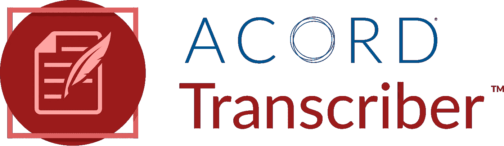

# 从数据中自动获取记录——第一部分

> 原文：<https://medium.com/codex/getting-acord-form-data-automagically-part-i-7f9148de835d?source=collection_archive---------4----------------------->

## [法典](http://medium.com/codex)

## 如何使用 Python 和 ACORD 解决方案组转录器

信用:ACORD 解决方案集团

在保险业内，ACORD 已经成为全球标准化信息的标准机构**。ACORD 对保险行业的价值源于表单(早在 1970 年),当时它们还是纸张。现在这些形式是数字化的…**