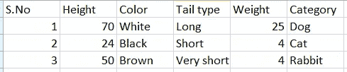
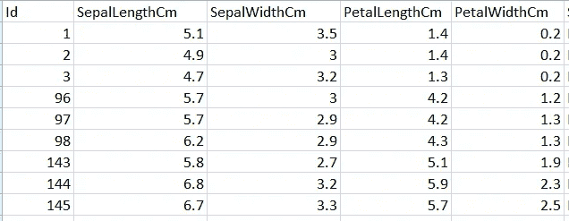
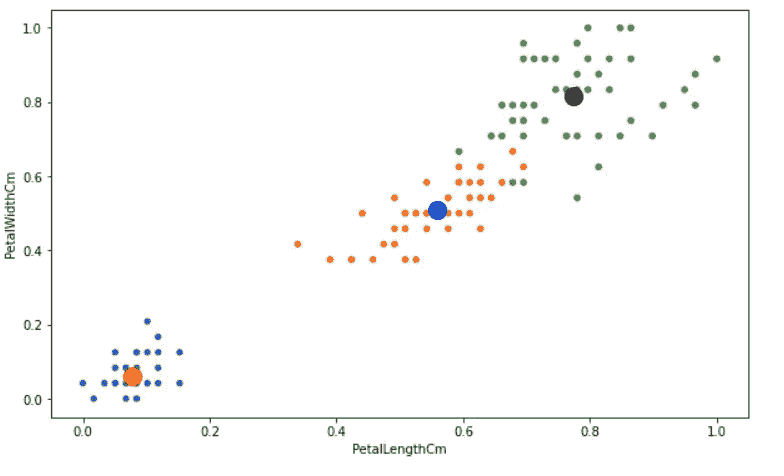
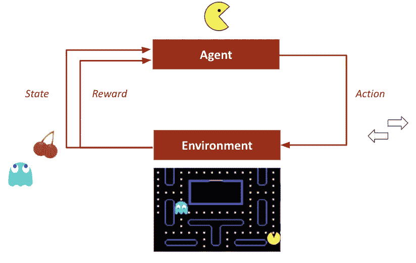

# 熟悉机器学习的世界

> 原文：<https://medium.com/codex/getting-familiar-to-the-world-of-machine-learning-ea31974ed0c4?source=collection_archive---------5----------------------->

## 机器学习的鸟瞰图

由 [Unsplash](https://unsplash.com?utm_source=medium&utm_medium=referral) 上的 [Element5 数码](https://unsplash.com/@element5digital?utm_source=medium&utm_medium=referral)拍摄

> **注:这是“初学者的完整机器学习和深度学习”系列的第一篇博客，该系列的主要受众是任何想要了解更多关于机器学习和深度学习或完善其 ML/DL 技能的人。**

## 这个博客的大纲

1.  介绍

*   机器学习简史
*   人工智能的未来

2.机器学习的类型

*   监督
*   无人监督的
*   加强

3.数据相关性的重要性

4.每个机器学习模型都要经历的步骤

*   数据预处理
*   探索性数据分析
*   模特培训
*   模型评估
*   模型部署

5.结论

这只是一个介绍性的博客。如果你在开始时难以理解这一点，请继续关注我们，随着本系列的深入，这一点会变得更加清晰。

# 介绍

当我们第一次听说回归、数据预处理、随机森林、朴素贝叶斯分类器时，所有这些术语对所有人来说都有点吓人，让一些人开始怀疑他们是否能够掌握这些，但是随着这一系列主题的深入，它将变得越来越清晰和容易，这一系列将帮助您摆脱所有的恐吓，与我们一起继续您的机器学习之旅。

## 机器学习简史

当我得知“机器学习”这个术语是在 1959 年首次被创造出来的时候，我真的很惊讶！！！从那时起，机器学习领域的工作一直在上升。机器学习和深度学习的算法不断发展。然而，由于缺乏计算能力，让计算机在上面工作是不可能的。然而，自从最近十年以来，随着计算机的进步，它们打开了许多测试和评估的大门，并在这个令人兴奋的领域发现了新的发现。

## 人工智能的未来

除了人工智能将如何在未来让机器对抗人类这一有争议的话题之外，我们将在未来看到更多令人兴奋的事情，这些事情将由人工智能来实现，自动驾驶汽车几乎就在我们身边，令人惊叹的机器人使复杂的工业任务变得非常简单，将旧照片恢复为新照片，使用人工智能来创造令人惊叹的艺术，自动化医疗保健，增强说话有困难的人的能力，等等。因此，它也为从业者提供了巨大的职业机会。

# 机器学习的类型

掩盖一个大题目的最好方法是把题目分解成更小的片段，然后在机器学习的世界里学习每一个；被分割的部分将是:

1.  监督机器学习
2.  无监督机器学习
3.  强化学习

让我们深入了解一下这些产品的简介和示例

## 1.监督机器学习

一个书生气十足的定义——“有监督的机器学习是一种机器学习，我们使用一个标记良好的“数据集”来训练机器。

嗯……好吧……..，让我们试着用一个例子来理解这一点。

假设在一家宠物店里，你有许多猫、狗和兔子。现在，在每个数据点或数据实例中，您都有商店的数据集；你会有一些数据的特征，如高度，颜色，尾巴的类型等。，作为数据集的一列。将有一个感兴趣的特定列，我们希望在其上训练我们的机器。该列的值充当我们数据的标签。

看看上面的表格，现在；在此表中，我们有 3 个数据点和 4 个信息列。现在，根据我们对数据集的尝试，我们将选择我们的标签列，假设我们想预测数据点属于哪个类别，那么“类别”将成为我们的标签列，其他列将作为功能，帮助我们预测类别。

同样，如果您想要预测数据点的尾部类型，基于这个用例，名为“尾部类型”的列将作为带标签的数据列，我们将尝试预测该列，将其他列作为特征。

因此，当我们训练一台机器以这种方式预测某事时，它属于监督机器学习的范畴。有不同的方法来训练模型，但训练模型将在本系列的稍后部分讨论。

## 2.无监督机器学习

根据书籍——“一种机器学习，我们使用未标记的数据集进行训练，机器可以在没有任何监督的情况下对数据进行操作。”

好吧…..那又怎样？？，让我们再用我们的方法学一遍。

假设您想要在没有感兴趣的列的数据集上训练机器；我们不想预测任何事情。它只是数据，我们想知道数据本身是如何表现的，我们能从数据中学到什么。在无监督的情况下，机器学习非常类似于使用给定数据集的机器学习，因为人类确实令人着迷。

假设我们有一个类似这样的数据集。

这是花卉种类的数据，每个数据点对应这些花卉种类中的一个。这些列指定了花的萼片宽度、花瓣长度等值。然而，我们不知道哪个数据点属于哪个类别；我们该怎么做？

要考虑的最好的事情之一是数据点如何与形成集群的数据实例相关，因此在对该数据集执行无监督学习时，我们训练我们的机器从该数据中学习；这是结果。

因此，当我们对这些数据进行聚类时，我们可以看到 3 个聚类中心对应于每个花卉类别，我们可以说，是的，在这个数据集中有三个花卉类别；现在，假设我们获得了一个新的数据实例，我们想知道它与哪一种花的类别非常相似。因此，它将搜索与数据关系最密切的文化，该分类将是数据点所属的类别。

## 3.强化学习

假设你遇到一只猴子，你决定每次他翻个身就给他一根香蕉，猜猜他下次见到你会做什么。是的，你猜对了，他会跳起来，期待得到香蕉。现在想象一只猫在喝牛奶，你把杯子放在它面前，如果猫推杯子，你就把牛奶抢走，你这样做几次，猜猜如果杯子放在猫面前，猫会怎么做，是的，猫不会推杯子，因为那会把牛奶抢走。

以上两个例子讲述了在特定的环境下，如果做了特定的事情，会得到什么样的奖励或惩罚。对猫来说，环境就是牛奶和玻璃。对猴子来说，环境就是你和香蕉。奖励和惩罚训练动物在特定的环境中做特定的动作或避免特定的活动。这被称为强化学习，类似的事情可以用机器来执行。

看看这个著名的 Pacman 例子

来源->[https://towards data science . com/deep-q-network-combining-deep-reinforcement-learning-a 5616 bcfc 207](https://towardsdatascience.com/deep-q-network-combining-deep-reinforcement-learning-a5616bcfc207)

## 数据相关性的重要性

在机器学习的世界里，一切都取决于数据。你的数据是唯一会影响你训练过的机器学习模型的鲁棒性和有效性的东西，其他任何东西都不会。如果你在挑选、选择或收集数据时出了问题，你可以肯定的是，无论你做什么，最终的结果都不会达标，所以数据的适用性是你需要注意的最重要的事情。没有绝对正确的数据；重要的是数据与你的案例的相关性。

假设您想要使用一些数据集来预测一所房子的价格，那么如果您有一个数据集，它的特征列为(房子面积，数量。房间、位置、周围环境、电力)和另一个具有特征列的数据集(房屋面积、房间数量、位置、周围环境、电力、水的可用性)，因此所有这些因素都会影响房屋的价格，但是第二个数据集比第一个好。因此，更保险的说法是数据集 2 更适合我们的用例。

## 每个机器学习模型采取的步骤:

1.  数据预处理
2.  探索性数据分析
3.  模特培训
4.  模型评估
5.  模型部署

这些只是对主题的简单介绍。他们都将在即将到来的博客中涉及。

1.  **数据预处理**

一旦有了正确的数据，就可以继续进行数据预处理。数据预处理处理使数据更适合于进一步的处理，以便机器可以学习更精确的数据。比如处理缺少列值或数据点不完整的数据点。

2.**探索性数据分析**

我们试图从视觉上理解数据，并看到模式以及不同列之间的视觉关联。基于此，我们根据理解对不同的列进行优先级排序。

3.**模特培训**

在这一步中，我们尝试和测试不同的方法来根据我们的数据训练我们的机器，并从中选择一个性能最佳的模型。

4.**模型评估**

为了评估哪个模型最适合我们的用例，我们在不同的参数上测试模型，并选择具有最佳结果的模型供最终使用。

5.**车型部署**

现在，我们已经根据我们的数据训练了我们的机器，现在为了使它可用，我们需要部署它，这意味着将它保存在某个地方(通常是云)，以便用户可以有效而轻松地使用它。

**注意:**没有必要每次都按顺序执行这 5 个步骤，我们可以根据用例、情况以及我们在项目生命周期中的位置在它们之间来回切换。

## 结论

这篇博客向您介绍了机器学习的世界，机器学习如何进一步分为不同的子类别，为什么数据的相关性如此重要，以及需要采取哪些步骤来建立一个良好的机器学习模型。这只是一个介绍性的博客，是其系列的第一篇。在接下来的博客中，我们将进一步深入这些主题，您将学习构建机器学习模型并进一步改进它们。

在下一篇博客中，我们将学习机器学习的必备数学知识。

**系列的下一篇博客** : [机器学习的基础— 1](/@malikSarthak/foundation-of-machine-learning-1-b21f7b3e5850)