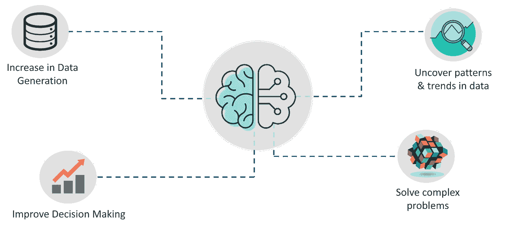
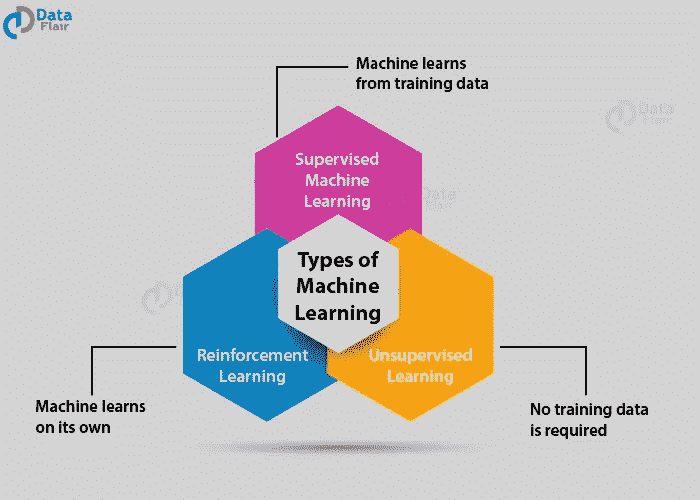

# 熟悉机器学习

> 原文：<https://medium.com/codex/getting-familiar-with-machine-learning-157833418e70?source=collection_archive---------3----------------------->

潘卡杰·帕特尔在 [Unsplash](https://unsplash.com?utm_source=medium&utm_medium=referral) 上的照片

## 在这篇文章中，我会写什么是机器学习，为什么它是山羊。

用 Tom M. Mitchell 的话来说，机器学习是*“一个计算机程序，如果它在 T 类任务中的性能，如 P 所测量的，随着经验 E 的增加而提高，据说它从经验 E 中学习关于某类任务 T 和性能测量 P 的经验”*

我发现这个定义特别有趣，因为它很好地概括了机器学习的作用。通俗地说，我们要说的是，ML 为我们提供了一种给计算机“体验”的方式。使用这种“经验”,所述机器可以预测新数据的相关值/输出。它是人工智能的一个子集，其中机器具有学习能力，而无需显式编程。

当你在 YouTube 上看《老网飞》的时候，你在网上购物时得到的所有推荐，都可以通过 ML 实现。

**我们为什么需要机器学习？**

ML 在现代的重要性是我们不能忽视的。非结构化数据的数量变得不可估量，手动处理此类数据成为一项繁琐的工作。但机器学习不仅有助于为数据提供结构，而且有助于推断模式，并对给定的数据给出见解。这反过来帮助我们解决复杂的问题。通过建立预测模型和使用统计分析，机器学习可以用来找到隐藏的模式，并为我们提供有关数据的重要细节。

# **机器学习的一些应用有:**

**1。面部识别技术**允许用户在社交媒体上标记并与朋友分享图片。

**2。** **推荐引擎**，根据用户喜好提供视频和电视剧推荐。

**3。谷歌的垃圾邮件过滤器**，它使用分类算法(一种 ML 算法)和自然语言处理来实时分析电子邮件，并将电子邮件分类为垃圾邮件或非垃圾邮件。

在我们开始有趣的事情之前，我们需要熟悉一些在 ML 中常用的术语:

**1。算法:**用来学习模式并从中提取重要信息的程序。它们随着经验而改进，无需人工干预。

**2。模型:**它是我们在数据集上运行的机器学习算法的输出，代表了从数据中学到的东西。

**3。预测变量:**它是我们输入数据中的一个特征，有助于预测我们的输出。

**4。** **响应变量:**使用我们的预测变量预测输出变量

**5。训练数据集:**这是一组用于训练我们的算法并获得模式洞察力的数据。由此推出的模式随后用于预测输出。

**6。** **测试数据集:**该数据集用于衡量算法预测的准确性。

# **机器学习的类型:**

机器学习的方式主要有三种:

1.  **监督学习:**

这里，数据集包含“标记数据”。这表明某个输出值与每个输入数据相关联。这允许我们将输入数据与输出标签进行映射，从而确定它们之间建立的模式。这允许我们准确地预测与任何新数据相关联的输出标签。主要有两种类型的监督学习:

**分类:**当我们可以根据输出标签将数据集分组或分类为两个或更多组时。最常见的例子是垃圾邮件过滤器，将我们的电子邮件分为垃圾邮件或非垃圾邮件类别。

**回归:**当我们的输出标签值连续时使用。例如当我们预测房价时。我们无法对房价进行分类，这也没有意义。在这里，我们只关心给定我们房子的特征，如房间数量、面积等，预测价格。

监督学习的一些**应用**涉及**生物信息学、语音识别、垃圾邮件检测。**

监督学习算法的例子:线性回归、逻辑回归、K-最近邻、朴素贝叶斯分类器。

**2。无监督学习:**

这种类型的学习涉及没有相应输出标签的输入数据。由于没有给出标签，机器必须在没有任何指导的情况下推断出模式。因此，未排序的数据基本上是根据特征的相似性进行分组的。无监督学习有两种类型:

**聚类:**输入数据的分组是基于它们具有的相似特征。输入数据更类似于给定组/群集中的任何其他输入，而不是其群之外的任何其他输入。

例如:如果我们要识别一个香蕉和一个苹果，但没有标签或指南来帮助我们对它们进行分类，我们可以简单地使用它们的特征来将给定的水果归类到上述类别中。像香蕉一样，它应该是黄色的，长度较长，而苹果应该是红色的，长度较短。

**关联:**我们在大型数据集中发现输入之间的相互依赖性。这样的规则或相关性可以用来描述大型数据集。

例如，如果一个人买了一个笔记本，那么他很可能也会买一支笔或者其他种类的文具产品。

无监督学习的一些**应用**涉及**信用卡欺诈检测、异常检测、建议下一步购买哪些产品的推荐系统。**

无监督学习算法的例子:K-均值聚类、Apriori 算法、分层聚类、FP-Growth 算法

**3。强化学习:**

它涉及**三个组件**:

1.代理人(学习者或决策者)

2.环境(代理与之交互的一切)

3.行动

在这里，代理被允许从其动作的结果中学习。它涉及一个反馈系统，如果代理人朝着我们的目标状态行动，它会给予奖励，如果代理人远离目标状态，它会给予惩罚。这种类型的学习大多涉及试错。

例如:当我们第一次玩电子游戏时，我们会玩得很笨拙。但是通过反复试验，我们将学会避免可能导致惩罚的行为。

就这样了，伙计们。我希望你能从这篇博客中学到一些东西。非常感谢你坚持到最后！