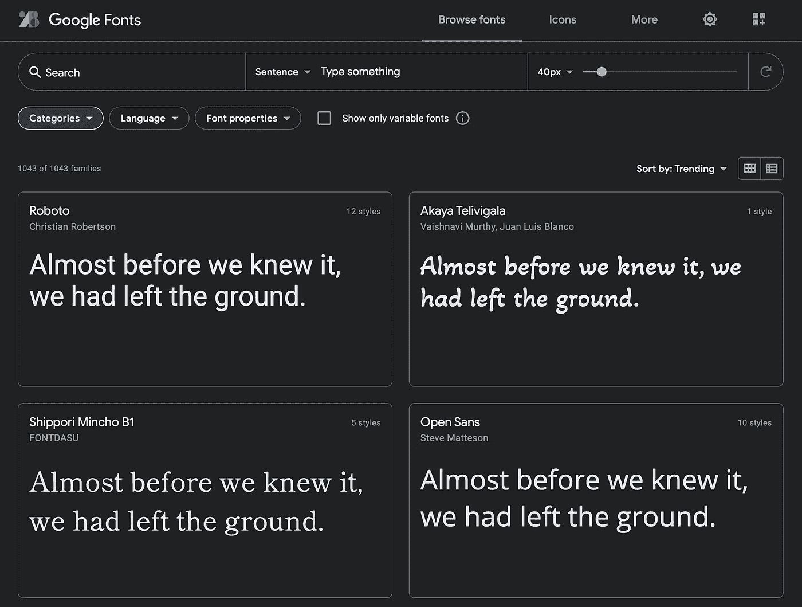
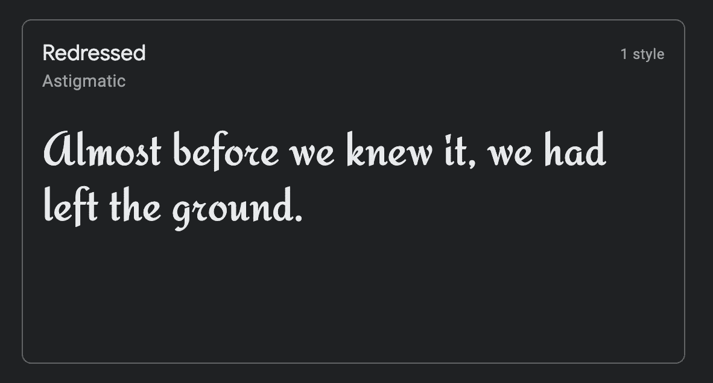
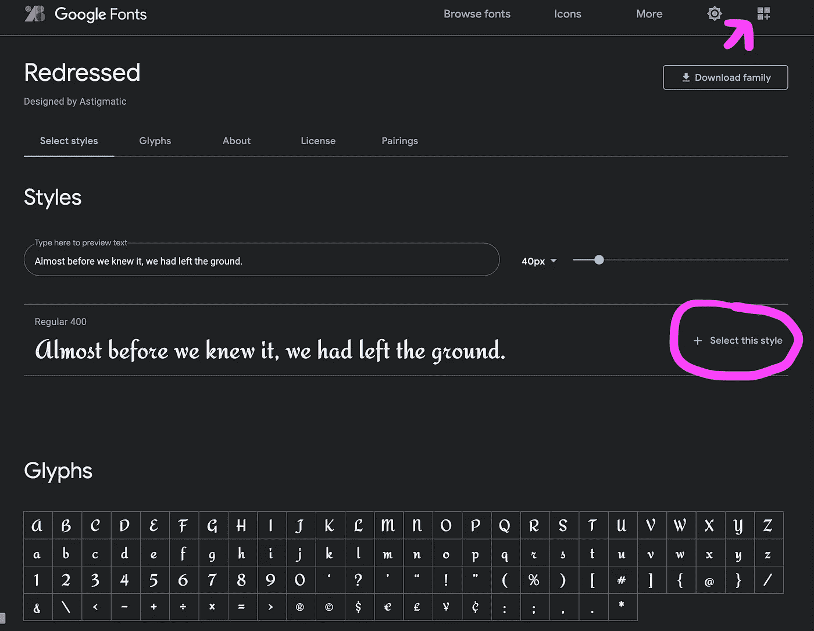
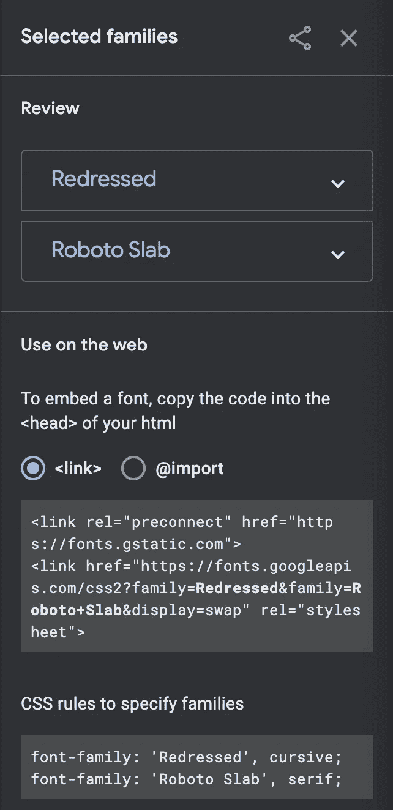
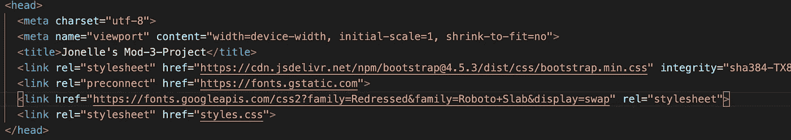
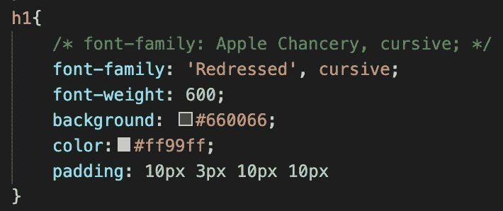
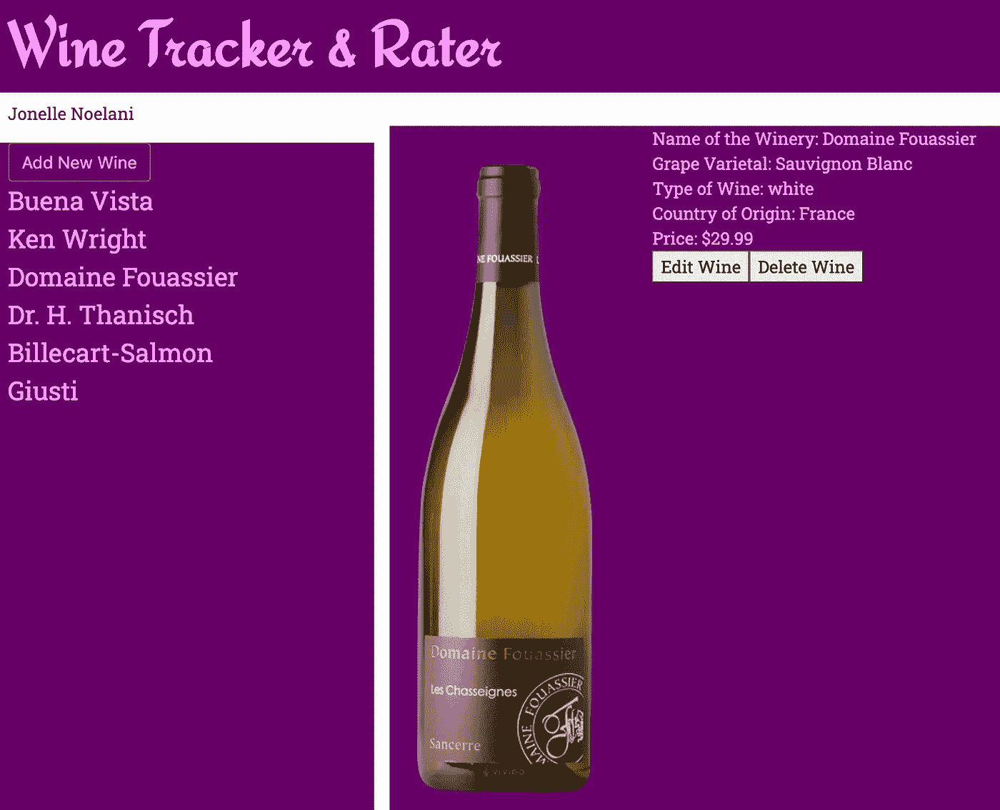

# 越来越喜欢字体了

> 原文：<https://medium.com/codex/getting-fancy-with-the-fonts-5a6c8075a599?source=collection_archive---------6----------------------->

## [法典](http://medium.com/codex)

在准备一个 JavaScript 项目时，我被展示了谷歌网络字体的神奇世界！

谷歌字体

我喜欢排版！

在缩小选择范围之前，我花了一些时间探索。但是，当在 CSS 文件中实现它的时候，事情并不顺利。

也许我选择了少数几种在这种情况下不适用的字体之一。也许我错过了什么。

因为这在当时对我来说是全新的，而且我在时间紧迫的情况下要达到最后期限，所以我决定只留在苹果公司和佐治亚州，继续这个项目。

Web 安全字体列表

 [## CSS 网络安全字体

### 以下是 HTML 和 CSS 的最佳网页安全字体:Arial(无衬线)Verdana(无衬线)Helvetica…

www.w3schools.com](https://www.w3schools.com/cssref/css_websafe_fonts.asp)  [## CSS 字体堆栈:网页安全和网页字体家族与 HTML 和 CSS 代码。

### Web 安全字体是许多操作系统预装的字体。虽然不是所有系统都有相同的字体…

www.cssfontstack.com](https://www.cssfontstack.com/) 

更多字体

 [## CSS:字体

### 另请参见所有提示的索引。在这一页:除了颜色，字体可能是一个页面最基本的属性…

www.w3.org](https://www.w3.org/Style/Examples/007/fonts.en.html) 

嗯，这不可能永远持续下去，所以我现在就要在这里把事情弄清楚。

# 谷歌网络字体

 [## 谷歌字体

### 通过出色的排版使网页更加漂亮、快捷和开放

fonts.google.com](https://fonts.google.com/) 

有一些字体你可以购买许可，但是谷歌字体是免费和开源的。万岁！

在撰写本文时，有 1043 种字体可供选择。

按类别(衬线、无衬线、显示、手写、等宽)、语言和字体属性(样式数量、粗细、倾斜、宽度)缩小选择范围。

默认情况下，它会以句子的形式显示每种字体的例子。此外，您可以查看示例段落表单，也可以键入一组自定义文本，以具体查看它是如何显示的。或者，查看整个字母表或一组数字。

# 选择一种字体

找到一种字体并选择它。你将被带到一个新的页面，在这里你可以查看多种样式(如果它有一个以上)和字形。

对于您想要的每种样式，选择“+选择该样式”。

> 注意:如果你想使用多个谷歌字体系列/样式，只需在导出链接前不断添加即可。最后，所有的字体将被编译成一个方便的链接。

若要检查和移除字体或样式，请选择右上角上方带有红点的框。

# 嵌入字体的链接

当你需要的所有东西都被选中后，点击右上角的那个方框，并对它进行最后一次检查。

复制整个链接标签并粘贴到 html 文件的标签中。

也许可以复制“指定系列的 CSS 规则”并保存在您的笔记中，这样您就可以将它添加到 CSS 文件中。

太简单了。我不确定我上次哪里出错了。

我可能选择了“Download family”按钮，它位于带红点的方形按钮的正下方，这将为您提供一个. ttf 文件(True Type 字体)以包含在您的项目目录中。也许我下次会探讨这个问题。

