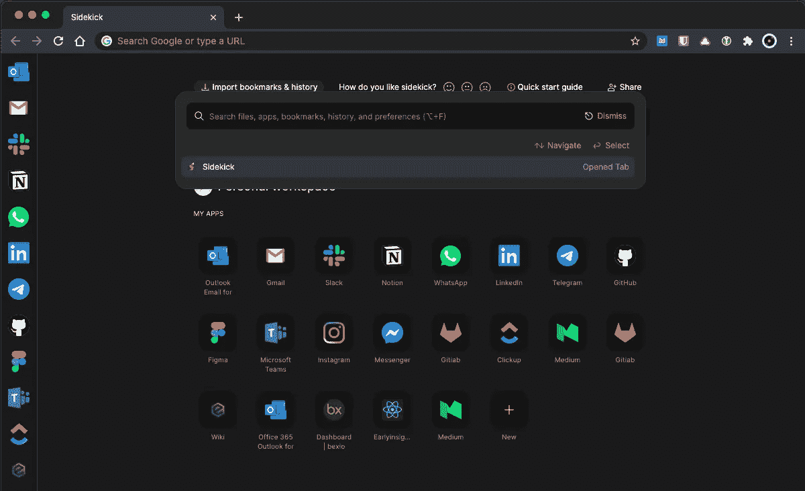

# 让 KeePassXC 浏览器集成在 Sidekick 浏览器中工作

> 原文：<https://medium.com/codex/getting-keepassxc-browser-integration-to-work-in-sidekick-browser-a7effd0e6fcb?source=collection_archive---------1----------------------->

## [法典](http://medium.com/codex)

助手浏览器

# TL；速度三角形定位法(dead reckoning)

本指南不仅适用于 Sidekick 浏览器，也可能对没有从直接支持的 KeePassXC 浏览器集成中受益的其他浏览器有所帮助。macOS、Linux 和 Windows 的原理是一样的，只是文件路径不同。

1.  安装 KeePassXC…