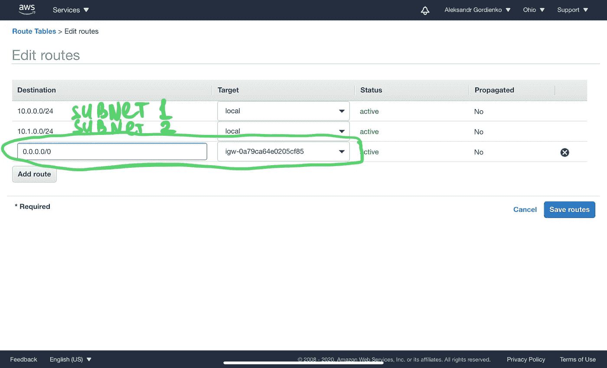
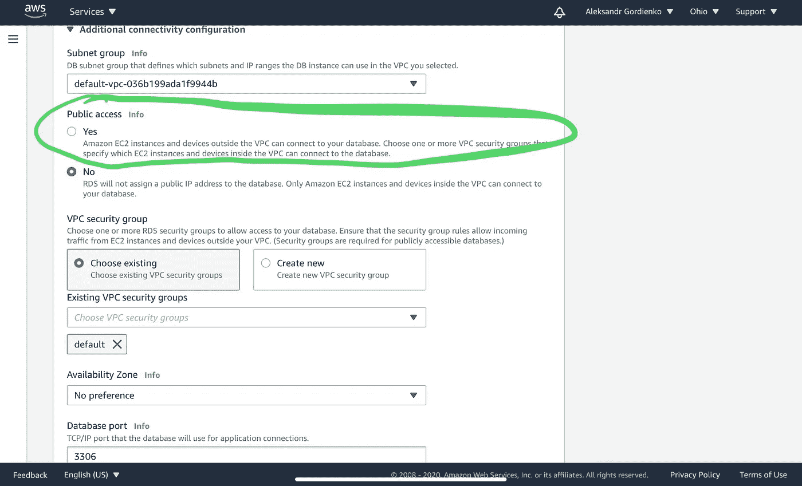

# 入门:AWS RDS

> 原文：<https://medium.com/codex/getting-started-aws-rds-f2594886a255?source=collection_archive---------0----------------------->

凯尔·桑在 [Unsplash](https://unsplash.com?utm_source=medium&utm_medium=referral) 上的照片

亚马逊在许多领域都是众所周知的领导者，尤其以其灵活的超高速云网络服务而闻名。Amazon Web Services (AWS)提供了 200 多种不同用途的服务，比如计算节点、数据库实例、文件存储等等。

本文的目的是为您提供关于如何为您的研究或新的工作项目设置 AWS 关系数据库服务的简单分步信息。*假设你已经有一个 AWS 计费账户。*

1.  建立一个新的 VPC 或使用一个你已经有的。VPC 代表虚拟私有云。这是一种有助于将 AWS 帐户中的资源划分为不同网段的机制。不要忘记使用两种不同的 CIDR。你可以点击阅读[更多关于 CIDR 符号的内容。](https://link.medium.com/kxk1Rz40xab)
2.  如果您打算从 AWS 外部使用您的新数据库，您必须设置一个 Internet 网关并将其连接到您的 VPC。创建 Internet 网关后，您应该允许通过路由表和 VPC 安全组传入到您的 VPC 的连接。如果您希望 RDS 可用于任何外部 IP，请在目标中输入 0.0.0.0/0。并选择您最近创建的互联网网关作为目标。

3.最后，您可以创建新的 RDS 实例。转到 RDS 部分，单击“创建数据库”按钮，然后选择正确的参数。例如，我将在 AWS RDS 上创建一个 MySQL 数据库(在某些情况下，您可以免费使用它— [请阅读关于自由层的页面](https://aws.amazon.com/free/))。我希望它可用于本地计算机上的软件连接，因此我将在下一个屏幕上选择这些选项:

*   引擎类型 MySQL
*   模板自由层
*   输入数据库实例和管理员身份证明的名称
*   选择现存的 VPC
*   扩展附加连接配置，并圈出对新数据库实例的外部访问的公共访问
*   此外，您可以使用其他参数，例如，选择软件更新和备份的维护窗口。

