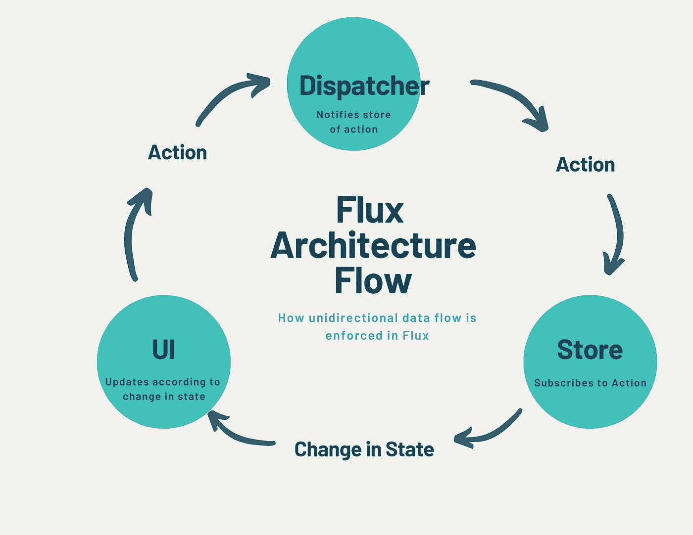
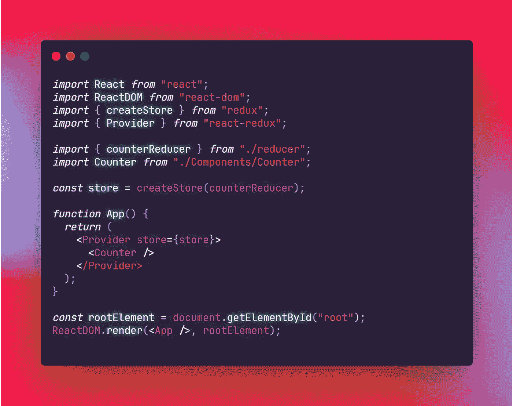
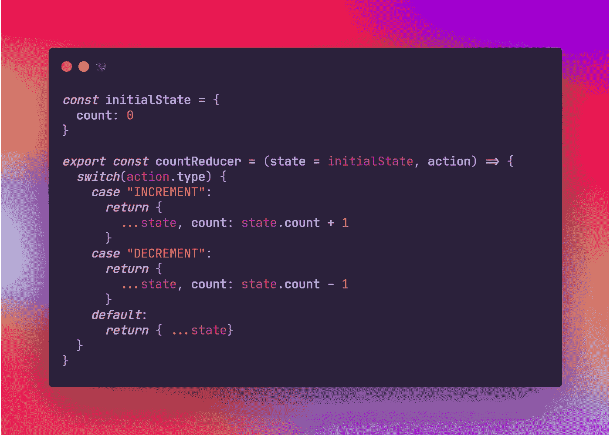
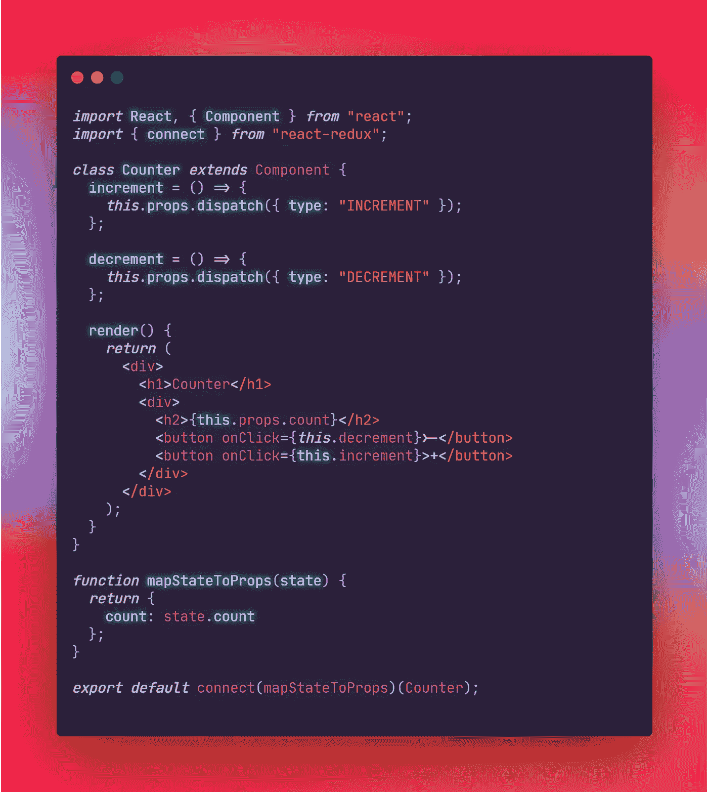

# Redux 使用入门

> 原文：<https://medium.com/codex/getting-started-using-redux-4dcf6845535d?source=collection_archive---------14----------------------->

## 使用缩减器、动作和调度程序的单向状态管理

你好！今天我将讨论使用 Redux 的状态管理，这是一个基于 Flux 的框架，用于在 react 中管理状态时实施单向数据流。这个流行的框架，尽管很小，却产生了一点影响，并且一直沿用至今。当涉及到在所有样板文件中涉水时，学习 Redux 可能有点令人头痛。这篇文章有望帮助读者更好地理解 Redux。事不宜迟，让我们开始吧！

# 通量架构

尽管 Redux 基于 Flux 架构，但 Flux 本身根本不是一个框架或库。事实上，通量架构是一种模式。通量流以单向流动的三点环形模式管理其事件。这种*单向数据流*的思想被 Redux 采用，由类似的架构组成。在 Flux 中，状态变化在一个*动作*中描述，然后被发送到一个*调度器*，在那里一个定义的动作将处理状态变化。最后，状态被保存在*存储器*中，以便在下一次状态改变时发送给调度程序。

通量架构流程(在 [Canva](https://canva.com) 创建)

简而言之，存储订阅动作，这些动作被发送给调度程序，然后调度程序通知存储该动作并相应地更新其状态，如果需要，更新视图，然后等待下一个动作来重复该过程。

# Redux

Flux 对单向数据流的强制是 Redux 的基础。这个框架允许我们的 React 应用程序为它们的状态维护一个单一的真实来源。使用 Redux 来集中我们的状态相关逻辑，我们可以重新关注组件架构。基于功能的组件现在可以专注于单个角色。此外，它在架构上的简单性使它成为管理组件之间复杂交互的首选。

要在 React 应用程序中开始使用 Redux(假设您已经有了 React 前端)，您可以通过从终端运行`npm install redux react-redux` 或`$yarn add redux react-redux`来安装 Redux 以及 React-Redux 绑定。

在项目根，我们可以从 React-Redux 库中导入一个提供者到`index.js`。Provider 模块允许我们访问应用程序状态所在的存储区。要做到这一点，我们可以从 Redux 库导入`createStore`来从一个 reducer 创建一个 store 对象，稍后我们将对此进行更多的讨论。下面的例子来自一个示例计数器应用程序，它使用一个`counterReducer`来保存我们状态的初始值。

index.js(创建于 https://carbon.now.sh)

# 还原剂

如前所述，我们还需要一个存储对象来保存应用程序的状态。我们的商店可以订阅从调度程序接收的动作作为状态更新。当编写一个规约时，我们必须为我们的状态传递一个初始值。对于`counterReducer`来说，这意味着初始计数为零。

一个 reducer 还需要接收一个 action 对象，该对象包含修改我们状态的一个*副本*并返回该副本的属性。记住我们不能直接修改状态，这使得我们避免做类似于`return state.count++`的事情变得很重要。该示例演示了两种操作类型；一个用于递增计数，一个用于递减计数。可以选择将动作类型作为字符串常量存储在各自的文件中，即`const INCREMENT = “INCREMENT”`，尤其是在处理多个动作时。这样，你可以把所有的动作类型放在一个地方。下面的例子是一个较小的项目，所以声明动作类型的字符串常量。

reducer.js(创建于 [https://carbon.now.sh)](https://carbon.now.sh))

Redux 强制执行这个流，目的是保持状态树不变。不要直接改变状态！上面的例子使用一个[扩展操作符](https://devdocs.io/javascript/operators/spread_syntax) *，*返回状态，它将为其中的每个键值对扩展我们的状态对象。spread 操作符创建了一个对象文字的副本，我们可以使用动作创建器代替状态对象本身来修改它。

# 调度员

为了分派我们已经定义的动作，我们可以使用分派函数来通知存储需要执行的动作。下面的示例通过在每个操作的方法中调用 dispatch 函数来实现 dispatch 函数的使用。

现在你知道了！如果您运行这个 React 应用程序，您将有一个简单的计数器，它有一个增加显示的计数的按钮和一个减少计数的按钮。(如果您想保持您的功能组件的纯净，您可以简单地分别定义您的调度程序。)

今天就到这里吧！查看下面的链接，获得更多关于使用 Redux 的学习资源，包括 Redux 文档以及一本介绍实现 Redux 来反应应用程序的基础知识的书。感谢阅读！下次见！

## 引用的消息来源

" API 参考| Redux。"*Redux——JavaScript 应用的可预测状态容器。| Redux* ，[https://redux.js.org/api.](https://redux.js.org/api.)2021 年 8 月 2 日访问。

丁克维奇、鲍里斯和伊利亚·格尔曼。*完全还原本*。Leanpub，2017 年，第 12–24 页。