# AWS EC2 Linux 上的 Aerokube Selenoid 入门

> 原文：<https://medium.com/codex/getting-started-with-aerokube-selenoid-on-amazon-aws-linux-416901bd2fe?source=collection_archive---------7----------------------->

Selenoid 是原 Selenium hub 代码的一个强大的 Golang 实现。它使用 Docker 来启动浏览器。

你可以在这里阅读更多关于 Selenoid 的信息

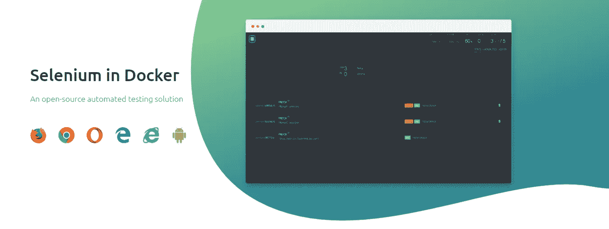

在本文中，我们将主要探讨如何在 Amazon EC2 Linux 实例中安装 Selenoid，并在 AWS 中为您的跨浏览器兼容性测试设置 selenio 网格，让我们开始吧。

## **步骤 1:创建一个 AWS EC2 Linux 实例**

先决条件:你需要一个 AWS 帐户，你可以导航到[注册](https://portal.aws.amazon.com/billing/signup#/start/email)页面创建一个帐户。

注册后，登录 AWS 管理控制台并导航到 AWS EC2，这是一项可用于创建虚拟机的计算服务。它们提供了从 Linux、Ubuntu、Windows 和 macOS 开始的广泛选择。在我们的例子中，我们将使用一个基于 Linux 的实例。需要注意的一点是，EC2 实例是区域性服务，您可以在单个区域或跨区域创建多个实例。您可以根据控制台页面上的下拉列表检查您当前选择的区域。

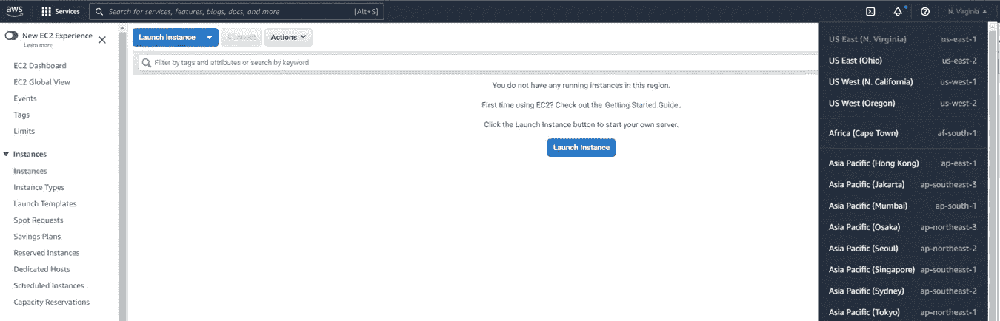

AWS EC2 仪表板

您可以选择一个靠近您的地理位置的地区，然后继续创建 EC2 实例。

[](https://aws.amazon.com/about-aws/global-infrastructure/regions_az/) [## 全球基础设施区域和 az

### AWS 有一个区域的概念，它是我们在世界各地聚集数据中心的物理位置。我们称之为…

aws.amazon.com](https://aws.amazon.com/about-aws/global-infrastructure/regions_az/) 

单击 EC2 仪表板上的“启动实例”按钮，您将被导航到下面的页面。

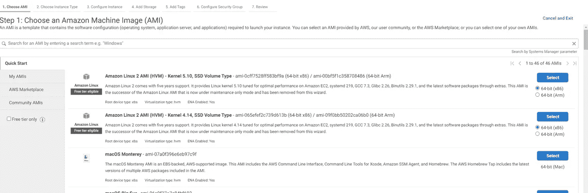

使用 AMIs 创建 EC2 实例

出于演示目的，我们将选择任何可用的“Amazon Linux 2 AMI”机器，这将把我们重定向到“选择实例类型”页面。

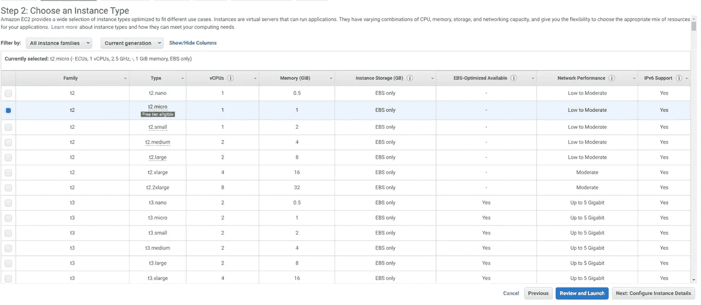

选择实例类型

在我们的例子中，我们将继续选择 t2.medium 实例类型。安装完成后，您可以终止 t2.medium 实例，这样就不会产生太多的成本。由于这些是按需实例，您将根据使用情况付费，一般来说，您的口袋不会太重。我们还可以选择“符合空闲层条件”的 t2.micro 实例类型，但您可能会注意到使用此实例类型时速度有些慢，因为 vCPUs 的数量和内存大小相对小于其他实例。

点击“配置实例详细信息”按钮，在此页面中您可以选择默认选项，默认情况下 AWS 将为您分配一个 VPC(虚拟私有云)、子网等。您可以单击添加存储移至下一页。

在“Add Storage”页面上，您可以将默认存储值保留为 8gb，也可以将其略微增加到 10 或 12gb。由于 Selenoid 将为 Firefox、Chrome 和 Opera 浏览器提取许多 docker 图像，这会占用相当多的空间。因此，如果您针对实例类型相应地调整存储以避免任何空间问题，效果会更好。在我的情况下，我一直保持在 10 吉卜。

接下来，您可以添加或跳过“添加标记”页面，转到“配置安全组”页面。

安全组:这是需要正确更新的最重要的步骤，以便您访问您的 Selenoid Hub URL & Selenoid UI 页面。

您可以创建一个新的安全组，并根据添加的快照添加下述规则。请注意，我已经编辑了该图像以删除我的 IP 详细信息，在您的情况下，如果您选择“Source”下的“My IP”下拉选项，您的 IP 详细信息将会自动填充。如果您希望您的实例可以从任何 IP 访问，您也可以选择 Source:“Anywhere”

您需要为 Selenoid 公开以下端口:

22 —用于连接 EC2 实例
4444 的 SSH 端口—这是 Selenium HUB URL 端口
8080 —您可以通过该端口访问 Selenoid UI

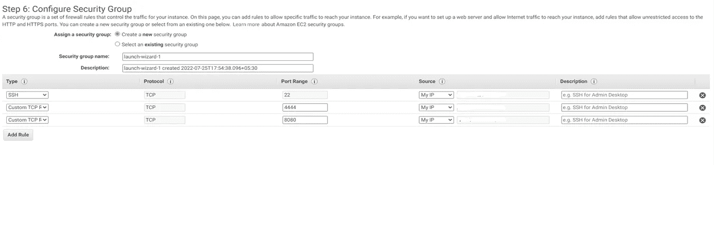

配置安全组

您可以选择为您的安全组提供名称和描述，这将有助于将来创建任何新实例，因为您还可以选择以前创建的安全组。

最后，我们是实例创建的最后一步，您需要单击按钮“Review and Launch”。这将打开“Review”页面，您可以验证并确认所选的详细信息和选项，发布后您可以单击“Launch”按钮来启动 EC2 实例。

单击启动按钮，您将看到如下所示的“选择或创建新的密钥对”窗口。

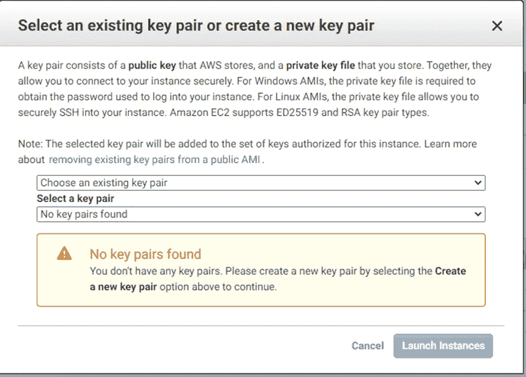

选择或创建 EC2 密钥对

由于这是一个全新的设置，您可以在第一个下拉菜单中选择“创建新的密钥对”选项。在文本框中提供一些相关的“密钥对名称”,然后单击下载密钥对按钮。这将下载一个. pem 文件，该文件可用于 SSH 并登录到您的 EC2 实例。

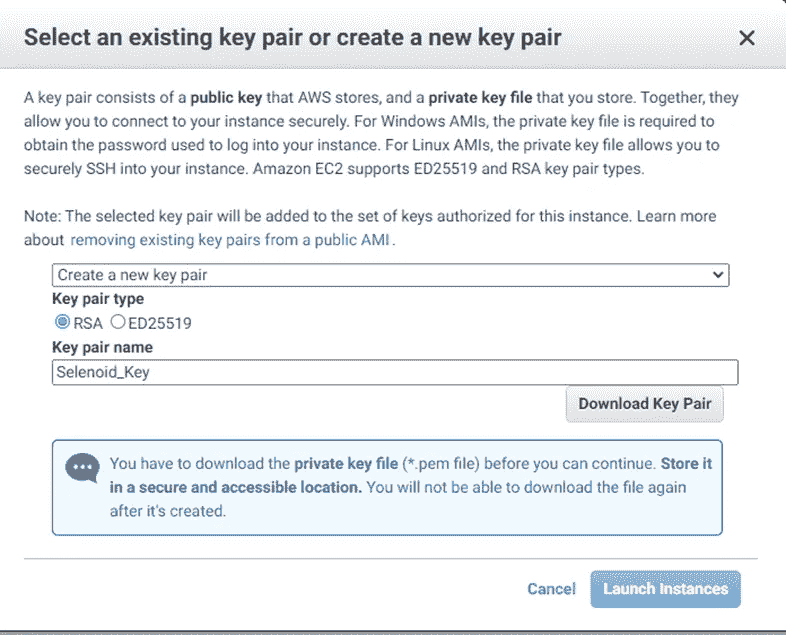

下载密钥对并启动实例

单击“启动实例”按钮，这将启动您的 AWS EC2 Linux 实例。您需要等待几分钟，让实例完全启动并运行。

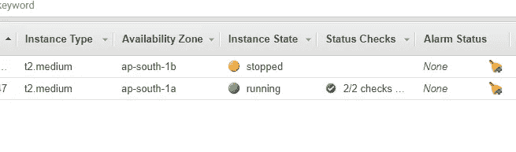

EC2 运行状态

## **步骤 2:连接到创建的 AWS EC2 实例**

登录 EC2 实例有多种方式，在本文中，我们将使用下载的。pem 文件登录并访问我们的 EC2 实例。

1.  打开命令提示符窗口或 mac 终端，将命令 cd 所在的目录更改为下载。pem 文件。就我而言。pem 文件存储在下载文件夹中，所以我将只执行

```
cd Downloads
```

2.接下来，为了对实例执行 SSH，我们可以参考下面的命令模板

> ssh -i 文件名. pem ec2-user@ec2-public-ip

作为我的。pem 文件命名为:Selenoid_Key.pem，我的 ec2-public-ip 是 43.205.128.212，我需要执行的命令应该如下所示。*(注:这将根据您的设置而变化。pem 文件名和公共 IP 地址将不同)*

```
ssh -i Selenoid_Key.pem ec2-user@43.205.128.212
```

3.输入上述命令并按 ENTER 后，将显示一个问题提示，要求将主机添加到您的 known_hosts 文件中。只需键入 yes 并按回车键。您应该登录到您的实例。

登录到 EC2 实例后，您需要执行的第一个命令是更新机器中所有可用的现有依赖项和库。您可以使用下面的命令来完成。

```
sudo yum update -y
```

## 步骤 3:在 AWS EC2 实例中安装 Docker

验证 docker 是否已经安装在您的 EC2 实例中，只需键入“Docker”并按回车键，如果您得到一大堆细节，如下面的快照，这意味着 Docker 已经安装在您的 EC2 实例中。您可以跳过 Docker 安装步骤，继续前进。

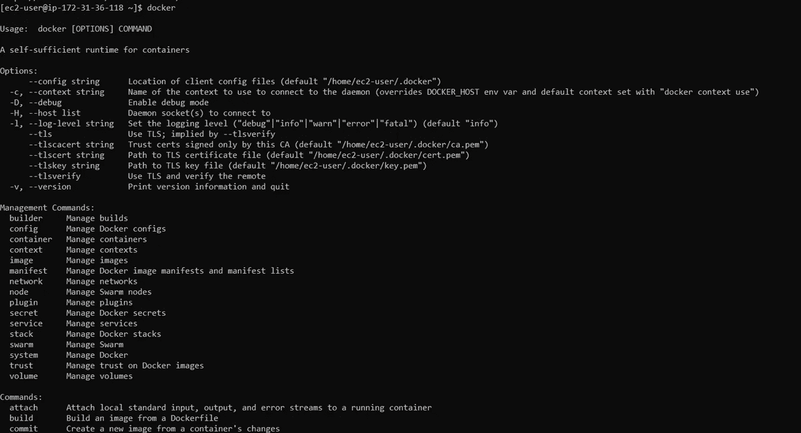

否则，您可能需要使用以下命令安装 Docker:

```
sudo yum install docker -y
```

安装后，您可能需要启动 Docker 服务，您可以执行下面的命令来启动 Docker 服务。

```
sudo systemctl start docker
```

您可以使用下面的命令来验证 Docker 是否正在运行，您应该能够看到 Active(正在运行)

```
sudo systemctl status docker
```

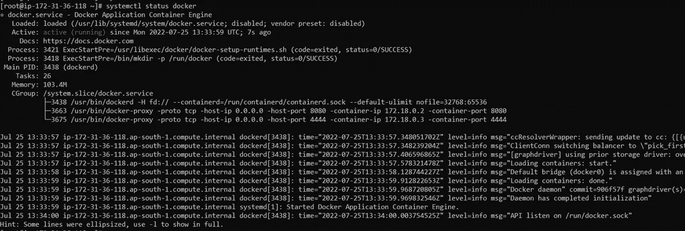

Docker 服务激活

## 步骤 4:安装 Selenoid 和 Selenoid UI

首先，我们需要下载配置管理器，这里我用的是 Linux 版本 1 . 8 . 1[发布](https://github.com/aerokube/cm/releases/latest)

```
sudo wget “[https://github.com/aerokube/cm/releases/download/1.8.1/cm_linux_amd64](https://github.com/aerokube/cm/releases/download/1.8.1/cm_linux_amd64)”
```

接下来，我们将不得不对使用 wget 命令下载的配置管理器二进制文件授予执行权限。

```
sudo chmod +x cm_linux_amd64
```

使用以下命令启动 Selenoid，这可能需要几分钟，因为它将下载所有相关的 selenoid 图像和不同的浏览器图像 Chrome、Firefox 和 Opera。

```
sudo ./cm_linux_amd64 selenoid start –vnc
```

将 ec2 用户添加到 Docker 组

```
usermod -aG docker ec2-user
```

启动 Selenoid UI

```
./cm_linux_amd64 selenoid-ui start
```

Post，执行所有上述命令您可以使用下面的命令来验证是否所有的图像都已被成功拉入。

```
docker images
```

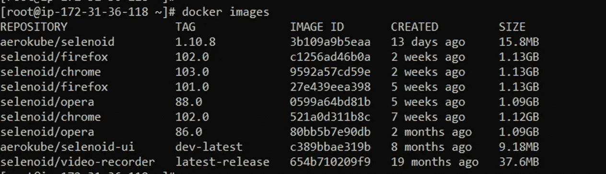

拉出来的月形图像

除了 aerokube/selenoid、aerokube/selenoid-ui、selenoid/ video-recorder 图像之外，您还应该能够看到以下浏览器图像:带有不同标签或版本的 Firefox、Chrome 和 Opera。

使用下面的命令检查所有正在运行的容器

```
docker ps
```

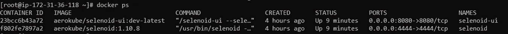

月形容器

## 步骤 5:从浏览器访问 Selenoid UI

你可以从你的浏览器访问 Selenoid 用户界面，为此你需要导航到网址:http://43.205.128.212:8080

这里的 IP 地址:43.205.128.212 是我创建的 EC2 实例的公共 IP，在您的情况下，公共 IP 将会不同。在 EC2 安全组中，我们通过添加 TCP 规则允许端口 8080 上的流量，因此我们应该能够使用公共 IP 地址和端口 8080 访问 Selenoid UI。

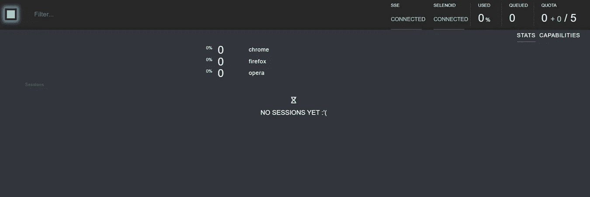

Selenoid UI

## 步骤 6:在 Selenoid 网格中执行测试脚本

终于，我们到达终点了！！我们需要使用 Selenium Grid concept:desired capabilities 和 RemoteWebDriver 类，其中我们需要传入所有适用的功能和 Selenoid grid hub URL 详细信息，这些信息将用于在 Selenoid 中可用的相应浏览器容器中连接和运行 Selenium WebDriver 测试。

下面是一个带有 Chrome 版本 102.0 的 Java 的 DesiredCapabilities 示例，可以从 Selenoid UI 页面引用。在浏览器设置期间，我们需要在测试自动化脚本中配置类似的东西。

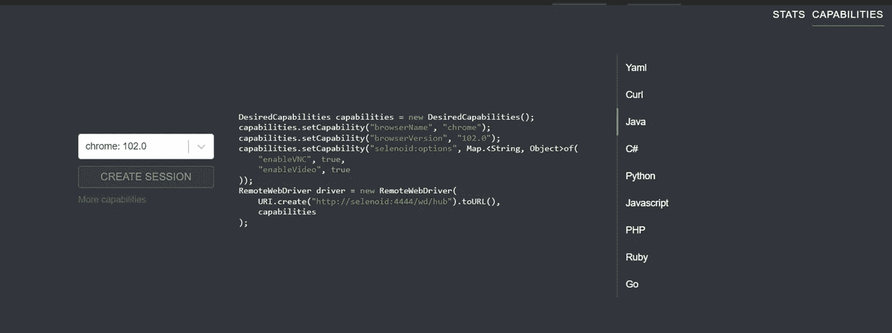

下面是一个非常简单的方法，我们可以在我们的设置脚本中配置细节，浏览器和版本细节是从 TestNG 参数传递的。目前，我只是使用 TestNG BeforeMethod 注释来初始化和设置 Selenoid 测试的所有浏览器功能。

由于我们已经将 enableVNC 和 enableVideo 的功能设置为 true，我们应该能够在 Selenoid UI 中查看正在运行的测试，并获得所有测试执行的视频输出文件，这非常有用。

所有请求都应该传递到我们的 Selenoid Hub URL，在我们的例子中是[http://43.205.128.212:4444/wd/hub](http://43.205.128.212:4444/wd/hub)(在您的例子中，您可以用您的 ec2 实例公共 IP 地址替换 IP 地址)。端口 4444 暴露在 EC2 安全组中。从 hub，节点请求将根据传递的功能被重定向到适当的浏览器。

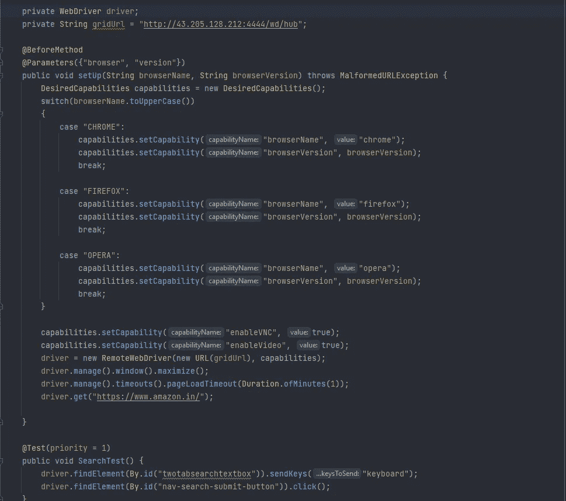

样本测试类

查看在 Selenoid 中执行的测试脚本

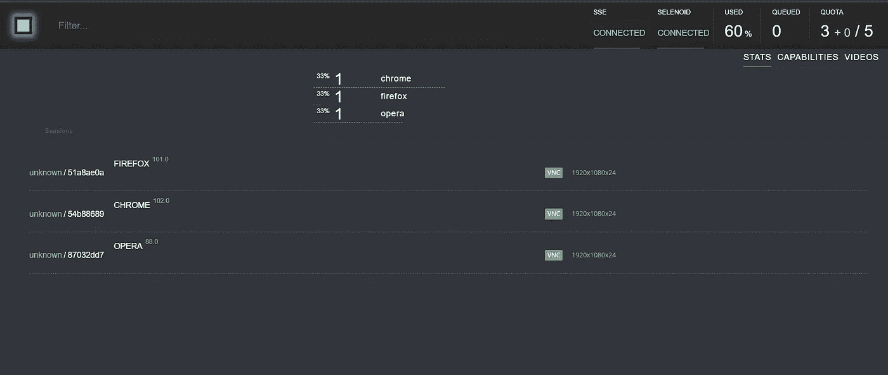

Selenoid UI —执行

您可以单击相应的浏览器会话来查看正在执行的脚本。执行后，容器将被处理掉。

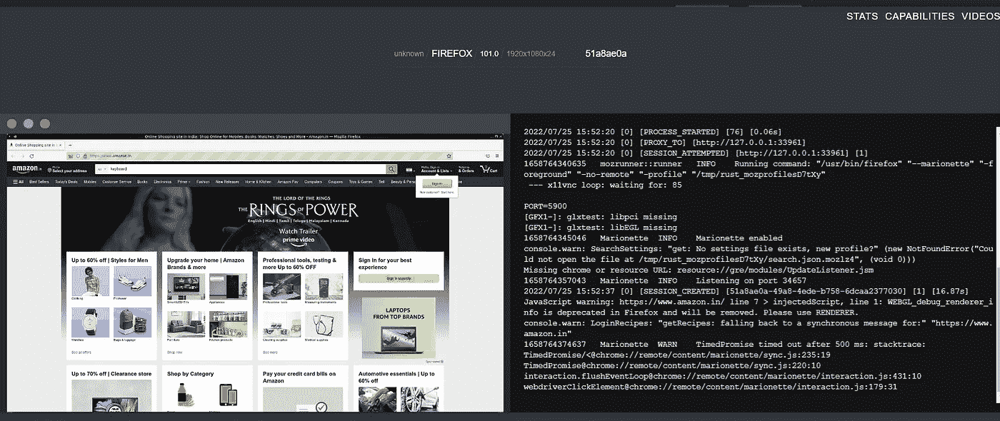

VNC 进行测试

视频还将在视频部分生成，可用于日志记录、收集证据或调试目的。

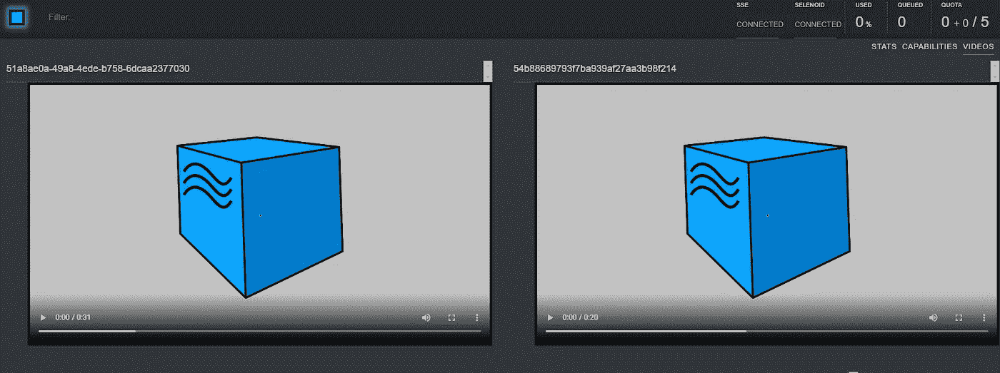

实际操作之后，一定要确保终止正在运行的 EC2 实例，方法是转到 Actions 并选择“实例状态”下的 terminate 选项，以避免对您的帐户收取过多的费用。

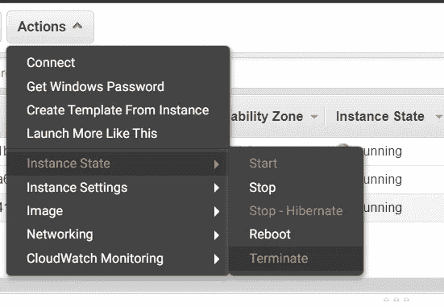

希望本文对您在 AWS EC2 实例中设置 Selenoid 和 Selenoid UI 有所帮助，如果您有任何问题或疑问，请告诉我。

感谢阅读！！干杯！！