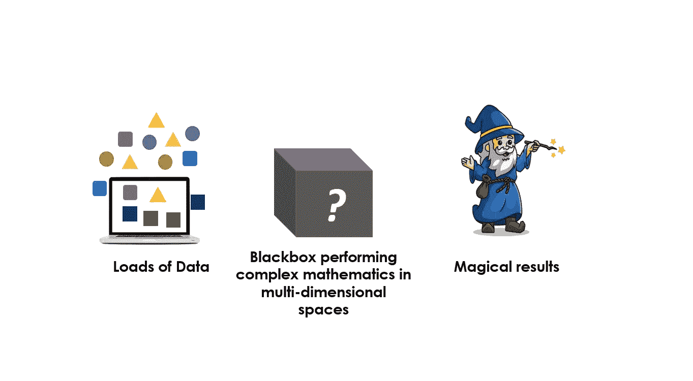
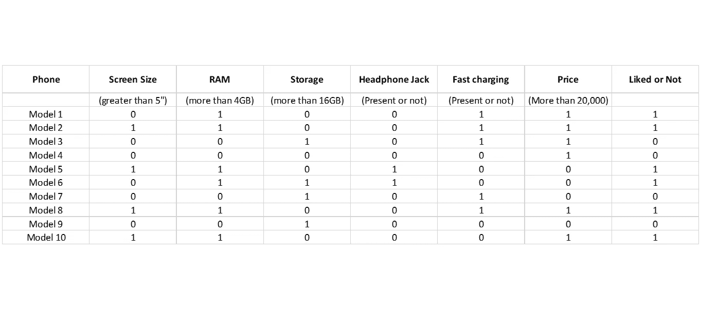
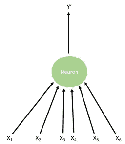
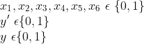
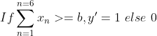
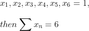
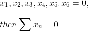
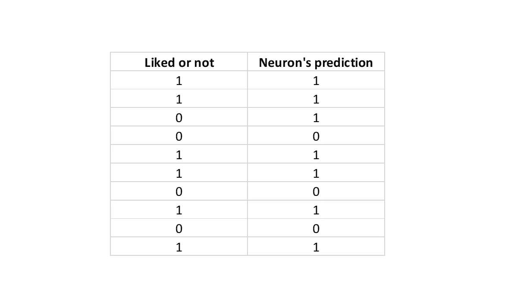

# 人工智能和深度学习入门

> 原文：<https://medium.com/codex/getting-started-with-artificial-intelligence-and-deep-learning-eb6d4694e652?source=collection_archive---------8----------------------->

## 推动未来发展的基本概念介绍

如果你曾经在网上购物，订阅了 OTT 平台，或者偶然在 YouTube 上看到了自动驾驶特斯拉的片段，你可能对*人工智能、机器学习、深度学习、计算机视觉*等术语很熟悉。这些是这些技术背后的驱动概念。虽然大多数人认为革命就在眼前，但这个计算机科学领域尚未开发的潜力及其对全球经济的影响是一个热门话题。麦肯锡的研究通过模拟描绘出，到 2030 年，大约 *70%* 的公司可能会依赖基于人工智能的服务。虽然人工通用智能，或能够执行不同任务和积累智力的系统距离现实很远(就像我们在科幻电影中遇到的那样)，但针对特定任务的人工智能给了我们很多工作。


由[凯文·Ku](https://unsplash.com/@ikukevk?utm_source=unsplash&utm_medium=referral&utm_content=creditCopyText)在 [Unsplash](https://unsplash.com/s/photos/coding?utm_source=unsplash&utm_medium=referral&utm_content=creditCopyText) 上拍摄

因此，让我们从实际定义我们谈论过的术语开始。人工智能是机器对人类智能的模拟，是对学习、解决问题或预测等特征的模拟或模仿。*机器学习*建立在这些人工智能概念的实现之上，并涉及计算机算法的开发和研究，当暴露于数据和经验时，这些算法可以自我改进。*另一方面，深度学习*是其中的一个子集，它专注于处理和学习数据，就像我们的大脑一样，通过建立一个人工单元网络，用未标记或非结构化数据进行训练。

尽管这些技术被广泛使用，不幸的事实是我们大多数人并不熟悉这些系统是如何工作的。当然，我们都知道特斯拉配备了环绕摄像头，可以绘制道路地图，但接下来呢？这些数据去哪里了？

这是大多数人对智能系统的普遍看法。



魔术师插图:由 [Freepik](https://www.freepik.com/) 设计

然而，事实并非如此。让我们慢慢解开这是如何工作的。

我们在每个应用程序中的最终目标是将决策过程委托给我们的机器。因此，我们将通过首先定义一个决策问题来说明这个过程。假设我们的目标是预测用户是否会喜欢特定型号的手机。我们得到了大约 10 种不同手机的数据。如下所示。



按作者分类的表格

有 6 个参数，我们必须在其中做出决定，最后一列显示结果，无论用户喜欢与否。为简单起见，每个参数仅以二进制显示，例如，屏幕尺寸大于 5”(是或否，0 或 1)，大于 4GB RAM(是或否，0 或 1)。这是我们的*玩具数据集，*仅用于说明。另一方面，现实生活中的数据非常大(可能有大约一百万个不同的样本)，更复杂(实数，而不仅仅是二进制值)，结构化程度较低，未标记，需要一些预处理技术来为学习做准备。然而，对于我们的例子来说，这个简单的数据集就足够开始了。

我们需要将这些数据中的输入与它们相应的输出关联起来，为此，我们必须首先定义一个*模型、*或一段代码来为我们做这件事。在深度学习中，这被称为*神经元、*或数据和计算将流经的节点。神经元一词的灵感来自生物神经元，生物神经元是神经系统的基本功能单位，有助于决策。

我们将从一个非常简单原始的神经元开始，如下图所示。



作者图片

我们这里的神经元将提取一个样本，比如上表中的模型 1。模型 1 有 6 个不同的参数，作为神经元的 6 个输入，从`x1` 到`x6­`。神经元给出输出`y’`，这是它的预测，表中的真实输出表示为`y`。对于我们的数据，



我们必须训练神经元高度准确地预测结果。让我们看看这是如何做到的。

对于我们简单的神经元，我们可以通过一个简单的过程将输入与输出联系起来。给定我们的输入，我们可以得到它们的和。现在，如果这个和大于给定的阈值，我们的神经元将预测 1，否则为 0。这表现为:



我们有我们的数据；我们已经建立了一个原始模型并定义了我们的任务。现在对于我们的神经元来说，我们需要确定这个阈值 *b* ，这样我们的精确度就可以最大化。为我们的神经元确定正确的参数被称为*学习*或*训练*，这是最具挑战性的任务。我们为训练定义的方法被称为*学习算法。鉴于我们的数据很简单，我们不必定义复杂的算法，当我们讨论复杂的神经元、模型和任务时，我们会这样做。*

对于我们的问题，我们将使用*强力*方法，其工作方式如下:

假设在我们的表数据中，存在一个所有参数都打开的样本，即，



我们还有另一个例子，



因此，我们的神经元可以计算的最大值介于 0 和 6 之间。在这种情况下，一个好的方法是尝试从 0 到 6 的 *b、*的所有值，并查看哪一个会给我们提供最大的数据精度。我们的数据显示 b 的值是 3。实际结果和模型预测如下所示。



按作者分类的表格

我们在模型上的准确性是样本总数的正确预测数，即 90%。

我们研究的这种神经元被称为麦卡洛克-皮茨神经元，简称 MP 神经元，由沃伦·麦卡洛克和沃尔特·皮茨于 1943 年建立。这是最基本和最原始的神经元，启动了我们今天所知的人工智能和深度学习的发展。

对于那些熟悉 Python 的人来说，我们可以写下一些基本的代码块来运行我们到目前为止所研究的 MP 神经元架构。在深度学习中，写下我们可以简单地调用我们的数据来训练我们的模型的类是很常见的。我们的 MP 神经元类如下所示:

```
class **MPNeuron**:def **__init__**(self):
  self.b = Nonedef **model**(self, x):
  pred = 1 if np.sum(x) >= self.b else 0
  return preddef **predict**(self, X_train_data):
  model_prediction = []
  for x in X_train_data:
    predict = self.model(x)
    model_prediction.append(predict)
  return model_predictiondef **train**(self, X_train_data, Y_train_data):
  acc_b = []
  for b in range(0,X_train_data.shape[1],1):
    self.b = b
    y = self.predict(X_train_data)
    z= accuracy_score(y , Y_train_data)
    acc_b.append(z)
  self.b = acc_b.index(max(acc_b))
  print('highest value of accuracy is', max(acc_b) , 'for b equal to              ',   acc_b.index(max(acc_b)))
```

这里`self.b`是我们必须确定的阈值。`X_train_data`和`Y_train_data`是输入和真实输出，就像我们从表中看到的，以 NumPy 数组的形式。模型函数返回对`X_train_data`中给定输入的预测。训练函数运行一个从 0 到所有输入参数长度的循环，并计算每个 b 值的精度。该精度存储在列表`acc_b` 中，然后返回精度最高的 b 值。`accuracy_score` 可以从库`sklearn.metrics`中导入，并以预测输出和真实输出作为输入，为我们进行精度计算。

使用这个类的基本过程是首先形成两个数组，一个是 2-D 的`X_train` 数据，每行作为一个样本，另一个是 1-D 的`Y_train` 数组。然后，我们将实例化该类，并调用 train 函数，如下所示:

```
mp_neuron = MPNeuron()
mp_neuron.train(X_train,Y_train)
```

如果我们有测试数据，一旦我们训练了模型，我们就可以对它调用预测函数来获得每个样本的预测数组。

所以现在我们已经看到了深度学习的基本单元，神经元，以及其工作的简化示例。在接下来的帖子中，我们将讨论这种神经元的一些缺点，并研究更复杂的神经元。我们还将讨论神经网络的基本框架，并深入更复杂的学习算法。在此之前，您可以在 Python 上随意尝试一下。快乐训练:)