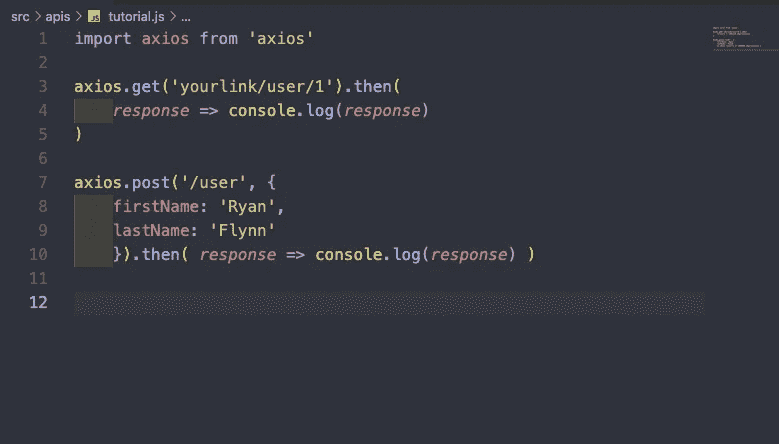

# Axios 入门

> 原文：<https://medium.com/codex/getting-started-with-axios-3d7836ab555e?source=collection_archive---------1----------------------->

如果您曾经需要发出一个 JavaScript HTTP 请求，您可能会默认使用一个经典的 fetch 请求。您可能已经注意到，您必须不断地写出您的头，并使用类似于`JSON.stringify()`的东西解析您的数据。Axios 是一个第三方 HTTP 客户端，它通过预先解析数据对象来简化这个过程。在这篇博客中，我将向您展示如何使用 Axios 发出 GET 和 POST 请求，这样您可以简化您的请求。

# **安装 Axios**

你要做的第一件事是要么使用`npm install axios`安装 Axios，要么使用 HTML 中的 CDN 链接:``。如果您在安装过程中遇到任何问题，这里有一个到文档的[链接。](https://github.com/axios/axios)

# **编写获取请求**

要在 Axios 中编写 GET 请求，我们首先需要导入我们的 Axios 库(我使用 react，但是如果您使用 vanilla JS，那么使用`const axios = require(‘axios’);`代替)。在你导入之后，你所要做的就是简单地调用`axios.get()`,链接你正在请求的数据。之后，你应该打电话。`then()`，你已经有了回应！不需要任何进一步的解析。这将为您提供一个响应，其中包含您所请求的所有数据、配置、标头、请求的类型以及请求的状态。

# **撰写帖子请求**

写一个 POST 请求几乎和我们的 GET 请求完全一样，除了我们需要做的就是传递我们想要添加到数据库中的对象。

就这么简单！

# **错误处理**

对我来说，这是 Axios 最伟大的部分，因为它自动帮助你检测错误，并随后捕捉它们。

事实上就是这么简单！如果你从一个 API 或者你的后端请求，假设它给你一个状态码 400，它会自动知道它应该抛出一个错误。这使得错误处理快得多。

# **结论**

就是这样！现在您知道了如何开始使用 Axios，以及它如何比 XML 或 fetch 请求简单得多。感谢阅读！

# **来源:**

 [## axios/axios

### 用于浏览器和 node.js - axios/axios 的基于 Promise 的 HTTP 客户端

github.com](https://github.com/axios/axios)