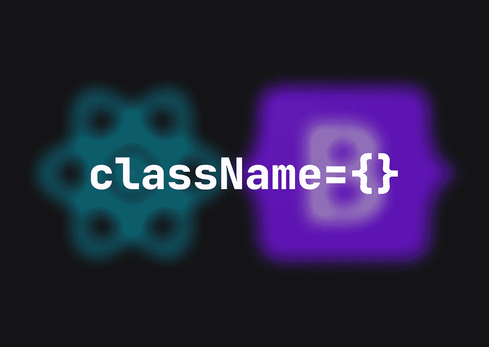

# React 中的引导程序入门

> 原文：<https://medium.com/codex/getting-started-with-bootstrap-in-react-ce3a34b2b241?source=collection_archive---------4----------------------->

Bootstrap 对于前端开发者来说是一个极其有效的工具包。由于其预定义的实用程序类，您可以创建一个连贯的用户界面，而无需定义自定义 CSS。在本文中，我们将讨论在 React 应用程序中使用它的理想方法。



在我看来，充分利用 Bootstrap 资源的最佳方式是同时使用 Bootstrap 和 React Bootstrap 库。

```
💡 React Bootsrap = A component-based rebuild of Bootstrap
```

有了这两个库，你可以使用 React Bootstrap 的预构建组件，如`<Container>`，甚至是复杂的组件，如`<Button>`，并用原始的 Bootstrap 类，如`ms-2`或`text-muted`来设计它们。

首先，我们需要安装两者

```
💡 Since React Bootstrap depends on Bootstrap, installing the most recent version of React Bootstrap along with the Bootstrap version it was developed will provide you the best experience. You can check this information on [React Bootstrap website](https://react-bootstrap.github.io/).
```

显然，使用`npm`

```
🥾 INSTALL BOOTSTRAP AND REACT BOOTSTRAPnpm install react-bootstrap@2.5.0
npm install bootstrap@5.2.0
```

接下来，将这一行添加到您的`App.tsx`文件中

```
👍 IMPORT BOOTSTRAP CSSimport 'bootstrap/dist/css/bootstrap.min.css'
```

现在，在您的项目中使用它们很简单。

当决定是利用 React 引导组件还是普通引导类时，我采用以下方法:

*我使用 React Bootstrap 的预构建组件，通常是包装器/父组件，并使用 Bootstrap 实用程序类来正确排列它们，以适当的间距设计它们的样式，或者偶尔修改它们的默认样式。*

## 一些例子:

```
🎨 **A REACT BOOTSTRAP BUTTON WITH A STYLE CHANGE AND SOME MARGIN ON THE BOTTOM**import { Button } from "react-bootstrap"
...
<Button
  variant='secondary'
  className='bg-light fs-2 text-muted mb-2'
>
  Click me!
</Button>
```

使用`<Container>`

```
🏑 **A REACT BOOTSTRAP CONTAINER WITH ONE ROW AND TWO COLS CUSTOMIZED WITH ORIGINAL BOOTSTRAP**import { Container, Row, Col } from "react-bootstrap"
...
<Container className='py-5'>
  <Row className='justify-content-center'>
    <Col sm='12' lg='10' className='text-dark'>
      Content... 
    </Col>
    <Col sm='12' lg='10' className='text-secondary'>
      Content... 
    </Col>
  </Row>
</Container>
```

使用`<Form>`

```
🚀 **ALSO A CONTAINER, ROW AND COL WITH CUSTOMIZED RADIO INPUTS**import { Container, Row, Col, Form, FormCheck } from "react-bootstrap"
...
<Container className='py-3 py-lg-5'>
  <Row className='gy-4'>
    <Col lg='2' className='d-flex flex-column gap-2 pe-2'>
      <h3>Title</h3>
      <Form className='d-flex flex-column gap-2'>
        <FormCheck
          className='text-muted'
          type='radio'
          name='sort'
          value='newest'
          id='newest'
          label='Newest'
          checked={sort !== 'oldest'}
          onChange={() => setSort('newest')}
        />
        <FormCheck
          className='text-muted'
          type='radio'
          name='sort'
          value='oldest'
          id='oldest'
          label='Oldest'
          checked={sort === 'oldest'}
          onChange={() => setSort('oldest')}
        />
      </Form>
    </Col>
  </Row>
</Container>
```

👋我希望这在你寻找新的学习材料时对你有用。感谢您花时间阅读这篇文章！

如果你从我的文章中更好地理解了一些东西，你可以请我喝咖啡来支持我:[https://www.buymeacoffee.com/daanworks](https://www.buymeacoffee.com/daanworks)

📯订阅我的电子邮件列表，如果你想在未来读到更多这样的故事，请在这里或 Twitter 上关注我