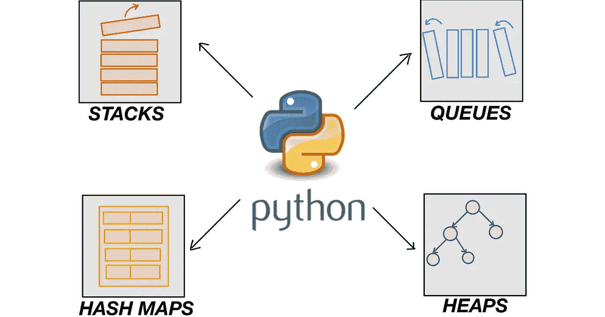
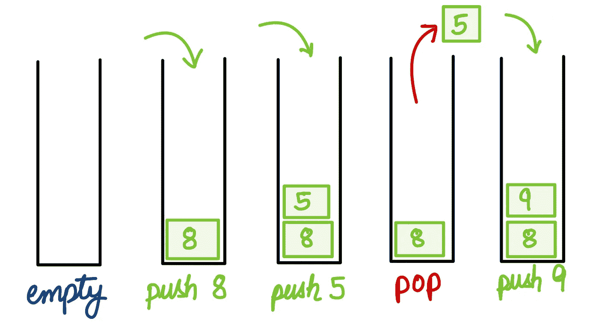
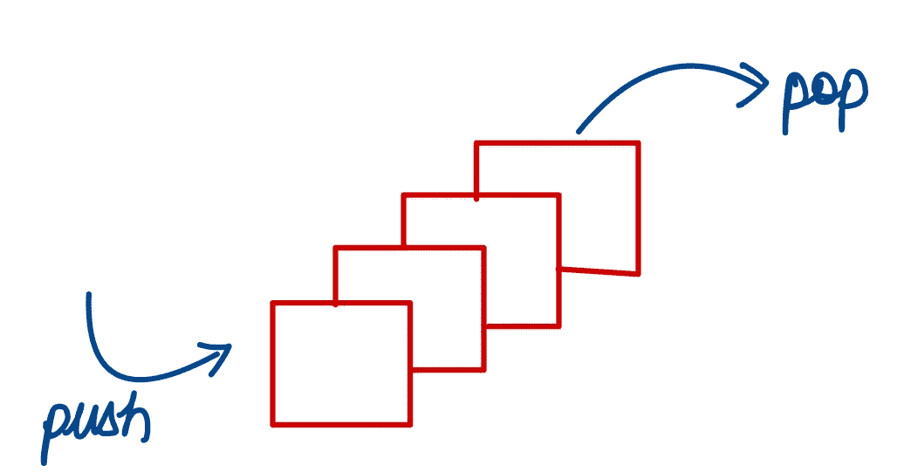
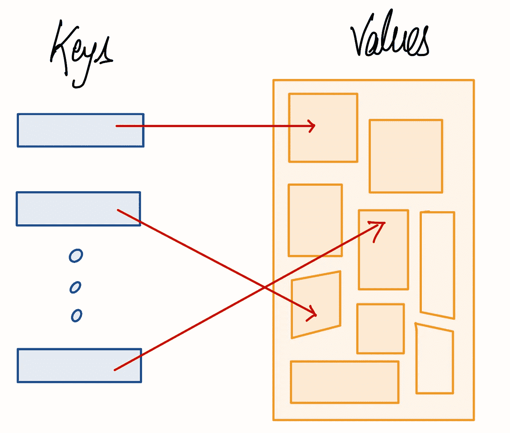
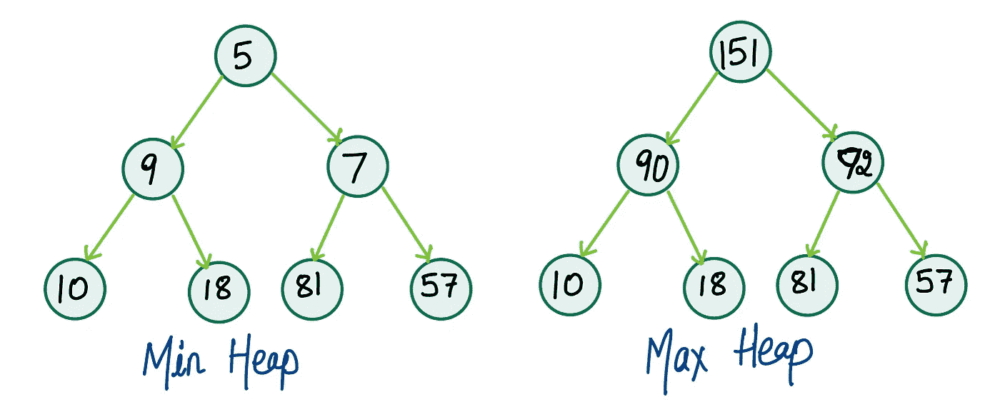

# Python 竞争性编码入门

> 原文：<https://medium.com/codex/getting-started-with-competitive-coding-in-python-8365d9cc64?source=collection_archive---------13----------------------->

## 本文将展示 Python 中基本的内置数据结构，这有助于我们在解决编程问题时节省时间。



# 介绍

数据结构和算法(DSA)知识是计算机科学中成功职业道路的必要条件。无论我们以软件工程师、数据科学家还是机器学习工程师为例，他们都要求最低水平的 DSA 理解。几乎所有的公司都有一个最初的在线编码环节，在这个环节中他们会问 DSA 一些问题。除此之外，还有代码共享、白板讨论等。，这很考验编码技巧。

DSA 面试一开始就让人望而生畏。受访者希望找到解决问题的最佳方法。因此，在我们的在线测试或面试中，我们可以更多地关注我们的算法，而不是专注于数据结构的实现。我的意思是，我们可以使用 Python 中内置的数据结构和它们的函数，这样可以省去从头编写它们的麻烦。为什么要重新发明轮子？

熟悉核心数据结构并了解关于它们的特定于 Python 的注意事项将使实现无缝。因此，本文将展示对我们的代码有帮助的最广泛使用的数据结构。

# **1。堆栈**

堆栈遵循*后进先出*程序，其中先去的元素将首先被移除。堆栈具有以下基本功能。

1.  **推送:**将一个元素添加到栈顶。
2.  **pop:** 取下顶部元件，放回原处。
3.  **top:** 返回堆栈中的顶部元素。
4.  **isEmpty:** 如果堆栈为空，则返回 True。



图一。基本堆栈操作。

上面提到的所有函数应该具有恒定的时间复杂度。在 Python 中，我们可以使用“列表”来实现堆栈。

```
**# stack initialization** stack = []**# Push operation with O(1) time complexity** stack.append(4) **# Pop operation with O(1) time complexity**
top_element = stack.pop()**# Top element with O(1) time complexity**
top = stack[-1] **# isEmpty O(1) time complexity** if len(stack) == 0:
    print("stack is empty")
```

# 2.行列

队列遵循先入先出策略，即先添加的元素将先被移除。队列具有以下基本功能。

1.  **推送:**添加后方元素。(恒定时间复杂度)
2.  **弹出:**从前面移除元素。(恒定时间复杂度)



图二。基本队列操作。

```
**# import the deque module** from collections import deque **# queue initialization** queue = deque([])**# PUSH at end** queue.append(5)**# POP at starting** element = queue.popleft()
```

Deque 模块提供了另外两个对我们有用的函数。

```
**# PUSH at start** queue.appendleft(5)**# POP at end** element = queue.pop()
```

# 3.哈希映射

Python 有“字典”,它的工作方式类似于散列图。字典存储键值对。在 Python 中，字典的键只能是可哈希的值，比如 int、str、tuple 等。此外，一个字典可以有多种类型的键和值。



图 3。哈希映射。

一般来说，用“默认字典”代替普通字典是一个好习惯。

```
**# import the module** from collections import defaultdict **# initialize the dict with default datatype of values.** hash_map = defaultdict(list) **# add elements in the dict** hash_map[x].append(y)**# delete key = x** del hash_map[x]
```

# 4.很

堆是一个完整的二叉树，其中除了最后一层(即叶节点)之外的所有层都应该被填充，并且所有节点都应该左对齐。有两种类型的堆:(a) **最小堆** —父节点的值小于或等于其子节点的值，以及(b) **最大堆** —父节点的值大于或等于其子节点的值。



图 4。最小和最大堆。

像堆栈一样，在 Python 中，没有单独的类来创建优先级队列或堆数据结构。相反，我们有一个" [heapq](https://docs.python.org/3/library/heapq.html) "模块，它允许我们使用列表作为堆。

```
**# import the module** import heapq**# initializing a heap** heap = []**# push an element into the heap** heapq.heappush(heap, 10)**# pop an element value on top of the heap** element = heapq.heappop(heap)
```

`heapq.heappush`和`heapq.heappop`将在我们用作堆的列表中维护 [**最小堆不变量**](https://docs.python.org/3/library/heapq.html) 。

## 将列表转换成堆(最小堆)。

我们可以创建一个空的列表，并用***“heapq . heap push”***将元素推送到那个列表中。这种方法的时间复杂度是 ***O(NlogN)*** ，其中 N 是列表中元素的数量。一个更有效的方法是使用[**heapq . heapify**](https://docs.python.org/3/library/heapq.html)**，**来交换它的元素，使一个列表成为一个最小堆。而且 heapq.heapify 只需要 **O(N)** 时间。

```
arr = [42,15,4,22,100]
heapq.heapify(arr)
```

如何使用最大堆？

我们可以将初始元素乘以-1，然后使用最小堆。这样，我们得到了根节点上的最大元素，或者说是最大元素的负数。当我们从堆中取出反转的数字时，我们再次将它乘以-1 来得到我们的初始数字。

如果需要比较多个字段来确定哪个元素更小或更大，可以考虑将堆的元素保存为元组。

# 结论

本文展示了 Python 中解决编程问题的四种最广泛使用的数据结构。除了数据结构，本文还提到了它们各自的功能。这篇文章可能是编程新手或想开始用 Python 编程的人的第一步。