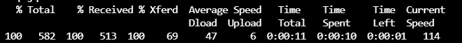

# Azure 上的计算机视觉入门。

> 原文：<https://medium.com/codex/getting-started-with-computer-vision-on-azure-6c42e7aefcf2?source=collection_archive---------8----------------------->


# 介绍

计算机视觉是一个研究领域，涉及使计算机能够处理视觉世界并与之交互的算法和技术。多年来，研究人员已经开发出算法，通过*从*标签*中学习*或发现*模式*，来训练计算机分析数字图像和视频。[](https://en.wikipedia.org/wiki/Computer_vision)

计算机视觉(CV)是一个充满用例的领域，从检测图像中的人脸，到识别图片中的单个对象，甚至通过分析 x 射线图像来检测癌症。这些功能对企业和其他企业具有巨大的潜力，但是，从头构建这些模型通常需要大量的专业知识和资源，而许多企业可能还没有获得这些知识和资源，谢天谢地，我们可以利用预先训练的模型和完全管理的解决方案，如 Azure Computer Vision，它为这些令人垂涎的解决方案抽象出大多数较低级别的工程。

Azure 计算机视觉 API 是 Azure 认知服务的核心产品，这些服务是基于云的人工智能产品，允许开发人员利用最先进的人工智能技术和云的灵活性和可扩展性。计算机视觉 API 提供了一系列对图像执行认知任务的功能，该 API 可用于从图像中提取书面文本，检测成人内容，用完整的句子描述图像内容等等。它们也是 Azure 认知解决方案的其他更专业的 API，执行一系列 CV 任务，如专门处理面部识别等面部相关认知任务的 Face API(文章即将发布)。

## 计算机视觉 API 的使用

这些只是计算机视觉 API 在您的应用或业务中的一系列可能用途:

*   库存图像分类。
*   检测图像中的人脸。
*   使用[光学字符识别](https://en.wikipedia.org/wiki/Optical_character_recognition) (OCR)从图像中提取打印和书写文本。
*   为内容审核系统检测不合适的图像。
*   用完整的句子描述一幅图像。
*   分析视频。
*   为图像生成缩略图。

# 提供计算机视觉 API

*   要使用计算机视觉 API，您需要有一个有效的 [Azure 订阅](http://https//azure.microsoft.com/en-us/free/)。
*   设置订阅后，您需要创建一个认知服务帐户，以访问所有 Azure 认知服务，或者创建一个特定的计算机视觉资源，后一个选项允许您以更模块化的方式管理云资源，因为您使用的每个服务都是单独计费和记录的。

## 设置您的认知服务帐户

它们是设置大多数 Azure 服务的两种主要方式:

1.  通过 Azure 门户，这是一个基于 web 的图形用户界面。
2.  通过 [Azure 命令行接口](https://docs.microsoft.com/en-us/cli/azure/) (CLI)。Azure CLI 是一个基于终端的界面，用于与 Azure 产品和服务进行交互，它可以在大多数本地机器上访问，因为它支持 Mac、Windows 和 Linux 安装，也可以通过 Azure cloud shell 或 Docker 文件在 web 浏览器上访问。下图显示了 Azure 门户，红色箭头指向云外壳。


Azure 门户右上角的云外壳

Azure CLI 允许用户以编程方式运行管理任务，从而提供自动化和可伸缩性等优势。

## Azure 命令行界面的认知服务。

要在云 Shell 中创建认知服务帐户，请在代码块中键入带有以下参数的命令:

```
az cognitiveservices create
```

*   资源组:将拥有认知服务帐户的资源组。在这里了解更多。
*   kind:认知服务帐户的 API 名称。
*   名称:您可以为认知服务指定一个名称。
*   SKU:SKU(库存单位)是指产品的价格层。认知服务的 SKU 通常控制产品的呼叫频率，即每秒 10k 次呼叫。SKU 可以是 FO、S1、S2、S3 和 S4。
*   位置:要创建服务的位置。选择离你最近的地方是一个好习惯。

下面的代码块使用 S1 定价层在西欧调配名为 Demo-Visionlab 的计算机视觉工作负载，如果代码运行成功，将返回一个 JSON 文件，显示所有几个内部配置，包括设置为“Succeeded”的“provisioningState”属性。

```
az cognitiveservices account create \
 — kind ComputerVision \
 — name Demo-VisionLab \
 — sku S1 \
 — resource-group [your resource group]\
 — location westeurope
```

**接下来，我们需要检索服务的访问密钥。**

现在我们已经创建了一个帐户，我们可以通过这个命令和下面的参数检索它的访问密钥

```
az cognitiveservices account keys list \
--name ComputerVisionService \
--resource-group [Your Resource Group]\
```

*   名称:认知服务帐户的名称。
*   资源组:资源组的名称

命令成功后，将发送一个 JSON 响应，其中包含一个备用密钥。保存这些钥匙。

```
key=$(az cognitiveservices account keys list \
--name ComputerVisionService \
--resource-group [Your Resource Group]\
--query key1 -o tsv)
```

上面的代码块显示了如何使用适当的参数运行该命令，它使用“query”参数来指定 key 1 并将该键存储为一个名为 key 的变量，可以使用这些命令来访问它

```
echo $key
```

# 调用计算机视觉 API

您可以通过 REST 端点、软件开发工具包(SDK)和您喜欢的编程语言中的 HTTP 库来调用计算机视觉 API。SDK 和 HTTP 库最终包装了 REST 端点。要访问端点，您需要以下内容:

1.  提供给您的 API 密钥。
2.  API 端点是遵循以下格式的 URL:

**"地区**. API . cognitive . Microsoft . com/vision/v 2.0/**资源** /【参数】"

其中**区域**是您创建帐户的位置，例如“westeurope”，而**资源**是您需要的特定计算机视觉工作负载，例如“分析”、“ocr”等。

**使用分析功能**

API 的每个特性都有自己独特的一组*参数。*讨论每个特性的调用方法可以是一篇独立的文章，我肯定会在不久的将来写这篇文章。然而，对于本文，我将展示如何单独使用**分析**特性。

回想一下，所有计算机视觉 API 资源的 URL 端点都遵循这种模式:

**"**region.api.cognitive.microsoft.com/vision/v2.0/**资源/【参数】"**

特别是对于**分析**功能，URL 遵循以下模式:

[https:/**/**region.api.cognitive.microsoft.com**/**视觉/v 2.0**/分析[？视觉特征][ &细节][ &语言]**](https://region.api.cognitive.microsoft.com/vision/v2.0/analyze[?visualFeatures][&details][&language])

注意上面 URL 中突出显示的部分， **Analyze** 取代了 **resource，**因为这是我们正在调用的特性/资源。其他突出显示的部分是**参数，**它们代表我们希望 API 执行的****特定请求。****

## ******了解参数******

****分析特性有三个参数，它们是指定我们希望 API 执行哪些任务以及返回哪些数据的方式。这些参数是:****

1.  ******视觉特征**:这是 analyze 资源的核心参数，它指定从图像中提取和分析哪些视觉特征。例如，您可以指定“成人”这将允许 API 检查图像中的成人内容，“描述”*视觉特征*提示 API 用完整的句子描述图像。在撰写本文时，它们是八个有效的视觉特征，都列在下面的官方文档截图中。只要用逗号分隔，就可以向 API 发送多个特性。****
2.  ******细节**:该参数用于指定我们何时想要识别图像中的名人或流行地标。****
3.  ******Language** :用于指定返回响应的语言。本服务支持的语言包括英语(en)、西班牙语(es)、日语(ja)、葡萄牙语(pt)和简体中文(zh)。如果没有指定语言，则以默认语言(英语)返回响应。****

********

****视觉功能选项。来源:认知服务文档。****

****好了，理论到此为止。让我们想象一下，我们创建并维护了一个社交媒体应用程序，允许邻里之间联系和共享信息。人们使用我们的应用程序来分享他们在社区公园的照片，并交换安全提示和信息，就像一种数字邻里监督一样。所有年龄段的人都在使用我们的应用程序，所以我们必须努力确保儿童不会接触到任何不适当的内容。****

********

****由 [Rajiv Perera](https://unsplash.com/@rajivperera?utm_source=medium&utm_medium=referral) 在 [Unsplash](https://unsplash.com?utm_source=medium&utm_medium=referral) 上拍摄的照片****

****任何人都可以一眼看出上面这张美丽的全家福照片是无害的，但是想象一下，每天必须滚动浏览来自数百名用户的数千张照片，这将是重复的，当然也不可能实时完成。这些类型的任务非常适合人工智能。****

****我们可以使用 [cURL](https://en.wikipedia.org/wiki/CURL) 从终端直接调用 Azure 计算机视觉 API。下面的代码块使用 *analyze* 资源调用 API，并将可视特性设置为 *dult* 和*描述(用逗号分隔的*)。然后它设置两个头，订阅密钥和要返回的文件类型。最后，它指定了我们要分析的 URL 图像，也就是上面显示的家庭照片。如果运行成功，我们会得到一个迷你表，显示关于调用本身和 JSON 响应的一些元数据，否则我们会得到一个错误消息。****

```
**curl "[https://westeurope.api.cognitive.microsoft.com/vision/v2.0/analyze?visualFeatures=Adult,Description](https://westeurope.api.cognitive.microsoft.com/vision/v2.0/analyze?visualFeatures=Adult,Description)" \
> -H "Ocp-Apim-Subscription-Key: $key" \
> -H "Content-Type: application/json" \
> -d "{'url' :'[https://cdn-images-1.medium.com/max/800/0*ggV5fYc6l_S5UGnx'](https://cdn-images-1.medium.com/max/800/0*ggV5fYc6l_S5UGnx')}" \
> | jq '.'**
```

********

****显示通话信息(如通话速度)的迷你表。****

********

****JSON 响应第 1 和第 2 部分****

********

****JSON 响应第 3 和第 4 部分****

****JSON 响应可以分为四个部分:****

*   ****第一个是 JSON 响应的一部分，包含了关于我们指定的**视觉特性**，**成人的信息。**它将两个属性“isRacyContent”和“isAdultContent”设置为布尔值(真或假)，在本例中为“假”，表示该图像不包含任何成人内容。它还有另外两个属性，可以对图片的色情程度或包含成人内容的程度进行评分。****
*   ****第二部分包含图像的关键字描述作为**标签。**请注意，这并不是因为我们的 API 调用中设置了“**描述**”参数，它接下来会以完整的句子而不是关键字来说明图像。****
*   ****第三部分对应于我们的 API 调用中的“Description”参数，它产生一个**标题，**，它用一个完整的英语句子描述图像，因为我们没有设置任何特定的语言。它还包含一个介于 0 和 1 之间的分数，表示系统对标题的信心程度。****
*   ****第四部分包含关于我们处理的图像的元数据。****

******结论和建议******

****到目前为止，我们已经探索了计算机视觉，并发现我们可以如何利用预先训练和完全管理的云解决方案来实现人工智能应用。我们还了解到，我们可以直接从命令行供应和调用 Azure AI 服务，最后我们在一个映像上测试了该服务。****

****今天，用户期望应用程序具有智能功能，请记住，在计算机视觉之外，你可以为你的应用程序探索更多令人兴奋的功能。在此探索更多可能性[。](https://azure.microsoft.com/en-us/services/cognitive-services/#overview)****

****非常感谢你的阅读，并享受你的一天，如果你像我一样，纯粹出于好奇在午夜阅读这篇文章，祝你有一个美好的夜晚，睡个好觉:)。****