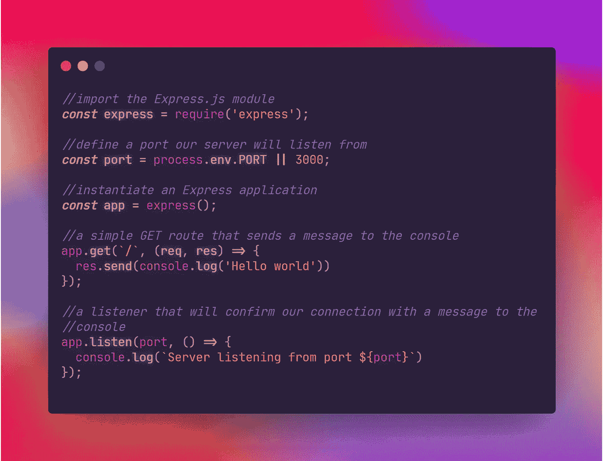
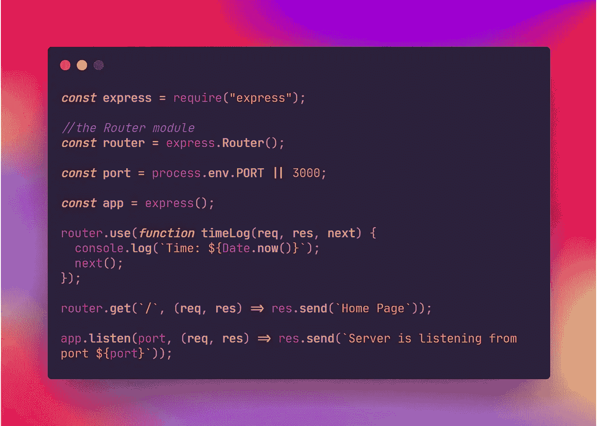
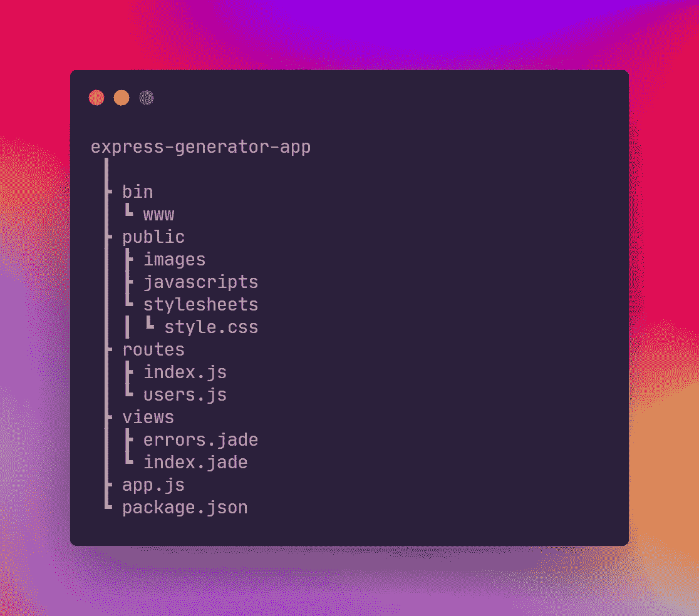

# Express.js 入门

> 原文：<https://medium.com/codex/getting-started-with-express-js-721ef88efe99?source=collection_archive---------15----------------------->

## 如何使用 Express.js 设置和利用服务器交互和路由

你好！今天我将讨论如何使用 Express 框架为我们的前端代码创建一个基本的服务器。本文还将展示如何使用节点 js 来利用路由和与 Express 服务器的交互。我们开始吧！

# 什么是快递？

Express.js 是一个 Node.js *框架*,它公开了一个最小的、但是通用的中间件*集*,允许我们在表面层次上将 Node.js 应用程序搭建到服务器上。使用 Express 时，我们可以使用的功能非常广泛。我们可以使用 Express 创建路由器，定义从某个路由端点发送的响应，处理用户身份验证/授权，与第三方 API 服务交互，提供静态或服务器端文件，甚至，考虑到它对数据库的非独立处理，为 MongoDB 或 PostgreSQL 等关系和非关系数据库提供配置。前面提到的所有特性也使得 Express 的结构更加灵活，因此确实没有一种方法可以创建 Express 应用程序；它的结构最终取决于您的应用程序需求或您的开发团队的偏好。

# 一个简单的快速服务器

让我们创建一个基本的 Express 服务器和一个简单的*中间件*函数，它将使用 Node.js `request`和`response`对象在请求-响应周期中发送和接收数据。(期望在本文中大量看到*中间件*这个词；Express 很大程度上强调了中间件的使用)。首先，我们必须将 Express 模块导入到我们指定的`server.js`文件中，并实例化一个端口号，要么使用 port 的全局环境变量，要么提供一个数字值。我们还需要通过调用 Express.js `express()`函数来实例化 Express 应用程序。最后，我们需要监听给定端口的连接，因此我们还必须调用内置的`app.listen()`，它将接收端口值，并通过向控制台发送消息来确认到端口的连接。下面的例子演示了这可能是什么样子。

Node.js 应用程序的基本 Express.js 服务器。(创建于 [https://carbon.now.sh](https://carbon.now.sh) )

# 按指定路线发送

正如我提到的，Express.js 允许我们使用中间件功能来利用 HTTP 请求。上面的例子包含一个指向根模块`/'的 GET 请求，并且像所有中间件函数一样，接收`request`和`response`对象。这个示例中间件只是将一条消息记录到控制台，但是 Express 允许我们使用各种各样的中间件来利用 HTTP 请求的不同功能。

在我们的 Express 应用程序中定义路由的另一个选项是使用 Express Router 模块。这允许我们使用一个中间件系统，该系统使用一个`Router()`模块来处理路由。下面的例子是上面的同一个示例服务器的实现，它使用`Router()`模块来处理相关的路由方法(GET、PUSH、POST、DELETE)。

`Router()`也可以利用基于 HTTP 动词的处理函数。例如，GET 请求可以通过用户 ID 或用户的新闻提要来处理对用户列表的请求。POST 可以利用授权用户的登录或向帖子列表添加新内容。PUT 可用于更新用户的帐户信息。最后，删除除了从用户数据库中删除帐户信息之外，还可以在用户注销帐户时删除会话 cookies。

# 快速应用生成器

除了创建 Express.js 服务器和通过内置中间件管理路由和客户端-服务器交互之外，为了将 Express.js 实现到 web 应用程序，我们可以使用 CLI 命令生成一个服务器文件，其中 Express 中间件是现成实现的。生成器还提供了使用什么前端标记的选项(我们可以在 Pug、Handlebars.js、EJS 或 Hogan.js 之间选择)。

我们可以使用 CLI 命令`npx express-generator`来初始化 Express App 生成器(Node.js 8.2.0 及更高版本)。安装完成后，我们可以开始为生成的 Express 应用程序设置配置。一旦我们运行这个命令，我们可以开始选择可选的添加剂，如前端引擎。默认情况下，Express Generator 将使用 Jade 作为 UI 引擎。如果您更喜欢使用静态 HTML 文件而不是 UI 引擎，您可以在您的终端中使用标签`— no-view`运行`express`。

一旦设置了选项，Express Generator 将添加文件来伴随 Express server 文件，例如 UI 组件(使用所选的引擎，如果有的话)、样式表以及它们各自的路由文件。下图是默认文件结构的表示，如果没有选择任何选项，它使用 Jade 作为它的 UI 引擎:

由 Express Generator CLI 创建的默认文件树(创建于 [https://carbon.now.sh](https://carbon.now.sh) )

生成文件树后，终端应该显示一条消息，指示在我们开始运行应用程序之前，通过运行`npm install`或`yarn`来安装依赖项。安装好应用程序的依赖项后，我们可以通过运行`npm start`或`yarn start`来运行应用程序。

希望您已经更好地理解了如何为您的 web 应用程序实现 Express.js，现在您已经阅读了一些基本功能以及一些可选的实现方法。如果你想看更多如何使用 Express.js 的例子，他们的 [Github 库](https://github.com/expressjs/express/tree/master/examples)提供了许多构建 Express 服务器的不同用例。今天就到这里吧！非常感谢您的阅读！如果您想要更多的资源来深入了解这个框架，您可以在下面找到一个资源列表。下次见！

# 引用的消息来源

“快递—节点。Js Web 应用程序框架。”*快递—节点。Js Web 应用框架*，StrongLoop，IBM，等 expressjs.com 投稿人，2017，[http://expressjs.com](http://expressjs.com/.)。于 2021 年 8 月 9 日访问。

"快速应用程序生成器。"*快递—节点。Js Web 应用框架*，[http://expressjs.com/en/starter/generator.html.](http://expressjs.com/en/starter/generator.html.)2021 年 8 月 9 日接入。