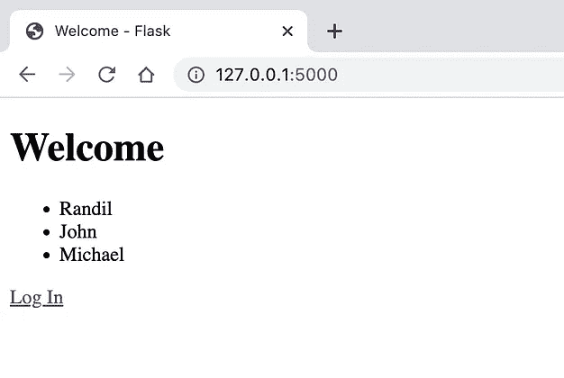
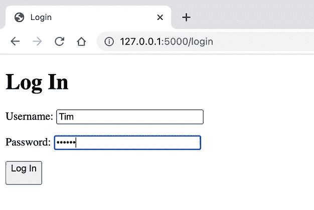
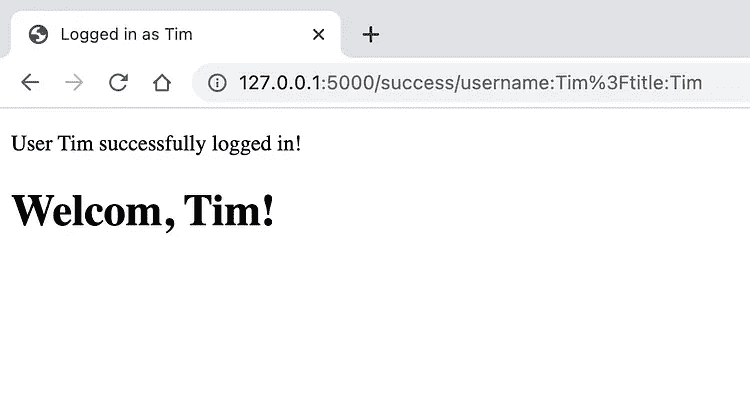

# 烧瓶开发入门

> 原文：<https://medium.com/codex/getting-started-with-flask-development-4b52752e9545?source=collection_archive---------10----------------------->

## 烧瓶入门指南。


由 [Pakata Goh](https://unsplash.com/@pakata?utm_source=unsplash&utm_medium=referral&utm_content=creditCopyText) 在 [Unsplash](https://unsplash.com/s/photos/python?utm_source=unsplash&utm_medium=referral&utm_content=creditCopyText) 上拍摄的照片

# 介绍

在本文中，如果您已经熟悉 Python 编程，我将解释如何在您的计算机上安装 Flask 来开发 web 应用程序。在 Flask 中，你可以用 Python 和一点 HTML 和 CSS 创建 web 应用程序。我正在一步一步地解释这个过程，以便你能跟得上我。本教程我使用的是 Mac 电脑。

# 1.搭建平台。

首先，你需要在你的电脑上安装`pip`，以便在用 Flask 开发时安装必要的东西。使用`pip --version`命令检查你的电脑中是否有`pip`。如果你的电脑上没有安装`pip`，使用下面的命令，将`pip`安装到你的本地工作站上。

```
$ curl https://bootstrap.pypa.io/get-pip.py -o get-pip.py $ python get-pip.py $ pip --version
```

一旦你在电脑上安装了`pip`，你就差不多准备好开始了。特别是，您可以在虚拟环境中全局安装 Flask。在本教程中，我在虚拟环境中安装 Flask，并运行我们的第一个 Flask 应用程序。

您可以通过`pip list`命令检查您的系统上是否已经安装了 Flask。如果在列表中没有找到 Flask，运行`pip install flask`命令安装 Flask。正如我前面提到的，因为我们在虚拟环境中运行 Flask，所以您不需要全局安装 Flask。

# 2.创建第一个烧瓶应用程序

接下来，使用`pip list`命令检查您的系统上是否安装了`virtualenv`。如果没有，使用`pip install virtualenv`命令。这将帮助您在虚拟环境中运行应用程序。

然后导航到您的项目目录，并在终端中运行`virtualenv env`命令。这将在您的项目目录中创建一个`env`目录。之后，您需要使用`source env/bin/activate`或`. env/bin/activate`命令*激活`env`【如果您使用的是 windows 电脑，该命令会有所不同】。*现在你进入了虚拟环境。

检查一下，看看你那里有什么。即使您之前已经全局安装了 Flask，您也不会在列表中看到它。然后，你可以使用`pip install flask`在虚拟环境中安装`Flask`，它不会影响全局。

接下来，创建一个`app.py`文件，并将下面的代码添加到其中。

```
from flask import Flask app = Flask(__name__) @app.route('/')
def index():
    return '<h1>Hello from Flask!</h1>' if __name__ == '__main__':
    app.run(debug=True)
```

然后你可以在你的终端上运行`flask run`命令来启动`Flask App`并导航到`127.0.0.1:5000`来在浏览器中打开应用。

如果不使用名称`app.py`作为文件名，则需要使用`.flaskenv`文件将环境变量设置为相关文件。假设你的文件名是`main.py`。然后您需要创建`.flaskenv`文件并如下设置这些变量。

```
FLASK_ENV=development
FLASK_APP=main.py
```

现在，既然你有了`.flaskenv`文件，你需要在运行`flask run`命令之前运行`pip install python-dotenv`命令。该命令将允许您使用`.flaskenv`文件。运行`pip install python-dotenv`命令后，运行`deactivate`命令禁用环境，并再次使用`source env/bin/activate`命令激活虚拟环境。然后运行`flask run`命令启动应用程序，并在浏览器中查看输出。

此外，你可以将所有的包保存到一个文本文件中，如果有一天你不得不将你的项目转移到另一台计算机上，你就不必再次创建`env`目录了。您可以使用这个文本文件来创建它。使用下面的命令将您的包添加到文本文件中。

```
$ pip freeze > requirements.txt'requirements.txt' is the file name
```

然后在新机器中，你可以运行下面的命令来使用文本文件创建`env`文件夹。

```
$ pip install -r requirements.txt
```

# 3.呈现网页并添加路线

然后在项目目录下创建`templates`、`static`和`images`目录。这些目录分别保存 HTML 页面、样式表和图片。之后，在 templates 目录下创建`index.html`文件，在 static 目录下创建 CSS 目录。您还可以在 css 目录中添加 main.css 文件。

此外，您需要将`render_template`模块导入到`app.py`中，以便呈现 HTML 页面。

然后你可以运行`flask run`命令在浏览器上渲染`index.html`文件。

一个 web 应用程序通常有一些路线，使用户更容易浏览。目前，我们只有一个 HTML 页面和静态内容。接下来，我们将看到如何在 Flask 应用程序中添加多个页面和设置路线。

让我们创建两个名为`about.html`和`contact.html`的 HTML 文件。确保您也将这两个文件放在`templates`目录中。出于学习的目的，我创建了这两个简单的文件。

接下来，我们可以将路线添加到我们的`app.py`文件中，如下所示。

运行`flask run`命令后，您将在浏览器上看到这些页面和导航。

# 4.模板继承

模板继承是你在用 Flask 开发应用时遇到的一个迷人的特性。基本上，模板继承所做的是，它允许我们为所有的 HTML 网页创建一个基础或布局，并且只定制/添加相关的部分，而不用从头开始一遍又一遍地构建整个 HTML 网页。

为了在我们的 Flask 应用程序中实现模板继承，我们创建了一个`base.html`文件并将其`extends`到其他 HTML 文件中，如下所示。这个场景`Jinja2`开始起作用，那些定界符属于`Jinja2`。一般来说，`Jinja2`被认为是 Python 开发者创建 HTML、XML 或其他标记格式的现代模板语言。

当您运行命令`pip list`时，您会看到`Jinja2`已经存在，并且已经安装了 Flask。

让我们将`base.html`文件创建为一个普通的 HTML 文件，并在必要的地方添加`Jinja2`分隔符。

这里，``和``是`Jinja2`分隔符。

接下来，让我们相应地修改我们的`index`、`about`和`contact` HTML 文件。

这种方法很容易在我们的网页上应用和创建动态内容。接下来，将了解如何在我们的应用程序中添加和呈现动态内容。

# 5.呈现动态内容。

让我们在`app.py`文件中创建一个简单的 Python 列表，并添加必要的修改，如下所示。

并将必要的更改添加到`index.html`中，如下所示。

同样，您可以遍历列表或字典，并将值从 Python 应用程序传递到 HTML 页面。

# 6.使用 GET、POST 方法

一般来说，我们的网页上有表单来获取用户输入，并据此采取必要的行动。因此，在本节中，您将学习如何从网页获取用户输入，并将其传递给我们的应用程序。

让我们创建一个名为`login.html`文件的新页面如下。

让我们更新`app.py`应用程序来处理表单请求。这次我们将 4 个新模块导入到`app.py`文件中，分别是`request`、`redirect`、`url_for`和`flash`。

要处理 Flask 中的`GET, POST`请求，您需要有密钥。在上面的`app.py`代码片段中，我已经将那个键设置到了 `app.config[‘SECRET_KEY’]`中。您可以为您的应用程序生成一个密钥，如下所示。

打开终端的另一个选项卡，运行命令`$ python`。这将打开 Python shell，然后运行以下命令。

```
$  python>>> import secrets
>>> secrets.token_hex(16)
'de921e121eec1e95642035ca4d39d34b'
>>>
```

复制该值并将其设置到`app.config['SECRET_KEY']`。

然后，一旦用户填写完表格并点击`Log In`按钮，结果将显示在`success.html`文件中。因此，让我们如下创建`success.html`文件。

最后，您将在浏览器上获得输出。

这是应用程序快照。



作者截图|演示 Flask App

# 恭喜

希望你喜欢这篇文章，并希望你能找到有用的信息。对于那些喜欢使用 Python 相关框架开发 Web 应用程序的人来说，这是一个初学者友好的教程。

如果你有任何问题，请给我留言。

感谢您的阅读！

**>敬请关注更多关于 Python 和 Flask ✌️的帖子<**

**快乐编码！👨🏻‍💻**

# 关于 FLASK 应用程序开发的更多信息

[](https://faun.pub/run-your-flask-app-on-kubernetes-ff03854db842) [## 在 Kubernetes 上运行你的 Flask 应用

### 本文指导您在 Kubernetes 集群上运行 Flask 应用程序。

faun.pub](https://faun.pub/run-your-flask-app-on-kubernetes-ff03854db842) [](https://faun.pub/publish-your-flask-app-docker-image-to-docker-hub-using-github-actions-837d20dad71d) [## 使用 GitHub 操作将您的 Flask App Docker 映像发布到 Docker Hub

### 这篇文章解释了如何构建、标记和发布一个基于 docker 文件创建的 Docker 镜像到 Docker Hub…

faun.pub](https://faun.pub/publish-your-flask-app-docker-image-to-docker-hub-using-github-actions-837d20dad71d)