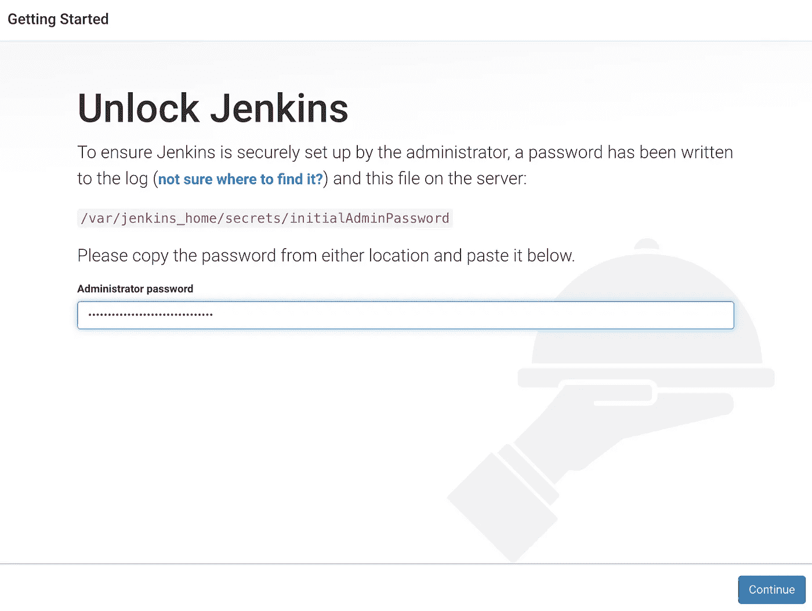
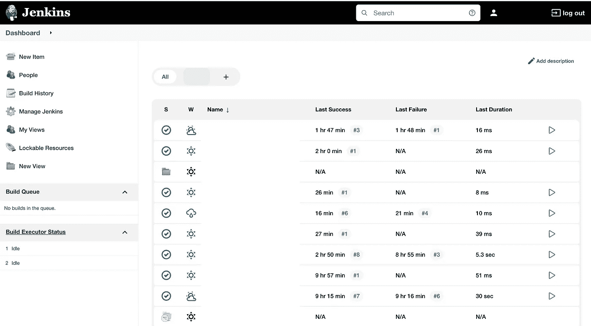

# 使用 Docker 开始使用 Jenkins

> 原文：<https://medium.com/codex/getting-started-with-jenkins-using-docker-167781c18214?source=collection_archive---------7----------------------->

使用 Docker 安装 Jenkins 并熟悉 Jenkins 作业。


照片由 [UX 印尼](https://unsplash.com/@uxindo?utm_source=unsplash&utm_medium=referral&utm_content=creditCopyText)在 [Unsplash](https://unsplash.com/?utm_source=unsplash&utm_medium=referral&utm_content=creditCopyText)

# 介绍

Jenkins 是最受欢迎的 CI/CD 工具之一，或者是一个自动化服务器，允许开发人员构建、测试和部署软件。如果您熟悉 CI/CD 概念和 DevOps，您可能已经体验过 Jenkins。这是一个开源的自动化服务器，无论您使用什么操作系统，您都可以将 Jenkins 安装到您的本地工作站上。不管你用的是 Windows 还是 Linux 还是 macOS，你都可以找到一个相关的方法来安装 Jenkins。

但我个人更喜欢将 Jenkins 安装在 Docker 容器中，因为我可以轻松地启动、停止、维护和删除 Jenkins。此外，因为它运行在 Docker 容器中，所以它运行在一种虚拟环境中。因此，在本教程中，我将解释如何一步一步地完成这项任务。如果你是初学者，我建议你跟着我学。对于本教程，我使用的是 Mac 电脑，但由于我们运行的是 Docker 内部的 Jenkins，即使你没有使用 macOS，你也不必担心。

# 安装 Docker

首先，你需要在电脑上安装 Docker。如果。如果您还没有，请使用下面的链接下载并安装它。

[](https://docs.docker.com/get-docker/) [## 获取码头工人

### 更新 Docker 桌面条款 Docker 桌面在大型企业(超过 250 名员工或…

docs.docker.com](https://docs.docker.com/get-docker/) 

# 将 Jenkins 作为 Docker 容器运行

一旦你在你的电脑上下载并设置了 docker，你就可以通过如下的`Docker run`命令获得 Jenkins。

```
$ docker run -p 8080:8080 -p 50000:50000 -d -v jenkins_home:/var/jenkins_home jenkins/jenkins:lts
```

这里，我们需要为 docker 容器设置一个卷，因为我们需要在每次停止容器时保持这些细节不被删除。所以音量有助于我们保留内容。

您可以通过下面的链接找到有关安装过程的更多信息。

[](https://github.com/jenkinsci/docker/blob/master/README.md) [## 主 jenkinsci/docker 上的 docker/README.md

### Docker Hub 上提供的 Jenkins 持续集成和交付服务器。这是一个功能齐全的詹金斯…

github.com](https://github.com/jenkinsci/docker/blob/master/README.md) 

# 启动服务器

一旦我们运行上面的命令，我们的容器将启动并释放终端，因为我们在命令中使用了`-d`(分离模式)标志。然后你可以在浏览器上点击`localhost:8080`来访问服务器。如果您没有加载页面，回到您的终端并运行`docker ps`命令来验证容器是否在后台运行。

导航到`localhost:8080`后，您将被要求输入管理员密码来解锁 Jenkins。



作者截图| localhost:8080

您可以从这个路径获得管理员密码，也可以在日志中找到它。运行`docker logs <container-id>`命令打开日志，获取密码并粘贴到这里。然后继续并选择**安装建议插件**并让它们被安装。

一旦完成，詹金斯会要求你创建一个帐户；因此，给一个用户名和密码，并创建您的帐户。下次登录时，您必须输入这些凭据。

一切都好！现在，您的 Jenkins 服务器已经可以使用了。

# 运行您的第一份詹金斯工作



作者截图|詹金斯仪表板

当您第一次登录时，您将不会在仪表板中有作业。那么，让我们创建我们的第一份工作。

首先，在仪表板中选择`New Item`，给出一个项目名称(例如:我的第一份工作)。然后选择常用的`Freestyle Project`，您也可以在列表中看到更多选项。之后，点击`ok`。

既然这是我们的第一份工作，我们就简单点。在点击`OK`后打开的窗口上，转到`Build`选项卡。然后点击`Add Build step`并选择`Execute shell`，因为我们正在使用 docker 运行 Jenkins。然后在命令部分，添加命令`echo "Hello, World!"`并点击`Apply`，然后点击`Save`。

现在我们的作业已经准备好，要运行作业，请单击左侧窗格上的`Build Now`。如果您的作业运行正常，绿色勾号将显示在`Build History`部分。如果您没有让它正常工作，您会在`Build History`中看到一个红色的十字标记。

作业运行完成后，单击绿色复选标记可查看控制台输出的更多详细信息。在该窗口中，您会看到`Hello, World!`已经打印出来，您也可以在任务运行过程中执行这些步骤。

**祝贺你！你已经成功地在 Jenkins 上运行了你的第一份工作。👍此外，在一个任务中，你可以有多个`Build steps`来运行几个命令。同样，你的工作中可以有多个`Post-build Actions`。`Post-build Actions`部分可用于指定您的工件，最终一旦作业运行完成，您将获得一个快速链接来轻松访问您的工件。**

感谢您的阅读！希望你喜欢、喜欢并发现本文中的信息有用。

**>敬请关注更多与 DevOps✌️相关的帖子<**